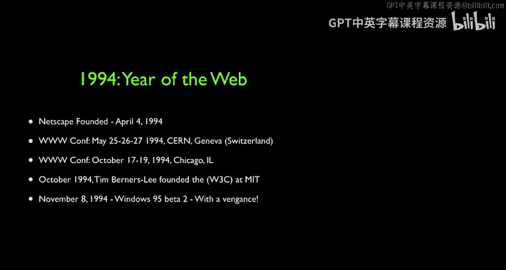

# 密歇根大学《互联网历史、技术和安全Internet History, Technology, and Security》中英字幕 - P27：26_万维网元年.zh_en - GPT中英字幕课程资源 - BV1DE421c7CT

Triggered mostly by the release of the windows and the Mac version of Mosaic。

 1994 was distinctly different than 1993。The staff at NCSA went and founded Netscape in April 1994。

 the first World Web conference was held in Switzerland。

 shortly thereafter the other first World W Web conference was held in Chicago。

 there's some interesting stuff about that。These books。

The books Robert Cayu's and Tim Bernnersley's book talks a little bit about that。And in October 1994。

 Tim left CEN and went to form the Worldwideide Web Consortium， and by the end of the year。

 Windows 95 Beta2 with an internet browser was there with TCPI be built in and so if you really think about。

 I mean it's not even a whole year， it's almost six months where the world changed forever。

And so at this point now money is coming into it， up to that point it was mostly ideas and research。

 but now money is coming at it and we start seeing a transition。

So Netscape was on the forefront of doing this， and Netscape basically took the open source product。

 they started kind of competing just to build a browser。

 but they quickly decided that they would go turn the browser and their web server more proprietary and try to create distributed computing applications using proprietary things that Netscape would build unique to themselves。

And they would attack Microsoft。The moment it became clear that Netscape was going to produce a way to develop software on Mac。

 Windows and Linux。Porably， then Microsoft got worried because then the operating system wouldn't matter and Microsoft did put so much into the Windows operating system that if the operating system didn't matter。

 it would really tremendously threaten Microsoft's business。

 hence Windows 95 with TCPI and a free web browser。So Nescape sort of scared。Balize。

Microsoft tried to buy Netscape， Netscape refused to sell wanting more money。

 and then Microsoft vowed to destroy it。And as Microsoft was coming after Netscape。First。

 Netscape tried to compete。By building better and better software。

 like the JavaScript language which willll meet Brandon Ike in a moment。

 and then after that they tried to sort of switch from being the proprietary bad guys and go become more of the open source good guys。

 and that kind of blew up in their face and they built this open source Mazilla which eventually became the Mazilla Foundation which eventually began firefight。

So now what I want to do is I want you to meet two people。

 both of whom now are the senior leadership at the Mozilla Foundation， Brendan Ike。

 who's the CTO of the Mozilla Foundation， but he'll really tell us about the 1995。

 where he invented JavaScript in 10 days as part of Netscape。

 and then will' meet Mitchell Baker who was the founder of one of the founders of Mozilla and she will talk about how Netscape kind of fortunes declined。

 got purchased by AOL and fortunes declined even worse and how they basically pulled the Netscape codebase out to form the Mozilla codebase。

 which then became Firefox codebase， and the Firefox， of course。

 had this great idea that Mitchell will tell you about of having a search box。And they made。

Tons and tons of money as Mitchell will tell you about so up next。

 Brendan Ike of the Mazilla Foundation and Mitchell Baker of the Misssilla Foundation。

