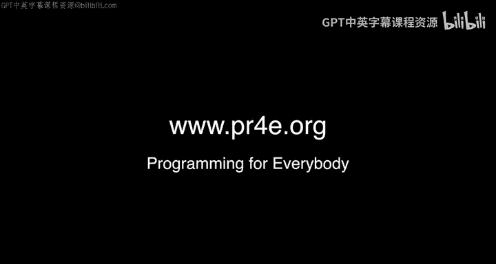

# 密歇根大学《互联网历史、技术和安全》：P3：附加办公时间：俄勒冈州波特兰市

## 概述
在本节课程中，我们将跟随查克博士，回顾在俄勒冈州波特兰市举行的一次线下办公时间活动。你将看到来自世界各地的课程学员分享他们的学习经历和感受。

---

大家好，我们正在俄勒冈州的波特兰市，进行又一次的线下办公时间活动。

我们原本计划有两位……等等，我刚才说了什么？哦，至少我确定自己所在的州是对的。俄勒冈州，波特兰市，俄勒冈州。好的，波特兰，俄勒冈州。

我们身处一条非常繁忙的街道，并在这里成功举办了一次办公时间活动。和往常一样，我希望向课程的其他学员介绍在场的各位。那么，请大家开始吧，只需说出你的名字以及任何想对课程其他同学说的话。

**以下是参与者的自我介绍：**

*   “大家好，我叫阿尔文。我报名过好几门在线课程，而这门Python课程是我第一个完整学完所有四个部分的课程。这要感谢优秀的讲师。”
*   “大家好，我叫斯科特。我报名了‘Python入门’课程。”
*   “大家好，我叫阿里雷扎。在过去的四个月里，我见到查克博士的次数比见到我孩子的次数还多。我刚刚学完了Python课程，现在正在学习数据结构和数据库访问课程。讲得非常棒，谢谢。”
*   “大家好，我叫保罗。我有一个17岁的儿子，他也叫保罗。我们正在一起通过Coursera学习编程，这是一个父子合作项目。他是一名高中生，学得非常出色。对我来说这是爱好，对他而言则是获取未来可用的技能。我的梦想是最终让这类课程进入每一所高中。虽然这很难实现，但至少在我们家已经开始了。”
*   “嘿，我是麦迪，来自匹泽学院的有机生物专业学生，但我对学习Python感到非常兴奋。”
*   “大家好，我是玛格丽特，实际上我是从田纳西州来这里度假的。Python课程是我一直想学的编程入门课。”
*   “大家好，我是黛安。我正在学习这个系列课程的第四门，并计划在今年夏天完成毕业项目。这过程充满乐趣。” （查克博士补充道：“毕业项目是所有课里最简单的，别告诉别人哦。”）
*   “大家好，我是亚历杭德罗。多年前我住在古巴哈瓦那时，就学习了精彩的互联网历史课程。感谢查克博士提供了如此出色的课程。”
*   “大家好，我是安德鲁。我和同事内森一起加入了Coursera，他今天因为工作没能到场。但他算是在‘虚拟合影轰炸’吧？你可以把他的照片放在我旁边……不过我已经离开那份工作了。感谢查克博士付出的所有卓越工作。”
*   “大家好，我是赫布。我在很久以前学习了‘互联网历史、技术与安全’这门课，后来成为了课程的社区助教，现在是一名导师。我参与这门课程已经很长时间了，非常享受帮助学生的过程。”

## 关于课程导师的重要性
上一节我们听到了学员们的分享，现在我们来谈谈课程运行中一个至关重要的角色。

赫布是课程中不到十位的导师之一。他孜孜不倦地帮助所有学生，并且完全是义务劳动。因此，我喜欢做的一件事就是去导师们所在的城市，请他们吃顿饭。这是对他们多年辛勤工作的一点微小补偿。

如果没有像赫布这样的导师，这些课程将无法保持活力。最好的讲座视频、最棒的作业和测验，如果缺乏人的参与，都将毫无作用。因为学习是人与人之间的事情，而不仅仅是信息的传递。正是像赫布这样的人，让这些课程保持生命力，即使在我和所有讲座都成为过去之后。

所以，让我们为出色的赫布鼓掌。

## 更多参与者
好的，我们还有一些随机加入的朋友……当然，不只是化学家。

“我是莫琳，一名化学家。我学习这门课程主要是为了能够以自动化的方式提取数据并每周生成图表，而不是在Excel中手动操作。”

## 活动预告与总结
好的，我们这次的活动就到这里。

下一次办公时间将在不到24小时后于西雅图举行。在那之后，大家还可以参加再之后在英国布莱切利园举行的办公时间。如果你正计划去英国度假，欢迎前来参加。

本节课中，我们一起回顾了波特兰线下办公时间的场景，聆听了学员们多样的学习背景和目标，也了解了课程导师对学习社区不可或缺的支持作用。这些真实的交流体现了在线教育中人与人连接的价值。