# 互联网历史、技术与安全：P40：传输层技术解析 🧩

在本节课中，我们将学习传输层（TCP层）的核心工作原理。传输层位于四层网络架构的中间，负责确保数据在网络中可靠、高效地传输。我们将探讨TCP如何弥补IP层的不足，以及它如何通过确认和重传机制来保证数据的完整性和顺序。

上一节我们介绍了网络层（IP层），它像明信片一样快速传递数据包，但不保证可靠性和顺序。本节中我们来看看传输层（TCP层）如何解决这些问题。

## IP层的“魔法”与局限 🌐

IP层的“魔法”在于它通过多跳路由，将带有源地址和目的地址的数据包从一个网络传递到另一个网络，最终到达目标网络上的计算机。其核心特点是网络内部没有长期存储，所有长期存储都在网络外部。这使得IP非常快速。

然而，IP层并不要求完美：它不保证数据按顺序到达，也不保证不丢失数据。它速度快，极少丢失数据，但当丢失发生时，需要一个上层协议来恢复。这就是传输层的作用。

## 传输层（TCP）的作用 🛡️

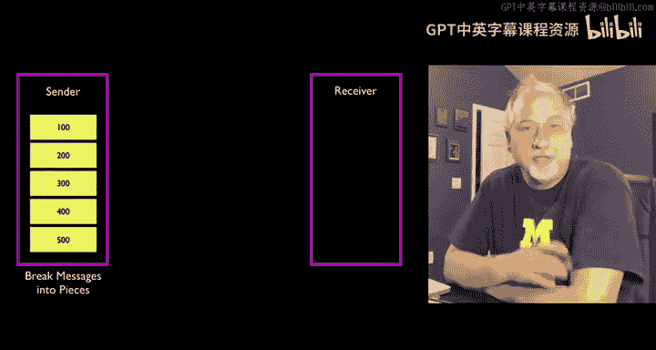

TCP层既简单又复杂。其目的是**补偿IP层可能出现的错误**，并**最佳利用可用资源**。TCP需要判断底层网络的速度和可靠性，并根据网络状况调整数据传输速率。如果网络快，TCP会快速发送数据；如果网络慢，TCP会降低速度以提高效率。TCP/IP网络的目标之一是有效共享资源，因此感知网络状况至关重要。

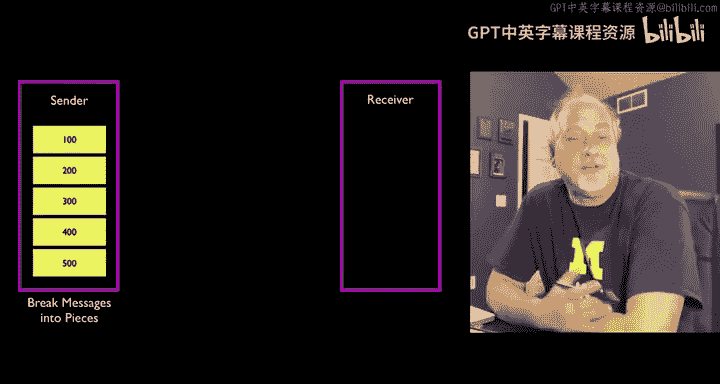

TCP的关键思想是：发送数据时，将数据分割成数据包发送，并**保留每个数据包的副本**，直到收到接收方的确认（ACK）。只有收到确认后，发送方才会丢弃副本。如果数据包丢失，它可以被重复发送，直到最终被目的系统确认。TCP的基本功能就是跟踪哪些数据包成功穿越了互联网层。

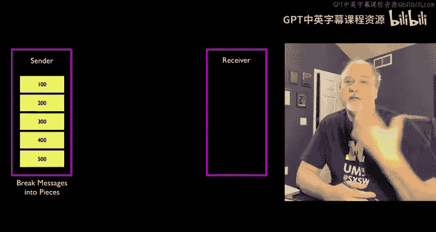

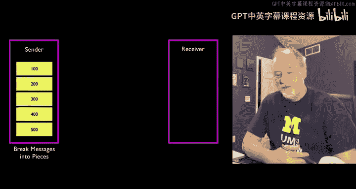

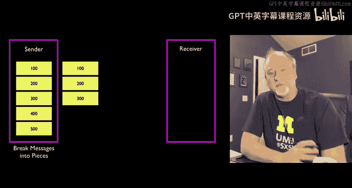

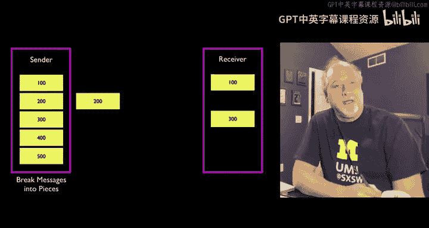

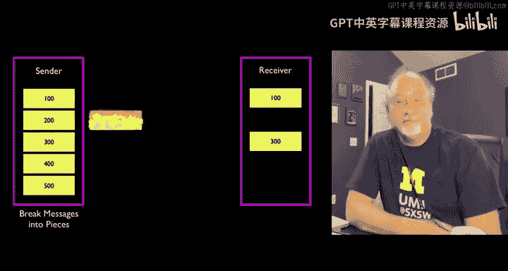

## TCP工作原理示例 📦

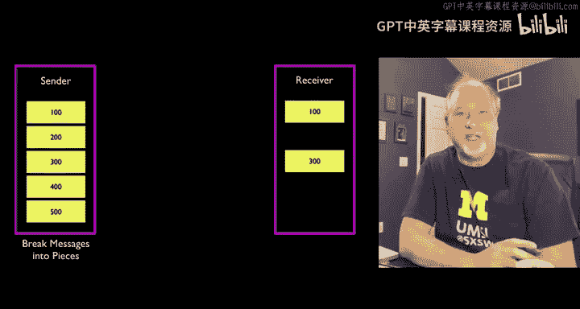

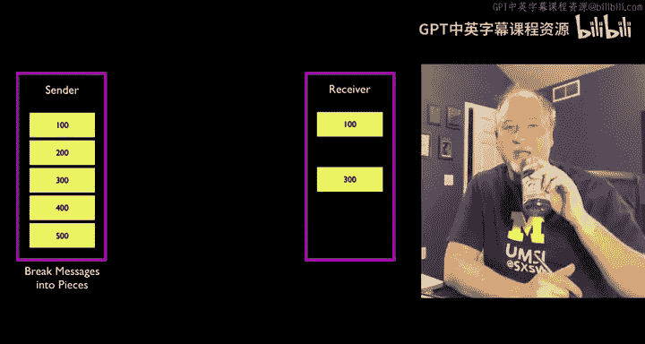

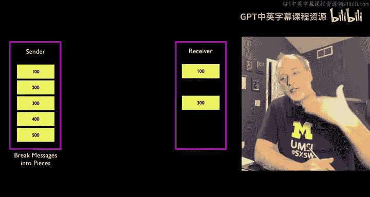

假设有一条消息被分成5个数据包（包含第1-100、101-200、201-300、301-400、401-500个字符）。TCP不会一次只发送一个包并等待确认，因为那样无法充分利用网络。相反，它会推测性地先发送几个数据包。

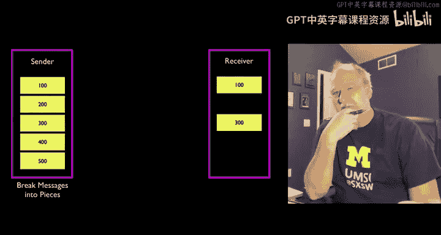

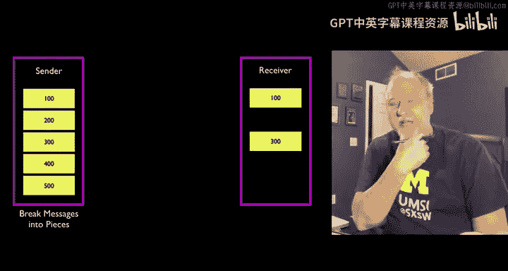

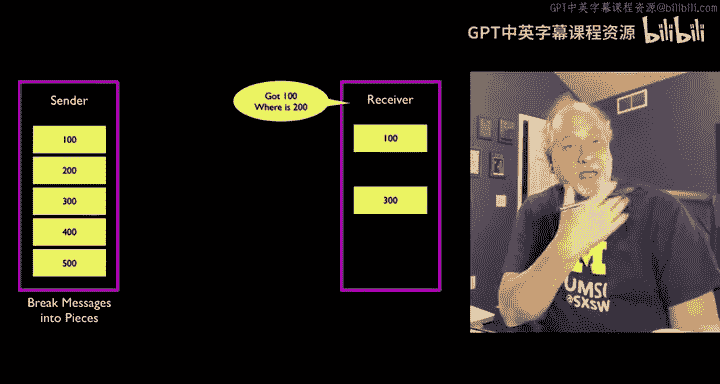

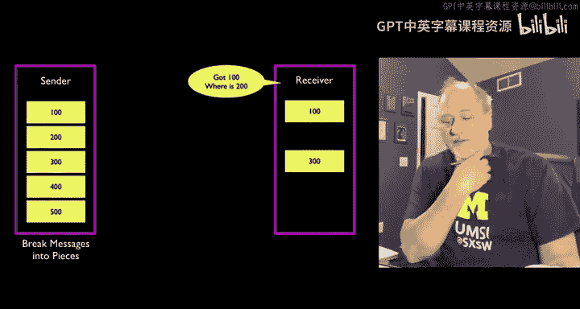

以下是工作流程：
1.  发送方先发送数据包1、2、3。
2.  数据包1和3成功到达接收方，但数据包2丢失了。
3.  接收方收到数据包1和3后，发现顺序不对（缺少数据包2）。它会向发送方发送一个确认，内容是：“我已收到第1-100个字符，我准备好接收从第101个字符开始的数据（即数据包2）”。接收方甚至可能因为等待过久而丢弃已收到的数据包3，要求从101开始重传。
4.  发送方收到这个确认后，知道数据包1已成功送达，可以丢弃其副本。同时，它知道需要重传数据包2（101-200），并再次发送数据包3（201-300）。
5.  这次，数据包2和3都成功到达。接收方确认收到数据包2，这意味着发送方可以丢弃数据包2的副本。接着，发送方继续发送数据包4和5。
6.  通过这种确认和重传的“簿记”机制，双方最终确保所有数据包都按顺序被接收和确认。

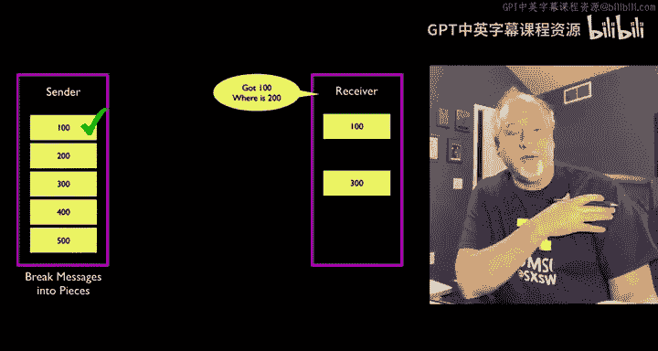

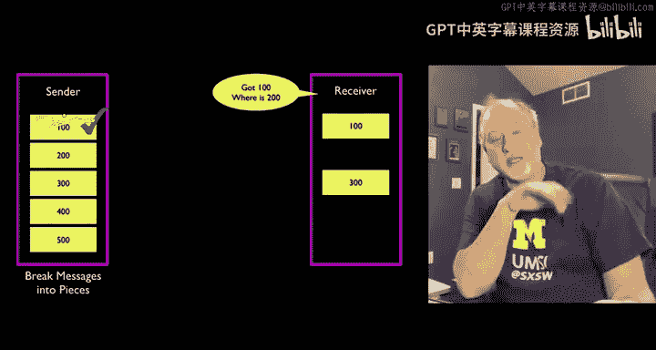

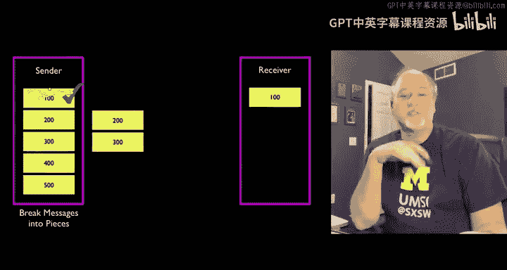

这是一个简化的视图，展示了TCP连接两端进行的簿记工作。

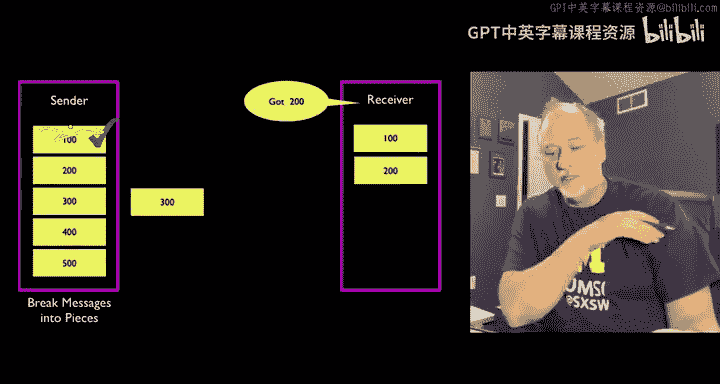

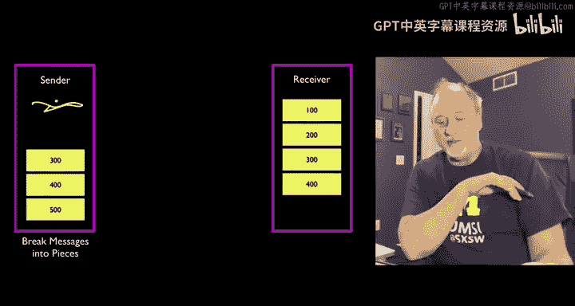

## 互联网设计的精髓 💡

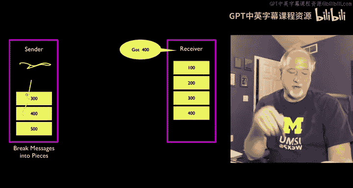

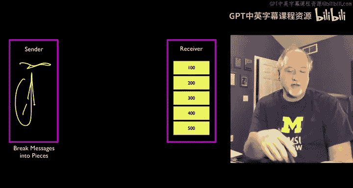

这里的精妙之处在于存储需求的位置。网络中间的路由器（IP层，即网际网络）被设计为**快速、敏捷、动态、智能，但也有权失败**。我们并不要求它们在网络中到处存储数据包。事实上，路由器应该丢弃数据包，并向系统反馈网络可能存在问题。

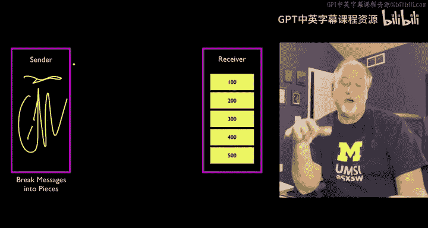

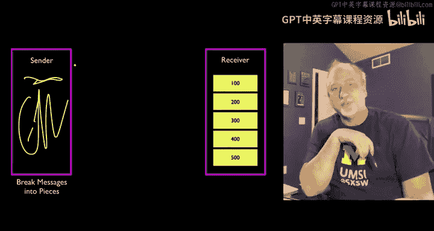

另一方面，网络外部有数十亿台计算机（如你的笔记本电脑、手机）。我们需要一种方法来使通信可靠，因此需要在数据包传输过程中存储它们以便重传。**我们将数据包存储在网络外部的计算机中**。每向网络添加一台新计算机，就为正在发送的数据包增加了存储空间。当你的计算机或手机发送数据时，它负责保留自己的数据包副本，并不期望网络内部来承担这个责任。

这种设计非常出色，正是它使得互联网得以工作。

## 范·雅各布森与“慢启动”算法 🧠

实现上述机制仍需大量工程努力。这里介绍一位本课程中的创新者：**范·雅各布森**。他在20世纪80年代末于伯克利工作期间，完成了一项关键贡献。

在20世纪80年代末，曾有一种预测认为互联网即将崩溃。当时NSFNET正在发展，越来越多的计算机接入，但主干网速度太慢，开始出现故障。一些计算机供应商认为学术界无法构建一个健壮、可扩展的网络。

在1987年，范·雅各布森**拯救了我们**。网络正在崩溃，我们所有人都安装了他的补丁，然后网络状况得到了改善。在我的记忆中，这是最后一次整个互联网看似要崩溃的情况。

他发明了**“慢启动”算法**，该算法已成为你现在使用的每台计算机上每个TCP实现不可或缺的一部分。事实上，在我们此刻进行讲座时，它正被用于流量控制。这个算法帮助TCP连接开始时缓慢增加数据发送速率，探测网络可用带宽，避免瞬间拥塞，从而让网络运行得更加平稳高效。

---

**本节课总结**：我们一起学习了传输层（TCP）的核心机制。TCP通过在通信两端（而非网络中间）进行数据包的确认、重传和流量控制，弥补了IP层不保证可靠传输的缺陷。其“保留副本直至确认”和“慢启动”等机制，是互联网能够在数十亿设备间可靠、高效运行的关键。理解了TCP，你就掌握了数据如何在不可靠的网络上实现可靠交付的基本原理。