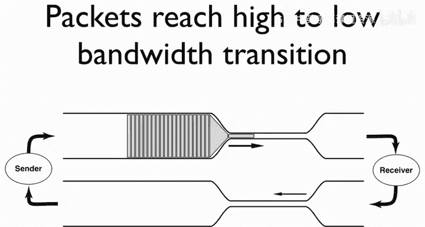
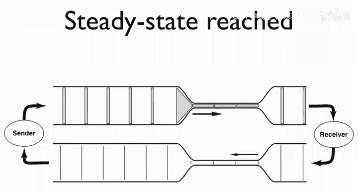
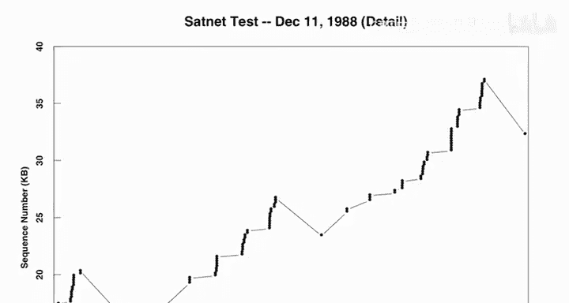

# 互联网历史、技术与安全：P41：范·雅各布森与慢启动算法

## 概述
在本节课中，我们将学习范·雅各布森（Van Jacobson）如何发现并解决了早期互联网中一个严重的性能问题，即网络拥塞。我们将了解问题的背景、分析过程，以及最终催生出TCP“慢启动”算法的核心思想。

## 背景：网络聚合与瓶颈
上一节我们介绍了早期互联网的雏形。本节中我们来看看当时网络扩展带来的具体问题。

当时，许多大学校园内部署了以太网，因为它们易于部署，可以安装在各个系里。然后，人们通过拉一条线连接两个系，就能形成一个更大的网络。因此，网络是通过**聚合**的方式成长起来的，在许多不同的大学校园里都是如此。

美国国家科学基金会（NSF）提供了一些资金，用56千比特的线路将这些校园网络连接起来，形成了NSFNET的第一阶段。但这就产生了一个问题：人们将**10兆比特**的校园基础设施与**56千比特**的线路连接在了一起。

这项技术非常受欢迎，因为之前无法通信的人们突然可以交流了。他们发送电子邮件、传输大文件，每个人都对此感到兴奋。但是，任何一个校园网络都可能以百倍的量超额使用这个骨干网，导致大量数据包堆积并被丢弃。

## 问题的发现与分析
当时，我是劳伦斯伯克利国家实验室的研究员，同时在伯克利分校任教。即使在80年代中期，每门课也都有一个类似新闻组的消息群，所有作业都会放在网上。我试图从我的办公室获取课程材料到伯克利分校埃文斯大厅的一台机器上，但网络吞吐量几乎为零，大约每10分钟才能收到一个数据包，性能差得令人难以置信。

我下去和迈克·卡雷斯（Mike Karels）谈了谈，他负责伯克利Unix（BSD）开发小组。他收到了来自全国各地的关于这些问题的报告。在当时，运行TCP/IP最简单的方法就是启动伯克利Unix，因为它有一个由ARPA资助的、非常优秀的实现。每个人都在经历糟糕的性能。

我们那天以及接下来的几天里讨论了很长时间：到底哪里出错了？是协议实现有错误，还是协议本身有错误？这个东西在较小规模的测试中运行良好，但突然就崩溃了。我们努力了三四个月，检查代码、编写工具来捕获数据包踪迹、查看数据包踪迹，试图找出是什么导致了故障。

我记得我们两个坐在迈克的办公室里，在埋头苦干了几个月之后，其中一个人（我记不清是谁了）说：“你知道我无法弄清楚它为什么崩溃的原因吗？因为我不理解它曾经是如何工作的。” 我们以10兆比特的速度发送这些比特，它们快速穿过校园，然后撞上这条56千比特的线路。我们期望它能穿过那条线路，从另一侧出来。这怎么可能正常工作呢？这成为了关键的起点。

## 核心原理：带宽变化与时钟同步
从那时起，我们开始思考：这个协议的什么特性让它能够工作？它如何处理所有这些带宽变化？如何处理多跳？

请看这张图。横轴是时间，纵轴是带宽。所以粗管道代表高带宽，细管道代表低带宽。当时的比例是，这是10兆比特的管道，而这是56千比特的管道。实际上差异接近100比1，而不是图中的3比1。

时间（秒）乘以比特每秒等于比特数。图中的每个小方块代表一个数据包，即一个数据包中的比特数。如果你在带宽维度上压缩它，它就必须在时间维度上延展，因为比特数不会改变。

因此，发送方发送了一串数据包（一个窗口的数据包），它们会在网络中飞行，直到遇到这个从快到慢的转换点。然后，因为数据包必须在时间上延展，它们都必须等在那里，排队进入更慢的线路。当它们从另一侧出来时，它们被这个瓶颈（慢速线路）拉开了间距。一旦它们被拉开，就会保持这个间距，没有什么能把它们重新推到一起。

数据包到达接收方，接收方将每个数据包转换成一个确认包（ACK）。于是你得到一串返回发送方的ACK，这些ACK记住了通过那个瓶颈的正确间距。ACK返回发送方，每个ACK又触发一个新的数据包被发送。我们可以看到数据包流回来。这是在经过一个往返时间（RTT）之后。

现在，数据包到达时已经完美地间隔开了，所以它们依次通过。一个新的数据包进入网络的时间点，恰好是前一个数据包离开瓶颈的时间点。这些ACK就像是一个**时钟**，告诉发送方何时可以安全地注入每个新数据包。网络中总是会有空间留给最慢的那个点。关键问题在于：如何最快地达到这种稳定的、浪费最少的状态？

## 问题的根源：启动阶段
我们看到的故障问题在于：这个机制在交换了大约一个往返时间的数据包后，工作得非常完美。但是当你启动连接时，**没有时钟**。所以TCP的难点不在于让它运行起来，而在于**启动它**。因为一旦它运行起来，你有了一个时钟告诉你该怎么做。

如果你突然启动，你会陷入一种重复的故障模式：你塞满了某个网关可用的缓冲区，然后当你重传时，你又做了同样的事情，所以你总是在丢失数据包。

但是，如果你启动得更**平缓**一些，你就不会使缓冲区过载。你会得到一个足够好的时钟开始工作，从而控制积压的数据量以适应可用的缓冲区，同时你仍在增加传输中的数据包数量，最终你会得到一个完整的时钟。你从一个零散的时钟开始，但最终会填满细节，得到一个完整的时钟。

## 解决方案的实施与社区协作
那么，你是如何让它应用到全球所有的TCP/IP实现中的呢？因为它们在某种程度上必须合作。请记住，那是一个简单得多的时代，当时全球的TCP/IP实现大概只有四个：伯克利Unix的实现、MIT的PC/TCP、BBN用于Butterfly和Nymbus的实现，以及Multics的实现。

我们拿了一直在研究的几个TCP内核模块，把它们打包成一个tar文件。我有一个非常糟糕的驱动黑客程序，可以让我们从内核嗅探数据包。你通过一个ioctl调用告诉内核你想嗅探什么，你写入一些二进制值，指定你想监听的端口，驱动程序会将这些数据包捕获到一个环形缓冲区，然后你读取内核内存来取出那个缓冲区。

我小组里的克雷格·拉格斯（Craig Lugg）和克里斯·托克（Chris Torek），他们都是长期的Unix黑客，对此感到尴尬。他们一起做了一个非常干净、漂亮的驱动程序，即**BPF（伯克利数据包过滤器）**，它允许你通过一个非常高效的ioctl接口从内核中提取数据包。我们把所有这些捆绑在一起。

然后，我们在TCP/IP邮件列表上宣布这些材料可用。在那个年代，TCP/IP是非常实验性的前沿技术，几乎所有研究它的人都在那个邮件列表上。一群人下载了它，尝试了，结果程序崩溃了。他们发送内核崩溃信息和错误报告。我们修复错误报告，发布新版本。然后立即有人回来说：“这里内核恐慌了，你想要内核转储吗？” 我说：“哦，不，太尴尬了。” 发布新版本，又有人回来说：“这里恐慌了。” 就这样循环往复。

大约一天后，我们得到了一个不会立即导致内核恐慌的版本。然后我们开始研究实际的算法，并进行了一些微调，以确保它始终表现良好且不会造成任何损害。这完全是一个社区的努力。当社区基本上说“这大多数时候表现良好，而且似乎从不造成损害”时，迈克就把它放入了内核。他采纳了社区开发的模块，并将其整合到BSD版本中。

## 总结
本节课中，我们一起学习了早期互联网因带宽不匹配导致的严重拥塞问题。范·雅各布森通过分析数据包在网络瓶颈处的排队与时钟同步机制，发现了问题的核心在于TCP连接的启动阶段缺乏 pacing 时钟。由此，他们提出了“慢启动”算法的核心思想——通过逐渐增加发送窗口来避免瞬间冲垮网络缓冲区，并依靠返回的ACK来建立发送节奏。这一解决方案通过开放的社区协作方式，集成到了伯克利Unix中，并最终成为TCP协议不可或缺的一部分，极大地改善了互联网的稳定性和性能。