# 密歇根大学《互联网历史、技术和安全Internet History, Technology, and Security》中英字幕 - P50：49_安全技术：完整性与数字签名.zh_en - GPT中英字幕课程资源 - BV1DE421c7CT

So now we just finished talking about basic confidentiality using simple Caesar cipher and we'll get better before we'll be more sophisticated than that because Caesar ciphers are trivially graable obviously。

 but now we're going to switch from confidentiality to integrity and we're worried about the message just to review the confidentiality means we're hiding information we just don't want Eve to see it because Eve sees the ciphertex and we want her to never be able to extract the plain text and as we saw in the last lecture。

 you， if I'm just using a Caesar cipher， I mean there was little or nothing I could do to stop you from doing it all you can do is enough work and you would figure out the shift and then you'd have everything。

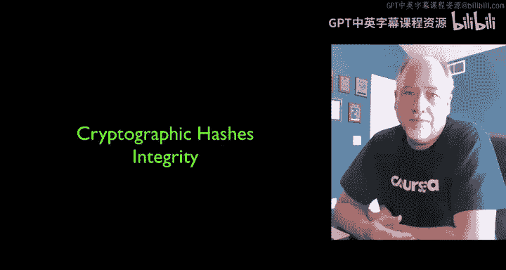

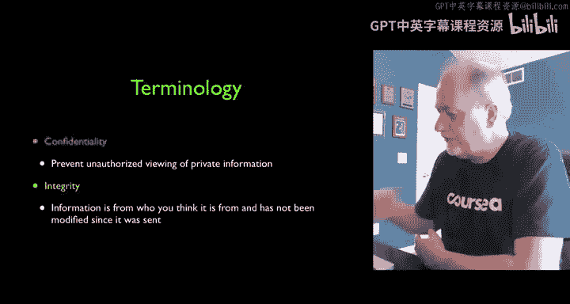

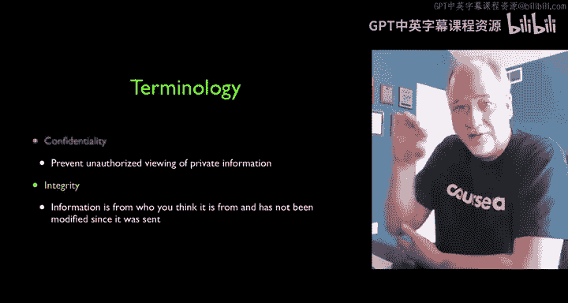

So it would take you， you know， you write a program。

 it would take you like a thousandth of a second to check all possible things and you're done。

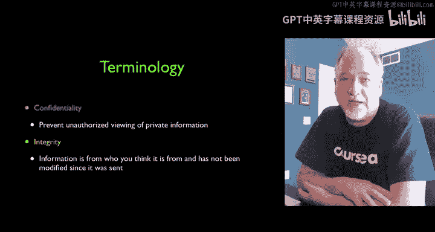

So that's confidentiality now we're going to talk about integrity， right？

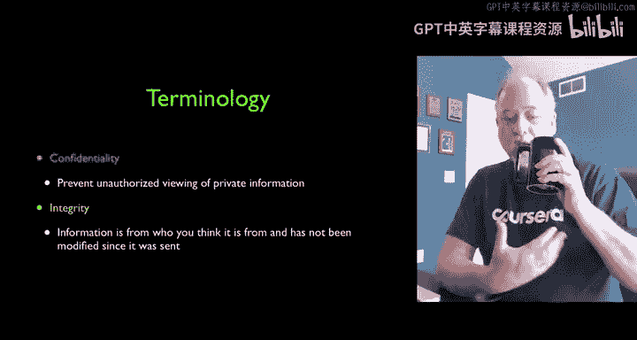

And we're going to kind of assume confidentiality or perhaps assume it's not necessary because we're transporting it in a locked box or in whatever。

 but let's just say I had some piece of paper， right？

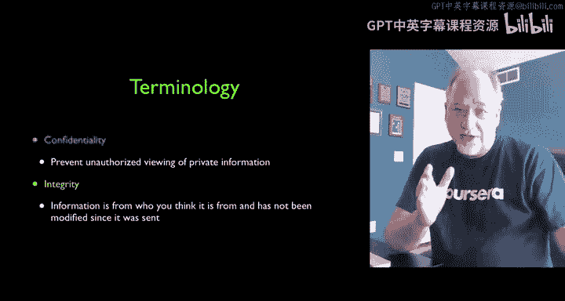

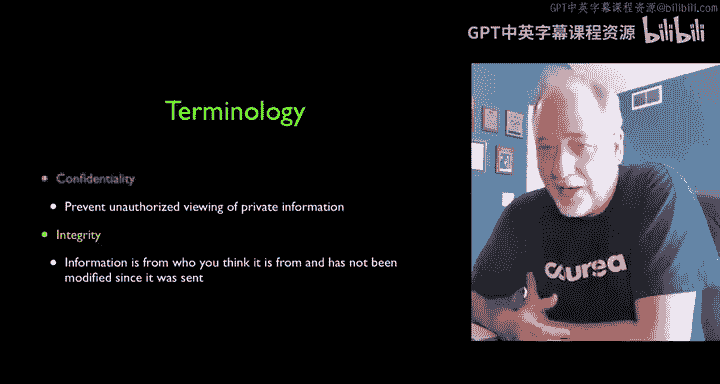

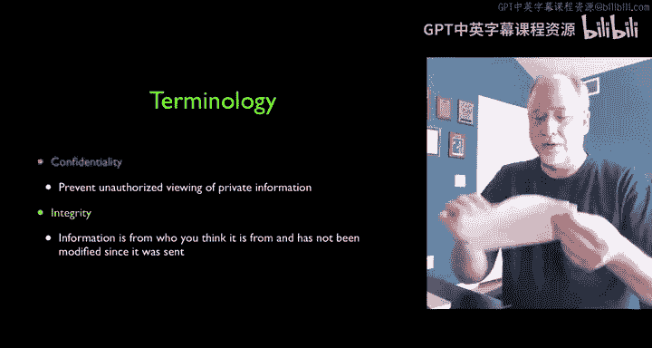

And and you'd wanted to know if this piece of paper really came from me， well。

 we would use things like a signature。

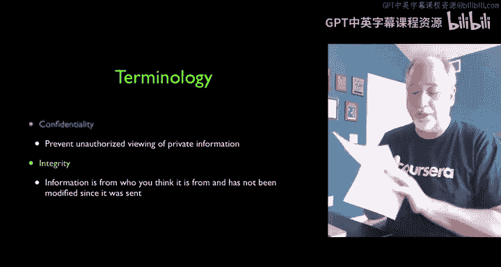

Right or we would use a bit of wax where we would push our seal on it and the seal only belong to us。

 but really signatures can be forged you know people can steal the wax imprint thing I mean in Roman times they would wear it around their neck to make sure that no one stole it。

 but you could also just create a fake one so you could seal your letter with the wax， but。

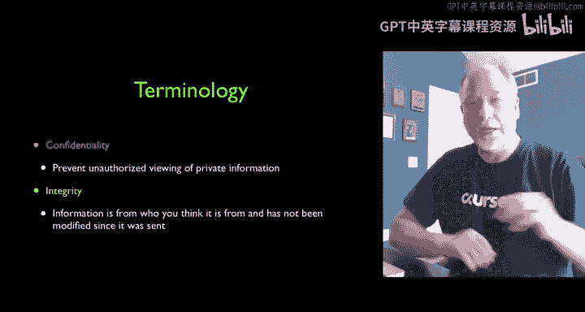

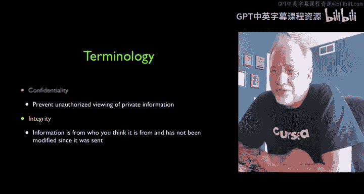

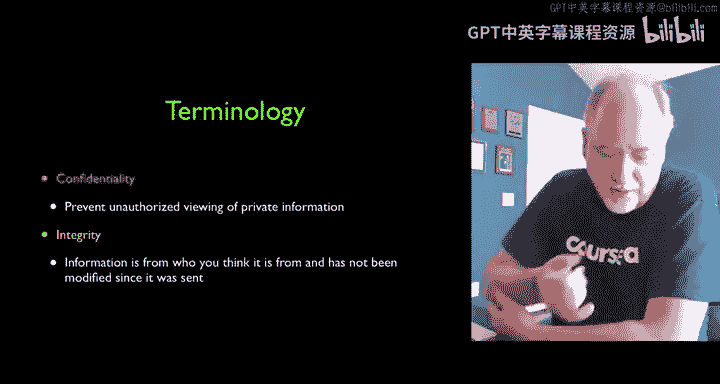

And you break the wax seal。 But in the computer world， we need something， right。

 We need a situation where。

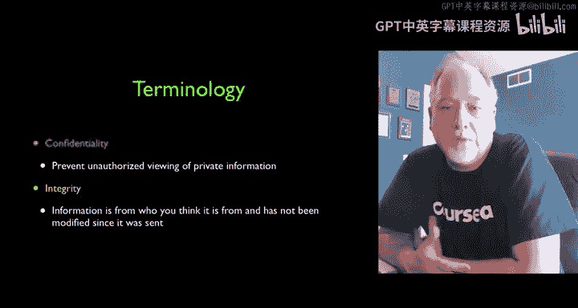

Where perhaps I mean my wife had to get a prescription and they sent her an email with a prescription in it and this prescription had on the end of it。

 a digital signature， it was just a bunch of numbers and you think to yourself， wow。

 you know here's this prescription and at the end it just has a bunch of numbers and that's the digital signature from the doctor and how does that work Well。

 it works surprisingly well and and that message can be forwarded， she can print it out。

 she can scan it， she can send it to a pharmacist via email and as long as that signatures in there we can know that the data originally came from the doctor。

And that you didn't know and modified it to be a different kind of prescription。

 like a different amount or a different drug， and then that would invalidate the signature and how exactly is that done？

It's done using a technique called cryptographic Hasing。And it is a bit of computer software。

 a bit of code that takes a large amount of text。And reduces it down to some small set of numbers。

 a large block of data to a fixed length set of numbers。

And the message is the big thing and the digest is the little thing it sort of it's like it digests it and sort of gives you this little tiny thing Now the key is there are many different techniques to map from a message to the hash or the digest。

And some are better than others and it turns out that there is a longter whole field of mathematics and computer science that's dedicated to understanding what a good cryptographic hash might be and so there are these well-known cryptographic hashes that you may have heard of like Shah1 or M5 each of those is the result of many。

 many years of research of thinking through what a good cryptographic hash is so for example。

 one cryptographic hash might be I sign it with a number of characters in the message that would be something that says like well at least they didn't expand or contract the number of characters in the message but then at some point that would be such an obvious thing that you would change the signature as well so you want to make it so you can't change the message and change the signature because then you're sort of properly forging a signature so the hash function that takes the message to create the digest that's something that is a scientific mathematical research effort to get the。

Thing right， okay？So here is an example of a hash function now this hash function takes as message input on one side right。

 it takes message input of and this can be short， medium or extremely long messages and the digest is always a fixed size。

It's always a fixed size， right， Some get longer than others different message hashing functions give different length。

 but they're all fixed， and they're fixed， even if the input is megabytes， it can be megabytes。

 hundreds of megabytes。 And you can still run all that through the hash function and get a digest。

 Okay， And so the key thing is is。Is to make it so that。For any change in the input。

 the digest also changes Okay， and so here we have the red fox jumps over the blue dog。

And that's the hash that comes out and if we change one letter， the V to a U。

 the hash changes dramatically， so this hash changes dramatically。

 so this suggests this is a good cryptographic hash function。The length didn't change。

 all the characters are the same， but one character changed and the hash function changes completely and here is another flipping of characters right where from here to here。

Let's getting better color here。Which covers to that。From here here。

 the V and the E were just toggled and yet from here to here。

 the hash function is completely different， and so the hash function needs to generate quite different hashes。

 even with tiny perturbations of the input， you're not even allowed to change one character add removed character and they know when a cryptographic hash function is bad。

If they can take two different messages and send it through and get the same digest。

 and so there's a lot of research to try to as soon as they come up with one of these things。

 there is a massive amount of research to try to disprove it to say that's a bad one。

And the bad one is if two different messages come in and they come out with the same hash function。

 then that's bad because it means that it's。Prorovably that the signature could use the same signature can be used to sign two different input messages。

Okay， so this hash function。Function is a bit of computer code， right， And， you know， Shah1。

You can go look on Wikipedia for Shah1 or MD5 these are kind of classic hash functions and when you read the Shah1 or MD5 Wikipedia。

 they'll talk about the fact that it's been decided it's kind of flawed and so there's like Shah1 don't use it It's not cool Now you can use it for less critical things you just have to be aware of what its limitations are it's like Shah 256 it's better than Sha 1 So what happens is there's continuous research and there's continuous improvement in the mathematics of these hashing functions and they're getting really good at it because we've been using these things for a very。

 very， very long time。Now if you want to play vote and clear this up。

 so I've got a simple S one calculator and you'll be using this in the homework。

 the S one calculator takes as input。Some kind of a plain text。

And it produces output when you hit the thing so you can put in pony or fluffy or whatever or even a whole bunch of stuff and it produces a Shah 1 okay so so basically get ready to use this because the next upcoming exercises are going to use this and you can read Shah 1 about Shah1 on Wikipedia and you can find out like it's seen as less than perfect and you should use Shah 256 or whatever。

 but actually lots of applications in less than critical situations know that you know for short and reasonably linked strings that you know the flaws are mathematically found but they're not commonly run into so Shah1 is not horrible its just been proven sort of less than ideal and so for highly sensitive information you would never use Shah 1 but for simple things Shah1 and even things like M5。

Are commonly used like for hashing passwords， so no hashing passwords。

The first application of this that we're going to talk about is hashing passwords。

So you go to a new site， even Coursera。org， and it asks you to create an account and create a password。

Now you're not supposed to， but lots of people use the same password for lots of systems。

And so if your Coursera password were somehow mistakenly revealed。

 they might get your LinkedIn password as well。And so it is considered very bad form， very。

 very bad form to actually ever store your password。In the Coursera database in plain text。

Because if the database was somehow compromised， then all the bad guys would get。

All of the plain text passwords and again， maybe use them not just on Coursera because you could change your password on Coursera。

 but use them on LinkedIn and Twitter and whatever and YouTube and steal all your accounts by compromising one account because you made the mistake。

That lots of people do of using the same password in a lot of different places because we're tired of making up a new password for each place。

So you're not allowed to store the plain text password in the database， that's bad practice。

 and we don't want to do that。 So the best practice is to store a hashed version of it to run。

 take the plain text of the password when you're creating your account。

Run a cryptographic hash on it， store the cryptographic hash。

 and then when you log in next you present to the system your plain text password and it runs your presented password through a cryptographic hash。

 same cryptographic hash and then compares it with the hash password in the database If they match。

 you must have presented the same plain text both times This is a way that they can verify that you've represented the same plain text again without。

Them ever storing the plain text， Okay， that's why a respectable system will never send you your password。

It's I've almost started doing this where I as soon as I go to a new system and I set my password。

 I set it to crap and then I have them send me a message。To reset my password。

 And if they send me the actual plain text to the password， it's like an。

 and I use some crap password。 I've actually got to the point where。

I'm tired of reusing my passwords and my technique I don't know if it's a good one or bad one is I just put crap in for my password and then every time I use this system I have it send me a new password or reset the password。

I mean， that I really think we should just change it so that when you log in。

 it just comes to your email and you click a link， I don't know， I'm not expert on this stuff。So。

 but a respectable computing system will never， ever。

 ever send you your plain text password because they don't possess it and they can't derive it。

 These cryptographic hashes are not backwards， you can't make them go backwards， let's go back here。

 therere only a one way hash because this might be one megabyte of data and this might be well let's see four times this is 40 characters。

 40 characters of data， one megabyte squeezes down to 40 characters， there is no way to go backwards。

 the information is lost。The hash is you know distinct and unique right but you cannot go backwards。

 it's a oneway operation you can go from the plain text to the hash。

 but you can't go from the hash to the plain text， which is very different than encryption and decryption right in decryption you had to be able to pull the plain text back out from the encrypted text this is not encryption this is calculating a special digest that is uniquely connected to the plain text message but you need to run the plain text through the hash again and then compare okay。

So let's do some homework。Well， so now， let me first show you how this works and the hash passwords。

So。So let's say for example， you're logging into Coursera。

org and creating your profile for the first time and it says， please give me your password。

And you choose a singularly bad password as fluffy。

Okay so fluffy and you can type fluffy into Drchuck。com/shaw1。php in another window。

 if you type fluffy and you encrypt it with Shah1， you get this as the hash password。

And then this is what they store in Coursera's database。

And so that is they don't know they never store fluffy。

 they would not do that they would be so bad if they did that so they store this and if I get this it's very difficult to reverse engineering it to fluffy。

 it also is even harder if you make your password long， best passwords are like sentences。

 not just eight characters but they're like long sentences。

Of stuff that's rather difficult to predict。So this is what's stored in the Coursera databases。

 some ugly string which is a cryptographic hash digest of your password。

 so now you log out and this is gone， that's only in your mind and this is sitting in the database。

So you log in， you log back into Coursera and you forget your password， so you type in Pony。

If you run pony through Shah1， you get this as the cryptographic hash of the word pony。

And you look and you compare。And you go nope。That is not the right password。

 I don't know what the right password is， I can't give you a hint， I can't tell you。

 hey you you put shift on your password， why don't you try taking that off you know you seem to have caps lock on because it doesn't know whether what your password is but it does know that pony is not your password then what it does。

Right so this is what's stored in the database then you go oh my secretary that's right。

 I use fluffy for my password on Coursera， so then Coursera runs that through Shah1。

 it gets the cryptographic hash of the plain text that you entered and then it compares it to what it has stored as the cry the plane as your hash password and it matches so then it says yay let you back in the fluffy only existed in your mind unless you foolishly like wrote it on a post it note and stuck it up on your computer which you shouldn't do as well but whatever it was。

Coursera never stored Coursera never stored it， Coursera only stored this。And that again。

 is why Coursera can never tell you what your password is or any reasonable site can never tell you what your password is。

 It can only tell you。It can only let you change it again。

 which is easy changing again you just it decides， oh， it sends you mail。

 you give it a new password and it recomputes a S one for that one and stores that S one so that's why you have to get password resets to happen。

ok。😊，Okay， so the next thing that I want to talk about is I want to talk about digital signatures。

 how we can use this for message integrity， so we've got the notion of a cryptographic has。

 which is a calculation takes a large block of text so far we've only used it on small blocks of text okay。

 but now we're going to use it on larger blocks of text where we're going to。

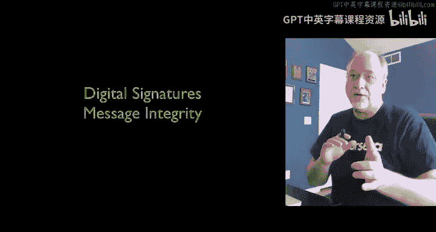

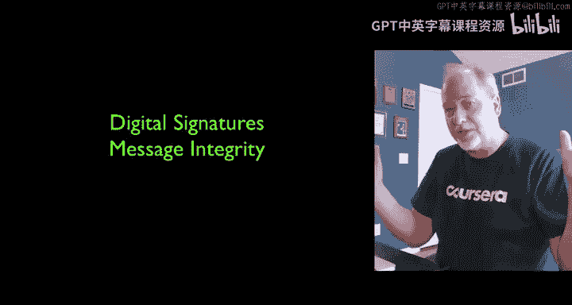

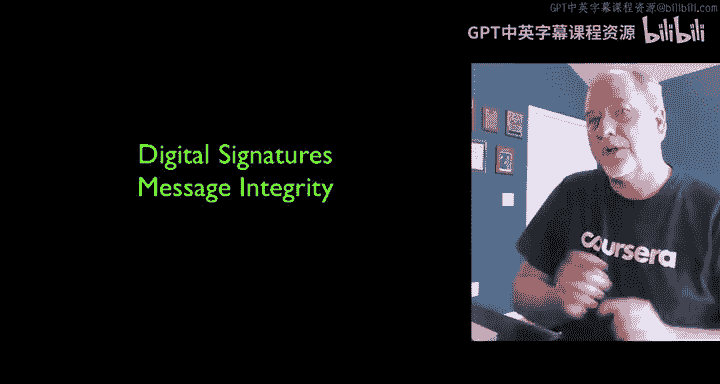

Ensure message integrity， which means we're going to figure out if this message actually came from a person we think that it came from okay so we're going to use integrity now。

 I mean， in a sense， what the system was doing when you were typing in a password it was ensuring that you were really the person on the other end of the line right hi I'm logging in as Dr。

 Chuck and here's my password fluffy that by giving you the password I'm proving that to Cosera that I'm really Dr。

 Chuck， so it's a form of integrity right off identification is form of integrity right it's not different than showing your driver's licenses yes。

 this is really me okay but now we're going to do it in a way that we're going to send a message so it's not just a password we're not really solving just the password problem but we're actually going to use it to make sure that the message A came from the right person and B was not modified in transit This is kind of the doctor signing the prescription digitally and then sending you an email with your prescription that you can print the email and take it。

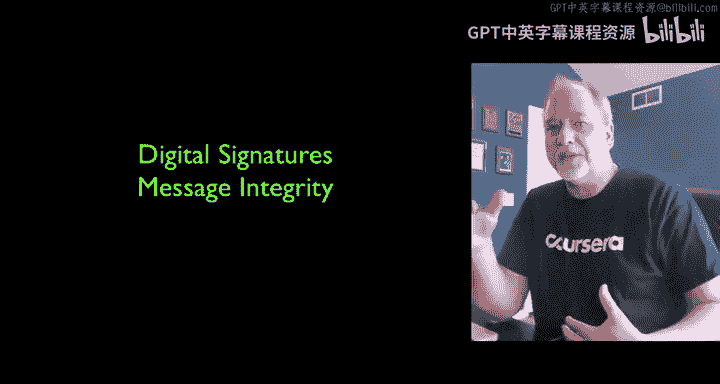

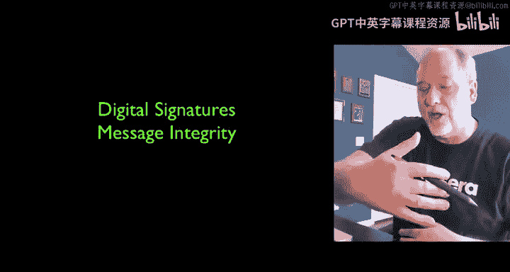

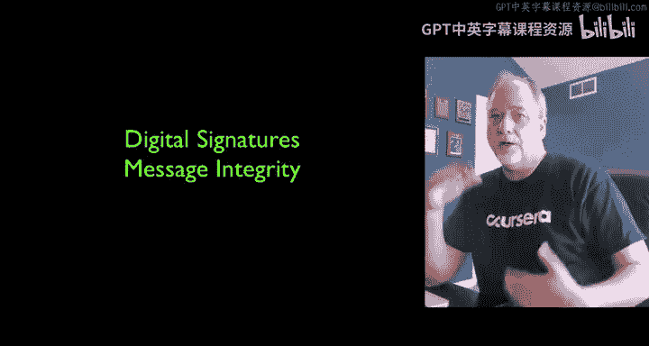

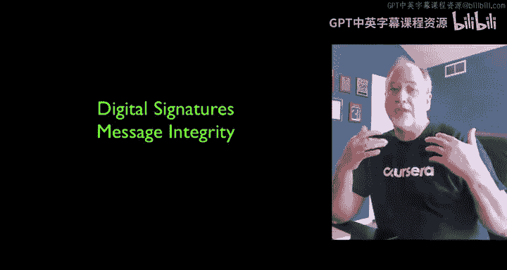

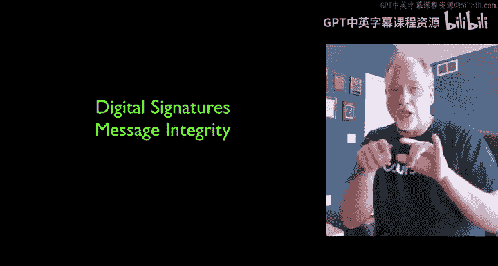

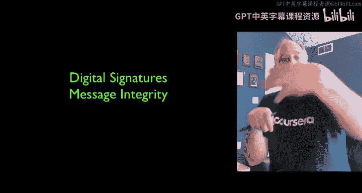

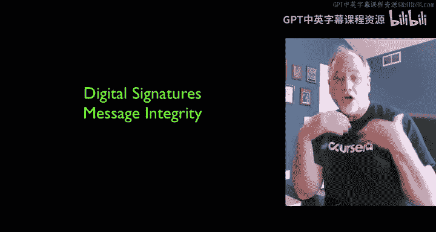

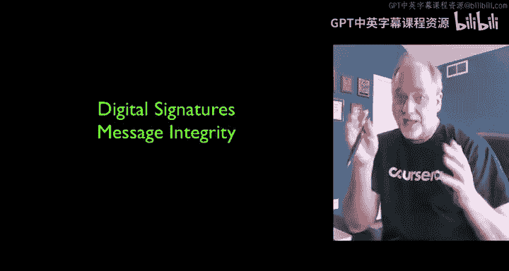

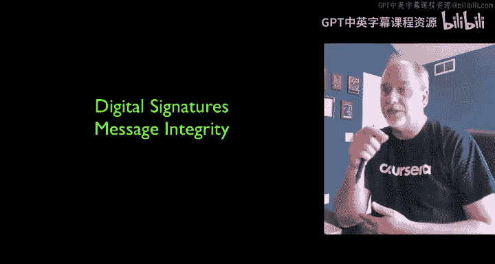

Take take it to your pharmacist。

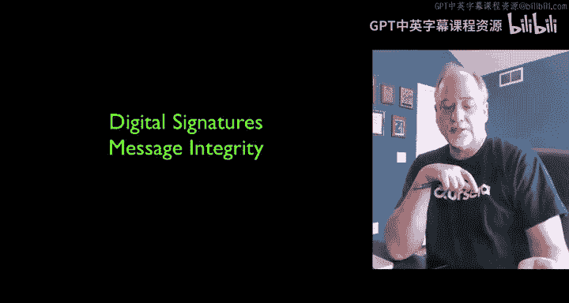

So again， message integrity， when you get a message， did it come from。

 who did it come from and do you did it come from who you really thought it came from or was it altered in transit？

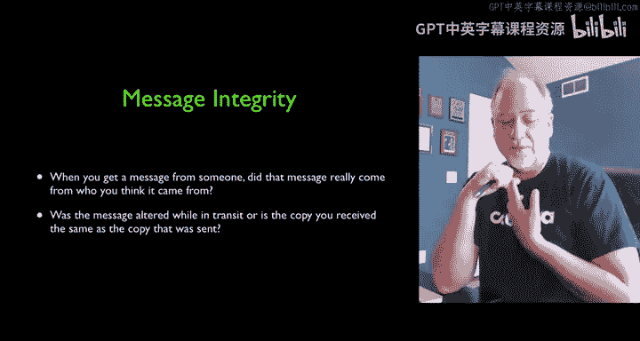

Okay， so if you go back to our little example from the Christmas story。

 the message from Annie was eatat more Ovaline。

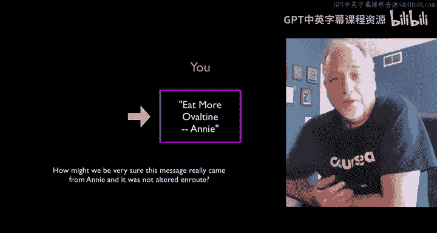

Now， the question really becomes， did it really come from Annie？

Because little orphan Annie didn't necessarily say it。Lorphaans handed the message to somebody else。

And then they read it。So did that person change the message because maybe there was actually a secret message from Annie and maybe Annie wrote it and it really was an important secret message。

 but then somebody like the advertiser changed it and sent it to you as if Annie came from Annie so we're not really worried so much now about the plain text that is the fine plain text the question is。

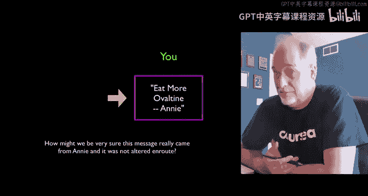

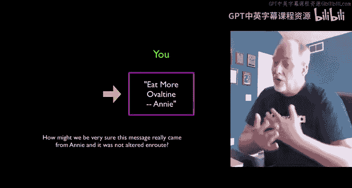

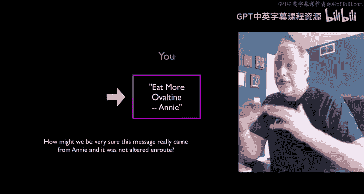

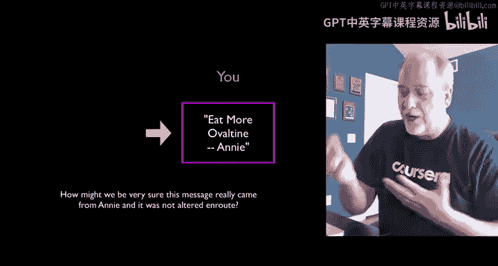

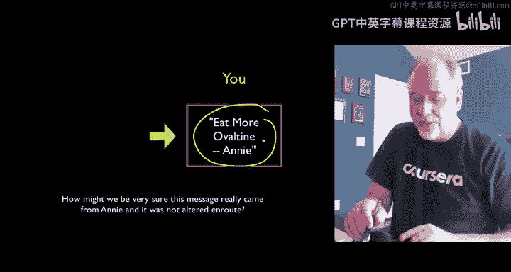

Did it really come from little orphaane？Because we are receiving this from on insecure media。

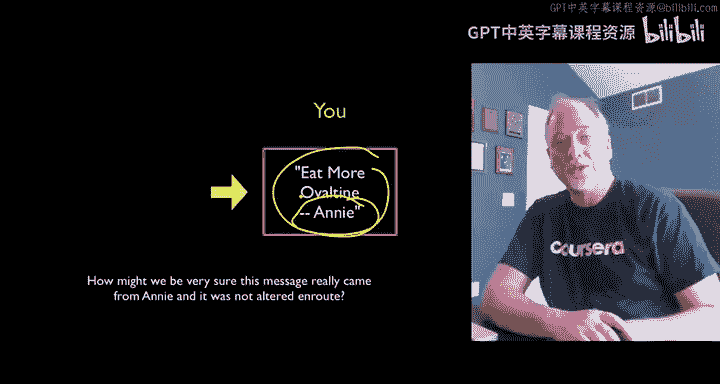

Like Annie is so out here somewhere， but Annie handed it to somebody to hand it to somebody。

 to somebody to send it across radio， yada yada yada， the question is。

 did the message originally come from Annie long， long ago？Handed through many people or not。

This is again， like the seal that you put on with the wax。

 did it really come from that person or not？Is it really Annie just saying， yeah， this is Annie。

 That's too easy。 You could say eat。Less ovaline or or maybe Annie wanted to say I hate ovaline right that's mind what but we don't know if Annie said eat more ovaltine or not right because all we saw was eat more ovaltine and it seemed to come from Man。

 but we got to know we got to know that it came from Annie or not okay。So。

Simple message signing using shared secret， and we'll move to a better technique later。

 but we're going to start with a simple technique of shared secret is that we have a shared secret that we're going to use for message signing。

It'll probably be different than the encryption secret okay。

 so now we get together with Annie in a shared room and she tells us what the shift is going to be and then she tells us what our shared signature secret is going to be and then we separate。

So the technique that you do is before we send the message， we can catnate the secret to the message。

 right， so eat more ovaltine。And then put the secret on the end of the message。

 and then you compute the digest of the message plus the secret concatenated together。

Then you remove the secret from the message and then you send the message plus the digest across the insecure。

 and in my wife's example， this was the little signature numbers that came from her doctor。

Was the digest。But it was the digest not just of the message， but of the message plus the secret。

The secret didn't come across the message plus the digest came across。 So let's look at this。

When we look at how when we receive a message。So we receive a message and we see a digest at the end of the message。

 and it's across an insecure transport， so we take the digest off the message。

Take the digest off the message and we add the secret back on the message。

 We know the secret and he knows the secret， but the people in the middle who transported the message do not know the secret。

 so it's finally arrived in our location， we see the digest， we pull that off and hold onto to it。

 we add the secret to it， we can take the concatenated message plus secret， we run it through Shahwa。

 we get a digest locally。And then。We compare that digest to the received digest。

And the only way to make the digest match is to know the secret now maybe somebody like。

Made Annie tell them the secret， which means they could forge the messages。

 but if the secret is not been compromised somehow。

 their only way to create the digest is to know the secret。

And so we can compare the received digestig to the known digest that we compute on RN in a secure way because we and Annie are the only ones in possession of the secret。

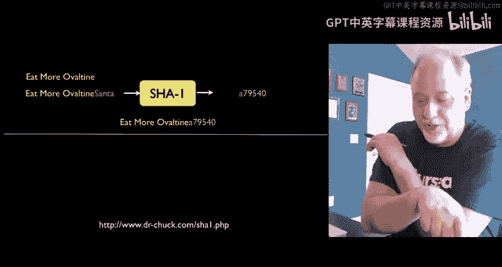

So here we go。So you can play with this on Sha1。phP， Dr。 Chuck。

 and so if the message is that Annie wants us to send or Annie wants us to get is eat more ovaltine and the secret is Santa so what you do is you take the message cancatenate the secret and then run that through Shah one。

 this is all happening in in Annie's secure room and she comes up with a digest now it's longer than this but that's just the first six characters of it and then what she does is she removes the secret and then concatenateates the digest okay and that's what gets sent across the insecure medium。

 it could be many steps could be many people， it could be on paper it could be Mor code。

 it could be phone call， who knows radio but we this is the danger right we do not know if the message is harmed in any way as it moves across this medium。

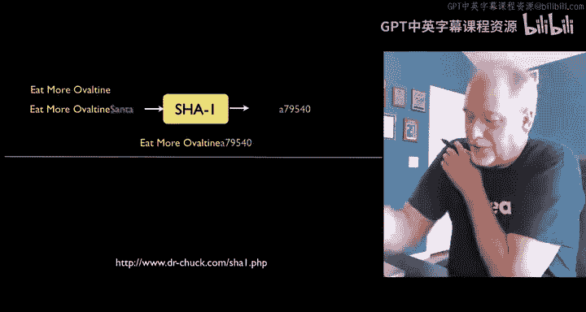

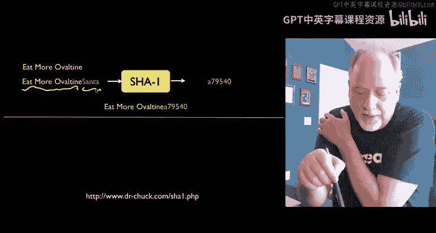

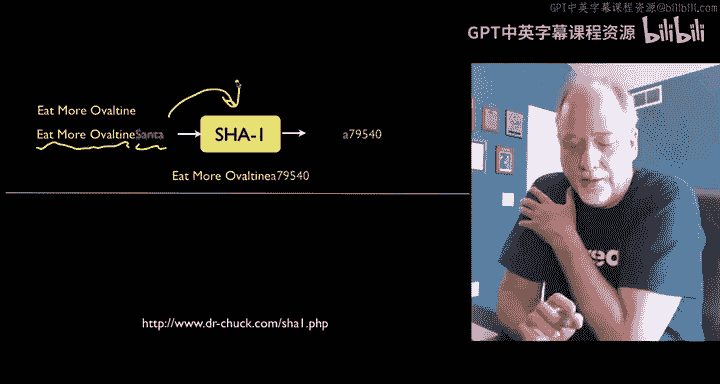

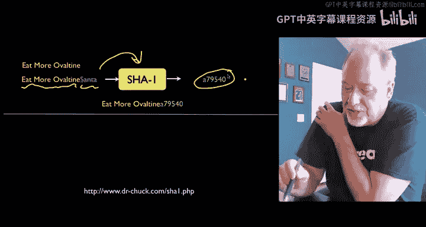

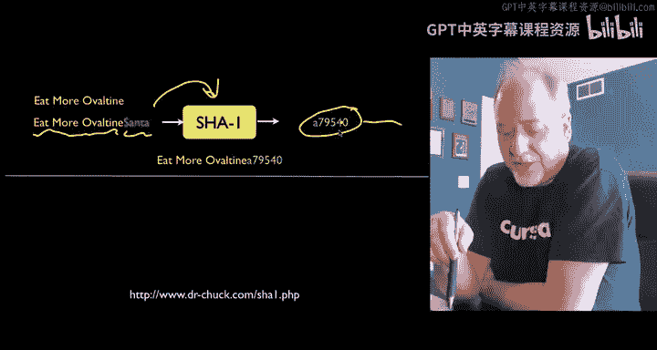

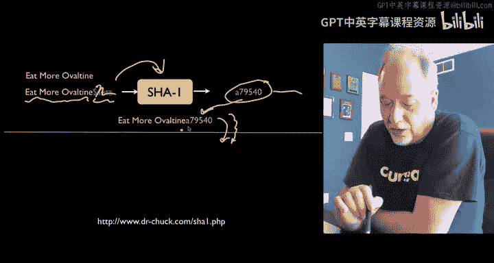

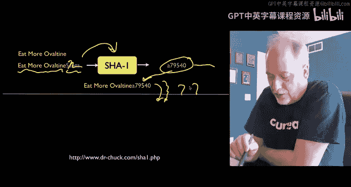

ok。So then what we do is we receive the message。RightWe don't know if it's a good message or a bad message。

 so we see that it's a message and it has a digest on the end of the message and we split that out。

 we split the digest out and we hold on to the digest separately okay。

And now we have the message minus the digest， and so then what we do is we add the secret back on because only Annie and us know the secret。

Right and。And us know the secret we all know how to do Shah1。

 and so we take this message and we run it through Shah1 and we get a digest that we've computed locally。

 This is the received digest that's the local digest， and then we compare。And we say this is great。

That must have came from Annie， and we know that it came from Annie。

 even if it came through a dangerous set of steps and we can't trust any of the people that transported the message。

 they're all untrustworthy， but we know that no matter what happened that originally at that moment。

Annie did this， okay， Annie made this digest because without knowing the word Santa。

 there is nothing and this could be like megabytes of data。And this is a real tiny。

 40 character thing here。The digest is small， the message is large。

 so you can't go backwards to get it。 There's no backwards here。😡。

Now if you can steal a secret from Annie， then all'll bets off， of course。

 so we have to assume that Annie's okay。And that， you know。

 Annie was not compromised like in James Bond movies， for example。

Without I was trying to get the secret from the good guy， Okay， so let's go and do this again right。

 so here we go。

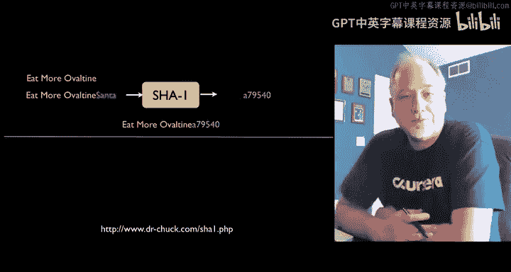

We want to send the E more ovaline and the secret Santa。

 and so we do the same thing and we end up with。

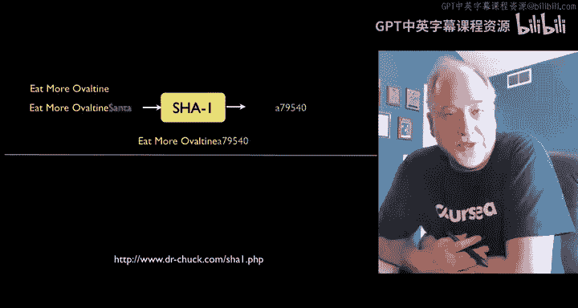

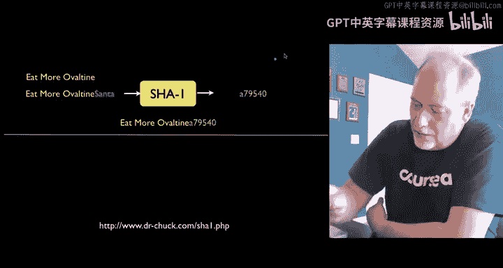

End up with that and then she concatenateates it and this is all done， you know。

 in Annie's bedroom and secret thing and then she sends it， okay， she sends it to us。

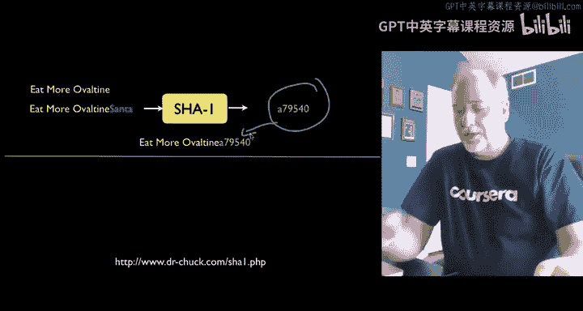

But。😡，A diabolical， diabolical courier says。

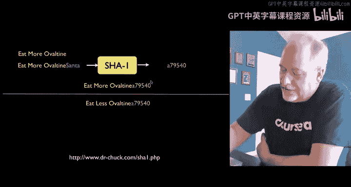

I have a thing about ovaltine， and I'm going to change the more to less。

 So I'm going to change this message to be eat less ovaltine。

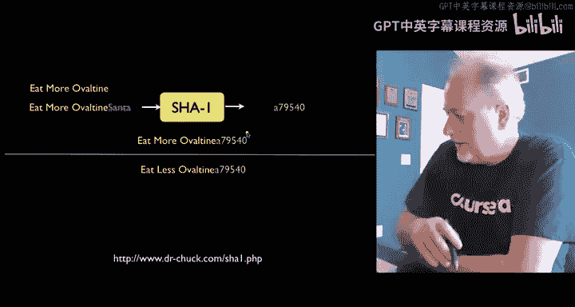

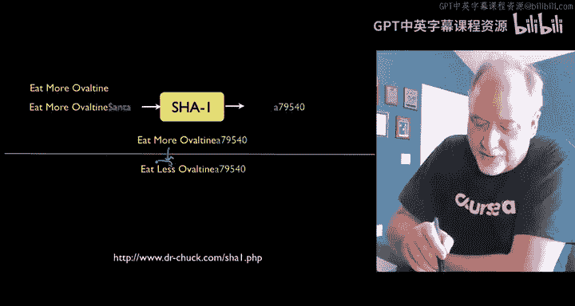

Right， so eat less ovaltine bad。

Evil， or I don't know how to draw evil， I'm a terrible artist。

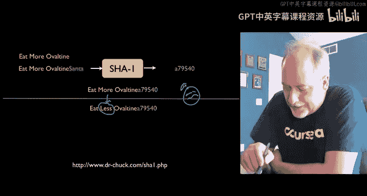

Can't draw evil。嗯。So some untrusted courier has changed the word more to less。

 so we receive a thing that says and we don't know right。

 we didn't see the courier they was carrying in the box， who knows what they did。

 but they changed it we give us new copy so we received this message from an untrusted medium。

 there's our untrusted medium and it is our job to decide if we really think it came from Annie or not。

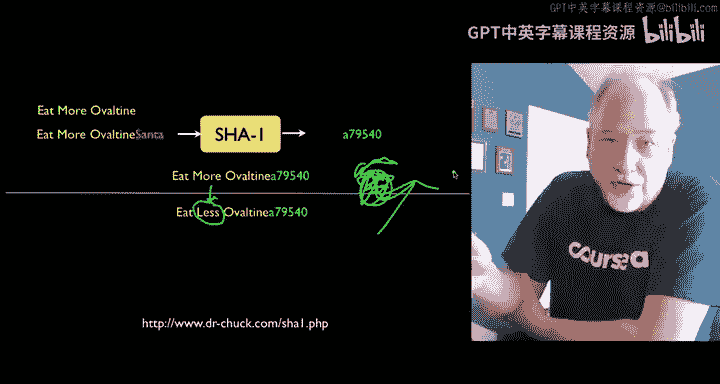

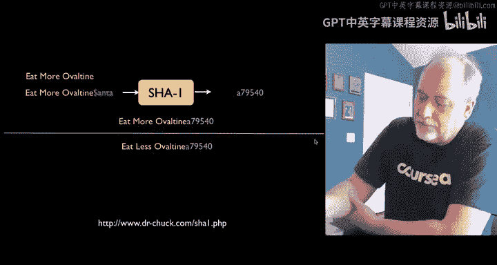

So。What we do is just like we did before， we break the message and the digest into pieces and then we add the known secret to the end of it。

So we've added the known secret to the end of it right here。

 then we run it through the Shah one calculation and you can take look。

There we go and go ahead and try this if you want， maybe you have this up in a separate window Sha1。

phP， put eatlessovvaltinesna in and you will get a different signature because you change even a single character and Shah1 will give us a different digest that's cryptographic hashes in action right even the tiniest change in megabytes of data will change the cryptographic has。

That's the beauty of Shah 1 and MD5 and you know， Sha 256 and the others， there is no match。

So we know that this。Message not either did not come from Annie or was modified in transit。

 so we can tell the difference and we do not have to trust the medium。Right？Okay。

So let's see what got coming up next year。ok。

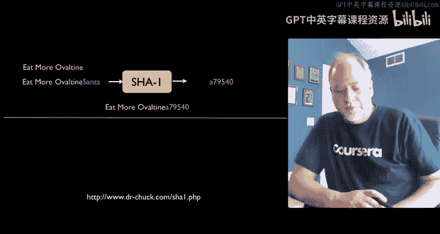

So here is the encryption technique and let's just。

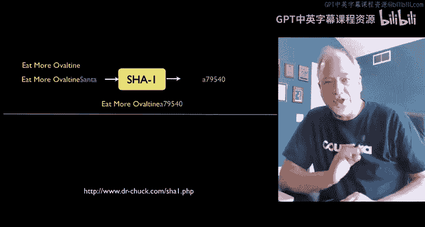

Stop and let you do one of these on your own。

And say that we've got two messages from Annie。And I want you to stop。

 and I want you to calculate Santa is the secret。

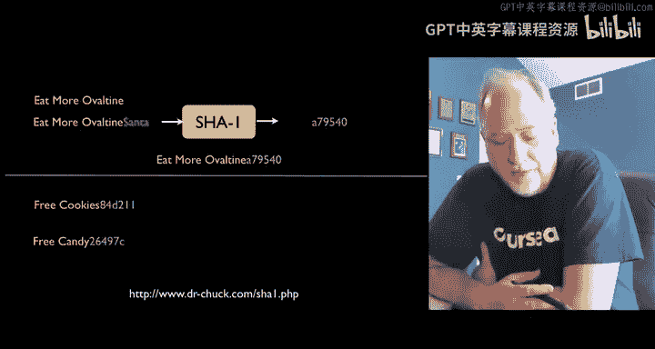

Okay，S is the secret。

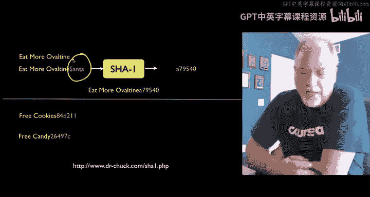

And I want you to tell me if free cookies or free candy actually came from Annie or not。

 one of them is a valid message from Annie。And the other is not a valid message from Annie， okay。

 so I want you to take a moment， use the Sh1 calculator and I want you to try to figure out which of these is valid and which of these is not valid。

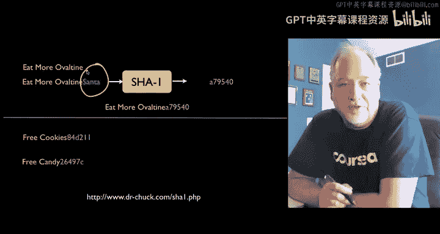

Okay。😊。

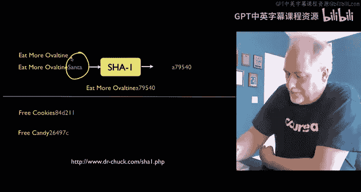

给弟们。

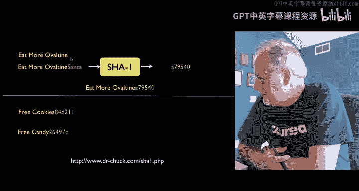

Okay， one last chance before we do the reveal。

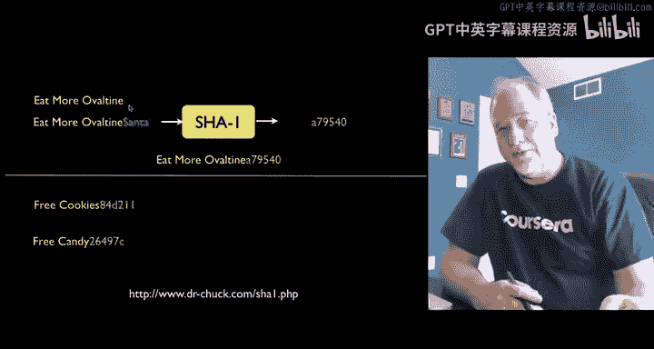

Okay， here we go。So。Here comes a message from insecure medium free cookies。

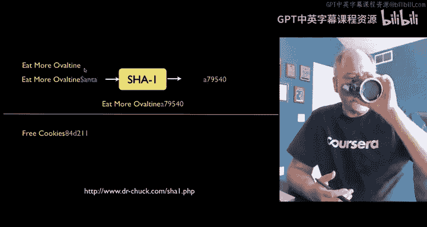

With that as the message digest， and we got the other one free candy。

 with that as the message digest。

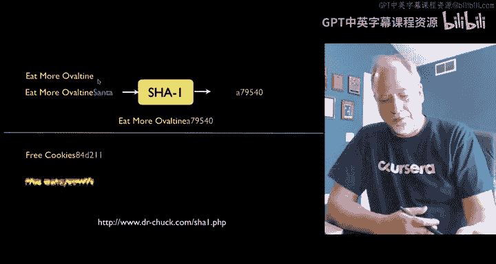

So what we do is we take and。Take off the digest and add the word Santa。To each one。

And then we run the Shah1 on each one。 And then we get the two Shah ones。

Here's the one and here's the two。And then what we do， most importantly。

 is we compare them with the received Shah one。And when you compare them with the received shot one or the received message digest or the received message signature。

 you see right away that one is good and one is bad。

 it's as simple as that right one of these is good and one of these is bad。

So digital signatures are actually really surprisingly simple and surprisingly easy to do without a lot of complex technology。

 the only complex technology in here is really the clever mathematics that makes these cryptographic hashes work effectively。

The simple concatenation of a secret， now you want your secrets to be kind of longer than this and more random than that。

 but ultimately the notion of a digital signature is actually a simple and rather elegant and beautiful notion that really leverages this notion of cryptographic hashes in a really cool manner。

So that kind of sums up our first half lecture where we really talk more about the techniques of both integrity and confidentiality。

 but we've done it all with a secret key right where we have the same key。

 we have a moment where we're together in a secure manner and we exchange the codebook。

 whether it's Annie or the CSesar or whatever where we know what the shift is right。

 so every pair of communicating people or systems needs a key。

Now in the internet with everybody buying from everybody else and using credit cards。

 that's just not practical you just could not have a secret key for Amazon。

I guess it kind of works for the password and let's do we'll get to that in a second and the password doesn't solve everything because then you would have to actually visit Amazon to get your password set up。

 And so the problem is is we have to use an insecure medium to establish the first。Secret as it were。

 and so it just was never going to work so we need a different approach with the internet and that's what we're going to talk about in the next lecture okay。

所的。