# 互联网历史、技术与安全：P52：安全技术：公私钥与SSL协议 🔐

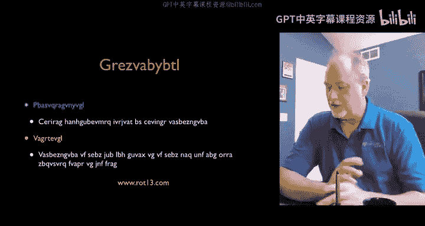

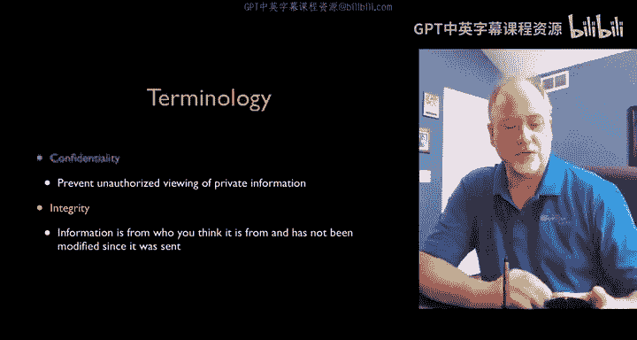

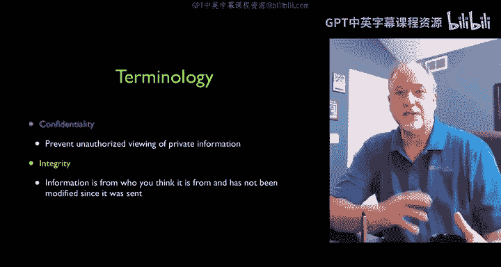

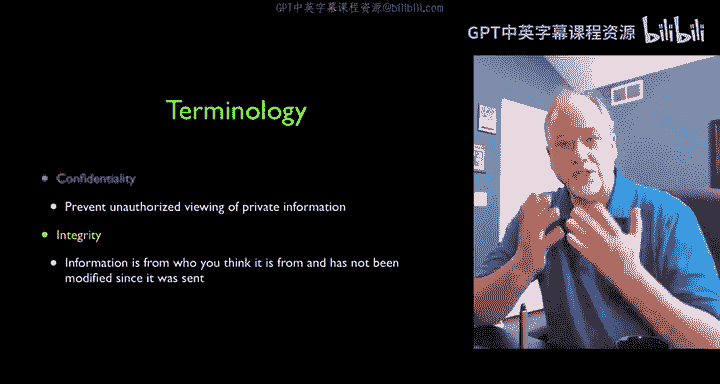

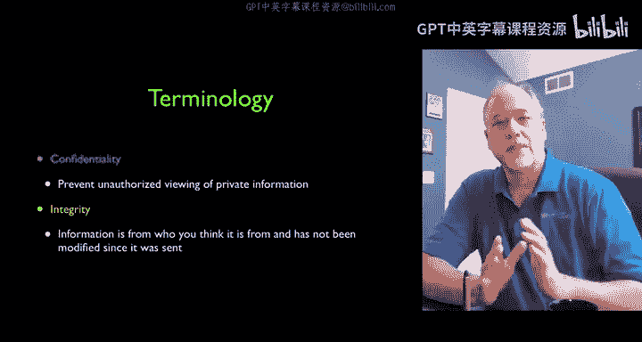

在本节课中，我们将要学习**公钥加密技术**。这是一种解决互联网通信中**保密性**问题的优雅方案，它允许我们在无需预先共享秘密的情况下，安全地交换信息。我们还将了解这项技术如何通过**SSL/TLS协议**（即HTTPS）被应用到日常的网络浏览中，保护我们的数据从离开电脑到抵达服务器的全过程。

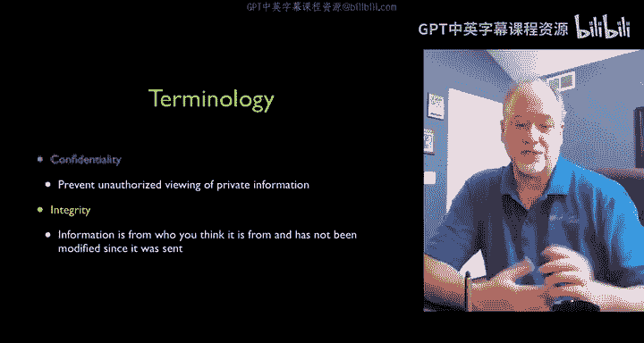

上一节我们介绍了使用凯撒密码等传统方法实现保密性，以及使用基于共享秘密的消息摘要来确保完整性。这些方法都面临一个共同的核心问题：**需要预先共享一个秘密**。

## 共享秘密的困境 🤔

在互联网世界中，要求每个用户在与亚马逊等网站交易前，都必须亲自前往其总部获取一个共享秘密，这是不现实的。如果秘密丢失，更新过程也将非常困难。因此，安全系统需要能够在“一臂之遥”的距离上工作，即无需事先见面交换秘密。公钥加密正是为解决这一问题而提出的优雅方案。

## 公钥加密：一种非对称方案 🔑

公钥加密由迪菲和赫尔曼在1976年提出。它的核心在于使用**两个不同的密钥**，因此被称为**非对称加密**。这与我们之前学习的、使用同一把密钥进行加密和解密的对称加密不同。

以下是公钥加密的核心概念：
*   **公钥**：可以完全公开，无需任何保护。用于**加密**数据。
*   **私钥**：必须严格保密，由生成者自己保存。用于**解密**数据。

这两个密钥在数学上相关联，其关系是公开的，但对于足够长的密钥，从公钥推导出私钥在计算上极其困难。其美妙之处在于，公钥可以被自由分发甚至被拦截，这都无关紧要，因为只有配对的私钥才能解密用该公钥加密的信息。

## 背后的数学原理：质因数分解 🧮

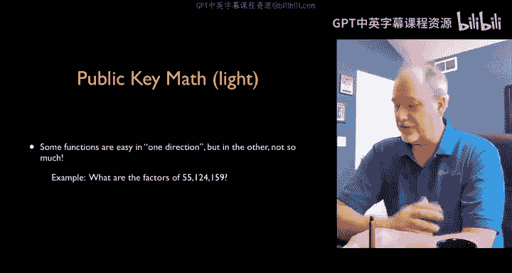

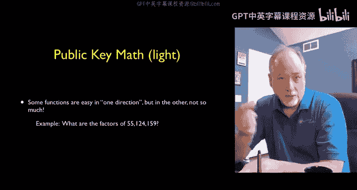

公钥加密的安全性基于一个经典的数学难题：**大整数的质因数分解**。

生成密钥对的过程始于选择两个非常大的随机**质数**（可能有数百甚至上千位）。将这两个质数相乘得到一个巨大的合数。公钥和私钥便是通过一系列计算从这个合数及其原质数中推导出来的。

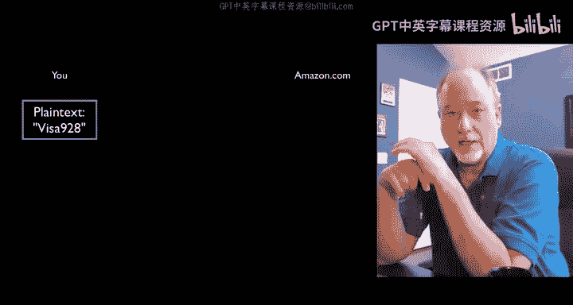

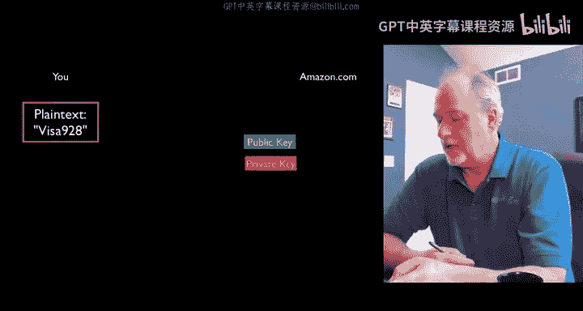

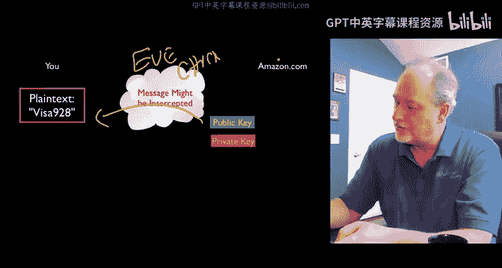

其计算不对称性的本质如下：
*   **正向计算（加密/验证）容易**：已知一个质数，求另一个质数（即做除法）是简单的。
*   **逆向计算（解密/破解）困难**：仅知道最终的合数，要求出原来的两个质因数（即分解），在计算上是极其困难的。

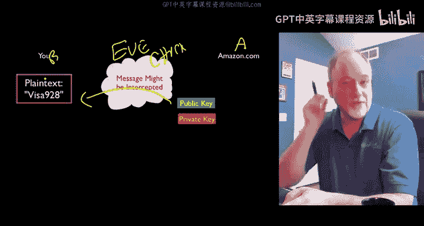

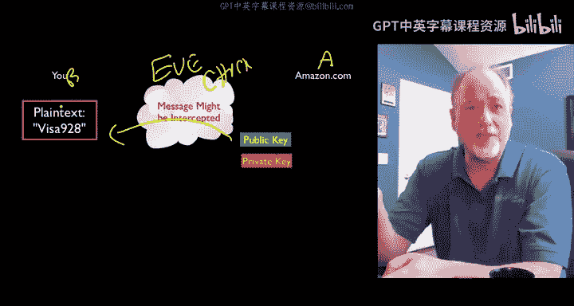

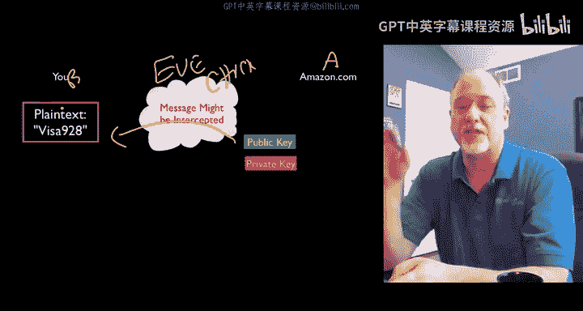

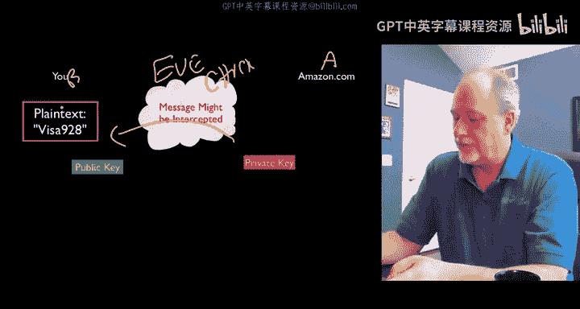

我们可以用一个公式化的例子来理解：
*   设 `N = p * q`，其中 `p` 和 `q` 都是大质数。
*   公钥和私钥由 `N`、`p`、`q` 以及其他参数通过特定算法（如RSA）生成。
*   已知 `N`，求 `p` 和 `q` 是困难的。但已知 `p`（或 `q`）和 `N`，求 `q`（或 `p`）则是简单的除法。

这种“单向”特性使得加密系统非常安全。我们并非无法破解，而是所需的计算量如此之大，以至于在现实时间尺度内“不切实际”。随着计算机能力增强，我们只需增加密钥长度即可维持安全性。

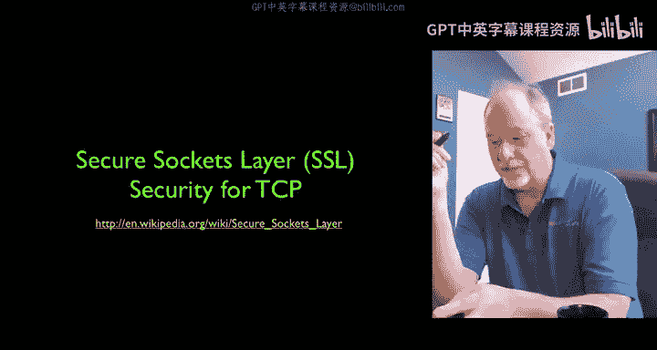

## 工作流程：以网购为例 🛒

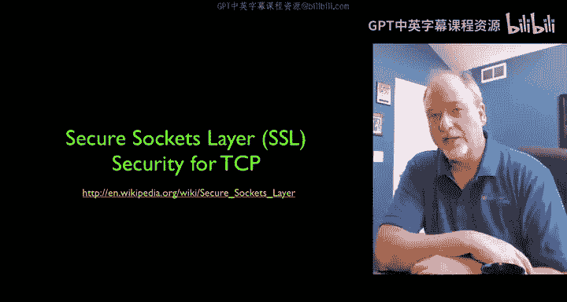

让我们看看当你访问亚马逊网站输入信用卡信息时，公钥加密如何工作：

1.  **密钥分发**：亚马逊服务器生成一对公钥和私钥。私钥被安全地保存在服务器上。当你连接网站时，亚马逊将其**公钥**发送给你的浏览器。这个过程是公开的，即使被攻击者“伊芙”截获也无妨。
2.  **加密数据**：你的浏览器使用收到的亚马逊**公钥**，对你的信用卡号等敏感信息进行**加密**，生成一段密文。
3.  **传输密文**：这段密文通过网络发送回亚马逊服务器。攻击者伊芙同样可以截获这段密文。
4.  **解密数据**：亚马逊服务器使用其严格保密的**私钥**对密文进行**解密**，恢复出你的原始信用卡信息。

关键在于，攻击者伊芙同时拥有了公钥和密文，但由于缺乏私钥，她无法在可行的时间内解密信息。而亚马逊因为拥有私钥，可以轻松解密。

## 融入网络架构：SSL/TLS与HTTPS 🌐

公钥加密技术被完美地集成到了互联网的分层架构中，具体表现为**安全套接字层（SSL）** 或其继任者**传输层安全协议（TLS）**，它们在应用层和传输层（TCP）之间增加了一个“迷你安全层”。

回顾一下网络分层模型（从上至下）：
*   应用层（如HTTP）
*   传输层（TCP）
*   网络层（IP）
*   链路层

以下是SSL/TLS的工作方式：
*   **对应用程序透明**：你的浏览器（应用层）只是照常发送明文数据（如信用卡号）。
*   **安全层介入**：在数据交给TCP层发送之前，**SSL/TLS层**会接管这些数据，使用公钥加密等技术对其进行加密。
*   **网络无感知**：加密后的密文作为普通数据流，经由TCP、IP、链路层正常传输。路由器、交换机等网络设备完全不知道它们正在传输加密数据。
*   **远端解密**：密文到达亚马逊服务器后，首先由服务器的SSL/TLS层解密，还原为明文，再交给亚马逊的网页应用处理。

这种设计的优美之处在于，**除了通信两端，整个网络基础设施都无需为支持加密而做任何改变**。加密和解密只发生在你的电脑和服务器内部。你在浏览器地址栏看到的 **`https://`** （而非 `http://`）就是该连接启用了SSL/TLS协议的标志。

## 安全边界与剩余风险 ⚠️

SSL/TLS（HTTPS）极大地提升了通信安全，它主要防范的是传输过程中的**窃听**风险，即攻击者“伊芙”在网络上拦截数据。它建立了从你的浏览器到服务器内部的一条安全通道。

然而，它并不能解决所有安全问题。主要剩余风险包括：
1.  **端点安全**：如果你的电脑感染了恶意软件（病毒），它可能在数据被加密之前（即你在键盘输入时）就窃取了信息。同样，如果服务器被入侵，私钥或明文数据也可能泄露。
2.  **身份冒充**：HTTPS保证了数据传输的保密性，但如何确保你连接的“https://www.amazon.com”就是真正的亚马逊，而不是一个伪造的钓鱼网站呢？这属于**完整性**或**认证**问题，需要依赖数字证书等机制来解决，这将是下一讲的内容。

作为用户，一个关键的安全习惯是：**任何时候输入密码、信用卡号等敏感信息，都必须确认浏览器地址栏以 `https://` 开头**，而不仅仅是 `http://`。

本节课中我们一起学习了**公钥加密**的原理，它利用数学上的非对称性，允许通过公开渠道安全交换信息。我们还探讨了这一技术如何以**SSL/TLS协议（HTTPS）** 的形式嵌入互联网架构，在传输层之上为数据提供加密保护，有效防止了网络窃听。记住，HTTPS是保护网络通信保密性的基石，但务必结合良好的端点安全习惯（如防病毒）并注意网站的身份真实性。下一讲，我们将探讨如何确认你正在与真实的网站通信。