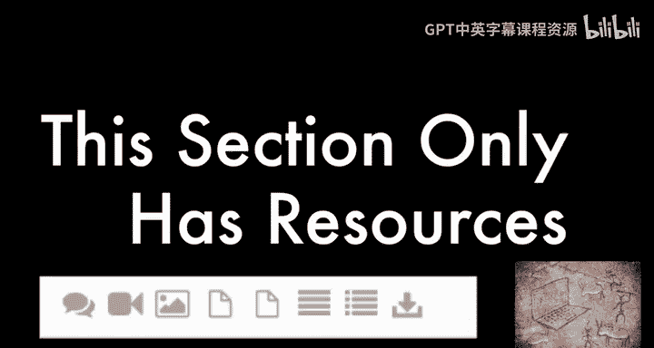
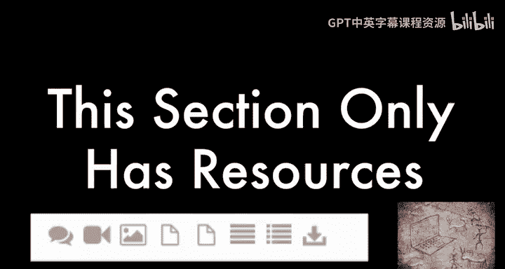
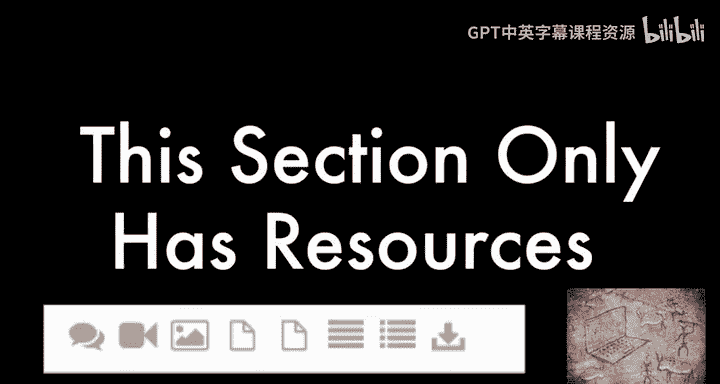
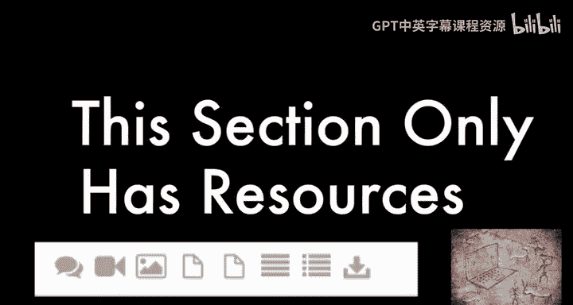
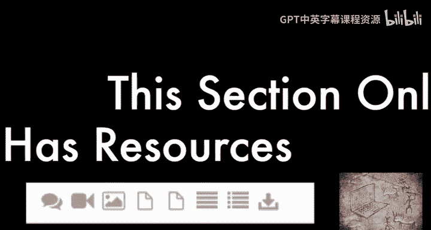

# 互联网历史、技术与安全：P53：Diffie-Hellman与Merkle密钥交换

在本节课中，我们将要学习密码学中一项革命性的技术——Diffie-Hellman密钥交换。这项技术解决了在不安全信道上安全共享密钥的难题，是现代安全通信的基石之一。我们将了解其核心思想、工作原理以及它与Merkle贡献之间的关系。

## 概述：密钥交换的难题

在上一节中，我们讨论了对称加密需要双方拥有相同的密钥。然而，如何在不安全的信道上（如互联网）安全地传递这个初始密钥，本身就是一个巨大的挑战。本节中，我们来看看Diffie-Hellman密钥交换协议是如何巧妙地解决这个“鸡生蛋还是蛋生鸡”的问题的。

## 核心思想：单向函数与公开信息

Diffie-Hellman密钥交换的核心依赖于一种称为“单向函数”的数学概念。单向函数的特点是正向计算容易，但逆向推算极其困难。

一个经典的类比是颜色混合：
*   将黄色和蓝色混合得到绿色是容易的。
*   但看到绿色后，想精确还原出原始的黄色和蓝色是几乎不可能的。

在数学上，Diffie-Hellman协议使用**模幂运算**作为其单向函数。其安全性基于**离散对数问题**的计算困难性。

## Diffie-Hellman密钥交换流程

以下是Diffie-Hellman密钥交换的标准步骤，假设通信双方是Alice和Bob。

1.  **公开参数协商**：首先，Alice和Bob公开协商两个数：一个大质数 `p` 和一个原根 `g`。这两个数是公开的，即使被窃听者Eve获取也无妨。
2.  **生成私有密钥**：接着，双方各自生成一个保密的私有数字。
    *   Alice选择私有密钥 **`a`**。
    *   Bob选择私有密钥 **`b`**。
3.  **计算并交换公开密钥**：双方用自己的私有密钥和公开参数进行计算，生成公开密钥并发送给对方。
    *   Alice计算公开密钥 **`A = g^a mod p`**，并发送 `A` 给Bob。
    *   Bob计算公开密钥 **`B = g^b mod p`**，并发送 `B` 给Alice。
4.  **计算共享密钥**：收到对方的公开密钥后，双方用自己的私有密钥进行计算，最终得到相同的共享密钥 `s`。
    *   Alice计算 **`s = B^a mod p = (g^b)^a mod p = g^(ab) mod p`**。
    *   Bob计算 **`s = A^b mod p = (g^a)^b mod p = g^(ab) mod p`**。

现在，Alice和Bob拥有了一个相同的共享密钥 `s`，而窃听者Eve虽然看到了公开的 `p`, `g`, `A`, `B`，但由于无法从这些信息中高效地推导出 `a` 或 `b`（离散对数难题），因此也无法计算出共享密钥 `s`。

## Merkle的贡献

需要指出的是，虽然这个协议以Whitfield Diffie和Martin Hellman的名字命名，但Ralph Merkle在公钥密码学的概念上做出了至关重要的早期贡献。他的工作为Diffie和Hellman指明了方向，因此有时这也被称为“Diffie-Hellman-Merkle”密钥交换，以表彰三位先驱的共同努力。

## 总结

本节课中我们一起学习了Diffie-Hellman密钥交换协议。我们明白了它如何利用单向函数的数学特性，允许双方通过公开对话生成一个共享的私有密钥，从而完美解决了在不安全信道上初始化加密通信的难题。这项诞生于1976年的发明，为现代网络安全（如HTTPS、SSH、VPN等）奠定了坚实的基础。