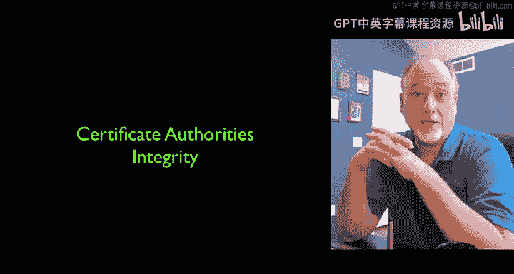
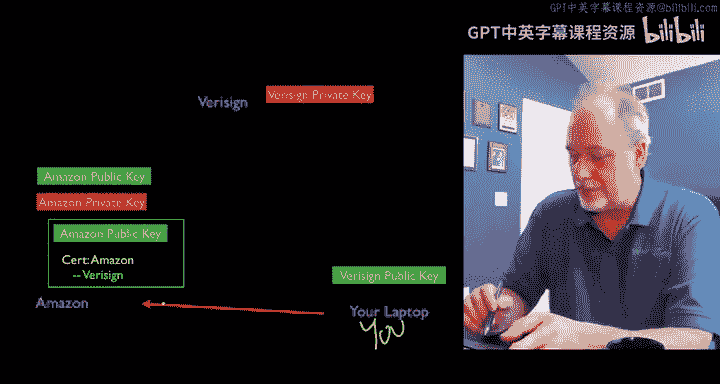
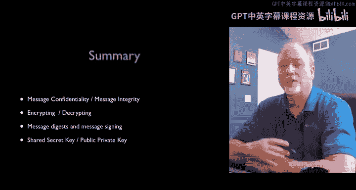
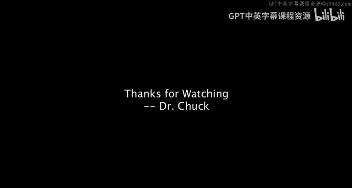

# 互联网历史、技术与安全：P54：安全技术：完整性与CA认证 🔐

在本节课中，我们将要学习如何确保网络通信的完整性，即如何确认我们正在与正确的服务器进行对话。我们将深入探讨数字证书和证书颁发机构的工作原理，了解它们如何与公钥加密技术结合，共同构建一个可信赖的网络环境。

上一节我们介绍了如何使用安全套接层和公钥加密技术来确保通信的机密性。本节中我们来看看如何确保通信的完整性，即如何验证服务器的身份。

## 身份验证的挑战

现在，我们有了使用安全套接层和公钥加密技术来确保机密性的方法。唯一剩下的问题是：我们正在和谁对话？我们是否真的在与我们以为的那个服务器对话？我们真的在和亚马逊对话吗？我们真的在和Coursera对话吗？我们如何知道？

如果你现在看一下浏览器顶部，通常当它显示你有一个安全连接时，你可以点击这里查看一些信息，这被称为证书信息。

## 数字证书与签名公钥

HTTPS协议包含公钥的概念。当我们建立连接时，会获取一个公钥。但公钥有两种：一种是服务器自己生成并发送给我们的普通公钥；另一种是由第三方证书颁发机构签名和验证的公钥。

以下是Coursera的证书信息，它由GoDaddy证书颁发机构认证。这意味着我们不仅从Coursera获取证书，实际上我们获取的是由GoDaddy签名的证书。GoDaddy已经核实了Coursera的身份，确认“你必须是Coursera的首席执行官，否则我不会给你这个签名的私钥”。因此，获取私钥签名是一个过程，也是一种确保你正在与你认为的对象对话的方式。这被称为**数字证书**，也可以理解为**签名私钥**。

## 完整性与数字签名

现在，如果我们回过头来讨论完整性，我们想知道我们正在和谁对话。因此，我们有了签名的概念。签名是一种让你知道正在与正确对象对话的方式。

例如，如果有人来到你的办公室说：“嗨，我是Chuck博士”，他留着胡子，头发有些花白。你可以说：“嘿，如果你真的是Chuck博士，给我看看你的纹身。”这样你就会知道，很少有人既长得像这样，又有这个纹身。所以，这是我的私钥，这是我私钥的签名。这就像我的消息摘要。如果有人声称是Chuck博士，但他们不会有这个纹身。这就是Chuck博士，这就是我的消息摘要。

## 证书颁发机构

一个普通私钥和一个由这些指定第三方认证的私钥之间存在区别。这些指定的第三方被称为**证书颁发机构**。

你可能会说“我是一个证书颁发机构”。然而，有些证书颁发机构比其他机构更可靠。它们是可信的第三方。

它们是如何开始的呢？有些机构比其他机构更受信任，而我们越信任它们，它们就越能发挥作用。所以，并非每个人都能成为可信的机构。你不能随便成为一个可信的颁发机构。

VeriSign是众多可信机构之一，也是最古老、最受欢迎、最昂贵的机构之一。获取证书签名可能相当昂贵，便宜的可能几百美元，贵的可能需要数千美元。VeriSign是其中最古老、最受尊敬的证书颁发机构之一。

## 获取签名证书的过程

其核心理念是：我有一个名为 `online.doctorchuck.com` 的网站，我在那里教授Python课程并做其他事情。我想要一个安全证书，因为我会处理用户数据，我希望显得可靠并拥有安全证书。

因此，我生成了一对公钥和私钥，然后将其发送给一个证书颁发机构。我付钱给他们，然后他们发回一个已签名的私钥。现在你可能会说，这有点邪恶或者真的很贵，因为他们所做的只是在我的私钥中改变或添加几个比特。但他们承担着很大的责任，优秀的机构拥有很高的信誉，他们不希望丢失信息。他们需要花时间验证身份，确认“你真的是Dr. Chuck.co的所有者吗？”他们不会将Dr. Chuck.co的签名证书交给除真正所有者之外的任何人。因此，他们会花时间检查以确保是真正的所有者，通过查看注册数据等方式来做到这一点。验证所有这些身份是有成本的，有点像Coursera上的签名认证轨道。

## 信任的建立

那么你可能会问：谁来决定信任哪个证书颁发机构？我们使用证书颁发机构来决定是否信任Amazon.com、Coursera.org或Drchuck.com等。我们如何决定信任哪个证书颁发机构呢？

事实证明，苹果、微软、Linux和其他操作系统供应商在你购买计算机或安装操作系统时，会预装一部分内容。这部分内容实际上是一个列表，包含了选定证书颁发机构的公钥。

如果你深入查看你的计算机内部（这是我的Mac），你可以看到被苹果作为操作系统制造商包含在内的公司。你会看到VeriSign是那些被预装在苹果Macintosh中的公司之一。这意味着来自VeriSign的证书将被识别。

## 浏览器与操作系统的内置信任

因此，你的浏览器和操作系统内置了某些证书颁发机构（如VeriSign）的预建公钥证书。这是苹果、微软和Linux对VeriSign寄予的巨大信任。这是因为多年来，VeriSign赢得了这种信任。

VeriSign不会未经检查就发放证书。如果VeriSign未经检查就将Amazon.com的证书发放给某人，他们将失去很多信誉，然后微软可能会将其移除，说“VeriSign似乎变得有点不靠谱，他们似乎无法处理安全问题”。但他们做到了，所以他们仍然保留在其中。这是一个有趣的现象，他们有动力保持高安全性，他们有动力做好工作，因为一旦他们失败，就会失去很多信誉和尊重，VeriSign品牌的价值以及我们对VeriSign的所有尊重都会受损。

## 验证服务器身份

我们提到了公钥加密。公钥在传输。我即将输入我的信用卡号，所以我们现在要解决的问题是：这真的是亚马逊的密钥吗？这真的是亚马逊的公钥吗？我的意思是，我通过连接到服务器获得了公钥，它声称是Amazon.com。但是，我相信它声称是Amazon.com吗？这就是完整性问题，这就是安全问题——我相信吗？除了它声称代表Amazon.com之外，它真的有VeriSign的“纹身”吗？它真的是Amazon.com的公钥吗？

我们也可以使用公钥进行签名。基本上，VeriSign自己有一对公钥和私钥。VeriSign的公钥现在就存在于你的浏览器中。他们使用私钥对亚马逊的证书进行加密，类似于生成消息摘要，然后创建一个摘要并将其附加到证书上。所以，一个证书会说“我是Amazon.com”，然后后面会说“哦，是的，VeriSign用VeriSign的私钥签署了这个”。因此，VeriSign的私钥被用来签署亚马逊的证书。

## 证书签名流程详解

这或许通过一个示意图来解释最容易。以下是亚马逊如何获得由VeriSign签名的公钥的流程：

1.  **初始设置**：VeriSign在一个安全的地方生成一对公钥和私钥，并安全存储私钥。然后他们将公钥交给苹果、微软和Linux。
2.  **预装公钥**：这些操作系统供应商将VeriSign的公钥捆绑预装在你的笔记本电脑中。所以，你购买的笔记本电脑在出厂时就内置了来自供应商的公钥。
3.  **亚马逊生成密钥对**：亚马逊说：“我想进行电子商务，我希望能够使用SSL并拥有一个经过认证的私钥。”于是，亚马逊在其服务器内部生成一对公钥和私钥。这个私钥永远不会离开亚马逊的服务器。生成足够随机的公钥和私钥需要一些时间，有时需要几分钟，通过查看所有大质数然后挑选一个来生成。
4.  **发送公钥**：然后，亚马逊将其公钥传输给VeriSign。在传输过程中，它可能被看到，但这没关系，因为它只是公钥。所以它实际上可以通过互联网发送，最常见的方式就是通过互联网发送。
5.  **VeriSign签名**：在VeriSign的服务器内部，VeriSign使用其私钥计算一个消息摘要，然后基本上添加一个签名。这个签名说：“哦，这是我从亚马逊收到的亚马逊公钥，我已经验证了发送者的身份，现在我，VeriSign先生，已经签署了它。”当然，这就像消息摘要一样，是附加在公钥比特上的信息。
6.  **发回签名证书**：然后，这个带有签名的公钥被打包在一起，发送回亚马逊。现在，亚马逊拥有的不仅仅是一个普通的公钥，而是一个声明“我是Amazon.com”并且VeriSign现在断言我确实是本人的公钥。

## 窃听者无能为力

同样，窃听者伊芙看到了这个传输。谁在乎呢？这只是一个公钥。其中不包含VeriSign的私钥，私钥从未离开过VeriSign的服务器。签名是公开信息，你可以使用VeriSign的公钥来验证签名是否正确，但你无法伪造签名。所以伊芙可以看到这个，伊芙什么也得不到。她什么也得不到。所以亚马逊现在有了一个已签名且经过认证的私钥。

## 用户验证与安全通信

接下来会发生什么？迟早，可能是几小时、几天或几个月后，你在你的笔记本电脑上决定买些鞋子。所以，你通过浏览器使用HTTPS连接连接到Amazon.com。

然后发生的是：亚马逊向你发送其公钥。当然，伊芙一直在窃听。伊芙看到它经过。但这毫无价值，因为它只是加密密钥，不是解密密钥。即使它被签名了，伊芙看到了，但她无法用这些信息做任何事情。

在你的笔记本电脑内部，你有来自供应商（苹果或Macintosh等）的VeriSign公钥。因此，你可以用这个公钥去查看那个签名，就像我们之前处理消息摘要一样，你可以说：“是的，这很好。这确实必须是由VeriSign签署的。”如果你的电脑非常谨慎，它实际上可以去向VeriSign查询，发送信息说：“嘿，你验证过这个吗？”然后VeriSign也可以验证它。但实际上你不需要连接，因为你已经有了公钥。你知道那个消息摘要正确的唯一方式是，如果VeriSign的私钥被用来生成该消息摘要，就像我们在另一个例子中使用的简单签名机制一样。这是可验证的，它来自这个私钥。现在，如果有人入侵并窃取了私钥，那就是另一回事了。但只要私钥是安全且未被泄露的，生成那个消息摘要的唯一方式就是拥有该私钥。

## 完成安全交易

现在，你处于一个可以放心交易的状态。你看到HTTPS，你可以点击那个小图标，看到它是由VeriSign签署的。你可以确信VeriSign断言那个密钥确实来自亚马逊。现在是时候加密你的信用卡号，并通过加密连接将其发送给亚马逊了。

因为除非你相信HTTPS是正常的，否则你不会发送加密信息。如果你的浏览器弹出一个提示说“等等，这个证书看起来有点可疑，它声称来自Amazon.com，但它不是由我信任的签名机构签署的”，你就不会发送数据。

你发送的数据被加密了，伊芙一直在监视，但因为它是用公钥加密的，除非伊芙拥有超级计算机并花费数月时间，否则她无能为力。然后，当然，亚马逊使用其私钥解密它。私钥派上用场了。

让我重新描述一下：数据进来了，伊芙在监视，但无能为力。因为他们没有足够的计算能力，伊芙没有足够的计算机，而且你的密钥足够大。所以亚马逊然后使用其私钥解密，最终再次得到你的明文。

## 总结安全机制

如果你仔细思考整个过程，伊芙一直在监视整个时间：我们发送了公钥，我们签名并返回了公钥，然后我们将公钥发送到你的笔记本电脑，我们验证了公钥。整个过程中，伊芙都在监视所有这些信息，但她无力破解。如果你问我，这真是相当聪明。我们可以感谢Diffie、Hellman和Merkle。这非常聪明，因为伊芙看到了所有东西。想象一下，如果德国人在二战时有这个技术，那该多酷。当然，他们没有计算机，所以会很困难。现在想太多也没用。

## 核心概念总结

所以，我们有了这个叫做**证书颁发机构**的东西，它是一个可信的第三方，负责签署这些证书。它是一个对公钥进行数字签名的实体，以便我们公众有一种方法来验证Amazon.com证书确实来自Amazon.com。

如果你把所有这些加在一起，我们有了基本的公钥加密技术，确保数据可以在互联网上从你的计算机传出并加密传输到另一端。这只是公钥加密的作用。然后，我们有了这个第三方证书颁发机构，你的应用程序可以用它来验证收到的证书。因此，SSL（安全套接层）和证书颁发机构的结合，使我们能够高度确信，当我们与某个对象对话时，我们知道我们真的在与它对话。这是一种相当非侵入式的安全措施。如果你的浏览器弹出一个提示消息，意味着它收到了一个证书，但没有可用来验证的证书颁发机构信息，那么除非你确切知道发生了什么，否则这不是输入敏感信息的好时机。

## 课程内容回顾

这为我们这几讲的结论做了铺垫。最后这几讲是关于消息机密性的，即保护内容不被泄露。我们为此使用了加密和解密技术。然后我们有了消息摘要和签名技术，我们签署了消息，签署了证书，签署了许多东西，这些都很重要。我们讨论了共享密钥和秘密密钥（对称加密），双方需要事先约定一个用于加密和解密的密钥；以及公钥私钥（非对称加密），其中一个密钥用于加密，另一个密钥用于解密，并且你可以自由展示加密密钥，因为它几乎不泄露信息（虽然从数学上讲有可能，但解密非常困难）。

本节课中我们一起学习了公钥加密和证书颁发机构如何共同工作，以确保网络通信的机密性和完整性。我们了解了数字证书的签发流程、浏览器如何内置信任，以及整个体系如何抵御窃听攻击。希望你觉得这些内容有价值，我们网络上再见。