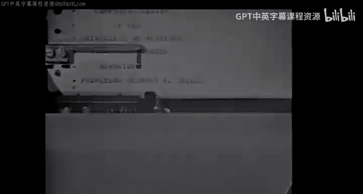

# 密歇根大学《互联网历史、技术和安全》：P8：通过6-00使用密歇根终端系统

## 概述

在本节课中，我们将学习如何使用密歇根终端系统。这是一个运行在密歇根大学计算中心IBM 360/67大型机上的系统。我们将通过一台标准电传打字机，使用普通电话系统拨号接入。无论身处何地，只要能直接拨号到计算机，都可以使用这个系统。这些电传打字机并非固定线路连接，而是利用普通电话系统工作。

## 连接与登录系统

上一节我们介绍了系统的基本概念，本节中我们来看看如何实际连接并登录到密歇根终端系统。

首先，按下“Originate”按钮以启动电传打字机。然后，使用设备上的常规电话拨号盘进行拨号。每台电传打字机系统都配有一个听筒。你也可以使用听筒来拨号。两种方式都有效。但一旦连接到计算机，就不要再将听筒用于任何目的。

现在，我按下“Originate”按钮。我可以通过这个小旋钮控制扬声器音量，这样你就能听到拨号音。我将拨号**763-0300**。在中心系统中，只需拨**30300**。现在计算机正在响应，我将调低音量。

计算机的响应是系统标识信息。“WHO ARE U”是标准的电传打字机通信身份询问，电传打字机本身会用其内置的代码编号进行回答。在本例中，是电视中心的电传打字机。

现在，我必须登录计算机并验证身份。行首的井号（`#`）表示密歇根终端系统正在等待我向其发送信息。我必须做的第一件事是发出登录命令。系统中的所有命令都以美元符号（`$`）开头。

电传打字机的键盘非常像打字机的键盘，包括Shift键。对于键位顶部的字符，我们没有大小写字母之分。因此，Shift键仅用于获取另一组字符。在本例中，美元符号是数字4上方的字符。

现在我将输入单词`signon`，这是官方命令。命令后必须至少有一个空格。现在我将输入我个人的计算中心编号，即**W010**。该系统的每个用户都会获得一个计算中心识别号，学生通过其导师获得，教职员工通过其所在部门获得。

现在这一行已经输入完毕。它正由计算机暂存。但如果我发现其中有任何错误，可以进行一些编辑和修正，稍后我们会看到这一点。我对这一行感到满意，现在我将给出行结束字符。每行结束后都必须给出此字符，我会在一段时间内每次操作时提醒你。

结束一行的字符需要使用键盘上的Control键。这是一个特殊键，表示我想使用除了通过Shift键添加的字符之外的更多字符。我按住Control键，在按住的同时，我可以按下其他一些键中的一个。在本例中，我将使用Control键加字母**Q**。也可以使用字母**S**，但它紧挨着另一个会使电传打字机断开的键，因此我建议使用**Q**。我将使用`Control+Q`来终止该行。

现在系统要求我输入私人密码。我先输入一个错误的密码，只是一些无意义的字符。当然，最后要加行结束符，因为我必须表明我对此行满意。系统提示我最好输入另一个密码。既然我打算输入正确的密码，我将关闭打印功能，这样没人能看到我的密码。要关闭打印，我们使用这个标有HDX（半双工）和FDX（全双工）的开关。我们通常在**半双工**模式下操作电传打字机。如果我将其推到**全双工**模式，打印就会被抑制。现在我将输入正确的密码。再次推回半双工模式。然后输入行结束字符`Control+Q`。系统接受了密码，我现在已成功登录。

这里输出的信息是上次登录的时间和日期，以及本次登录的时间和日期。这样我就可以检查是否有人在我之后使用了我的号码。

## 修改密码与创建文件

成功登录后，我首先要做的事情之一是修改密码。我可能担心有人已经获取了我的密码。我将发出一个命令：`$ set`。这个命令用于设置系统中的各种参数，但这次我想将密码设置为其他内容。每个命令后至少有一个空格。`PW`是我的密码参数名，后面跟等号，等号前后没有空格。现在我将再次关闭打印，输入新密码。然后终止该行。

井号（`#`）表示我现在可以准备向系统发出另一个命令了。

现在假设我们希望开始使用计算机，并希望将一些信息输入到一个文件中。我可以拥有多个私人文件，每个文件都有一个我自创的、对我有用的名称。我将尝试通过发出`create`命令来创建一个新文件。我将在这里说明一个事实：每个命令只需要前三个字母。所以输入`cre`，空格，然后使用一个名称，例如**EX**。系统会检查我是否已经有一个同名文件。当然，我知道我有一个这样的文件，现在我们看到它被检测到了。

为了显示我有哪些文件名，以防我忘记了，让我们运行一个计算中心库中可用的特殊程序，叫做`catalog`。所以我会说`run`命令，`run`命令用于激活各种程序，包括我自己的私人程序和公开可用的程序。空格，现在这个程序的名字是`catalog`，后面带一个星号（`*`）。我稍后会解释星号的作用。当然，最后是行结束符。

现在它正在列出我私人编号下的所有文件。像**EX**这样的名称，其内部形式实际上是**W010 EX**，我自己的识别号作为前缀。因此，除非他以**W010**身份登录，否则任何人都无法引用我的文件。而不知道我的密码就无法做到这一点。这样我就受到了保护，只要我保护好我的密码，我通过经常更改密码来做到这一点。

现在我们看到了我拥有的各种文件的名称，包括`videotape`，它被用来打印出这盘磁带的标题。我确实想创建一个文件，我最好想一个不在此列表中的名字。那么，想一个像**X1**这样的名字。所以我说`cre X1`。现在必须在计算机的磁盘存储上为这个文件找到空间，并且必须将其输入到系统的文件目录中。现在它向我报告已经完成了。

**X1**后面的空白提醒我，一个名称最多可以有12个字符。我这次没有选择那么长。现在我想在这个文件中输入一些行，这些行将被编号。我可以要求自动编号。所以我们将给出命令`number`。如果我此时终止该行，它将从1开始，步长为1进行编号，即1、2、3、4等等。但这次我将指定从第1行开始，但使用步长3。好的，现在它正在询问第1行。我将简单地输入一些信息。我拼错了一个单词。

## 编辑与修正文件内容

上一节我们开始向文件输入内容，本节中我们来看看如何在输入过程中进行编辑和修正。

让我们看看如何在这里进行修正。一种方法是删除整行然后重新开始。要删除一行，我使用`Control`键加字母**N**。这会在行中插入一个删除行字符。如果我愿意，我可以继续输入我希望在该点插入的新行，这次我就这么做。然后行结束。注意，由于我要求步长为3，它现在正在询问第4行。让我在这里再输入一些信息。我又犯了一个错误。

同样，如果我愿意，可以使用`Control+N`，这次我会在那一刻终止该行。我得到一个指示，表明该行已被删除。在上一种情况下我没有得到指示，因为我只是继续输入了该行的新形式。

那么，让我再次输入该行。我又犯了一个错误。这次，我其实只需要回退一个字符然后继续。让我回退两个字符来展示这是如何工作的。回退字符是`Control`键加字母**A**。如果我输入两个回退字符，我现在就回退了两次，可以重新开始输入单词“come”。

请注意，电传打字机不会像打字机那样物理回退。回退字符被插入到行中。当计算机处理该行时，它会解释为删除前面的字符。我们在电传打字机本身上看不到这一点。

我可以在这里再添加一行。好的，现在让我关闭自动编号，以便开始对它进行其他操作。我可以输入`$ number`，然后行结束符。它关闭了编号，并等待我进行操作。

现在，文件**X1**是我的活动文件，这意味着我所做的任何操作，例如输入一行，都会进入当前的活动文件**X1**。为了防止自己无意中执行某些操作并损坏文件中的信息，我将通过`release`命令将其从活动文件中释放。例如，现在如果我选择输入一行，比如“two”，我是受到保护的，因为我现在没有任何活动文件。

## 查看、修改与文件操作

既然我们对**X1**中的信息进行了相当多的修改，让我们打印或列出文件中的信息，看看实际输入了什么。命令是`$ list`。我可以输入全名`X1`。看起来很好。

现在，让我展示一下如果我们想进行修改，如何插入一行。我可以插入一个带编号的行，比如第2行，它会放在正确的位置。我甚至可以使用**2.5**。那么，让我们再次将**X1**设为活动文件，并在该文件中插入第2.5行。**X1**第一次是活动的，因为它是通过`create`命令创建的。我现在不能那样做，但我可以通过`get`命令使其成为活动文件。它得到确认，现在**X1**可能是活动文件了。让我尝试输入第2.5行。行中的信息从逗号后的字符开始，逗号表示行号结束。

现在让我们验证它是否确实被插入。我不想列出整个**X1**文件，它可能很长，但这次不是。所以我想做的是列出文件的一部分，比如说编号在1到5之间的所有行。有一个错误，回退。`X1`，1到5。注意，第2.5行根据其行号被插入到了正确的位置。这里的文件结束注释，即使我们没有得到第7行，也与名称`X1(1,5)`有关。括号`(1,5)`命名了一个新文件，它实际上是由旧文件的一部分组成的。**X1**的第1到5行实际上是一种逻辑文件，当到达该文件的末尾时，它会指示“文件结束”。

还有其他方法可以从旧文件创建新文件。我们可以使用一个称为显式连接的过程。例如，让我列出一个由旧文件片段组成的文件。我会说`list`。我有一个长文件，名字是**EX**，所以我将取第25到27行。现在，用一个加号（`+`），我显式地将一些额外的行附加到这些行的末尾，或者说连接到它们。比如说，第53和54行。注意，如果还是同一个文件，我不需要再次写名字**EX**。

现在我将直接从我的终端连接一些行，所以我需要我的终端作为一个文件的名称。我们使用星号（`*`）`source`。`E`，这是我的终端作为输入文件的名称。然后，我可能再从文件**EX**中取一些行。如果我只给一个数字，比如100，它意味着从第100行开始的所有行。那是一个长文件，所以实际上我们会看到相当多的打字输出。

这引出了一个问题：我如何中断一个正在进行但我希望停止的操作？电传打字机上有一个特殊的按钮，叫做**Break**按钮。它位于不同位置，取决于电传打字机的型号。在本例中，它就在这里。现在，当我想要中断时，正如我们将看到的，无论正在进行什么，我都会按下Break按钮。此时，由于电传打字机的构造方式，键盘会被锁定。然后我必须按下位于电传打字机另一部分的另一个按钮，称为**Break Release**按钮。这个按钮会亮起，当我按下它时，它会解锁键盘。

现在让我们实际操作一下，看看中断过程是如何工作的。我现在将给出行结束字符，这样我刚才输入的那一行实际上就会执行。第25、26、27行，这些是来自某个计算机程序的行。第53行，没有第54行。现在它正在等待来自名为`source`的文件的输入行，所以我必须输入一行。由于我正在这个终端上列出内容，当我输入一行作为输入时，它会立即回显出来，就像它在该文件中一样列出。该文件的第一行。

现在我需要一种方式来表示来自我终端的这个文件结束了。所以有一个特殊字符`Control+C`，用于表示文件结束。这是一个进入行中的字符，我现在仍然必须终止该行，然后我会得到一个确认。它显示“文件结束”，现在它继续处理那个旧文件**EX**的第100行。这是一行有趣的代码。我知道这个文件相当长，里面有一些程序。

所以现在我将按下Break按钮，以终止正在进行的操作。我从计算机得到一个响应，表明“注意”信号已被发出。现在我将按下Break释放按钮来释放键盘。按钮灯亮着，当我按下它时，灯熄灭，现在我可以再次从键盘进行操作了。井号（`#`）表示在通过Break按钮中断后，系统已准备好让我再次告诉它该做什么。

## 运行语言处理器（PIL）

现在，我将演示系统中一个语言处理器的使用，这种语言叫做**PIL**（匹兹堡解释性语言）。PIL语言的处理器存储在一个名为`*PIL`的文件中。我将通过`run`命令来运行那个程序，即PIL程序本身，并指定程序所在的文件名。我可以指定PIL的输入源来自其他文件，并让它直接读取该文件。在本例中，输入源将来自我的终端，所以我不会特别说明，它将默认使用终端。

我们会看到注释“执行开始”，当加载器找到该程序、加载它并启动它时。现在PIL正在标识自己已准备就绪。我只介绍这种语言的一些特性。关于该语言的完整描述，以及使用电传打字机的信息，可以在书店的一本名为《MTS中的PIL入门》的小册子中找到，由计算中心的Larry Flanagan教授编写。

现在，让我演示PIL语言的一些特性，但只是其中几个。首先，我可以要求轻松计算数值表达式。`3+4-2`应该得出5，很好。我可以说`type sqrt(4.12345)`。我可以要求某些三角函数，比如`sin(sqrt(...))`。注意我这里写平方根的方式不同。然而，这并不是完全的自由英语，只有这两种方式。

现在我可以要求，例如，`x+1`的值。当然，我得到了警告，因为我不知道`x`是什么。所以我可以用另一个PIL语言命令`set x=3`来设置。现在我可以要求`type x*x-1`，例如。好的。

现在在PIL中，可以将一系列语句构建成一个程序包。为此，我们给出一个行号，它由小数点前的数字（称为部分号）和小数点后的步号组成。我可能会说第1.2步，我输入的是`demand y and z`。这一行没有立即执行，因为带有行号表示它将被保存起来，成为程序包的一部分。让我们创建第1.3行：`type y+z as well as y and z`。然后第1.4行是：`go to step 1.2`。现在我们有了一个程序，它将首先要求我输入两个数字，然后打印出它们的和以及每个数字，接着返回去再次要求输入两个数字。

现在，为了实际执行这个计算，我必须说执行那组指令。由于所有这些都以1开头，这被称为第1部分，我们还可以有第2部分等等。所以我会说`do part 1`。它如预期那样要求输入`y`，我会说`y=5`。要求输入`z`，`z=4`。现在，打印它们的指令在那里，现在它又回到开头要求另一个`y`和`z`，比如7和9。我们可以看到我们可以做各种事情。

现在我如何停止这个程序，因为它总是回来要求更多输入？在PIL中，我可以给出一个中断，我可以按下Break按钮。但在PIL中，当它要求更多输入而你没有了时，你可以使用一个星号（`*`），这是通过Shift键和键盘上方的星号键输入的，然后输入任何非空格的字符，我通常用**X**。然后行结束。这向PIL表明我在第1.2步（它要求输入的地方）中断了程序。

顺便说一下，如果我想查看某个大型程序中第1.2步是什么，我可以说`type part 1`，它会告诉我第1部分是什么。

在这个语言中我们可以做各种事情，我再演示一个：我可以说`for`，不带行号，它会立即执行。`for i=1 from 1 to 5 by 2`，然后`type i+1`。如果它以步长2从1到5，它将取1、3和5，`i+1`应该是2、4、6。让我们看看是不是。现在PIL正在等待其他东西。

那么，在这一点上，我将停止演示PIL并返回到MTS系统。我们应该仔细区分，我一直在系统中运行一个特定的程序。所有的文件操作、编辑和修正都是在系统本身层面进行的。如果我现在正在与PIL对话，而我想返回到系统，例如去注销，我必须回到系统本身的层面。我通过告诉PIL命令`system`来实现这一点。执行终止，我们现在回到了系统。

## 回顾命令与文件管理

让我们回顾一下到目前为止使用过的命令。我有一个包含各种命令的文件。如果我复制那个文件，我们应该看到一些我们已经见过的命令，还会有几个我们尚未见过的命令：`signon`、`create`（创建文件）、`get`（使文件活动）、`number`（开启自动编号）、`number`（停止编号）、`release`（释放活动文件）、`list`（查看文件内容）。我们已经见过`set`和`run`。

我们还没有使用`copy`，尽管我用它来获取这个命令列表，但`copy`的主要用途是将一个文件复制到另一个文件，可能是一个临时文件，以便能够对其进行更改。例如，我将复制文件**X1**到一个临时文件，其名称将是`-J`。这里的减号表示这个文件将因为我此刻提到它而被创建，并且当我从该终端注销时它将被销毁。像**X1**这样名称不以减号开头的永久文件不会被销毁。我下周回来时，**X1**仍然完好无损。

创建临时文件需要一点时间，因为要检查确保我没有同名的文件。现在它准备好了。例如，我将只列出`-J`中的一两行，以确认**X1**已被复制进去。让我们列出，嗯，就第1行吧。现在`-J`将被自动销毁。

但在那之前，让我们将`-J`复制回**X1**，以防我们在进行一些更改后想要保留它。现在，如果我们简单地将其复制回**X1**，只有来自另一个文件`-J`的行会被替换，旧的行仍然会在那里。如果我不想新旧混合，我最好在将新形式的文件复制回去之前清空**X1**的内容。

因此，我将使用一个新命令`empty X1`。这不会销毁文件，它只擦除文件已有的任何内容。这是非常重要的一点：我们不喜欢销毁信息，除非我们确定这是应该被销毁的正确信息。系统要求我确认在这种情况下我想要清空的是**X1**。我输入`ok`。这是一个肯定的确认。感叹号（`!`）或`O.K.`也可以，但其他任何内容都不行。所以现在**X1**实际上被清空了，但它仍然存在。

如果我想完全摆脱这个文件，我会说`destroy`，就像我们复制`-J`回去之后我会做的那样。完成了。如果我对`-J`进行了修改，那么我现在就会有一个新的副本。现在，我会说`destroy X1`。它要求确认。我会说`ok`。现在，例如，如果我说`get x1`，它会说“就绪”，但一旦我尝试向其中放入一些内容，比如“bap”，它会报告没有这个文件。

一旦它返回，我将从计算机注销。我会说`cancel`，因为我没有其他想做的事情了。好的，现在我将通过发出命令`signoff`从计算机注销。现在我将得到一些总结本次会话的信息：注销时间、经过的时间。在本例中，我们使用了13秒的计算机时间。然后是各种其他信息，本次运行的近似成本是3.20美元。

## 总结与更新说明

本节课中我们一起学习了如何连接、登录密歇根终端系统，进行基本的文件创建、编辑、查看和修改操作，运行PIL语言处理器，以及管理文件（包括复制、清空和销毁）。我们还学习了如何使用Break按钮中断操作，以及一些基本的编辑技巧。

本演示旨在使您在电传打字机终端上的工作更加轻松。要复习这些材料，您可能希望再次观看此内容，或者如果您拥有计算中心编号，可以实际在电传打字机上尝试。如果您有任何问题，请咨询您的导师或计算中心咨询室的任何人。

请注意。自本影片制作以来，MTS系统已进行了一些更改，其中三点我们现在提请各位注意：
1.  要回退以删除字符，请使用`Control+H`，而不是`Control+A`。
2.  虽然`Control+Q`仍可用于表示输入行结束，但键盘右侧的**Return**键也可以使用，而且通常更方便。请使用Return键来结束一行。
3.  拨号接入时，如果电话连接建立后几秒钟内电传打字机上没有任何打印输出，请键入单词`go`，然后按**Return**键。即单词`go`加Return键。

谢谢。