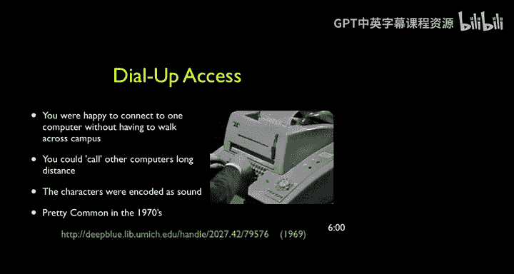

# 互联网历史、技术与安全：P9：课程总结与反思

在本节课中，我们将回顾20世纪60年代至70年代初，用户使用计算与通信技术的体验。我们将探讨早期技术的局限性、其变革性影响，以及推动技术向更高效共享方式发展的动力。

上一节我们回顾了互联网的早期形态，本节中我们来看看早期用户的真实使用感受。

我想让你了解20世纪60年代和70年代初，最终用户使用计算与通信技术的体验是怎样的。

正如我所说，那是一个充满乐趣的时代。如果你无法与数千英里之外的人交流，而突然之间，你桌上的这个设备让你能够做到这一点，即使它体型巨大、噪音嘈杂，它依然令人印象深刻，并且改变了你对世界的看法。你的同事可以通过这个键盘与你相连，而他们就在键盘的另一端。这是一个变革性的概念，即使以今天的标准看，当时的技术显得非常粗糙。

我们经历了许多复杂的步骤，因为计算机昂贵且稀有，必须被高度共享以证明其成本是合理的。

因此，在下一讲中，我们将开始探讨如何改进设备共享的方式，并使这种共享不再需要像最早时期那样直接拨号。在最早的时候，如果你想与千里之外的计算机对话，你必须支付长途电话费。所以，我们当时正在研究如何建立永久性的连接，以便我们能以更自然、更低成本的方式使用这些设备。

以下是早期技术体验的几个关键点：
*   通信能力具有变革性，尽管硬件笨重。
*   计算机是昂贵且稀缺的资源。
*   用户必须通过复杂的步骤（如长途拨号）来共享访问权限。

本节课中我们一起学习了早期计算与通信技术的用户体验，理解了其虽原始但具有变革性的本质，以及高成本和共享需求如何推动了后续网络连接技术的演进。下一讲，我们将探讨如何建立更高效、低成本的永久性连接。