# 001：课程介绍

在本节课中，我们将要学习移动机器人学的基本概念、研究动机以及课程的整体框架。我们将探讨为什么机器人技术如此重要，并初步了解构建自主机器人系统所需的核心算法和数学基础。

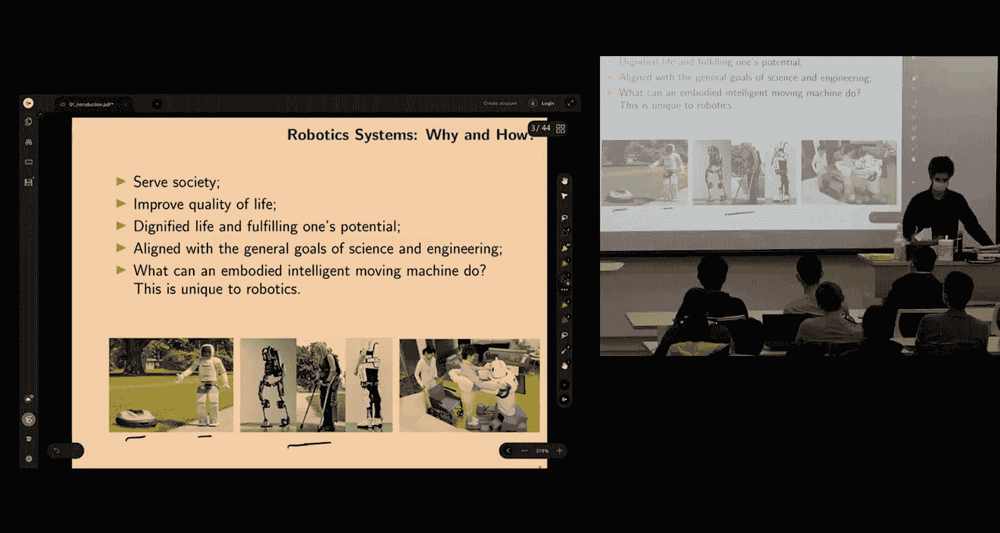

## 为什么研究机器人学？🤖

你来到这里，说明你对机器人学有内在的兴趣。但除了兴趣，机器人学对社会有着切实的价值。

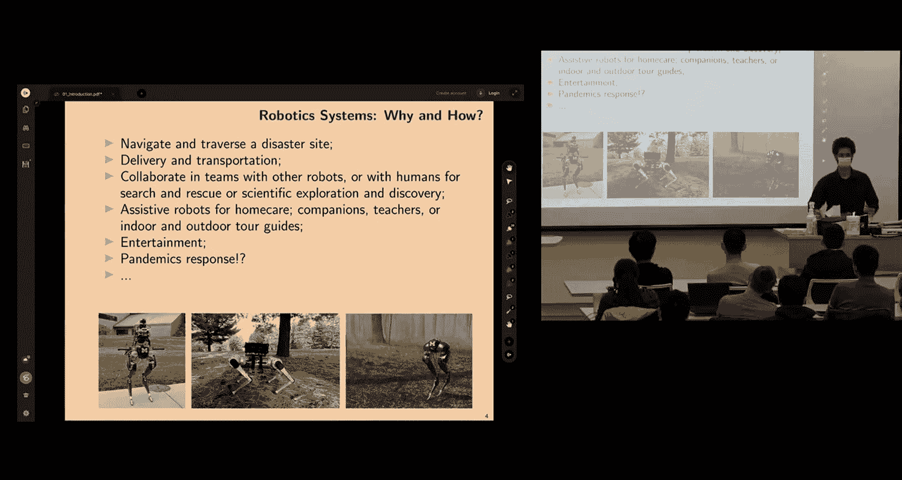

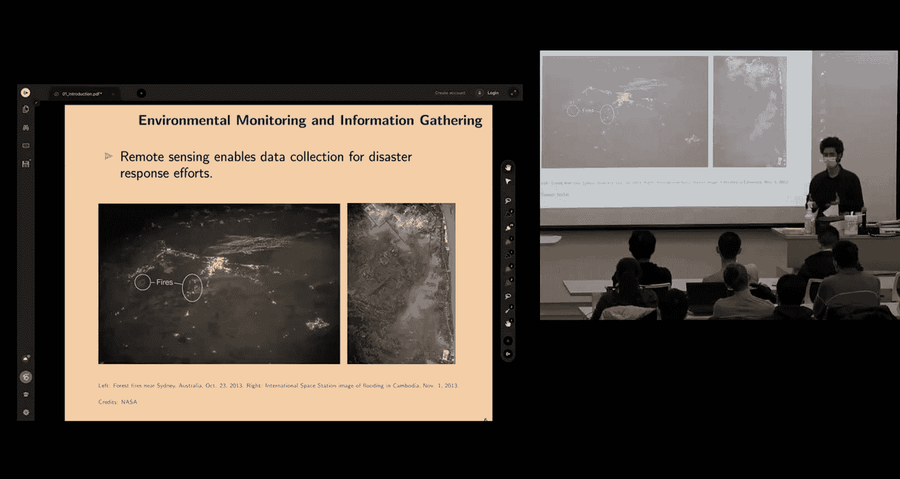

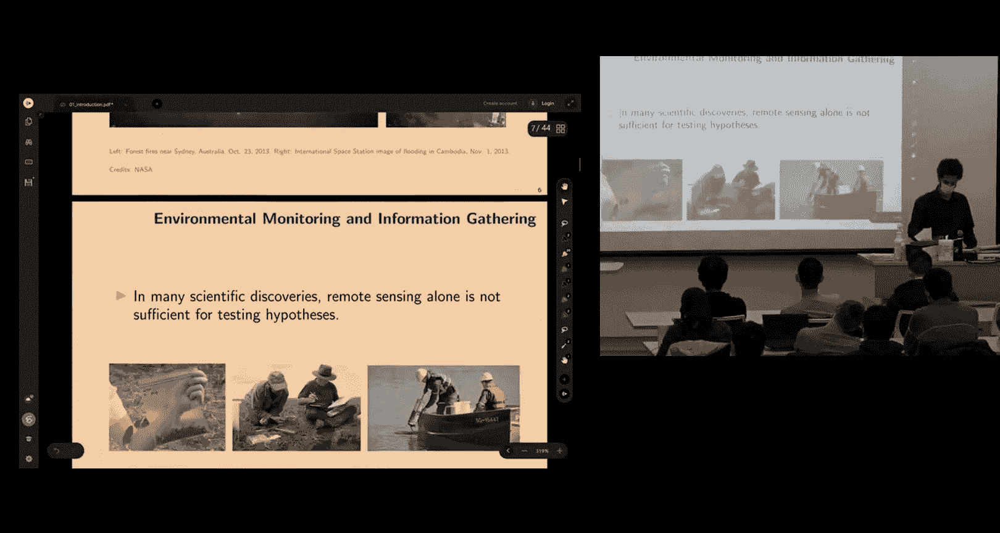

首先，机器人能让我们的生活更轻松、更安全。有些工作非常繁重或危险，例如搬运重物、进入火灾或灾难现场、采矿等。让机器人来完成这些任务，可以保护人类的安全。

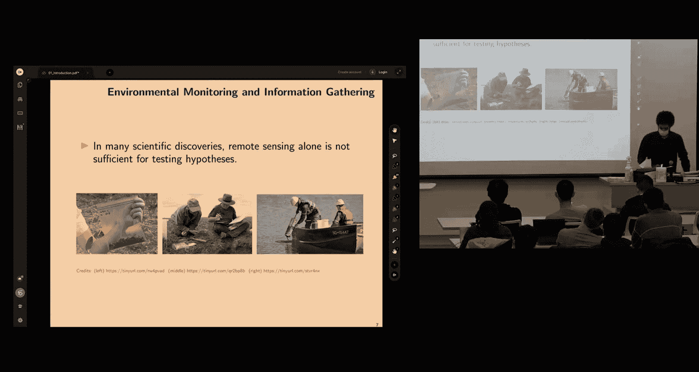

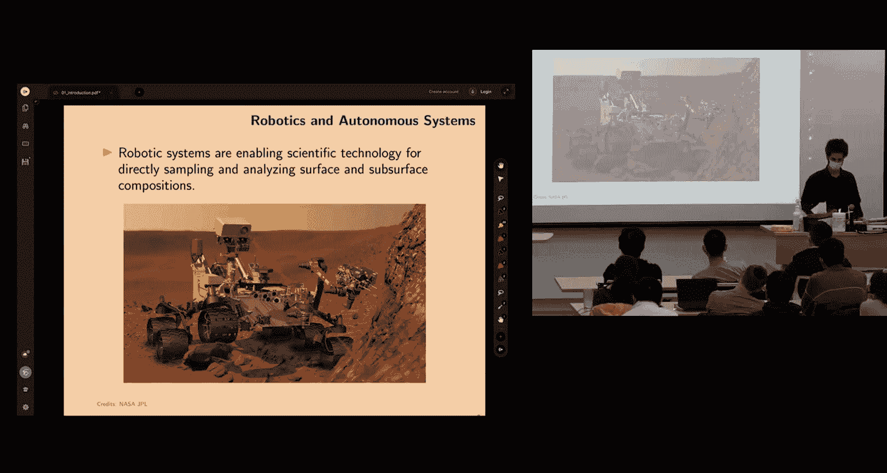

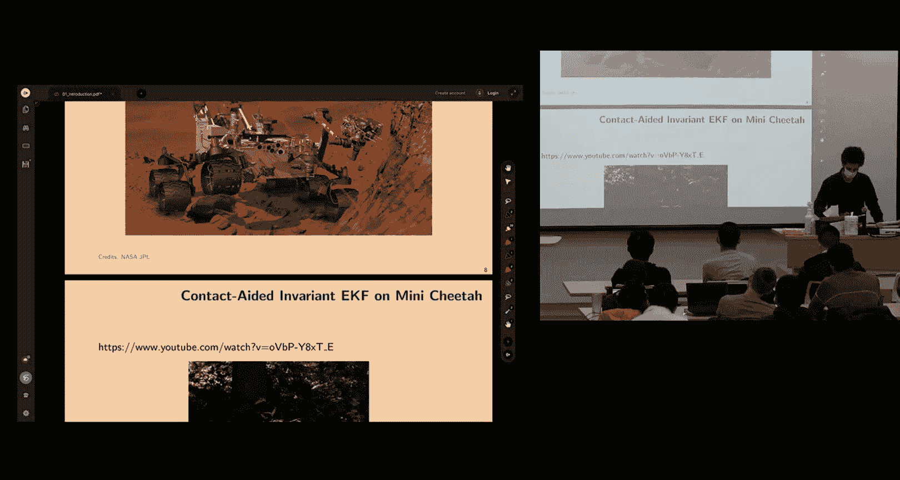

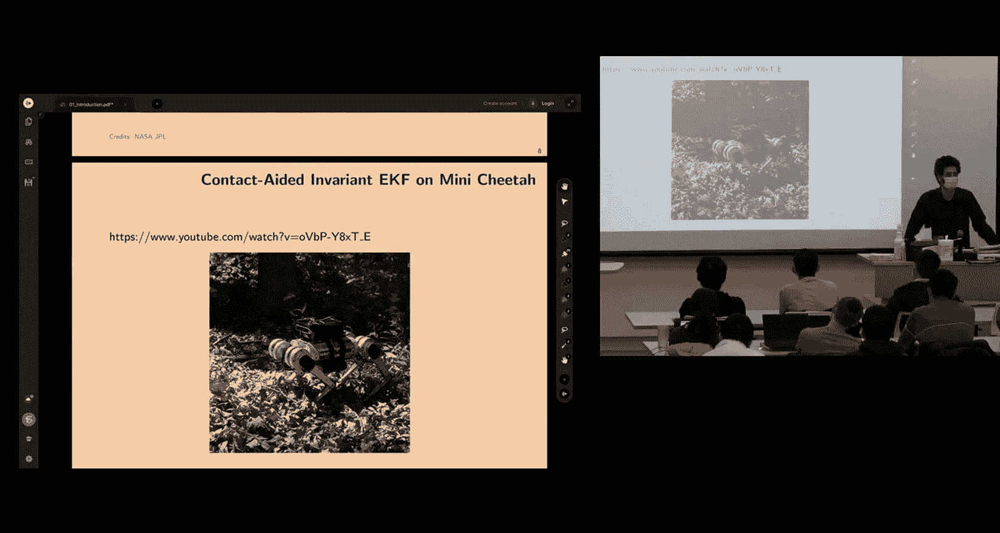

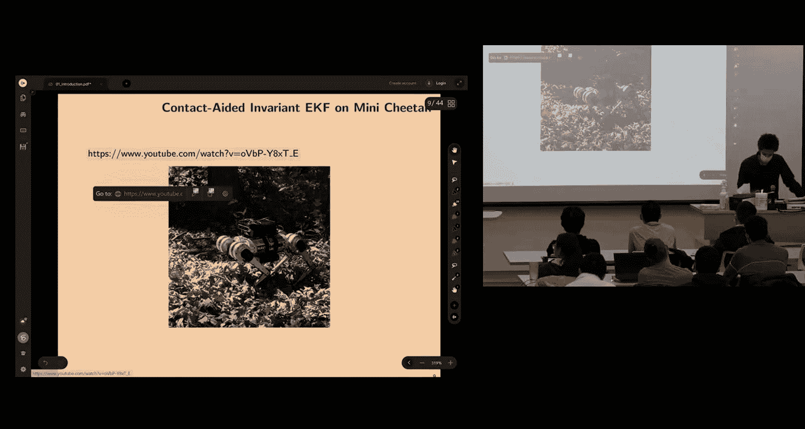

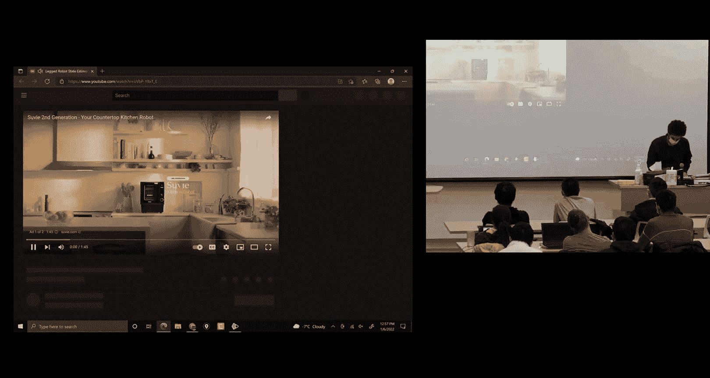

其次，随着社会发展，一些重复性、高强度的劳动岗位可能面临人力短缺。机器人可以填补这些空缺，让人们能从事更具创造性和尊严的工作。

此外，机器人技术是**具身智能**的体现。与纯粹的软件人工智能不同，机器人是能够与环境进行物理交互的智能硬件。它融合了多种感知模态，如视觉、触觉、听觉等，这是机器人学独特且迷人的地方。

在医疗、护理、教育、娱乐、灾难响应、环境监测等领域，机器人都有着巨大的应用潜力和市场前景。例如，外骨骼机器人可以帮助行动不便的人重获独立；在疫情期间，多机器人系统可以高效规划并配送物资。

## 机器人学面临的挑战与核心问题 ⚙️

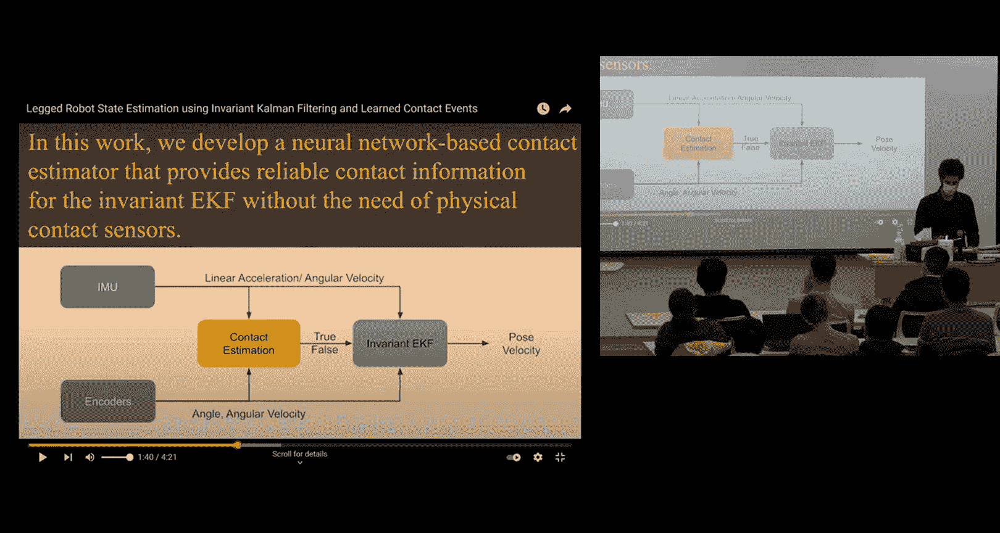

上一节我们介绍了机器人学的价值，本节中我们来看看实现机器人自主化面临哪些挑战，以及需要解决哪些核心问题。

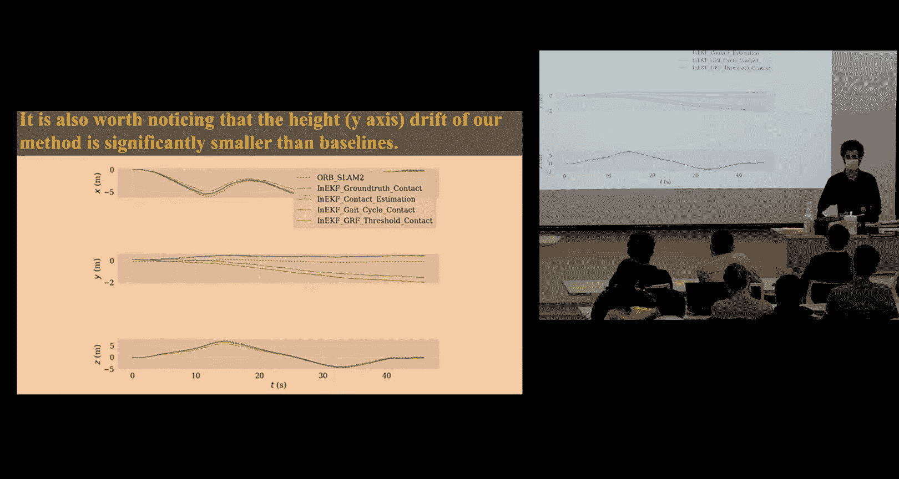

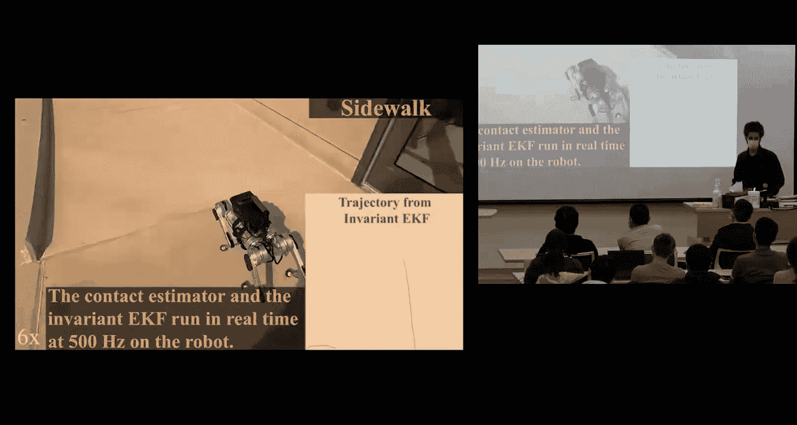

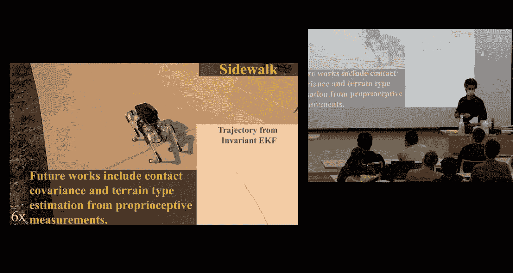

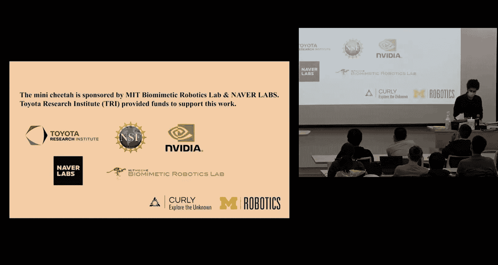

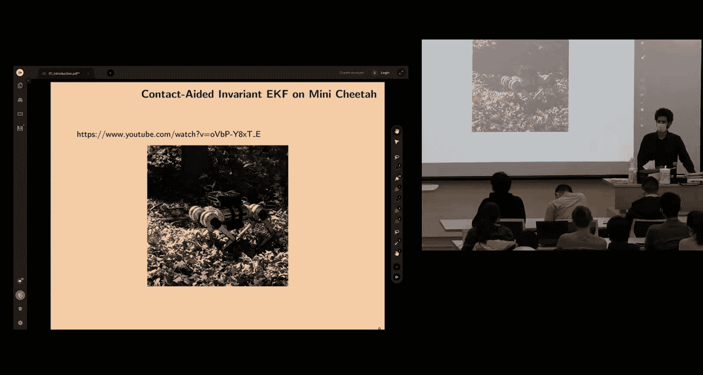

观看一个机器人（如Cassie）在复杂环境中行走的视频时，我们不仅要欣赏其动作，更要思考背后的技术。核心挑战在于**算法的鲁棒性**。在实验室运行良好的算法，往往难以直接应用到真实世界，因为：
*   **模型不精确**：我们对机器人动力学和环境的数学模型总是近似的。
*   **执行与感知的不完美**：执行器（电机）和传感器（摄像头、IMU等）都存在误差和噪声。

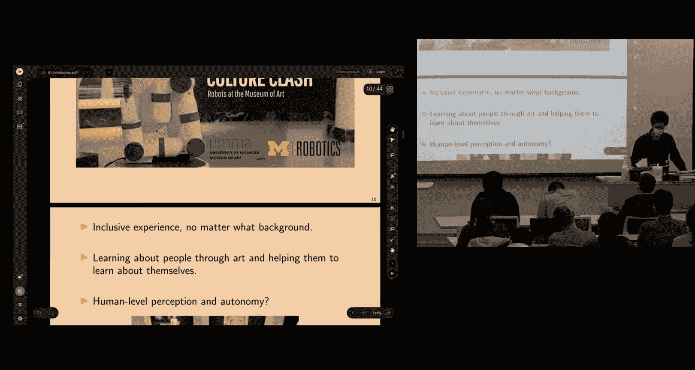

一个自主机器人系统需要解决几个基本问题：
1.  **定位**：机器人如何知道“我在哪里”？如果不知道自己的位置，就无法进行后续任务。
2.  **建图**：机器人如何感知并构建周围环境的地图？
3.  **规划**：在已知（或部分已知）的地图中，机器人如何规划从起点到目标点的路径？
4.  **控制**：机器人如何执行规划好的动作，并保持稳定（例如双足行走的平衡）？

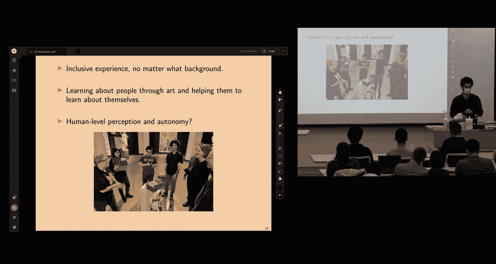

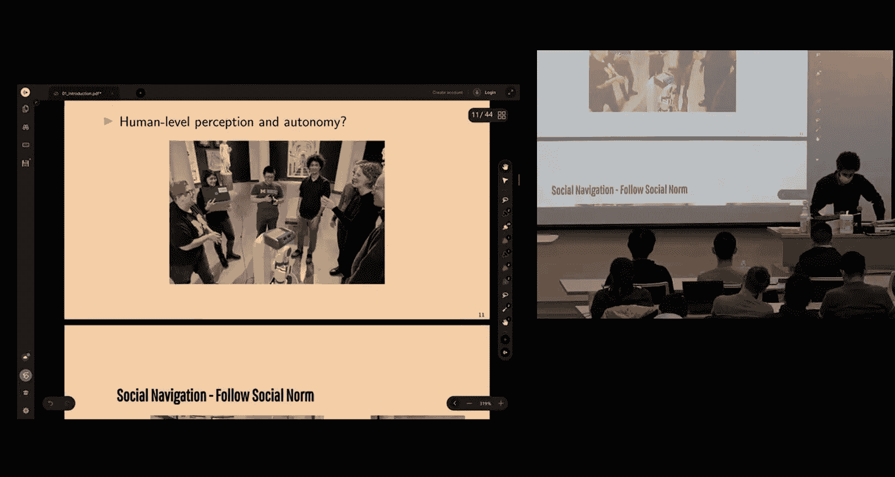

以森林行走的机器人为例，它可能仅依靠**关节编码器**（测量关节角度）和**惯性测量单元**（IMU，测量加速度和角速度）进行**航迹推算**，再通过**接触检测**（判断脚是否着地）来校正误差，最终利用**不变卡尔曼滤波**等先进算法实现高精度的轨迹跟踪，即使在没有视觉（“盲走”）的情况下也能工作。这展示了不依赖环境外观的**本体感知**的重要性。

## 自主系统的通用框架：感知-推理-行动 🔄

理解了具体挑战后，我们可以抽象出一个构建自主系统的通用框架。这个框架通常被称为“感知-推理-行动”循环或“信念-计划-行动”循环。

其运作方式如下：
1.  **世界与信念**：存在一个真实世界，机器人对其有一个内部表示，称为“信念”。信念是机器人对世界状态（包括自身状态）的估计，由于信息不完备，它总是不确定和概率性的。
2.  **感知**：机器人通过传感器（如摄像头、激光雷达）从世界获取数据（`Z`）。
3.  **更新信念**：机器人利用感知数据，根据**贝叶斯规则**更新其信念。更新后的信念 `bel(x_t)` 是给定所有历史感知数据 `z_{1:t}` 和动作 `u_{1:t}` 后，状态 `x_t` 的概率分布。
    `bel(x_t) = P(x_t | z_{1:t}, u_{1:t})`
4.  **推理与规划**：基于当前的信念，机器人进行推理，决定为了实现目标应该采取什么行动序列。
5.  **行动**：机器人执行规划好的动作（`u_t`），作用于世界。
6.  **循环**：行动改变了世界（也可能改变机器人自身状态），机器人获得新的感知数据，循环继续。

这个框架将复杂的自主系统分解为可研究的模块，每个模块（感知、状态估计、规划、控制）都有丰富的算法和研究内容。

## 机器人中的概率基础 📊

上一节我们介绍了自主系统的抽象框架，本节中我们来看看支撑该框架，特别是信念更新的数学基础——概率论。

在机器人学中，我们大量使用概率来描述不确定性。机器人的状态、传感器测量值、控制命令都不是绝对精确的，因此我们用随机变量和概率分布来建模它们。

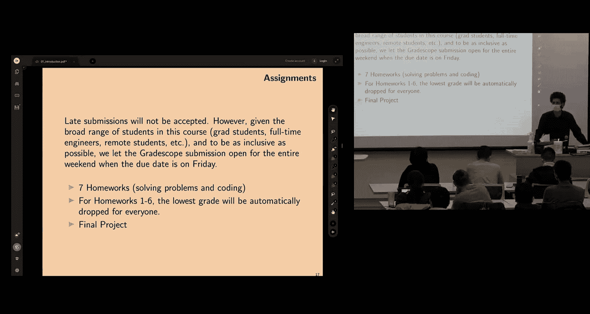

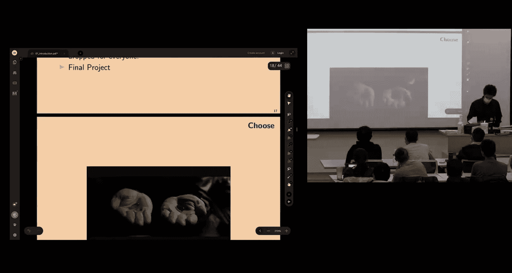

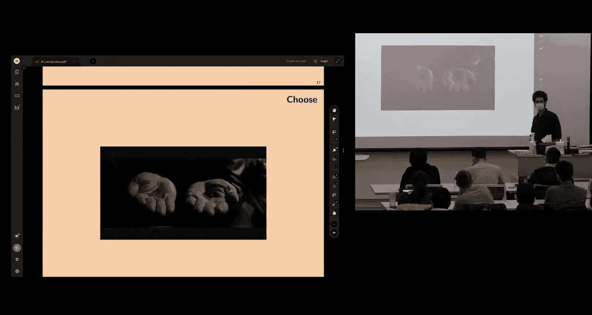

以下是几个核心概念：

*   **概率密度函数**：对于连续随机变量 `x`，其概率密度函数 `p(x)` 描述了 `x` 取不同值的可能性。满足 `∫ p(x) dx = 1`。
*   **联合概率与条件概率**：`p(x, y)` 是 `x` 和 `y` 同时发生的概率。如果已知 `y` 发生，那么 `x` 发生的条件概率为 `p(x|y) = p(x, y) / p(y)`。
*   **边缘化**：如果只想求 `x` 的概率分布，可以对联合概率关于 `y` 积分（或求和）：`p(x) = ∫ p(x, y) dy`。这被称为“求和掉”或“边缘化”变量 `y`。
*   **贝叶斯规则**：这是连接先验知识、观测数据和后验信念的桥梁。
    `P(假设|数据) = [P(数据|假设) * P(假设)] / P(数据)`
    其中：
    *   `后验` = `P(假设|数据)`：看到数据后，对假设的更新信念。
    *   `似然` = `P(数据|假设)`：在给定假设下，观察到当前数据的可能性。
    *   `先验` = `P(假设)`：在看到数据之前，对假设的初始信念。
    *   `证据` = `P(数据)`：数据本身的概率，通常作为一个归一化常数。

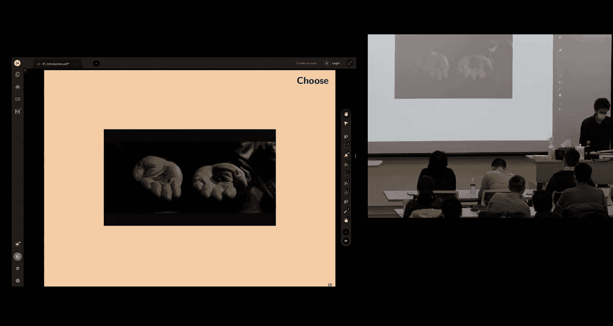

**高斯（正态）分布** 在机器人学中尤为常见，这主要得益于中心极限定理。其概率密度函数为：
`p(x; μ, Σ) = (1/√((2π)^k |Σ|)) * exp(-1/2 (x-μ)^T Σ^{-1} (x-μ))`
其中 `μ` 是均值向量，`Σ` 是协方差矩阵。

高斯分布有许多优良性质：
*   **线性变换下的封闭性**：若 `x ~ N(μ, Σ)`，且 `y = Ax + b`，则 `y ~ N(Aμ + b, AΣA^T)`。
*   **边缘化和条件化的封闭性**：高维联合高斯分布的边缘分布和条件分布仍然是高斯分布，且有解析解公式。这使得基于高斯假设的滤波器（如卡尔曼滤波器）计算非常高效。

一个简单的贝叶斯规则例子：一辆自动驾驶汽车在交通灯前停下。已知灯光循环（先验）和传感器在不同灯光下停车的概率（似然），我们可以计算在汽车停下的条件下，灯光是黄灯的概率（后验）。这展示了如何将因果信息（传感器模型）转化为诊断信息（状态推断）。

## 贝叶斯滤波器：一个统一的算法框架 🧠

基于前面的概率基础，我们现在可以形式化地描述自主系统核心的信念更新过程——**贝叶斯滤波器**。

贝叶斯滤波器为估计动态系统的状态（如机器人的位姿）提供了一个递归的、概率性的框架。它假设系统是马尔可夫的，即当前状态只依赖于前一个状态和当前控制输入。

算法需要两个模型：
1.  **运动模型**：`p(x_t | u_t, x_{t-1})`。描述在控制命令 `u_t` 下，状态从 `x_{t-1}` 转移到 `x_t` 的概率。
2.  **观测模型**：`p(z_t | x_t)`。描述在状态 `x_t` 下，产生观测 `z_t` 的概率。

贝叶斯滤波器的递归步骤如下：
*   **预测步**：利用运动模型，结合上一时刻的信念和控制输入，预测当前时刻的先验信念。
    `bel̄(x_t) = ∫ p(x_t | u_t, x_{t-1}) * bel(x_{t-1}) dx_{t-1}`
*   **更新步**：利用观测模型，结合新的观测数据 `z_t`，更新先验信念，得到后验信念。
    `bel(x_t) = η * p(z_t | x_t) * bel̄(x_t)`
    其中 `η` 是归一化常数，确保 `bel(x_t)` 积分为1。

这个框架非常通用，但直接计算（如在连续空间上积分）通常不可行。根据对噪声分布和系统线性程度的假设，会派生出不同的具体滤波器实现：
*   **如果状态空间离散且较小**：可以使用**马尔可夫定位**，直接在离散网格上计算和存储每个状态的概率。
*   **如果系统是线性的，且噪声为高斯分布**：**卡尔曼滤波器**提供了最优的闭式解，它递归地更新高斯分布的均值和协方差。
*   **如果系统是非线性的**：可以使用**扩展卡尔曼滤波器**（对非线性进行线性化）或**无迹卡尔曼滤波器**（使用采样点近似分布）。
*   **对于更一般的非高斯、非线性系统**：**粒子滤波器**通过一组随机样本（粒子）来近似表示概率分布，具有极大的灵活性。

本课程将引导你深入理解这些滤波器的原理、实现和应用。

## 课程安排与期望 📚

在本节中，我们将了解本课程的具体安排、学习工具以及对大家的期望。

本课程的目标是为你打下移动机器人算法研究的坚实基础。通过学习，你将能够阅读相关研究论文，理解不同算法的原理，并为在工业界或学术界开展机器人项目做好准备。

以下是课程相关的具体信息：

*   **交流平台**：我们将使用 **Piazza** 进行课程问答。这是一个高效的平台，便于集中管理问题、分享解答和进行讨论（支持数学公式）。请避免通过邮件询问课程内容问题。
*   **学习小组**：我们鼓励你通过Canvas上的学习小组功能结识同学，组成学习小组。你们可以一起讨论课程内容、作业（但最终作业需独立完成），这不仅能加深理解，也能建立宝贵的人际网络。
*   **作业**：课程共有7次作业。我们会自动去掉你得分最低的一次作业（第1到第6次中的一次）。第7次作业是必做的。作业设计具有挑战性，旨在促进深度思考。如果遇到困难，请及时在Piazza上提问或寻求帮助。
*   **寻求帮助**：如果你在课程学习中遇到任何个人困难（健康、家庭等），**请尽早与我沟通**。我们可以一对一交流，寻找解决方案。不要等到课程末期。

请合理安排时间，不要将所有作业拖到最后一天完成。有些作业需要较多时间思考和实现。

## 总结

本节课中我们一起学习了移动机器人学的入门知识。我们探讨了研究机器人学的多重意义，从提升生活品质到应对极端环境挑战。我们剖析了实现机器人自主性所面临的核心问题：定位、建图、规划与控制，并引入了“感知-推理-行动”这一通用框架来理解自主系统。

在数学基础上，我们回顾了概率论的核心概念，特别是贝叶斯规则和高斯分布，它们是描述和推理不确定性的基石。最后，我们介绍了贝叶斯滤波器这一统一的算法框架，它如何递归地更新机器人对世界的信念，并概述了其各种具体实现（如卡尔曼滤波器、粒子滤波器）。

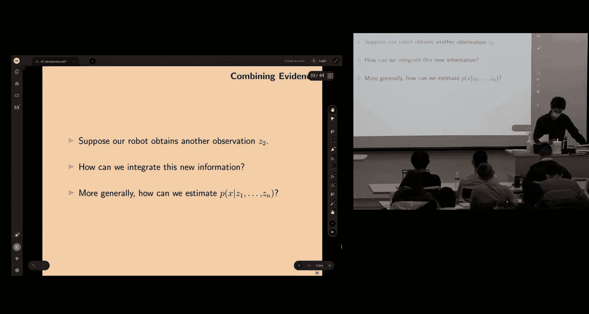

本课程将带你深入这些主题，通过理论学习和实践编程，掌握移动机器人感知、估计和决策的关键方法与算法。期待与你共同探索机器人技术的精彩世界。