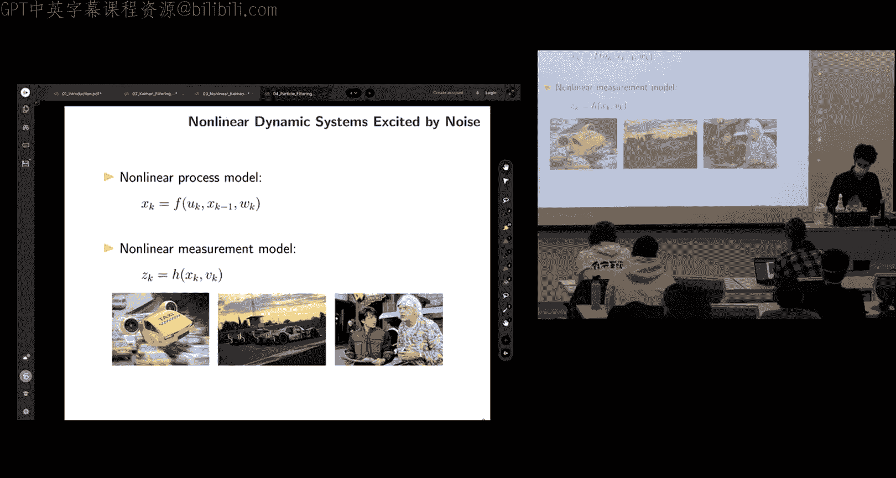
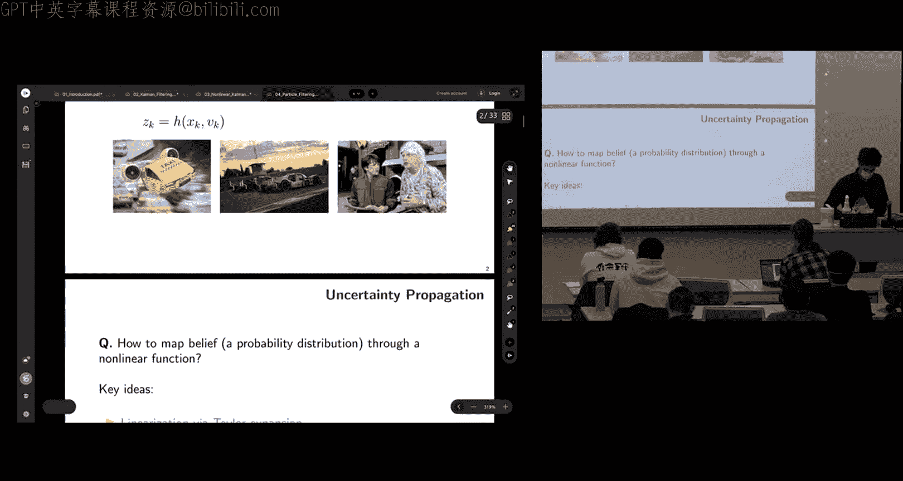
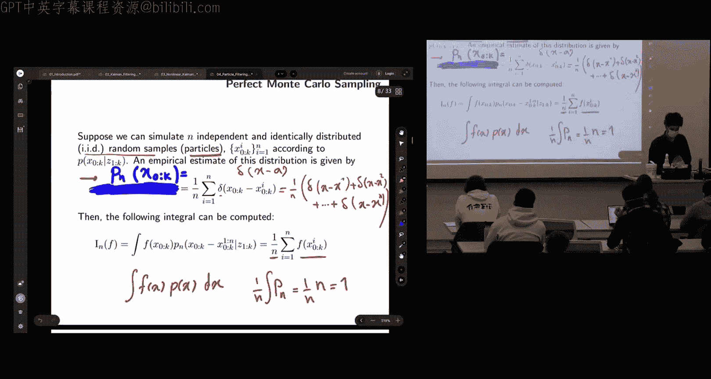
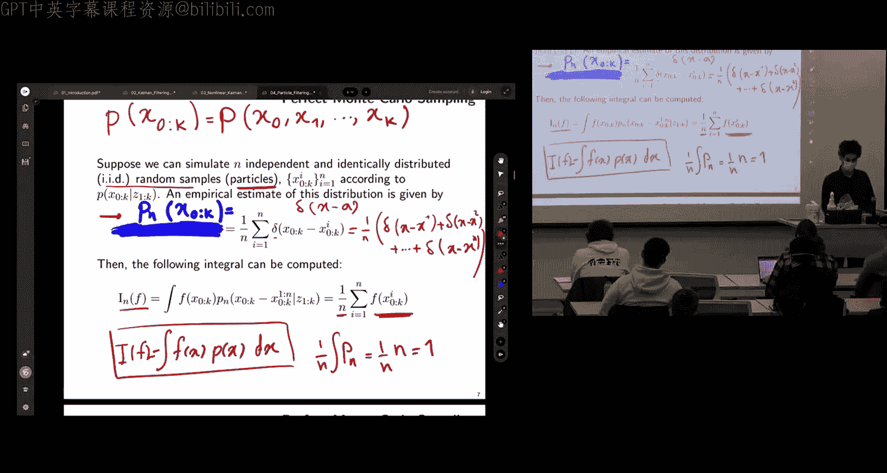
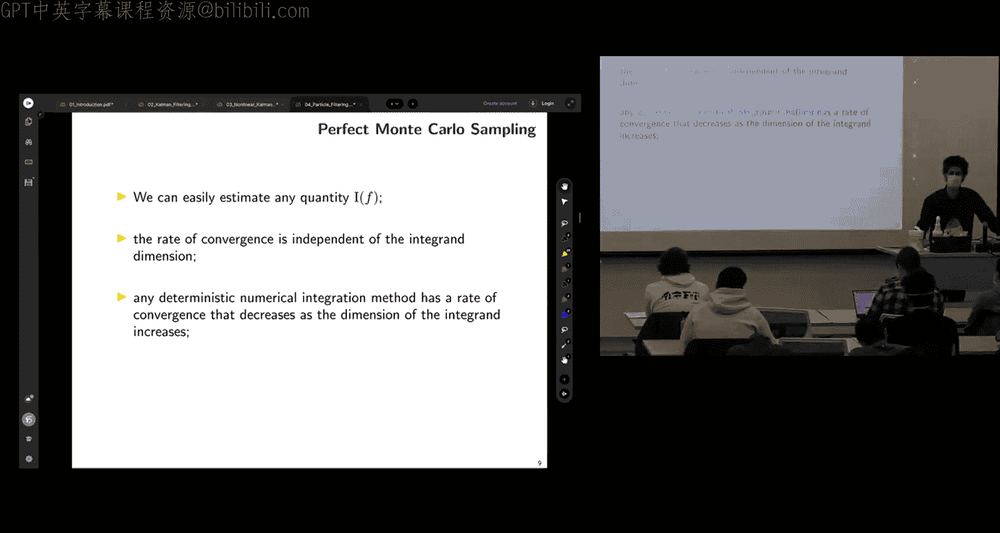
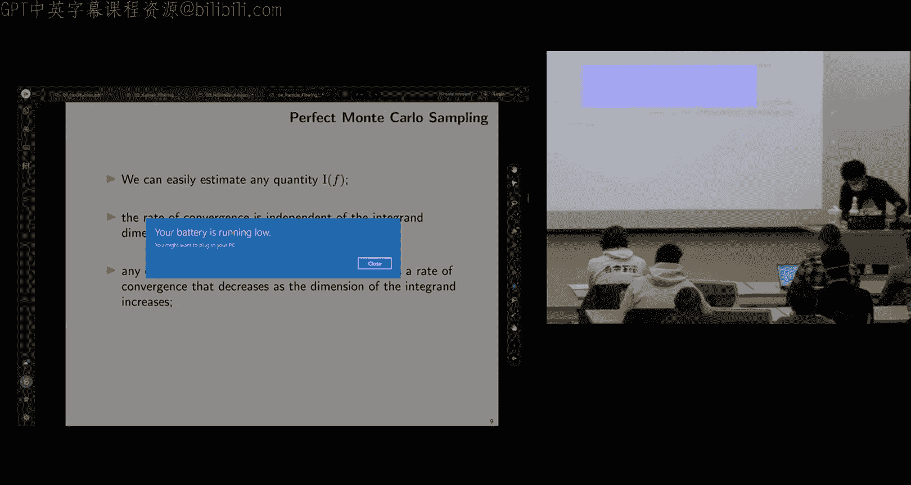
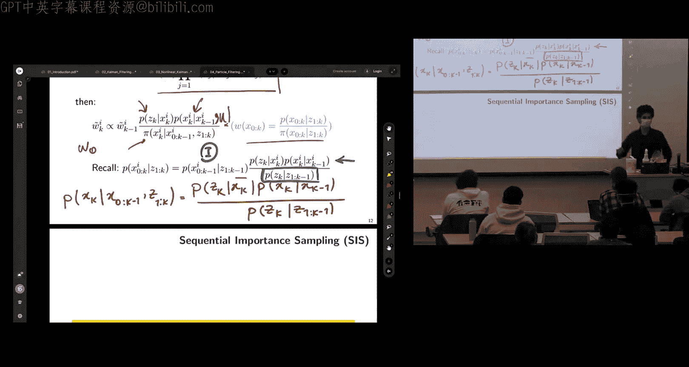
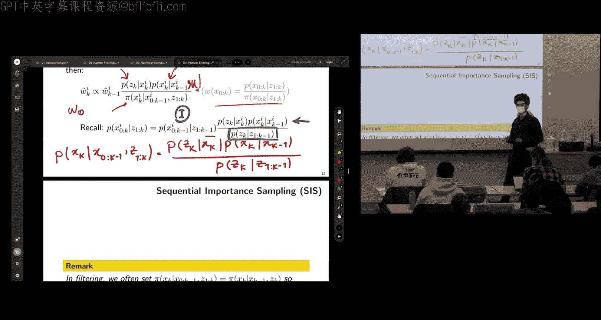
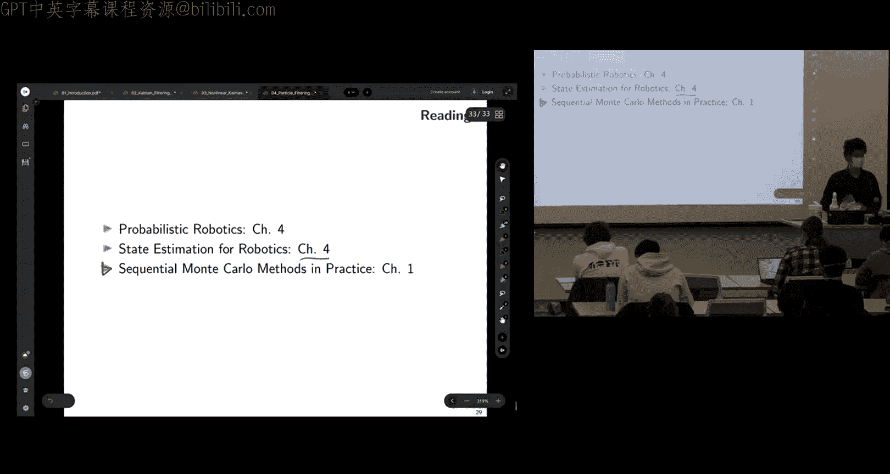

# 004：粒子滤波






在本节课中，我们将学习粒子滤波。粒子滤波是我们在探索状态估计或不确定性传播方法时涉及的第二个核心思想。它是一种基于随机采样的方法，特别适用于处理非线性、非高斯系统。

## 概述：非线性系统与不确定性传播

上一节我们介绍了基于确定性采样的无迹卡尔曼滤波。本节中，我们来看看基于随机采样的第三种方法——粒子滤波。

在现实中，我们通常处理的是非线性系统和测量模型。这些系统无处不在，例如自动驾驶飞行出租车或赛车，其运动模型往往是非线性的。我们的核心动机是解决状态估计任务，如跟踪、定位或感知。给定一个概率分布（由于现实中不存在完美的执行器和传感器），我们需要递归地通过非线性模型来传播这个“信念”。对于非线性系统，通常没有精确的解析解。

我们已经学习了两种线性化方法：基于泰勒展开的扩展卡尔曼滤波和基于确定性采样的无迹卡尔曼滤波。今天，我们将讨论基于随机采样的第三种思想。

## 粒子滤波的核心思想

粒子滤波的概念非常直观。其基本思想是：利用计算机模拟后验概率分布的演化，使用测量值对不同的模拟假设（即“粒子”）进行加权，从而追踪最可能的状态。每个粒子代表一个可能的假设或状态实例。

这种方法属于更广泛的蒙特卡洛方法范畴，其基础是随机采样和模拟。与之前需要复杂代数推导的滤波器相比，粒子滤波通常更易于实现。此外，它能够处理非高斯、多模态的后验分布，而卡尔曼滤波器族通常仅限于跟踪高斯分布。

我们将重点讨论顺序蒙特卡洛方法，因为机器人数据是按时间顺序到达的，我们需要递归地实时处理它们。当问题具有非高斯、高维和非线性特征时，就应考虑使用粒子滤波。一个典型例子是“机器人绑架问题”，即机器人被突然移动到别处，粒子滤波因其能跟踪多个假设而能更好地处理此类问题。

## 数学基础：狄拉克δ函数与理想蒙特卡洛采样

在深入算法之前，我们需要回顾一个重要的数学概念：狄拉克δ函数。δ函数在特定点a处为无穷大，在其他所有地方为零，并且其积分为1。在概率意义上，它可以被视为将所有概率质量集中在一个点上的概率测度。δ函数的一个关键性质是：∫ f(x) δ(x - a) dx = f(a)，这使得它能够“评估”函数在特定点的值。

现在，让我们设想一个理想情况：假设我们已知真实的后验概率分布 p(x)，并且可以从中独立同分布地抽取N个样本 {x⁽ⁱ⁾}。

我们可以用这些样本来构建后验分布的一个经验估计：

```
p̂_N(x) = (1/N) * Σ_{i=1}^{N} δ(x - x⁽ⁱ⁾)
```

这个估计将概率质量均匀地（每个权重为 1/N）放置在每个样本点上。基于此，我们可以近似计算关于后验分布的任意函数 f(x) 的期望值：

```
E[f(x)] ≈ (1/N) * Σ_{i=1}^{N} f(x⁽ⁱ⁾)
```

根据大数定律，随着样本数 N 趋于无穷，这个估计会以概率1收敛到真实值，且是无偏的。其收敛速率与积分维度无关，这避免了传统数值积分方法（如黎曼积分）中的“维度灾难”问题。

然而，这个方法存在一个根本性问题：**我们并不知道真实的后验分布 p(x)**。如果知道，问题就已经解决了。因此，我们需要一种方法来绕过这个障碍。

## 重要性采样：从已知分布中采样

为了解决未知真实分布的问题，我们引入了**重要性采样**。其核心思想是：选择一个我们已知且易于采样的分布 π(x) 作为**提议分布**（或重要性分布），并要求其支撑集包含真实后验 p(x) 的支撑集。

我们通过一个巧妙的变换来重写期望积分：

```
E[f(x)] = ∫ f(x) p(x) dx = ∫ [f(x) * (p(x)/π(x))] π(x) dx
```



定义重要性权重 w(x) = p(x) / π(x)。那么，期望可以近似为：

```
E[f(x)] ≈ (1/N) * Σ_{i=1}^{N} f(x⁽ⁱ⁾) w(x⁽ⁱ⁾)
```



在实际计算中，我们通常使用归一化的重要性权重：

```
E[f(x)] ≈ Σ_{i=1}^{N} f(x⁽ⁱ⁾) w̃⁽ⁱ⁾
```
其中，归一化权重 w̃⁽ⁱ⁾ = w⁽ⁱ⁾ / Σ_{j=1}^{N} w⁽ⁱ⁾。





这样，我们通过从已知的提议分布 π(x) 中采样，并用权重 w(x) 来修正样本的重要性，从而近似了关于未知分布 p(x) 的期望。

## 顺序重要性采样：递归权重更新

然而，上述方法仍不足以进行递归的状态估计。我们需要一个能随时间递归更新权重的方法，即**顺序重要性采样**。

通过利用贝叶斯规则、马尔可夫假设以及模型的链式分解，我们可以推导出权重更新的递归公式。假设在时间步 k，第 i 个粒子的权重 w_k⁽ⁱ⁾ 可以递归地计算为：

```
w_k⁽ⁱ⁾ ∝ w_{k-1}⁽ⁱ⁾ * [p(z_k | x_k⁽ⁱ⁾) * p(x_k⁽ⁱ⁾ | x_{k-1}⁽ⁱ⁾)] / π(x_k⁽ⁱ⁾ | x_{0:k-1}⁽ⁱ⁾, z_{1:k})
```

这个公式看起来很复杂，但它包含了我们熟悉的项：似然函数 p(z_k | x_k) 和运动模型 p(x_k | x_{k-1})。提议分布 π 是我们选择的设计参数。

## SIR粒子滤波：机器人学的实用选择

对于机器人定位问题，一个特别实用且常见的选择是：将提议分布设置为先验分布，即运动模型：π(x_k | ...) = p(x_k | x_{k-1})。





代入递归权重公式后，得到了极大的简化：

```
w_k⁽ⁱ⁾ ∝ w_{k-1}⁽ⁱ⁾ * p(z_k | x_k⁽ⁱ⁾)
```

这意味着，**新的权重正比于旧权重乘以当前观测的似然值**。这非常直观：粒子根据运动模型移动，然后根据传感器测量值的好坏来调整其权重。

由此，我们得到了**采样重要性重采样**粒子滤波算法，其核心步骤如下：

1.  **预测（采样）**：对于每个粒子，根据运动模型 p(x_k | x_{k-1}) 采样其下一个状态。
2.  **更新（加权）**：根据观测模型（似然）p(z_k | x_k) 计算每个粒子的权重，并归一化。
3.  **重采样**：根据权重，复制高权重粒子，淘汰低权重粒子，从而得到一组新的、权重均匀的粒子集。

以下是算法的伪代码描述：

```
# SIR粒子滤波算法
初始化：生成N个服从初始信念 p(x0) 的粒子 {x0⁽ⁱ⁾}，权重 w⁽ⁱ⁾ = 1/N

对于每个时间步 k：
  对于每个粒子 i：
    # 1. 重要性采样（预测）
    从提议分布（运动模型）中采样：x_k⁽ⁱ⁾ ~ p(x_k | x_{k-1}⁽ⁱ⁾)
    # 2. 重要性加权（更新）
    计算权重：w_k⁽ⁱ⁾ = w_{k-1}⁽ⁱ⁾ * p(z_k | x_k⁽ⁱ⁾)
  结束循环

  # 权重归一化
  总权重 = Σ w_k⁽ⁱ⁾
  对于每个粒子 i：
    w_k⁽ⁱ⁾ = w_k⁽ⁱ⁾ / 总权重
  结束循环

  # 3. 重采样（可选，但通常需要）
  如果有效粒子数 N_eff = 1 / Σ (w_k⁽ⁱ⁾)² 低于阈值（如 N/2）：
    根据归一化权重 {w_k⁽ⁱ⁾} 重采样N次，生成新的粒子集 {x_k⁽ⁱ⁾}，并重置所有权重为 1/N
  结束如果
结束循环
```

## 算法挑战：退化与样本贫化

SIR粒子滤波虽然强大，但也面临两个主要挑战：

1.  **退化问题**：在顺序重要性采样中，经过几次迭代后，除少数粒子外，大多数粒子的权重会变得非常小，这意味着计算资源被浪费在无关紧要的假设上。衡量退化的一个常用指标是**有效粒子数**：`N_eff = 1 / Σ (w⁽ⁱ⁾)²`。当 `N_eff` 很小时，表明发生了退化。

2.  **样本贫化问题**：重采样是解决退化问题的关键，它淘汰低权重粒子，复制高权重粒子。然而，这会导致**样本多样性丧失**。多次重采样后，许多粒子可能源于同一个祖先粒子，从而无法有效表示多模态分布或应对突然的状态变化（如绑架问题）。

在实践中，我们通过设置重采样阈值（不每步都重采样）和使用诸如**低方差重采样**等技巧来在退化与样本贫化之间寻求平衡。

## 应用示例：目标跟踪

让我们看一个简单的目标跟踪例子。假设目标运动模型为恒定速度模型，状态包括位置和速度。观测模型可能是传感器获取的距离和方位角。

通过运行SIR粒子滤波，我们可以同时估计目标的位置和速度。与卡尔曼滤波相比，粒子滤波在此类非线性、可能非高斯的问题上通常表现更鲁棒，尤其是在初始不确定性很大或存在多模态假设时。

## 总结

本节课中，我们一起学习了粒子滤波。它是一种基于随机采样的非参数滤波方法，核心思想是通过模拟大量假设（粒子）的演化，并用观测数据对其加权，来近似复杂的后验概率分布。

我们回顾了理想蒙特卡洛采样，引入了重要性采样以处理未知真实分布，并推导了顺序重要性采样以实现递归更新。最终，我们得到了适用于机器人学的SIR粒子滤波算法，并讨论了其核心步骤（预测、更新、重采样）以及面临的挑战（退化、样本贫化）。



粒子滤波的优势在于能够处理非线性、非高斯、多模态的估计问题，并能应对全局不确定性（如机器人绑架问题）。其代价是计算效率，特别是在高维状态空间中，需要大量粒子才能保证估计质量。然而，对于许多机器人定位和跟踪任务，粒子滤波仍然是一种强大而实用的工具。