# 008：机器人运动与不确定性传播 🚀

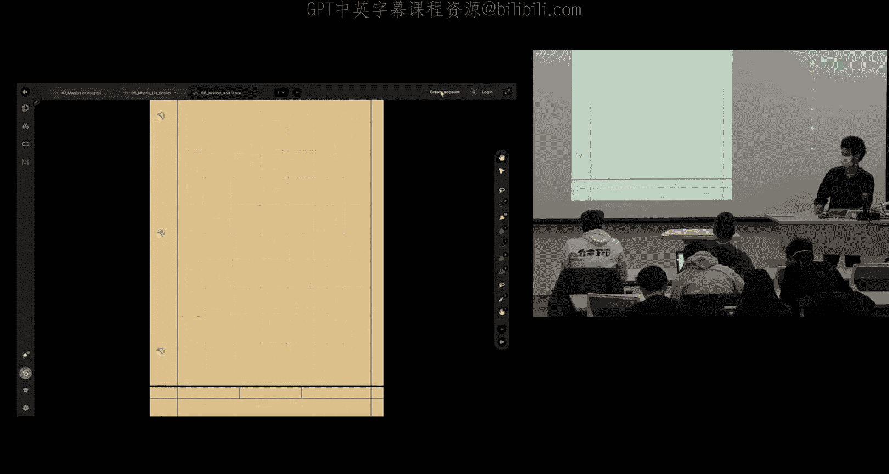

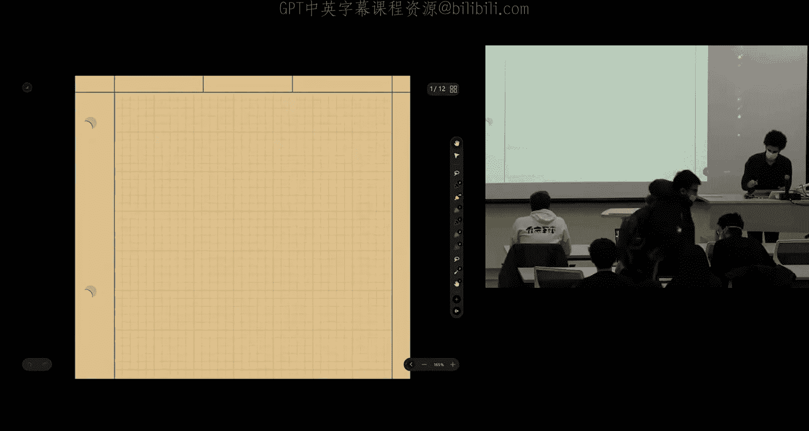

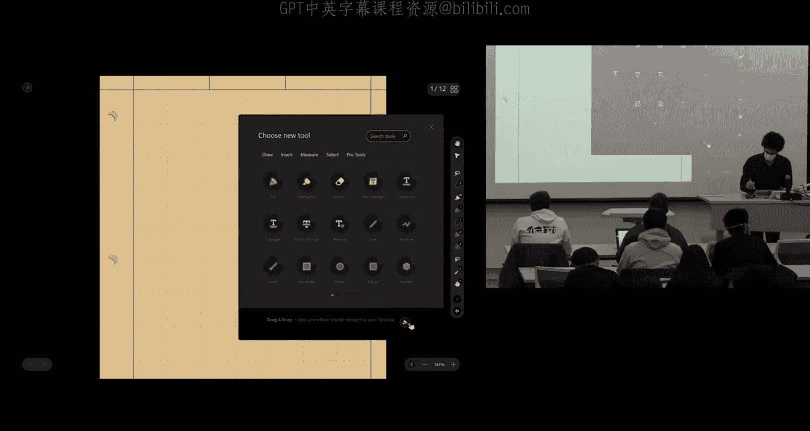

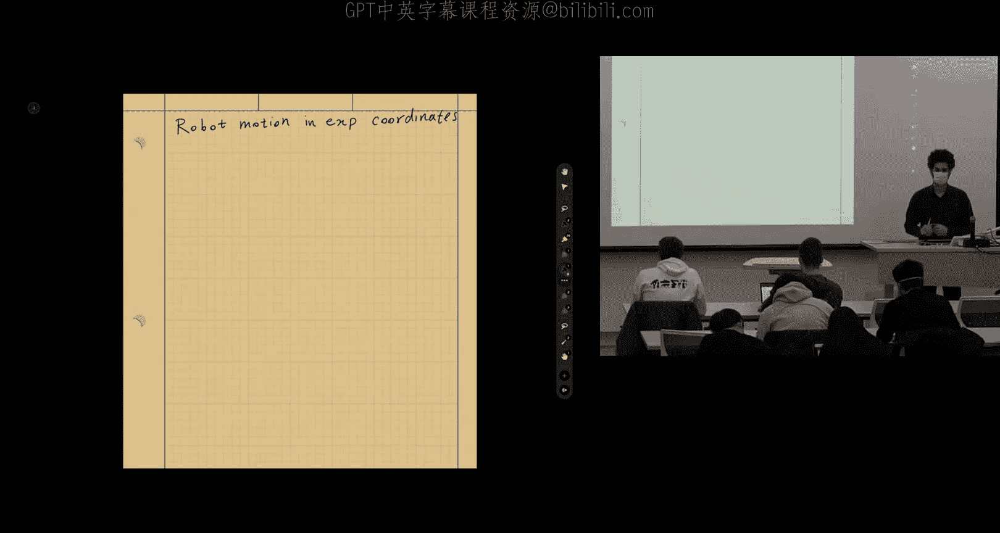

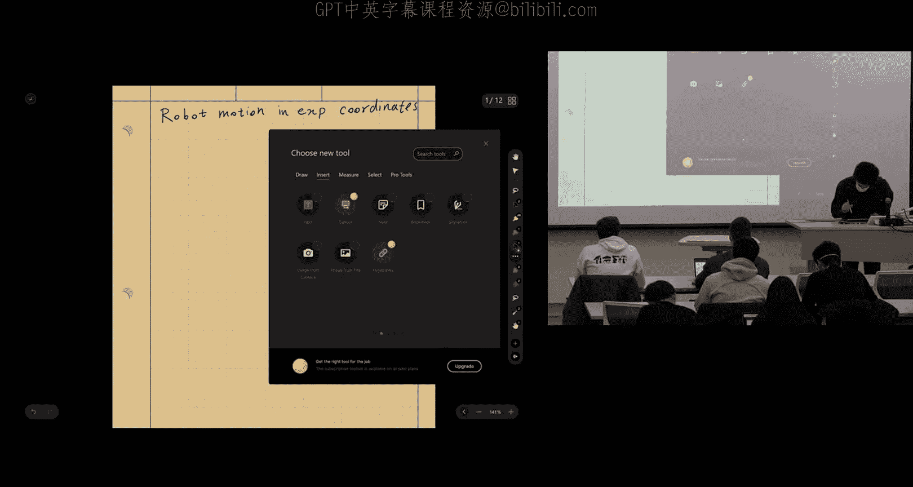

在本节课中，我们将学习如何对机器人运动进行建模，并理解如何在这种运动模型中传播不确定性。我们将重点关注使用指数坐标（李代数）来描述机器人位姿，这种方法能让我们以更自然、更线性的方式处理包含旋转和平移的运动。

上一节我们介绍了矩阵李群的基础概念，本节中我们来看看如何将这些概念应用到机器人运动建模中。

## 机器人运动建模 🤖

我们从一个常见的移动机器人平台——Roomba扫地机器人开始。它是一个地面机器人，有两个轮子，可以在平面上移动和旋转。对于状态估计和感知任务，我们关心的是如何根据运动命令来估计机器人的轨迹，而不是控制它如何精确地跟踪轨迹。因此，我们可以忽略导致运动的物理原因（如力和扭矩），而专注于运动学模型。

机器人的运动可以用一个附着在机器人本体上的坐标系来描述。这个坐标系相对于一个固定的世界坐标系，具有位置和朝向（位姿）。通过测量两个轮子的角速度，我们可以计算机器人本体的线速度和角速度，这被称为“扭转”。

**扭转** 是一个向量，它包含了角速度和一个线速度分量。在二维平面中，它是一个3维向量：
`twist = [ω, v_x, v_y]^T`

其中，`ω` 是关于垂直于平面的轴的角速度，`v_x` 和 `v_y` 是机器人本体坐标系下的线速度分量。

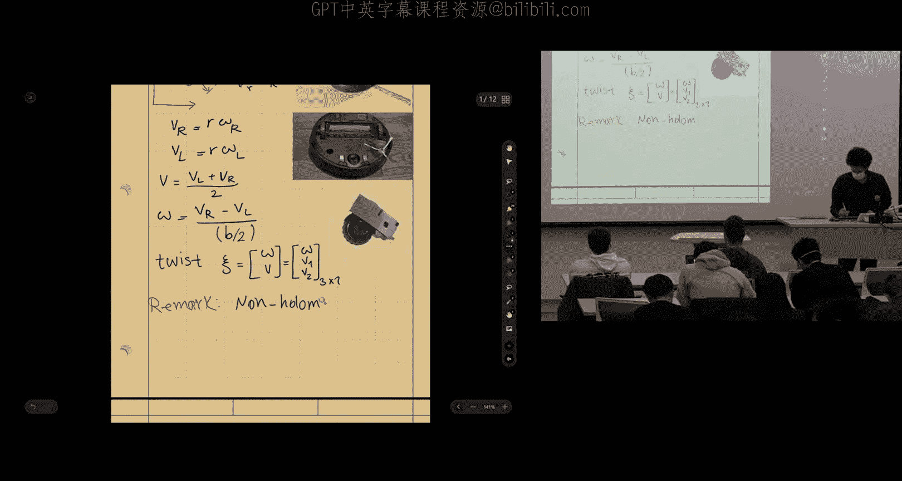

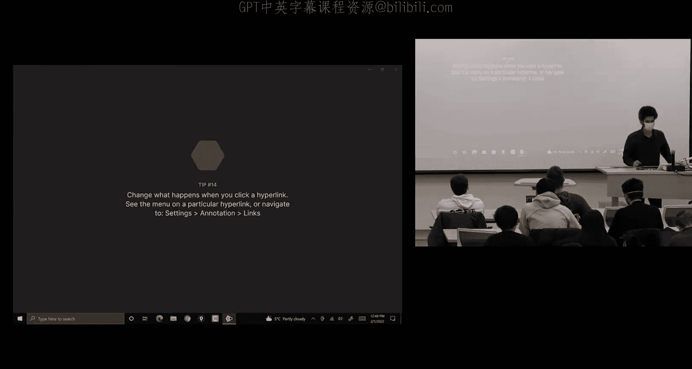

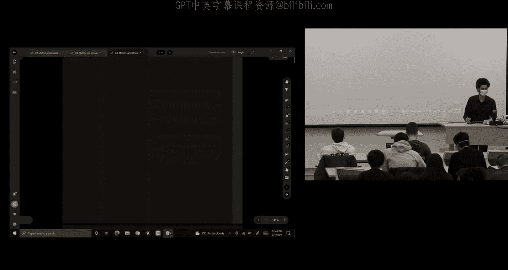

## 非完整约束与建模简化 ⚙️

像Roomba这样的机器人存在“非完整约束”，这意味着它不能瞬时地向任意方向移动（例如，不能直接横向移动）。它必须通过先前进再旋转的组合运动来到达目标点。然而，对于状态估计，我们有一个优势：我们是在机器人执行完命令后去估计其位姿，而不是在命令它如何运动。因此，我们可以忽略这些约束，将机器人视为一个可以在平面上自由移动的刚体，只要其运动速度符合物理实际即可。这简化了我们的模型。

更重要的是，我们选择在机器人本体坐标系下描述运动。机器人作为一个物理实体，其与环境的交互全部发生在本体坐标系中。使用全局坐标系（如世界坐标系）虽然对人类工程师方便，但在数学上会导致描述运动的方程变得非线性且复杂。相反，在本体坐标系下使用指数坐标（李代数），运动方程会呈现出一种“类线性”的特性，这使得后续的不确定性传播变得异常简单。

## 二维刚体与李群 SE(2) 📐

我们的机器人是一个二维刚体。描述其旋转的群是 SO(2)，描述其旋转加平移的群是 SE(2)。SE(2) 中的元素是 3x3 矩阵，形式如下：

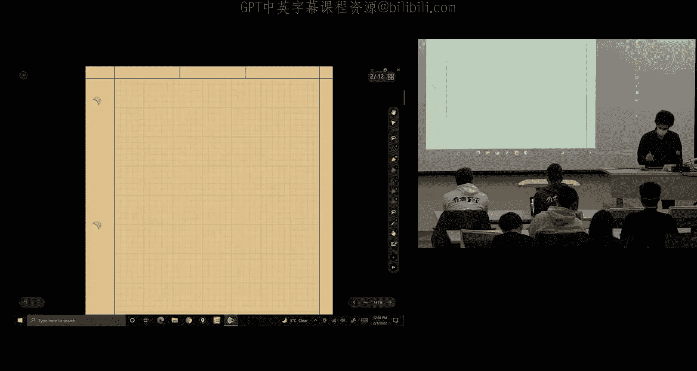

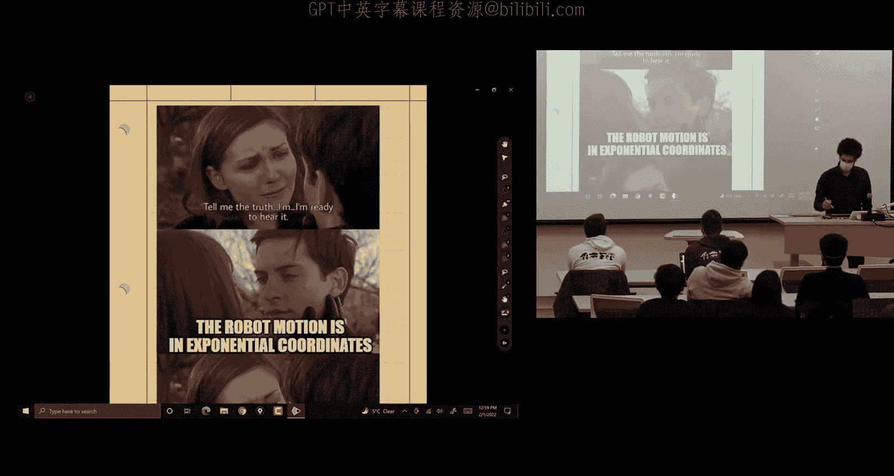

```
X = [ R,   p
      0^T, 1 ]
```

其中 `R` 是一个 2x2 旋转矩阵（属于 SO(2)），`p` 是一个 2x1 平移向量。

对应的李代数 se(2) 元素可以用一个“楔积”运算符表示为 3x3 矩阵：

```
ξ^ = [ ω^, v
       0^T, 0 ]
```

其中 `ω` 是一个标量（角速度），`v` 是一个 2x1 向量（线速度），`ω^` 是 `ω` 对应的 2x2 斜对称矩阵。

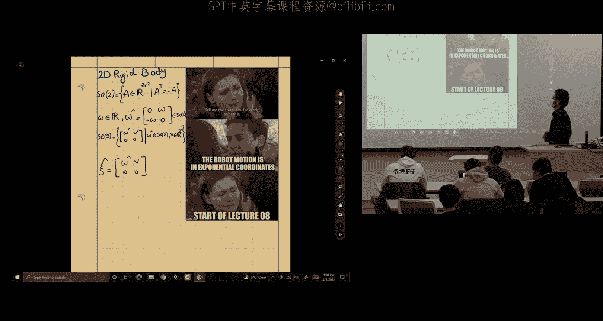

## 确定性运动过程 ⏱️

在离散时间中，机器人的运动过程可以描述为：

`X_{k+1} = X_k * U_k`

其中 `X_k` 是当前位姿（SE(2)矩阵），`U_k` 是从时间 `k` 到 `k+1` 的相对运动增量。这个增量可以通过对本体坐标系下的扭转进行积分得到：

`U_k = exp( (twist_k * Δt)^ )`

这里 `exp()` 是矩阵指数映射，它将李代数中的元素映射回李群中的位姿。

## 定义噪声与误差 🔍

在实际中，运动存在噪声。我们巧妙地将噪声定义在李代数中：

`U_k_noisy = exp( (twist_k * Δt + w_k)^ )`

其中 `w_k` 是一个零均值的三维高斯噪声向量，其协方差为 `Q_k`。这种定义方式非常干净，因为噪声源位于向量空间（李代数）中。

为了进行状态估计和协方差传播，我们需要定义位姿的误差。我们采用“左不变误差”的定义：

`η_k = X_k^{-1} * X̄_k ≈ exp( ε_k^ )`

其中 `X_k` 是真实位姿，`X̄_k` 是估计位姿，`ε_k` 是李代数中的误差向量。这个定义的优点是，无论用哪个全局坐标系作为参考，只要对位姿进行相同的左乘变换，误差值保持不变，这符合我们对一致算法的期望。

## 误差传播与 BCH 公式 📈

我们的目标是找到误差 `ε_k` 如何随时间传播。将带有噪声的运动过程代入误差定义，并利用李群中的伴随（Adjoint）性质来移动矩阵项，我们得到：

`exp( ε_{k+1}^ ) ≈ exp( -Adj(U_k^{-1}) * ε_k^ ) * exp( w_k^ )`

这里出现了两个矩阵指数相乘。为了将它们合并，我们使用 **Baker-Campbell-Hausdorff (BCH) 公式**。当误差 `ε_k` 和噪声 `w_k` 都较小时，BCH公式允许我们进行一阶近似，将指数乘积近似为指数内的和：

`ε_{k+1} ≈ Adj(U_k^{-1}) * ε_k + w_k`

这是一个**线性**的误差传播方程！它描述了上一时刻的误差如何通过相对运动 `U_k` 的伴随矩阵映射，并与当前的运动噪声叠加，得到当前时刻的误差。

## 不确定性（协方差）传播 📊

基于上述线性误差方程，我们可以直接推导协方差的传播公式。假设噪声 `w_k` 的协方差为 `Q_k`，误差 `ε_k` 的协方差为 `Σ_k`，则有：

`Σ_{k+1} = Adj(U_k^{-1}) * Σ_k * Adj(U_k^{-1})^T + Q_k`

这个公式非常优美且强大：
*   **与绝对位姿无关**：不确定性（协方差）的增长只取决于**相对运动** `U_k` 和噪声强度，而与机器人当前在空间中的绝对位置和朝向无关。这非常符合直觉：从A点移动到B点所积累的不确定性，应该只与这段移动本身有关。
*   **在向量空间中运算**：所有运算都在李代数（一个向量空间）中进行，避开了在李群（弯曲空间）中直接处理协方差的复杂性。
*   **伴随矩阵的作用**：`Adj(U_k^{-1})` 充当了一个“基变换”的角色。它将上一时刻的误差协方差从旧的切空间映射到新的切空间（以新位姿为基准），以便与当前时刻的噪声协方差正确相加。

## 伴随矩阵的计算 🧮

对于 SE(2) 和 SE(3)，伴随矩阵有具体的矩阵形式。对于 SE(3)，如果扭转表示为 `ξ = [ω, v]^T`（6维向量），位姿为 `X = [R, p; 0^T, 1]`，则其伴随矩阵为：

```
Adj(X) = [ R,   0
           p^ R, R ]
```

这是一个 6x6 的矩阵。它精确地描述了如何将一个坐标系下的扭转映射到另一个坐标系下，包含了旋转以及由旋转中心偏移引起的线速度分量。

## 总结 🎯

本节课中我们一起学习了：
1.  **机器人运动学建模**：我们将机器人视为刚体，在其本体坐标系下使用扭转来描述运动。
2.  **指数坐标的优势**：使用李群 SE(2)/SE(3) 和李代数 se(2)/se(3) 来描述位姿和运动，能将复杂的非线性运动在误差层面转化为近似线性的关系。
3.  **左不变误差**：定义了与参考系选择无关的位姿误差，为一致性估计奠定了基础。
4.  **BCH 公式与线性近似**：利用 BCH 公式，在小误差假设下，得到了李代数空间中线性的误差传播方程。
5.  **不确定性传播公式**：推导出了清晰的不确定性（协方差）传播方程 `Σ_{k+1} = Adj(U^{-1}) Σ_k Adj(U^{-1})^T + Q`。该公式表明不确定性增长只与相对运动和过程噪声有关，这是一个非常有力且符合物理直觉的结果。

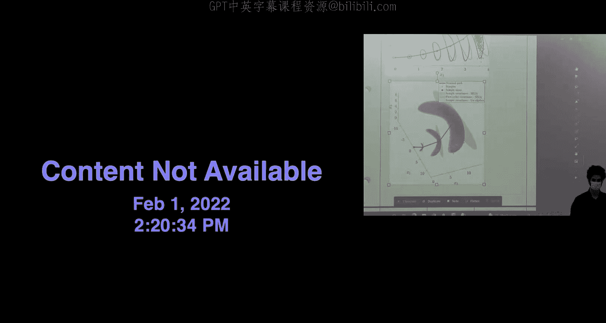

这种方法为后续在复杂运动场景下进行鲁棒的状态估计（如卡尔曼滤波）提供了强大的理论工具。在接下来的课程中，我们将探索如何利用这些坐标进行具体的状态估计算法设计。