# 015：优化与平滑 II 🧮

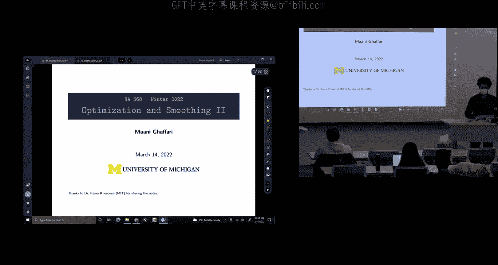

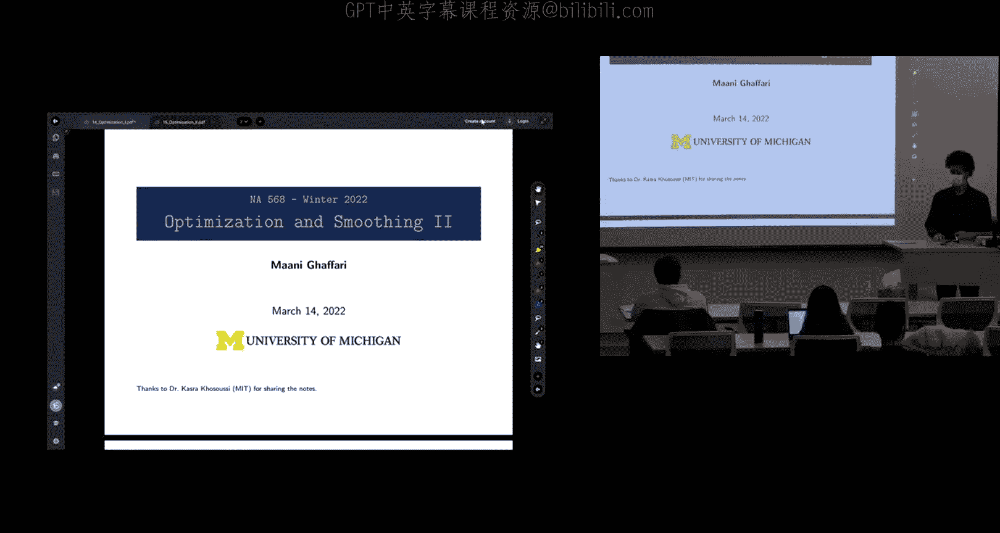

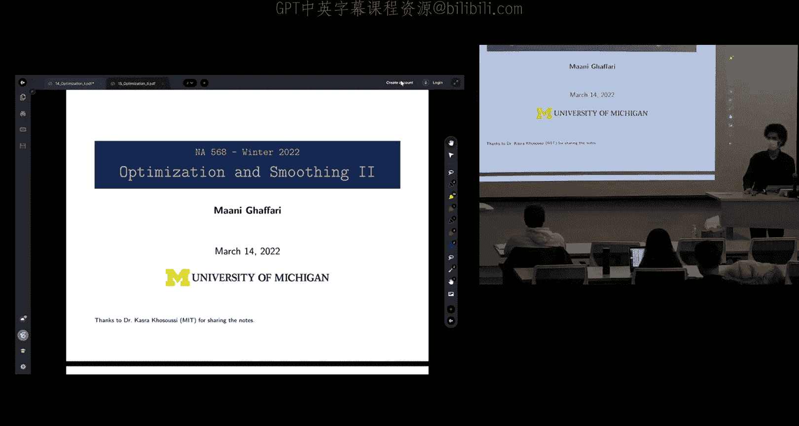

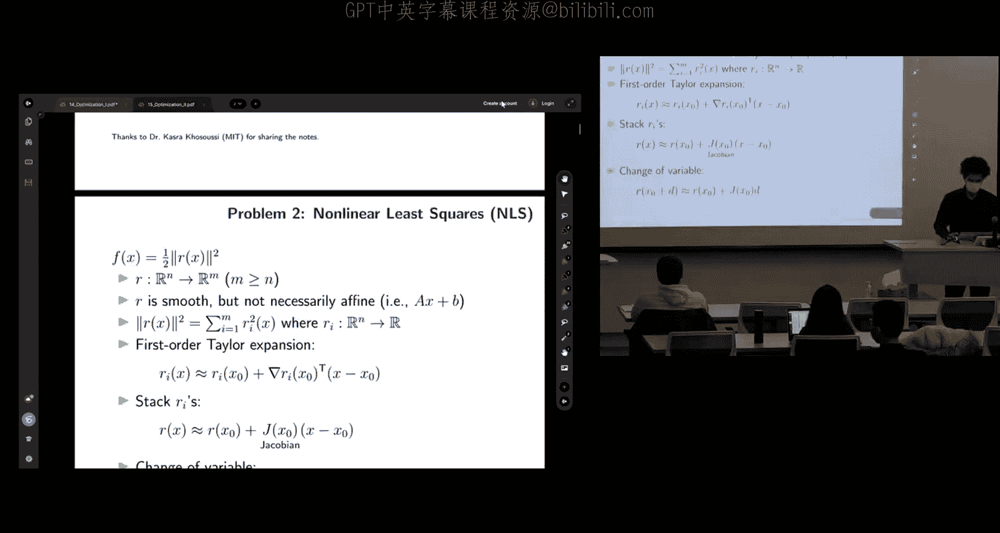

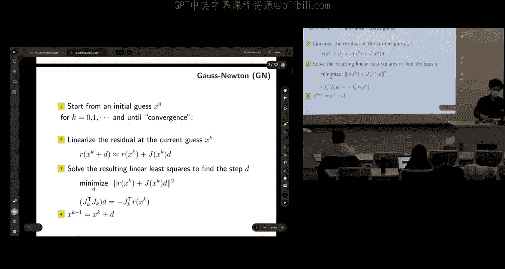

在本节课中，我们将要学习优化与平滑的进阶内容。我们将从非线性最小二乘问题出发，探讨当目标函数不是最小二乘形式时该如何处理，并介绍一种名为迭代重加权最小二乘（IRLS）的新算法。接着，我们将讨论鲁棒估计中的M估计方法。最后，我们将学习如何在流形，特别是李群上进行优化。

---

## 回顾：非线性最小二乘问题 🔄

上一节我们介绍了非线性最小二乘问题。其目标函数是残差向量的欧几里得范数平方。残差是一个从输入空间到向量空间的映射。由于残差通常是非线性的，我们采用了高斯-牛顿算法：在当前迭代点对残差进行线性化，得到一个仿射近似，然后求解这个线性最小二乘问题，更新变量，并迭代直到收敛。

高斯-牛顿算法的核心思想是：当问题非线性时，线性化并迭代。其基本形式易于实现：设置一个循环，当梯度（即雅可比矩阵转置乘以残差）的范数为零时，我们满足最优性必要条件，可以停止迭代。

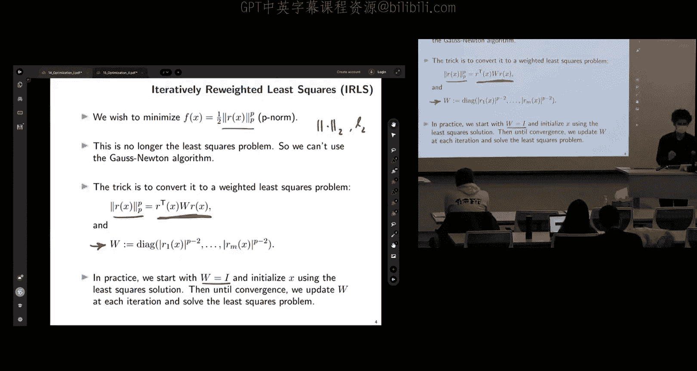

---

## 从L2范数到P范数 📈

一个自然的问题是：如果目标函数使用的不是欧几里得范数（L2范数）怎么办？根据具体问题，我们可能选择其他范数。例如，我们可以使用P范数，其定义为对每个残差项的绝对值取P次幂，求和后再取1/P次幂。

当P不等于2时，这就不再是最小二乘问题，我们无法直接使用高斯-牛顿算法。虽然可以使用通用的非线性求解器，但它们无法像高斯-牛顿那样利用问题的特殊结构（通过雅可比矩阵近似海森矩阵，获得类似二阶求解器的效果）。

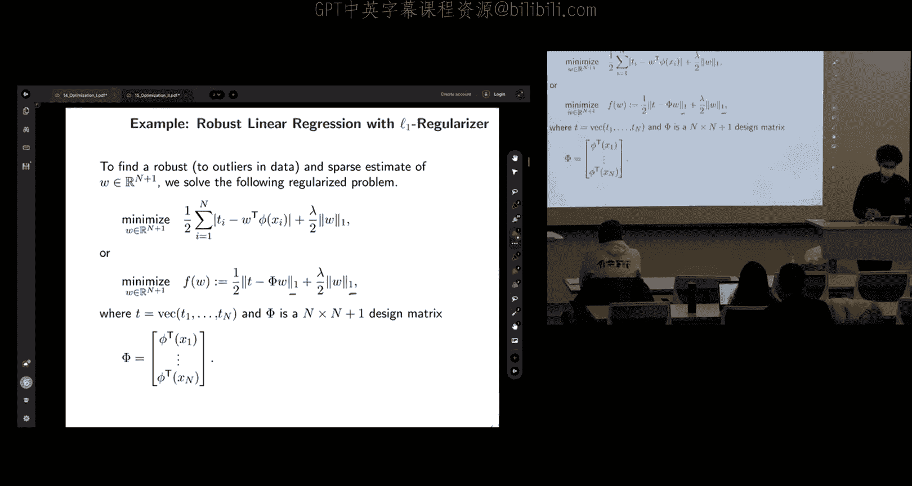

---

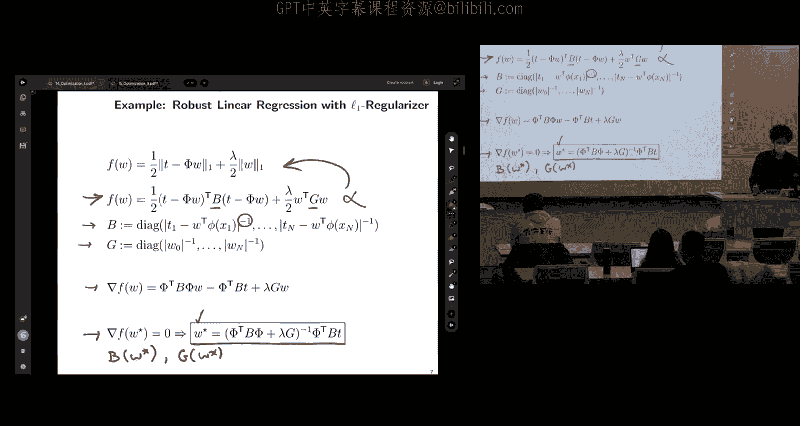

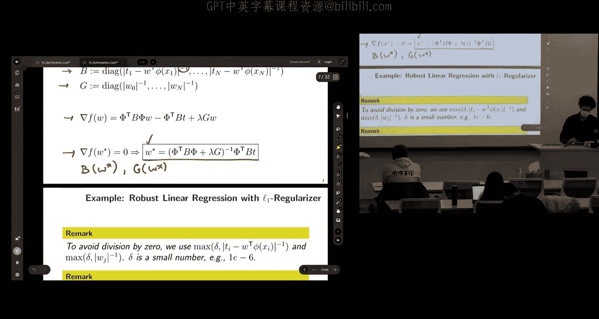

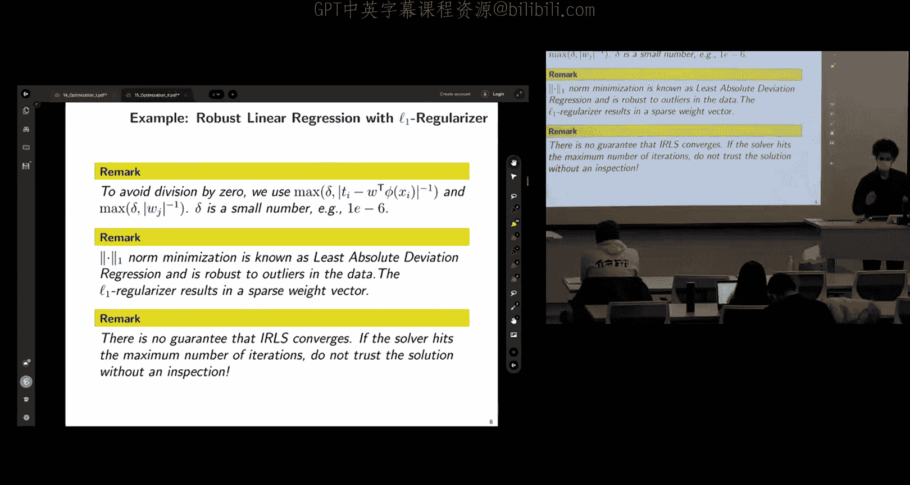

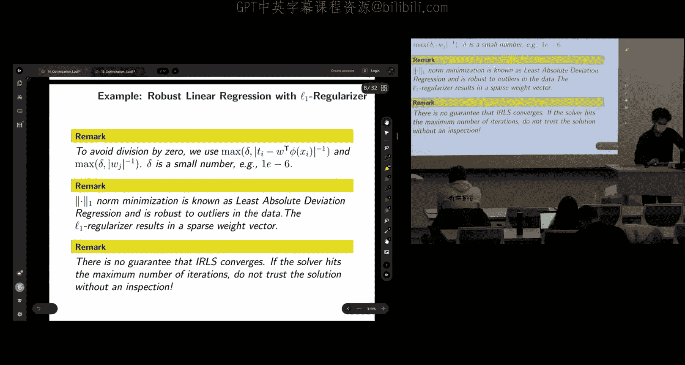

## 迭代重加权最小二乘（IRLS）算法 ⚙️

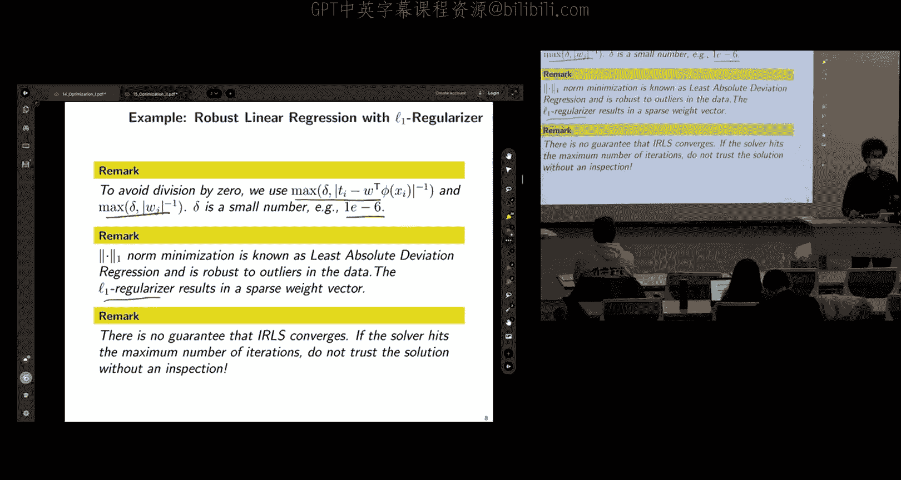

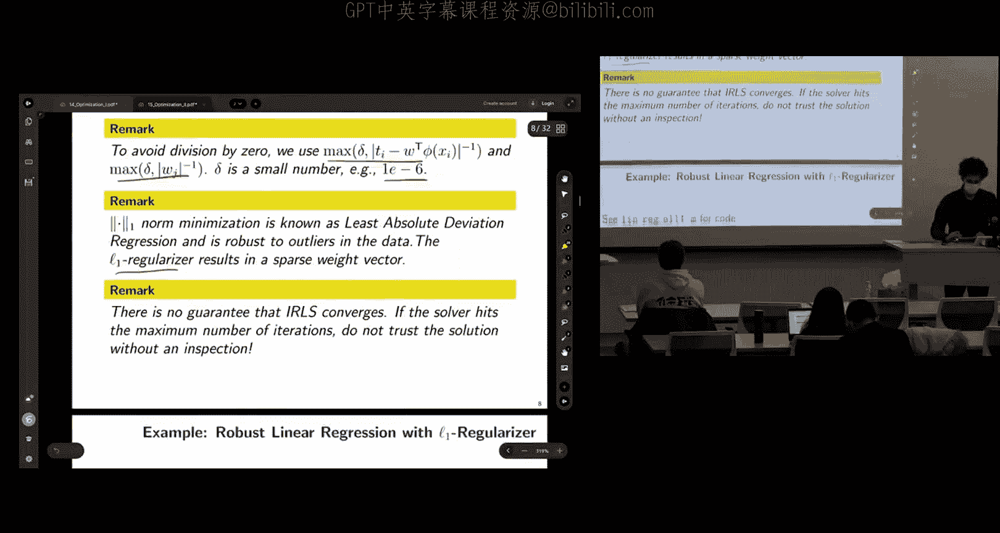

历史上（大约在20-30年前），一种常见的技巧是将P范数最小化问题转化为加权最小二乘问题。具体做法是重新定义优化问题，引入一个权重矩阵。这个权重矩阵是对角阵，其对角线元素是每个残差绝对值的(P-2)次幂。

这样，当权重固定时，问题就变成了一个加权最小二乘问题，易于求解。关键在于，权重本身依赖于残差，而残差又依赖于解。因此，IRLS算法在固定权重求解最小二乘问题和根据新解更新权重之间交替进行。这就是“迭代重加权”的由来。

这是一个实用的技巧，虽然没有严格的理论保证，但在机器人学（如鲁棒优化）等领域有广泛应用。实践中，可以从单位权重开始，求解最小二乘问题得到初始猜测，然后迭代直至收敛。

**注意**：即使残差本身是线性的，只要范数是P范数（非L2），IRLS仍然需要迭代。

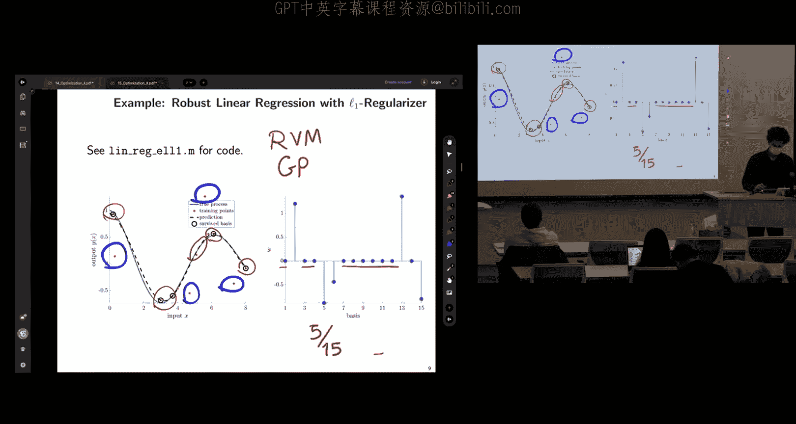

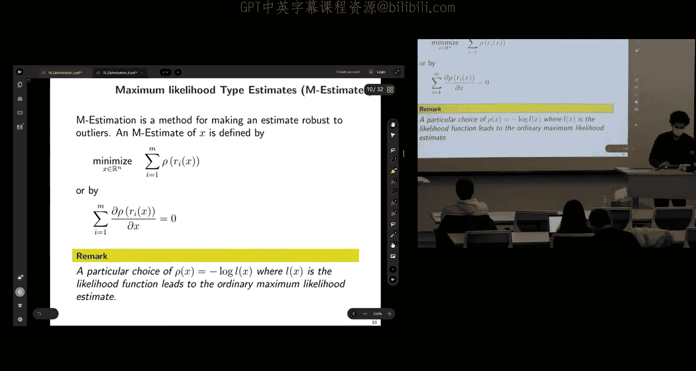

---

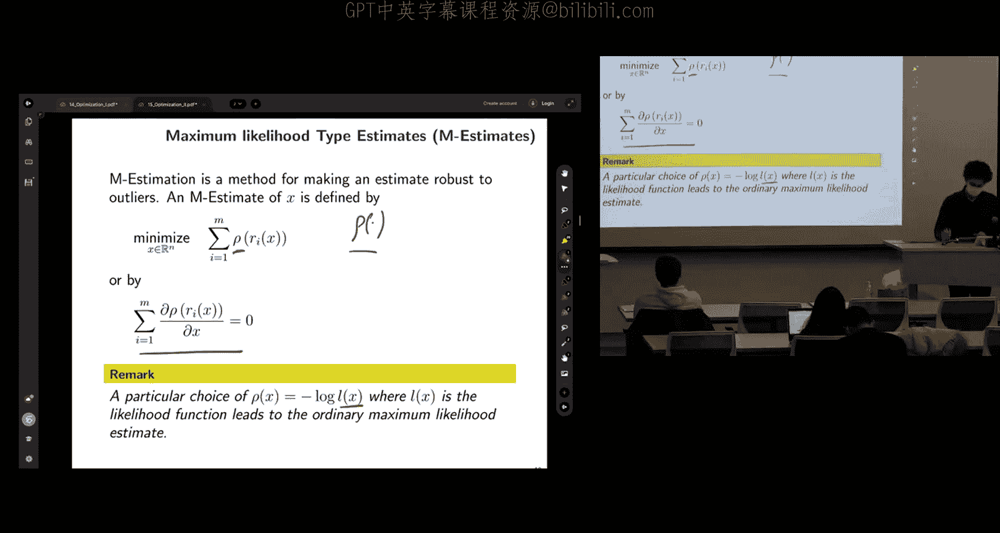

## 示例：L1范数线性回归与鲁棒估计 🛡️

让我们回到线性回归的例子。假设数据中存在**离群值**——这些数据点不符合潜在的趋势，会严重干扰估计结果。处理离群值在实践中非常重要。

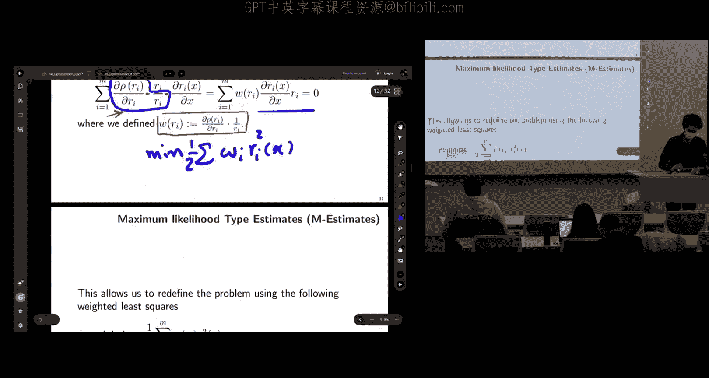

模型本身不变，我们仍然使用带高斯基的线性模型。改变的是**目标函数**：我们将L2范数替换为L1范数。L1范数（也称为曼哈顿距离）传统上用于鲁棒优化，因为它倾向于忽略离群值。此外，L1范数还能促进解的稀疏性（许多权重会趋于零），这在稀疏编码等领域很有用。

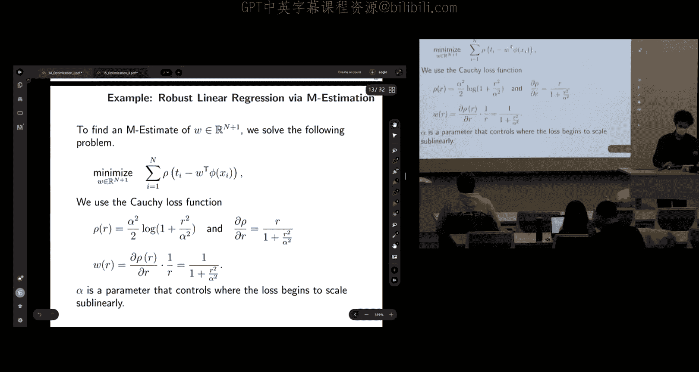

目标函数变为最小化L1范数下的残差。这不是最小二乘问题，但我们可以使用IRLS将其转化为加权最小二乘问题。对于L1范数（P=1），权重矩阵是残差绝对值的倒数（即P-2 = -1）。求解过程涉及设置两个新的权重矩阵，计算梯度，并找到最优解。然后，用新的解重新计算残差和权重，进行下一次迭代。

**实现注意**：当残差接近零时，权重计算会出现除以零的问题。实践中，我们通常设置一个小的阈值（如 `max(|残差|, δ)`）来保证数值稳定性。

L1范数最小化也称为**最小绝对偏差回归**，它对离群值鲁棒并能促进稀疏性。IRLS不一定保证收敛，因此我们通常设置最大迭代次数，并需要检查解的正确性。

在示例中，使用L1回归后，许多权重变为零，我们只使用了少量基函数来估计趋势，同时自动忽略了离群值。这展示了范数选择如何显著改变求解器的行为。

---

## M估计：鲁棒估计的一般框架 🧰

L1回归只是鲁棒估计的一个例子。更一般的一类方法是**M估计**（“M”代表最大似然型估计）。其思想是用一个鲁棒核函数（或称为损失函数）来“包裹”残差，而不是直接使用残差的平方和。

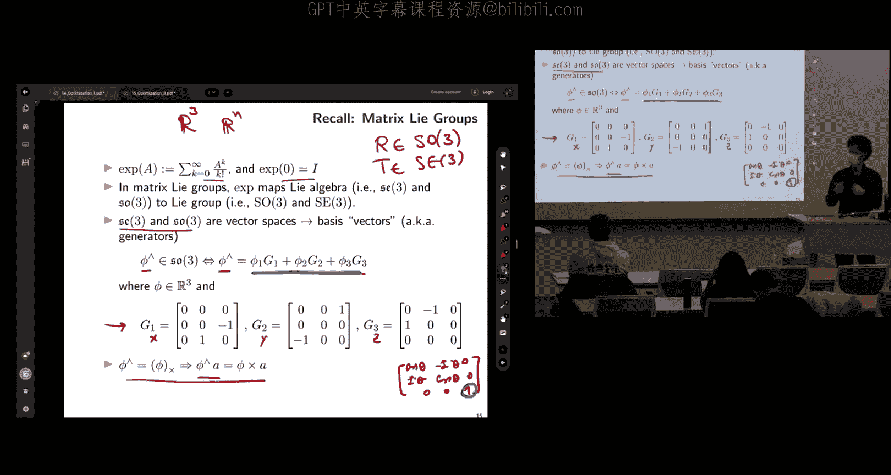

在最大似然估计的背景下，如果我们假设噪声为高斯分布，取负对数似然就会得到最小二乘问题。但当存在离群值时，这可能不是最佳选择。M估计使用一个对离群值鲁棒的核函数 `ρ(·)` 来构造新的目标函数。

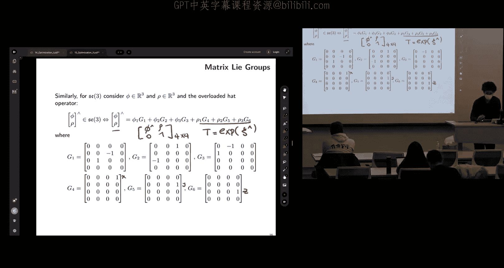

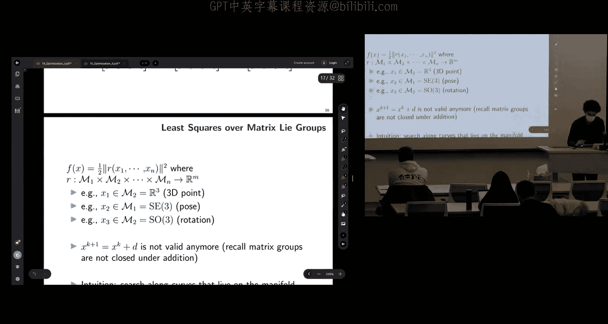

通过计算新目标函数关于决策变量的梯度（应用链式法则），并设其为零，我们可以得到最优性条件。经过一些代数变换，这个条件可以写成一个**加权最小二乘**问题的形式，其中权重依赖于残差和核函数 `ρ` 的导数。

因此，M估计问题最终也归结为一个权重不固定的加权最小二乘问题，我们可以用**IRLS算法**来求解。权重的具体形式由核函数 `ρ` 决定：`权重 = ρ‘(残差) / 残差`。

---

## 示例：柯西损失函数 📉

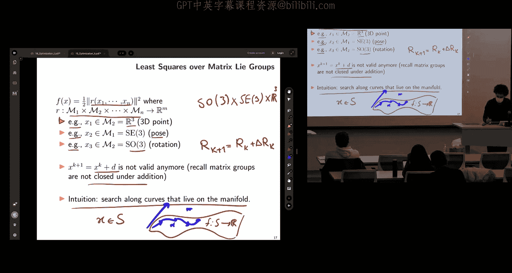

一个常见的选择是**柯西损失函数**。它的形式是 `ρ(r) = log(1 + (r/α)^2)`，其中 `α` 是一个可调超参数。其导数很容易计算，从而得到IRLS中所需的权重。

直观上，L2损失（二次函数）会随着残差增大而急剧增加，导致离群值的梯度主导整个优化过程。鲁棒核函数（如柯西损失）的作用是“弯曲”或“截断”二次函数的增长，使得当残差超过某个由 `α` 控制的阈值后，其对目标函数的贡献不再急剧增加，从而被优化器忽略。

使用柯西损失的M估计目标不再是促进稀疏性，而是专注于鲁棒性，所有权重通常都是非零的。当然，你也可以额外添加正则化项来同时获得稀疏性。

---

## 李群上的优化 🌀

在机器人状态估计中，我们经常需要估计位姿（旋转或刚体变换），这些变量是**李群**的元素（如旋转矩阵）。如果状态是欧几里得空间中的点，我们已经知道如何优化。但当决策变量是李群元素时，情况就不同了。

回顾一下，矩阵李群是一组可逆矩阵，在矩阵乘法下构成群。李代数是对应李群在单位元处的切空间，它是一个向量空间。指数映射将李代数中的元素映射到李群中。

关键问题是：李群对加法不封闭（旋转矩阵相加不一定还是旋转矩阵），但对乘法封闭。因此，在优化迭代中，我们不能简单地使用 `R_{k+1} = R_k + ΔR` 来更新。我们必须尊重李群的乘法结构。

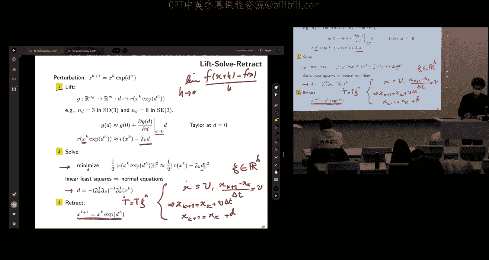

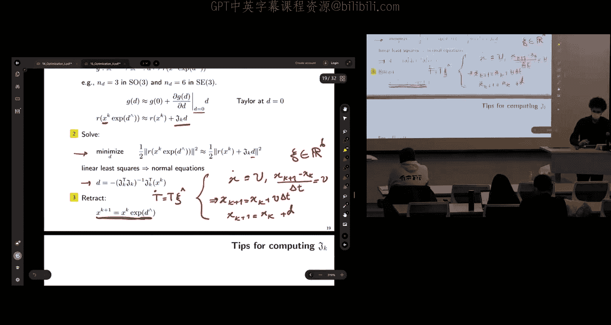

---

## 流形优化框架：提升、求解、收回 📤➡️🧮➡️📥

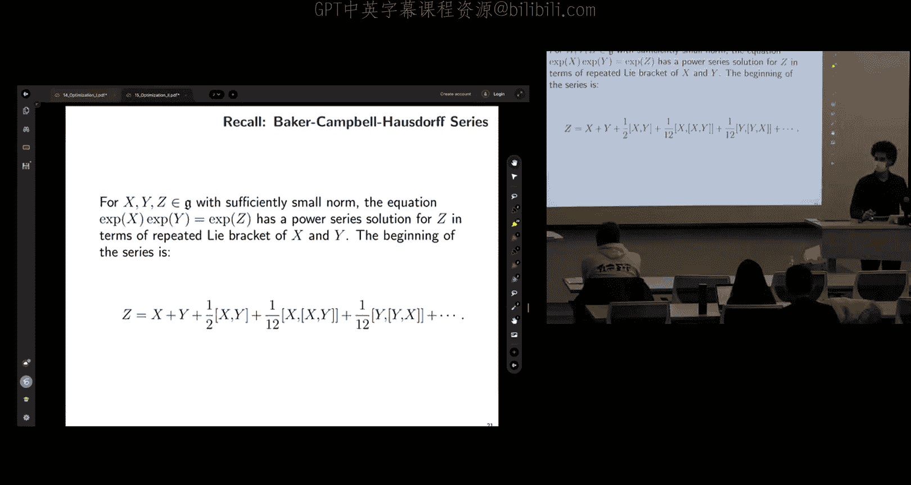

解决李群优化问题的一般框架称为**提升、求解、收回**。

1.  **提升**：由于直接在流形上求解困难，我们将问题“提升”到李代数（切空间）中。我们通过在当前点 `X_k` 处乘以一个李代数中小扰动 `d` 的指数来参数化扰动：`X_{k+1} = X_k · exp(d)`。然后，我们对残差在这个扰动 `d` 处（在 `d=0` 点）进行线性化，得到雅可比矩阵。
2.  **求解**：在向量空间（李代数）中求解线性化后的最小二乘问题，得到最优扰动 `d*`。
3.  **收回**：将解“收回”到流形上。对于李群，收回映射就是指数映射：`X_{k+1} = X_k · exp(d*)`。对于欧几里得变量，则简单相加。

这个框架允许我们利用线性代数的工具（高斯-牛顿等）来解决李群上的非线性优化问题。雅可比矩阵的计算通常利用指数映射的一阶近似和链式法则，有时比在欧氏空间中直接求导更结构化、更简单。

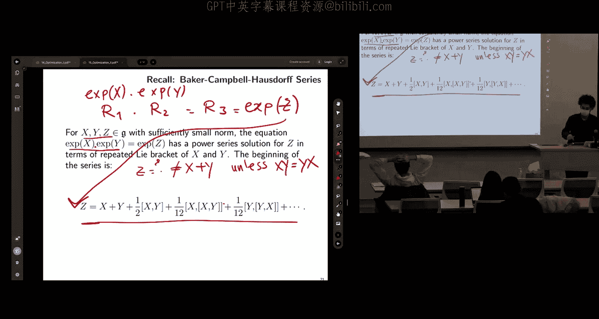

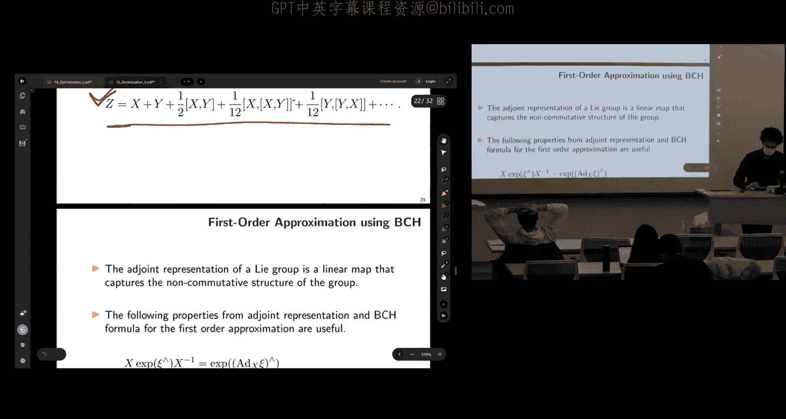

---

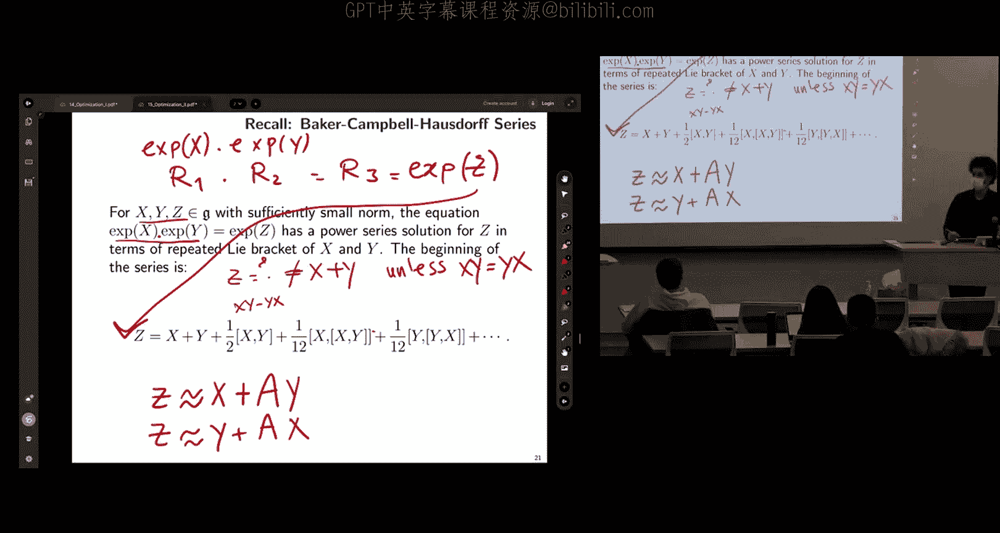

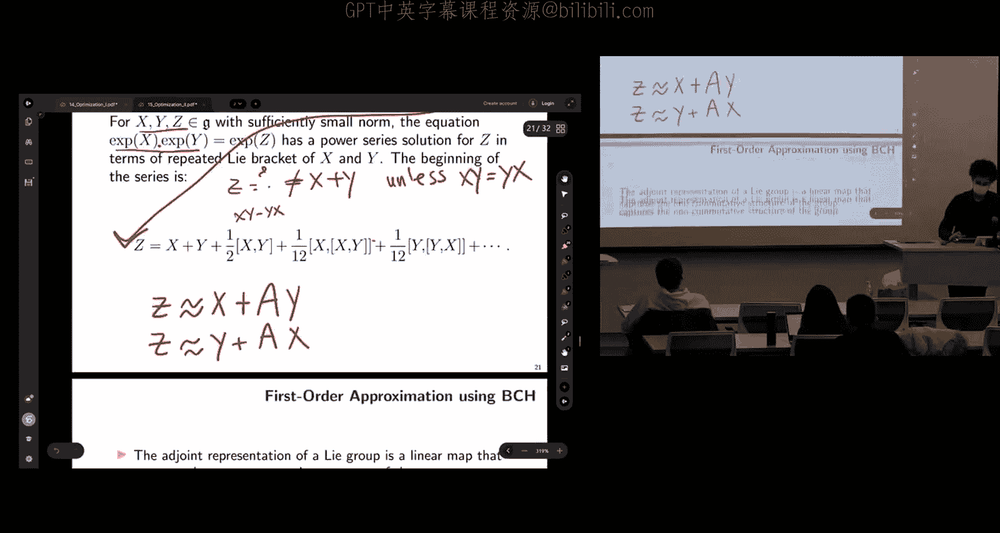

## 李群线性化与BCH公式 ➕

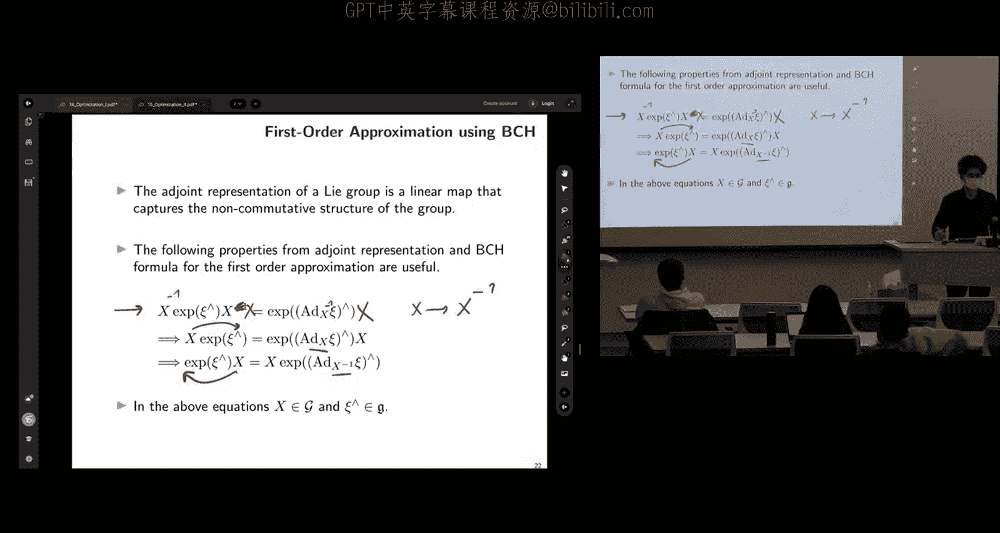

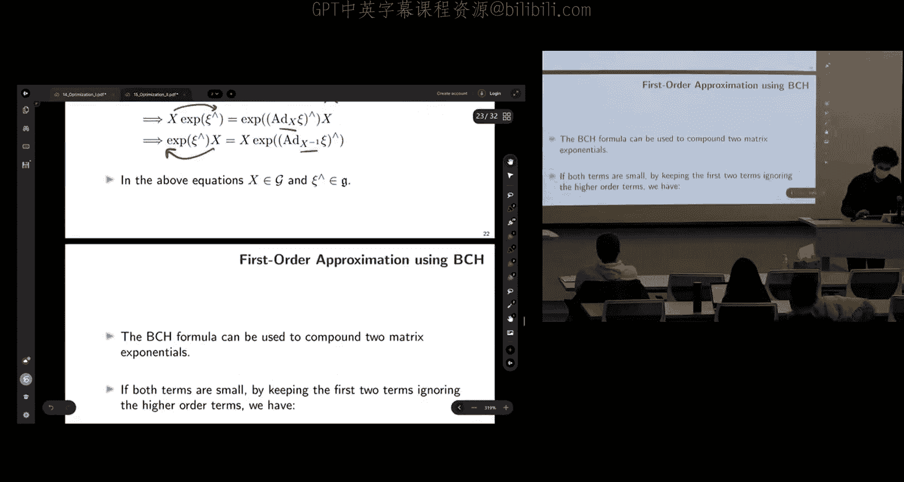

线性化涉及处理像 `exp(A)exp(B)` 这样的乘积。对于矩阵，`exp(A)exp(B) ≠ exp(A+B)`，除非 `A` 和 `B` 可交换。一般的公式由**Baker-Campbell-Hausdorff（BCH）公式**给出，它是一个无穷级数。

幸运的是，在优化中，我们的扰动 `d` 总是很小的。当两个指数因子中有一个是小量时，BCH公式可以简化。这导出了**左雅可比**和**右雅可比**矩阵，它们有闭式解（对于SO(3)和SE(3)已知）。这些雅可比矩阵使我们能够将群乘法线性地近似为李代数中的加法。

---

## 应用示例：位姿图优化（SLAM后端）🗺️

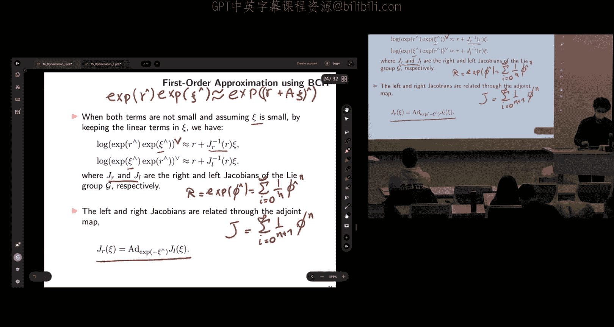

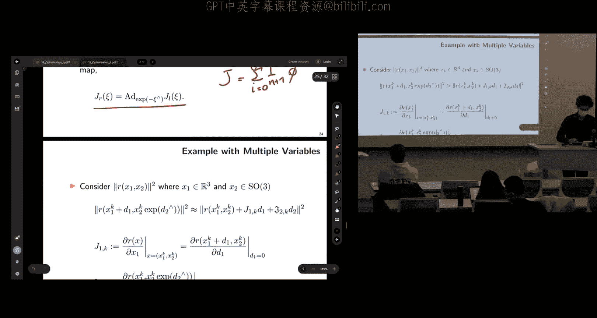

一个重要的应用是**位姿图优化**，这是同步定位与建图（SLAM）的后端核心。我们有一系列机器人位姿（关键帧）作为图节点。连续关键帧之间的相对运动估计（来自里程计等）以及非连续的关键帧之间的闭环检测，构成了图的边。

每条边提供一个相对位姿测量 `Z_{ij}`，它应该满足 `X_j = X_i · Z_{ij}`。考虑到噪声，我们定义残差为 `r_{ij} = log( (Z_{ij})^{-1} · X_i^{-1} · X_j )`，理想情况下应为零。

为了优化所有位姿 `{X_i}` 以最小化所有残差的平方和，我们使用上述李群优化框架。对每个位姿变量进行扰动（例如从右侧扰动），利用伴随表示和BCH公式进行线性化，最终得到关于所有李代数扰动向量 `{d_i}` 的线性最小二乘问题。求解后，用指数映射更新位姿，并迭代。

现代SLAM库（如g2o, GTSAM）的后端就是基于这种图优化原理。前端负责从原始数据（图像、激光等）中检测特征、跟踪并建立这个图（包括检测闭环），后端则负责求解这个优化问题。

---

## 另一个示例：点云配准 ☁️↔️☁️

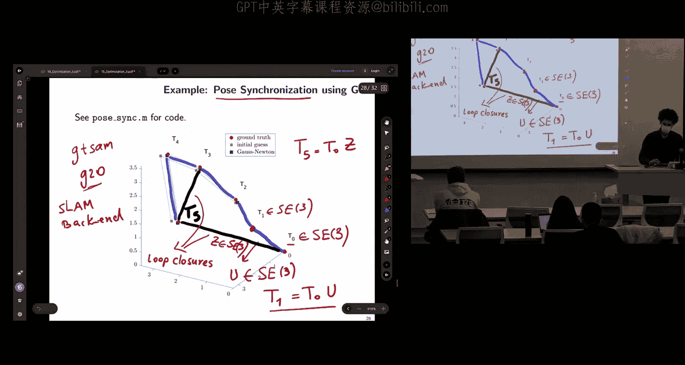

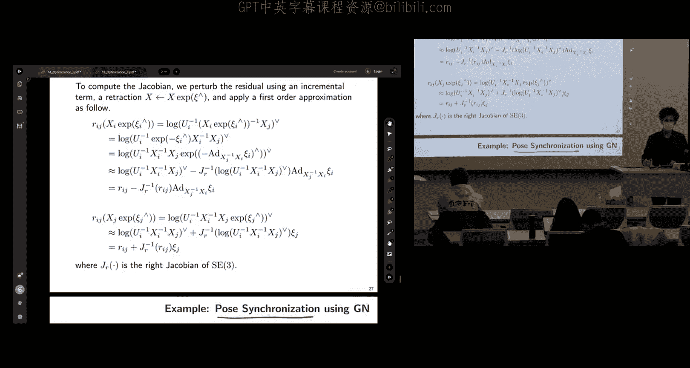

点云配准是另一个经典问题：给定两个点云 `{x}` 和 `{y}`，寻找一个刚体变换 `T`，使得变换后的 `y` 点云与 `x` 点云对齐。目标函数是最小化对应点之间的距离平方和。

这本质上是一个关于 `T` （属于SE(3)）的最小二乘问题。为了使用高斯-牛顿法，我们需要计算残差关于 `T` 的雅可比矩阵。通过从左侧扰动 `T` （`T <- exp(d) · T`），并利用指数映射的一阶近似，我们可以分离出残差和雅可比矩阵项。经过代数运算，可以得到一个3x6的雅可比矩阵，从而线性化问题并求解。

这种方法避免了复杂的微积分，主要依靠代数和指数映射的近似，通常更为简洁优雅。

---

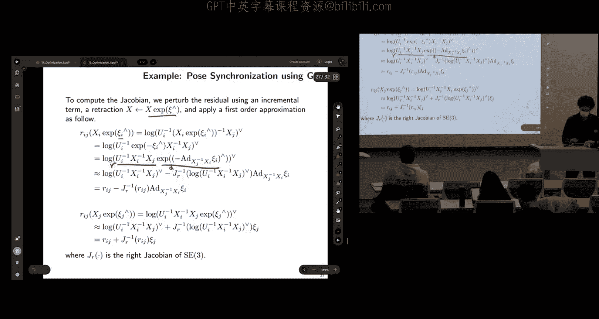

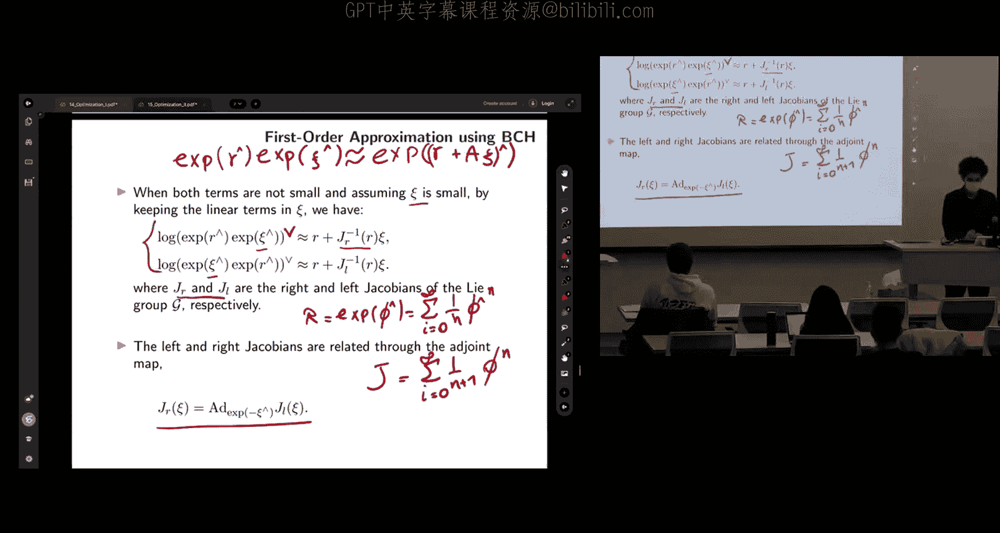

## 总结 📚

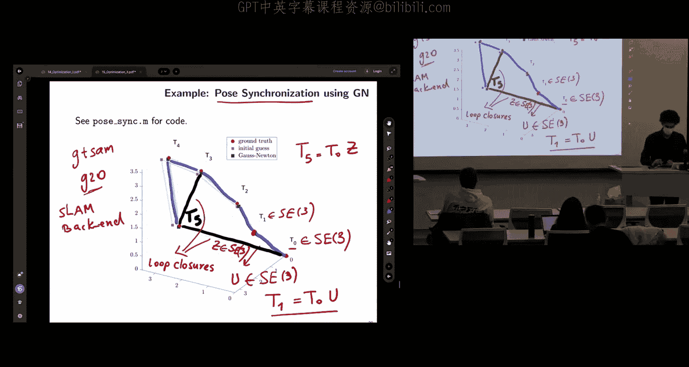

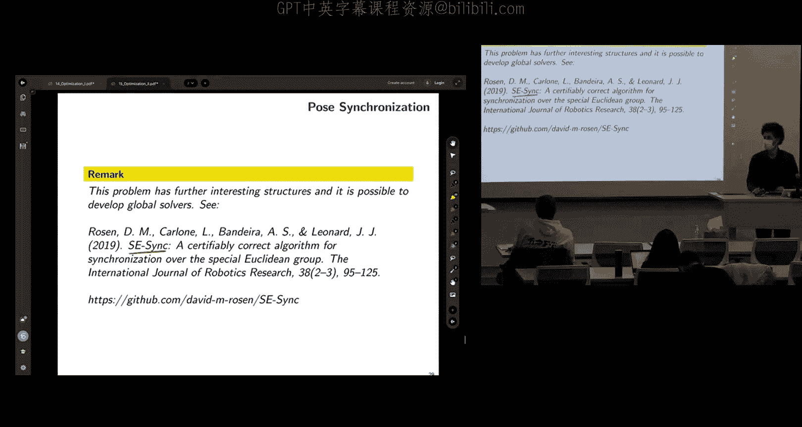

本节课我们一起学习了优化与平滑的进阶主题：

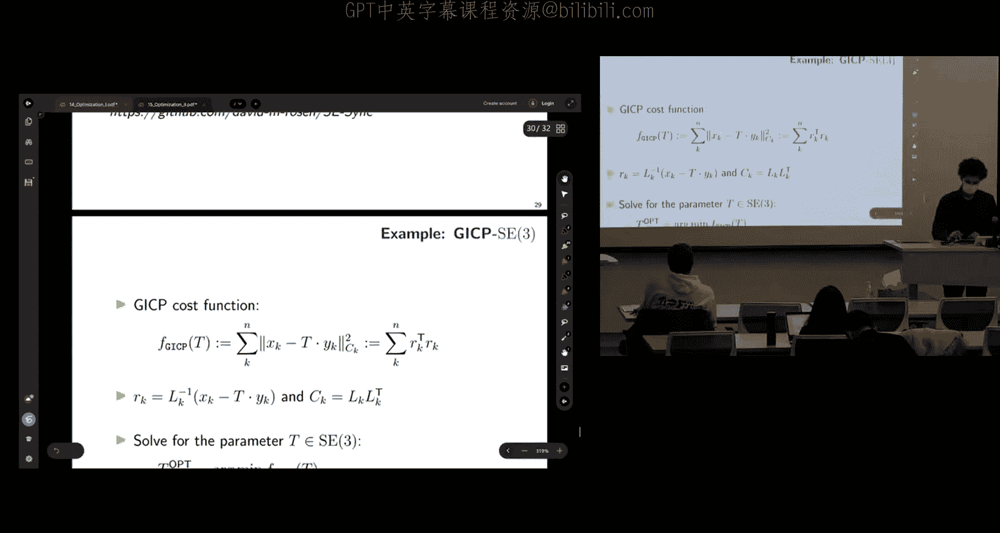

1.  **迭代重加权最小二乘**：一种通过交替求解加权最小二乘和更新权重，来解决一般P范数最小化问题的实用算法。
2.  **鲁棒估计与M估计**：通过使用鲁棒核函数（如L1范数、柯西损失）构造目标函数，使估计对数据中的离群值不敏感。M估计问题可以转化为加权最小二乘，并用IRLS求解。
3.  **李群上的优化**：当决策变量属于李群（如旋转矩阵）时，我们不能直接使用向量加法更新。通过“提升-求解-收回”框架，我们将问题线性化到李代数（向量空间）中求解，再利用指数映射将解收回流形。这为机器人学中的位姿图优化、点云配准等问题提供了强大的解决工具。

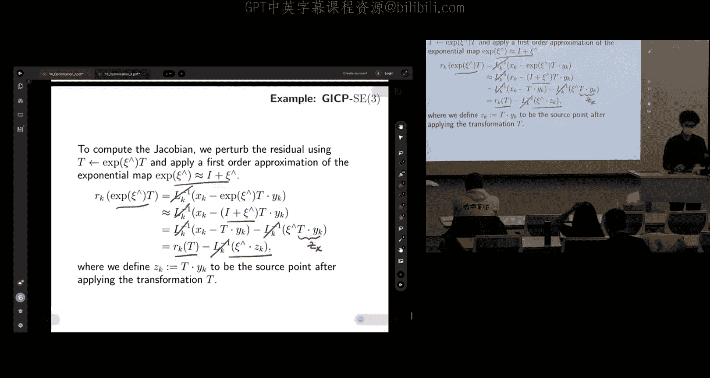

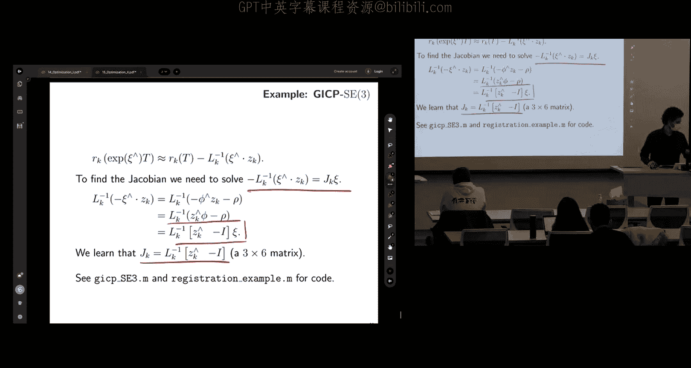

这些方法构成了现代移动机器人状态估计、SLAM等核心算法的基础。理解它们有助于你深入使用相关库（如g2o, Ceres）并推动算法前沿。