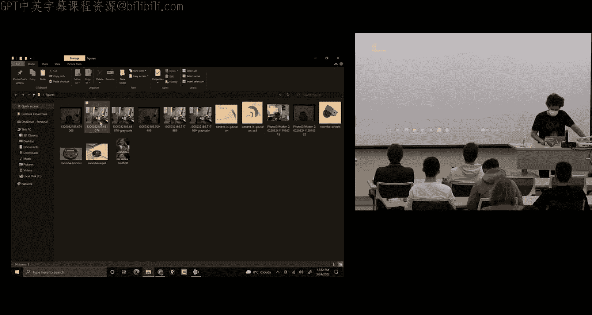
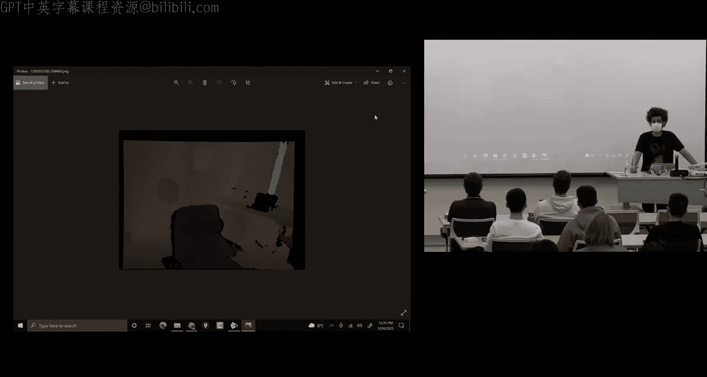
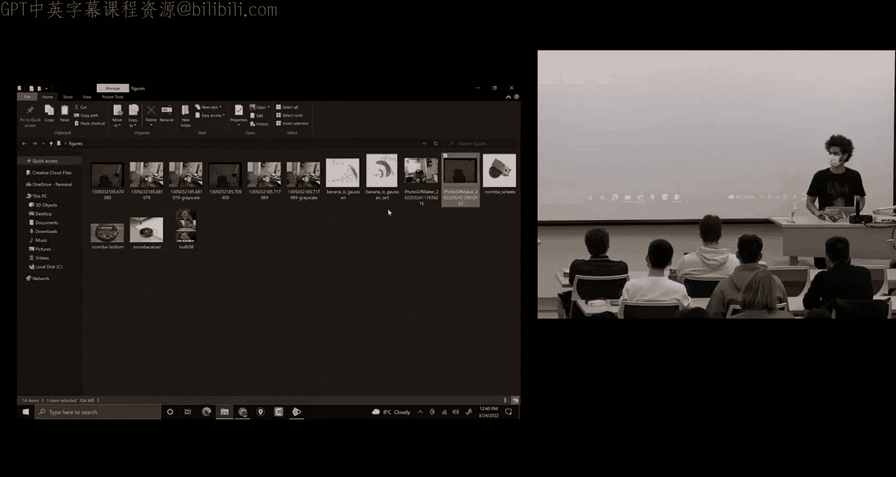
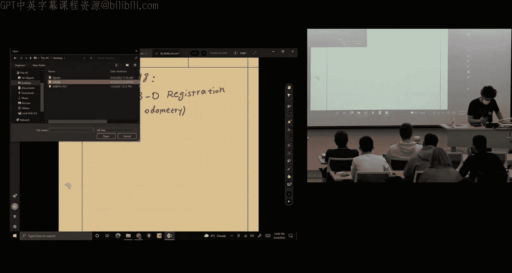
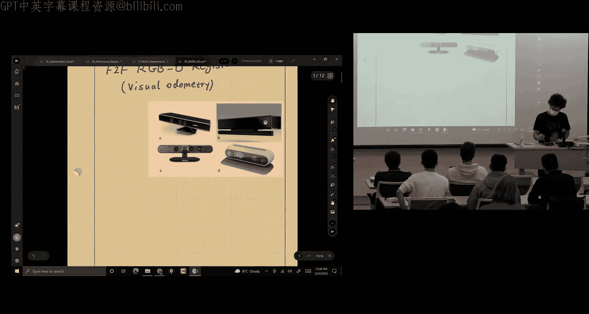
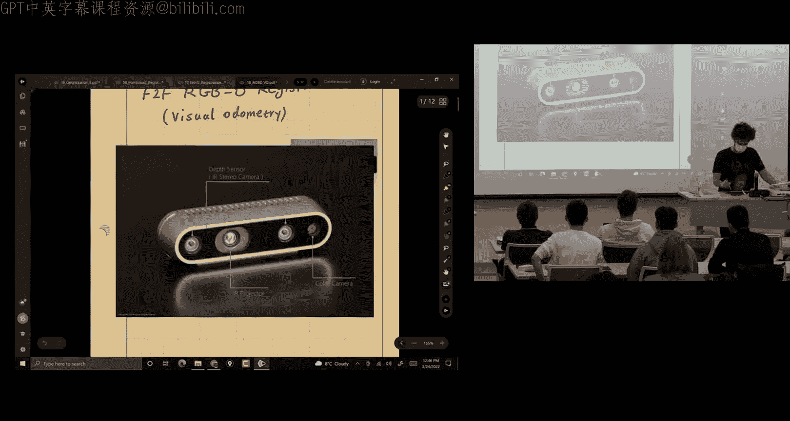
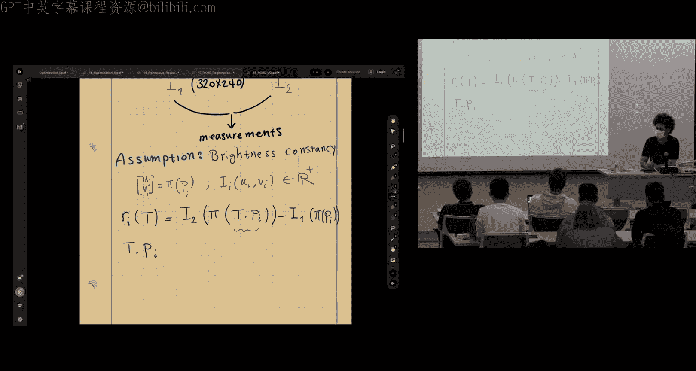
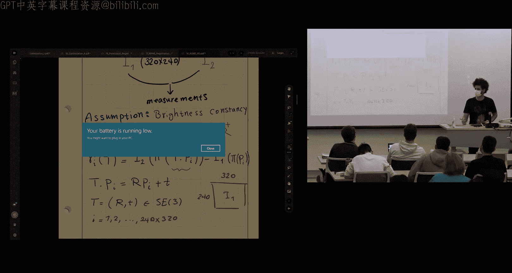
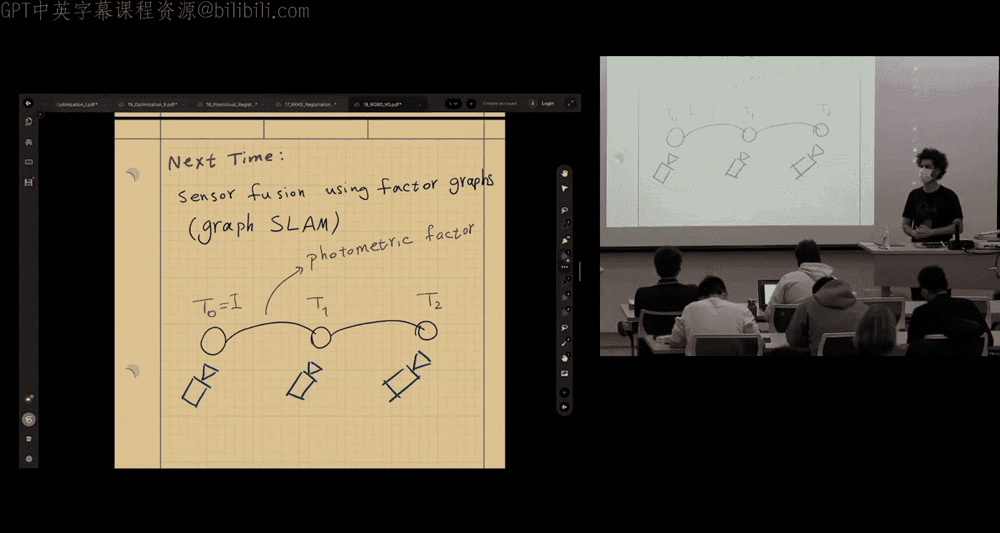

# 018：RGB-D视觉里程计

在本节课中，我们将学习RGB-D视觉里程计。我们将了解如何使用一种深度相机，它能够提供RGB图像形式的测量值，以及另一幅图像形式的深度图，该深度图告诉你每个像素到相机镜头的距离。然后，我们可以结合这些信息，构建带有颜色信息的点云。我们将探讨如何使用这种相机来重建场景。为此，我们需要随时间追踪相机的位姿。这就是视觉里程计的范畴，它可以使用单目相机、立体相机或RGB-D相机来完成。

我将使用TUM RGB-D数据集中的一个例子进行说明。

首先，这是一个房间，你可以看到一只泰迪熊。数据集中有很多序列，但这个特定序列是围绕泰迪熊移动的。我们的目标是重建这只熊。

如图所示，图像是模糊的，这是一个问题，因为这台特定的相机使用了卷帘快门。当相机移动时，快门也在移动以捕捉场景，这导致了运动模糊。据我们所知，这最好被理解为沿时间通道的卷积。因此，这导致了运动模糊，进而使得将当前图像与下一帧图像配准以找出相机位姿变得困难。

我们确实有全局快门的相机，显然这更受青睐，因为它们在一个瞬间捕捉整个图像。这样，你就不会像这里看到的那样出现那么多运动模糊。这是一个深度图的例子。你需要一个比例尺来知道实际的度量值，但基于图像，你可以看出泰迪熊离相机更近，所以较暗的值离相机更近，较亮的像素则更远。

这完美吗？很难说。由于现场光线等原因，在课堂上可能很难看清。但这远非完美，因为有些像素缺失了某些形状的边界。例如，你可以看到这里有一台笔记本电脑，但其形状与我们在图像中看到的并不完全一致，这是一个问题。

并非所有像素都有精确的深度值，有时我们处理的是缺失的深度值。

这是一个视频，一个GIF图像，播放了相机记录的所有图像。这展示了相机在房间中的移动方式。这是六自由度运动：相机可以滚动、俯仰、偏航，以及XYZ方向的移动。我们可以看到它可以放大、缩小。所有这些运动可以同时进行。因此，你移动得越快，看到的运动模糊就越多，配准也就越困难。连续图像之间的重叠越多，问题就越容易解决，因为我们求解的是较小的运动；移动越快，挑战就越大，有时甚至变得无法追踪，这时我们可能需要依赖互补传感器来估计相机运动。

例如，现代相机带有IMU，你可以将IMU与图像信息融合，以获得视觉惯性里程计。另一个你可能注意到的点是，虽然有人站在那里，但环境是静态的。如果物体在移动，相机也在移动，这将使问题变得更加困难，因为我们不知道物体的运动信息，也不知道相机的运动信息。我们需要其中一个作为参考来估计另一个，如果两者都未知，那就非常具有挑战性。

我们可以在相机移动时追踪相机帧中的物体，但这将是相对的。一个想法是，如果你能检测到图像的动态部分并将其移除，那么也许你可以使用静态部分来解决问题。这是一个显而易见的想法：丢弃动态信息。更具挑战性的是，如何实际利用场景的动态性来改善你的追踪，但这是一个更难解决的问题。

现在，你在这里看到的深度视频是针对相同的图像。然而，我们购买的相机有两个不同的传感器来获取RGB数据和深度数据，这两个传感器不一定完美地共位。它们位于相机上的某个位置，这些图像没有完美地校正，它们不在同一个坐标系中。我们不会深入探讨如何进行这种低层信号处理。

幸运的是，当你购买这类相机时，通常它们会附带驱动程序。驱动程序通常由制造商或像你一样的人开发，他们坐下来构建驱动程序并通常使其开源，这样我们就可以使用它。它可能是一个ROS包、LCM包或其他可以在你的操作系统上运行的软件。

然后，我们得到的是已配准的深度和图像数据。首先，它们是同步的。它们不一定同步。想象一下RGB传感器的频率与深度传感器不同。一旦我们配准它们，我们就可以得到同步的深度和RGB图像。并且，可能通过工厂提供的固有校准，你可以获得点云。如果需要，我们可能需要重新校准相机的内参。

但是，当你第一次处理问题时，你可以使用通常附带校准参数和所有预处理的数据集，使用提供的工具。这是一个专注于算法方面的好方法，之后如果你感兴趣，可以深入研究这些部分。

有了这些，让我们开始看看如何共同构建一个公式化的问题。

我想构建问题的方式是使用非线性最小二乘法。之所以是非线性的，是因为我们会看到它最终是非线性的。我们将尝试提出想法，看看如何构建一个最小二乘问题来通过配准两个连续图像找到这个相机位姿。从某种意义上说，这是帧到帧的RGB-D配准。它类似于点云配准，因为我们可以直接处理点云，事实上，我们可以使用我之前讨论过的方法。我们可以整合颜色和点云。RKHS配准的想法出现在这之后。我们今天讨论的是之前发表的东西。

但是，我们今天推导的目标函数很重要，因为它被称为光度损失函数。下次我们讨论SLAM时，当我在图中展示一条边时，我们会说，例如，这是一个光度因子。然后你就知道该怎么想了。本讲座是一个构建模块，也许是图中用于构建SLAM问题的一条边。

那么，让我们从帧到帧RGB-D配准的问题开始。或者你可以把这个想法看作是RGB-D视觉里程计。现在，视觉里程计不一定只是一帧到另一帧。我们可以处理一系列帧，这通常是它的做法，称为滑动窗口优化。或者我们可以维护整个历史，类似于SLAM。但当它是里程计时，意味着没有全局闭环。没有长时间后回到同一个地方并知道那是同一个地方的全局追踪。我们试图消除漂移。当我们有那个时，那就是SLAM，即同时定位与建图。如果你使用滑动窗口并依赖局部约束来改进你在时间窗口内的估计，那通常被称为里程计。

因此，帧到帧配准是构建模块。它是解决里程计问题的最简单方法。如果学习它是必要的，那么你可以在此基础上通过同时解决许多这样的帧到帧问题来构建，在一个时间窗口上，并且窗口随时间滑动，对吧？你添加新帧，忽略旧帧。这就是想法。

我给你看一些这种相机的例子。你们很多人可能见过微软Kinect，也许你玩过Xbox。那是我们最早用于RGB-D SLAM的设备。它不是为机器人技术而建的，但聪明的人可以为Linux制作驱动程序，然后我们可以在Linux中运行它。这就是RGB-D感知研究的开始。

因此，拥有硬件、拥有传感器以便我们可以收集数据然后解决问题的重要性是巨大的，因为它突然让人们可以将许多我们可能知道的想法变为现实。所以，它是由拥有传感器实现的。也许最近的一个例子是Intel的RGB-D相机，它内部带有IMU。你可以在很多机器人上看到它。他们使用这种相机是因为它体积小，相对便宜，并且工作良好，尽管它适用于室内。如果你在户外使用它，你可以解决短距离5到10米的问题，但点云会变得嘈杂。我们将看到亮度恒定假设会被违反。我们会讨论这一点。

这一页充满了动机。之前有人要求在讲数学之前先讲动机。我专门用一页来讲动机。我希望这能满足你。所以，相机。我们的算法在某种程度上与你购买什么品牌的传感器无关。我们将假设数据已经过处理，我们有同步的RGB和深度图像，加上我们知道相机的校准、内参校准，这样我们就可以使用相机的投影模型将3D点投影到图像上，因为如果没有校准，投影将不准确。那么，模型就无法像我们希望的那样捕捉我们在现实中看到的情况。

相机提供RGB和深度图像。从哪里开始？你认为我们应该从哪里开始构建问题？第一天，你开始工作，你的主管给你一台相机，并要求你看看能用它做什么。我们想看看这条工作线对机器人是否有前景。你知道这门课程中的非线性最小二乘法。你会怎么做？

我不想完全为你写出来。我们希望基于我们所学的知识，使其成为一个案例研究。你是在尝试定义模型吗？我们需要一个模型。我们需要一个约束。我们需要某种约束，将我们感兴趣的位姿与我们能够最小化某种距离、某种残差成本的地方联系起来。这是关键。一旦我们有了这个，我们就可以通过取这些残差的平方和来定义最小二乘问题。

所以，我们需要一个模型。然后我们需要为优化定义一个残差、一个成本函数。一个好的起点是列出我们拥有的东西。目标是什么？随时间追踪相机位姿。目标是追踪相机位姿。随时间，我的意思是，我们处理的是连续图像。我们将专注于最简单的情况，因为如果你不能解决这个问题，那就真的没有必要让它变得更复杂。

所以，我们将从相机收集一些数据。也许如果我添加图像，我们可以看到我们能做什么。它们大致相同大小。好的，所以我们拥有的，我们将专注于时间步T1和T2。在时间步1，我有一个图像。并且可以理解它也有深度图像。我们知道我们有那个。在时间步2，我有另一个图像。你可以称这个为图像一，也许这个是图像二。现在，我想知道的是，相机如何在3D中移动，以便它在时间步T2观察到第二幅图像。

现在，根据我们以前的知识，我们知道这个六自由度运动可以有旋转和平移，它必然是一个李群元素，那就是SE(3)。所以我们立即认识到我们想要估计的参数不是一个典型的向量。它是一个矩阵。它是一个矩阵李群的元素。我们谈论的是相机，也许。对，它从时间步T1移动到时间步T2。

现在，根据传感器的文档，我假设你读过那些，就像你读过我在作业中给你的IMU文档的每一百页一样。我和几个学生谈过，他们知道那份文档的每一个字，所以我信任你也读过这个。所以我们有一个相机投影模型。对于这台特定的Intel相机，你可以在GitHub上找到它。有一个仓库。它也与ROS兼容。所以如果你买了相机，你可以直接运行ROS包，就可以在RViz中流式传输数据。这非常简单。看到数据后，剩下的就是我们的工作了。

相机投影模型是提供的。所以假设有一个点。现在，如果你在本科计算机视觉课程中学过这个，或者研究生院的计算机视觉课程可能涵盖了这个。这是一个几何模型，当你看到一个3D点时，它告诉你一个投影到图像平面上的模型。如果你以前没见过，那也没问题，你可以想象这是这个传感器的给定模型。

所以模型告诉我们，如果我有一个点，比如P(X, Y, Z)。这是3D空间中的一个点。我可以将这个点投影到像素(u, v)上。所以我的投影函数π将取这个点。u将是这样的：相机沿X方向的焦距f_x乘以点沿X方向的坐标值除以Z，再加上图像中心的某个偏移c_x。我会告诉你为什么我们需要c_x和c_y。现在，相机沿Y方向的焦距f_y可能不同。像素不一定是正方形。也许像素是矩形。这只是你需要从制造商那里获得的信息。但是当你校准相机时，通常你可以求解f_x和f_y的不同值。所以，v = f_y * y / Z + c_y。现在你可以以一种解耦的方式写这个，通常有一个标定矩阵K。然后你有你的3D点除以Z。所以这是。我相信你在作业3中见过这个。当你有两个相机时，有一个物体。你想估计物体的位置。所以这就是模型。这个模型是线性的还是非线性的？非线性。为什么？因为我们除以Z。这使它成为非线性。

所以这是我们的模型。这是一个2x1向量。为了清楚起见，我们有。在计算机视觉中，通常使用这样的坐标系：当你有一个轴沿着图像的高度，从图像的左上角开始，正方向指向下方和右方。通常这是u，这是v。如果这是图像的中心，那么我们将需要这些c值来将其与我们选择的原点（图像的角落，而不是图像的中心）关联起来。所以有c_x和c_y。

所以我们有了模型，下一步是什么？寻找想法。当你在思考时，我要做另一个简化。RGB图像有三个通道：红、绿、蓝。我们可以尝试将每种颜色用作单独的测量值。或者，在这个上下文中，文献中通常的做法是将图像转换为灰度图。然后将所有三个通道合并为一个通道，然后我们处理强度值。这使得问题稍微简单一些。但是当你使用深度学习时，你可以直接将所有三个通道作为输入，不需要合并它们。

所以，遵循我们在文献中读到的内容，图像被转换为灰度图像。现在，将彩色图像转换为RGB的最简单方法只是将它们相加并除以3。但存在更好的模型，它们对RGB使用不同的权重。但是如果你使用OpenCV或任何其他软件或库，你可能有一个函数为你做这件事。

好的，所以现在我们有了强度。我再次使用I表示强度，但也表示图像。从图像1到图像2。这里的约束是什么？我需要定义我的约束，以便我可以测量误差。如果你不能测量误差，你就不能最小化它。如果我们不能最小化误差，就没有目标函数来估计你感兴趣的变量。所以我们可以处理一些我们可以测量的东西。

可以是任何类型的变换吗？相机的变换。所以如果我们在图像上追踪一个点，那么我们可以追踪误差。从一个图像投影到另一个图像，这个差异然后可以转化为相机的运动。这有道理。所以你是说，首先，我们应该将这些强度值视为测量值。我们有很多测量值。这就是为什么像光或相机这样的感知传感器是高带宽的。我们获得的数据量远高于像IMU这样的东西，IMU只是一个信号，每个维度随时间变化的1D信号。

例如，这可以是一个320x240的图像。这是一个合理的工作大小，但这相当小。我们可能可以从VGA相机获得高清图像。但可能像素太多，处理时间更长。所以这已经超过76,800个像素。对于一个时间步来说，这是很多测量值。

所以你指出的约束是，如果相机移动，环境是静态的，我可以假设我看到的东西应该与我之前观察到的相似，只是视角改变了，如果这个位姿能够捕捉到这一点，我应该再次看到相同的像素。确实，这就是我们要假设的。这个假设被称为亮度恒定。

当你建模时，列出你的假设很重要，如果你的假设不明确，就会让别人想知道你的模型的范围，何时有效，何时无效。当假设被违反时，模型无效。这就是你可以解释为什么某些东西在实践中效果不佳的方式。你回去看看你的假设。希望你的假设是合理的，并反映了你的模型。然后看看它们是否被违反。如果被违反，你可以解释。可能这就是为什么你的性能不是很好。

所以这个假设被称为亮度恒定。它说的是，如果你移动一点点，不是很多。在小运动下，对应像素的强度值是相同的。因此，这给了我们一种在下一帧中重新观察这个像素的方法。因此，现在我们可以讨论它们的差异。如果我最小化重新观察到的像素之间的差异，那么描述那个最小化的位姿就是我的解。所以这就是想法。

现在，这个假设很容易被违反，对吧？如果相机移动很多，这个假设很容易被违反。另一个违反假设的情况是什么？有一个非常明显的情况，当你使用这种方法时应该非常小心，并查看是否存在那种环境条件。光照变化。对。这就是为什么在户外使用这样的方法如此困难。也许是一个晴天，你移动的方式可能会在图像中看到眩光，这可能会破坏一切。当阴天均匀时，天空光线均匀，那么SLAM方法就会大放异彩。当天空晴朗时，SLAM方法就“天气不佳”了。所以，当你看到一个数据集是阴天时，你就知道了。他们知道。你会获得最佳论文奖。它甚至在户外也有效。

所以这有点令人沮丧，因为它有时可能有效，有时可能无效，如果假设被违反。我们喜欢用于机器人感知的方法，它们能在可能变化的一般条件下工作。所以，这是我们在机器人感知中的一个基本限制。我们正在努力使算法更好，以便在不同的情况下工作，比如那种情况。

好的，假设这是真的。顺便问一下，当我知道像素坐标时，如何读取像素值？想象我有这个像素。它的强度是什么？所以我有我的3D点。有一个3D点。我使用相机投影模型，它会给我一个像素。我称这个为点i，u_i, v_i。我问你，强度是什么？或者也许你称它为I(u_i, v_i)。它是一个标量，是的，当然是。它只是一个实数，并且是一个正数，因为颜色值是正的。它是一个实数。或者有时人们这样表示它。

我如何访问这个强度值？你把它保存在内存中，这样中心与u在同一个坐标系中吗？是的，我把它保存在内存中，以任何你想要的方式保存。我想我不理解。所以，这很琐碎，你甚至没有考虑它。所以你从内存中读取它，对吧？所以这就是你做的。所以没有函数，没有关系。它存储在内存中，你根据索引值从内存中读取它。对于这个方法来说，这没问题。

在上一讲中，RKHS正是解决了这个问题，即没有模型描述这些强度值与3D点之间的关系。你看到的核密度估计是标签的加权和。它定义了一个函数。它是一个分析模型，描述了3D点P和这个强度、你的颜色值之间的关系。所以在这个上下文中，那个模型不存在。你可以回去的东西。

现在比较这两者，在这种情况下，我们只是从内存中读取它。这很好。这就是我们做的。顺便说一下，我们受到图像分辨率和数据的限制。它不是连续的。它是离散的，尽管我们有很多像素。在实践中效果很好。

所以我现在需要定义残差。看看我是否有。看看我是否在图像1中观察到一个点。记住，我们有深度值。对于RGB-D相机，我们有3D点。如果我在图像1中观察到一个点。让我先写下来。所以我在图像1中看到一个3D点。当然，对于每个点，你可以读取像素值，因为对于RGB-D相机，存在一一对应关系。我们在3D点和图像像素之间存在一一对应关系。所以无论你知道(u, v)还是3D点P，你都可以从内存中读取强度值。

所以我在图像1中看到这个点，然后我在图像2中再次看到这个点。连接这两个点的关系是，如果我使用这个刚体变换变换图像2中的点。然后，如果我把它投影到图像2上，我应该得到一个与我在图像1中相似的强度。严格来说，我认为我们应该这样写。但是再次，这部分是常数，因为它不依赖于变换。你只知道它，它是一个值，一个标量值。在帧2中看到点。变换它。抱歉，在帧1中看到点，将其变换到帧2，投影到图像2上。读取图像2上的像素值、强度值，从我们在图像1中变换的点的对应强度值中减去它。这就是残差。

我们可以用另一种方式做吗？在帧2中看到点，将其变换到帧1，并投影到图像1上？是的，我们可以。真的没有区别。你需要选择一个。至少在帧到帧的情况下，真的没有区别。你估计T或T的逆。无论如何，它是一个刚体变换，优化器不在乎你试图求解哪一个。也许如果你在做滑动窗口或SLAM，你可能关心顺序。但无论如何，它将类似于这种情况。

所以，刚体变换对3D点的作用，因为我没有将点设为齐次坐标。我没有在X, Y, Z后面附加1。所以我使用这个点值来定义T对P的作用，即旋转然后平移。我的参数，优化的决策变量是SE(3)的一个元素。

那么我有多少个这样的残差？76,800。假设这是图像大小。你可能比我更擅长算术。乘一下看看你得到什么。超过76,800，对吧？所以残差向量非常长。如果你想使用所有图像，它长得令人难以置信。如果是高清图像呢？什么是1080乘以700左右？新电视是8K。

所以计算机视觉中有一个想法叫做图像金字塔。所以，历史上，当他们有高分辨率图像时。这个问题不是凸的。有几个原因，首先，刚体变换有约束，因为R^T R必须是单位矩阵。这使得问题成为有约束的。现在，当我们在李群上做时，我们使用指数映射的技巧来积分。我们忽略约束。但这给了我们一个局部解。强度值，如果你可视化，残差目标函数的景观不是凸的。它不会是一个你可以找到最小值的漂亮的二次函数。不，将有许多局部最小值。然后图像越大，分辨率越高。当它更高时，你会得到更多这些局部最小值。有时这甚至使问题更难解决。

高分辨率有时使问题更难解决。所以图像金字塔的想法是从非常粗糙的分辨率开始，当图像粗糙时，分辨率非常低。你大致知道你想去哪里，因为所有那些微小的最小值都会消失。你将专注于图像和成本函数中最深的最小值。所以在粗糙级别进行配准，当然，你需要决定你想要执行多少层。使用该解决方案来初始化下一个更精细的步骤。现在，你处于一个最小值附近，希望比你在更高分辨率图像中看到的许多糟糕的局部最小值更好。然后再解决它。移动到下一步，下一步。所以，你重复这个，解决同样的问题也许10次，5次。使用图像金字塔的想法。

所以同样的问题，只是改变了图像分辨率。显然，如果你必须解决10次而不是一次，这将增加负载。这是一个需要考虑的因素。但它将显著提高你的性能，因为粗略版本大致会进行粗略配准，将引导问题走向更深的最小值。然后高分辨率部分将尝试在该最小值周围最小化误差。

这是一个非常成熟的想法，你可以在计算机视觉教科书中找到它。再次将其与上一讲联系起来，RKHS配准。不需要多次解决问题，因为连续性，高斯核的带宽，你看到的那个长度尺度。当你改变那个核时，你记得在环面上当L很大时，我们有一个凸问题，当我们减小L时，我们得到了很多局部最小值，对吧？所以图像金字塔的想法与那个带宽有关，从某种意义上说，使用带宽，你可以在一次优化中连续控制沿着那个金字塔移动。在任何时候，你都可以沿着那个金字塔移动，无论你想去哪里。只是很难知道如何移动。但你能够在一个优化中做到这一点。所以这是该方法的另一个强大特性。

所以这是图像金字塔，知道这一点很重要。有时人们使用它，只是在论文中写一行，你读到时就知道它的意思。

在计算方面，或者只是优化输入分辨率到你的系统的问题？我想，更多的是硬件设计问题还是软件设计？图像分辨率。是的，就我们正在做的设计而言。但是，就像降低分辨率。不，图像，硬件。问题是，这是一个硬件问题还是算法问题？硬件可以给你非常高分辨率的图像，我们只是算法上，如果我们尝试使用全分辨率图像来解决这个问题，你可能会认为你会得到更好的结果。因为软件是局部的，你的结果可能更差。因为高斯牛顿法会根据你开始的位置找到局部最小值。那是否是一个好的答案，取决于你从哪里开始。当你寻找粗糙版本时，嗯，它最初会使其更快，对吧？然后很多那些细微的最小值会消失。就好像你有一个表面有很多起伏，对吧？如果你去掉信号的高频部分，你就剩下一个漂亮的表面，对吧？所以你首先去损失函数深的地方，然后你回到高分辨率表面进行精细配准。所以这是一个算法问题。如果你有一个全局求解器，你可以使用那个，但通常全局求解器无论如何都更慢，如果你使用高分辨率图像，可能无法实时。所以这是一个持续的挑战。

那么，我如何调和这一点，因为我们使用一一对应来构建残差？对，好问题。有一个问题，上次我们有一个双重求和，它是无关联的。我们怎么知道从I2中减去哪个I1，对吧？所以，答案是。当，从图像一开始，你有所有这些点，对吧？你从第一个开始。再次，你知道3D点，因为它是RGB-D相机。所以你读取强度值，这给了你I1的这一项，对吧？现在，当你变换它并投影它时，你得到图像2上的坐标。你可能需要做舍入，因为索引是离散的，对吧？基于投影值，找到最接近的索引。或者有时人们取一个邻域。我们说，这使它变得更复杂，因为现在每个残差都变成了基于你选择多少个邻居的残差。但无论如何，如果你选择一个坐标，即这里的投影，我们舍入它并从I2读取该像素值。所以这也是另一个想法，在文献中被称为投影数据关联。所以你只需要投影，然后通过读取像素坐标来解决关联问题。

我们将使用RGB还是强度值来做什么？我们不知道变换。在优化的任何时间，在任何迭代中，给定当前的猜测，我们必须做这个关联。所以它们不一定正确。但希望每次我们都更接近正确的关联。对，这也是一个问题，很好的观点。无论猜测是什么，这个差异不一定相同，对吧？即使存在完美匹配。在图像一和二中。对。好的。这证明了什么？像素的几何一致性。听起来你只是没有，最接近的强度。在相应的图像中。问题是，是否有任何几何约束，因为我们只使用？被称为光度损失函数的东西。我们构建的东西被称为光度损失函数。所以我们不在3D中执行配准，这就是我们所有的。在这个公式中。再次，在上一讲中，它在3D中。有一个可以更好地捕捉碰撞的几何关系。对于度量，显然是在图像中，它受到遮挡的影响，是在2D中。尽管如此，它是一个非常强大的公式。它已经给了我们很多。

所以我们准备好构建第一个问题。最优变换是使这些残差的平方和最小化的变换。这是问题的最小二乘公式。为什么是最小二乘？因为那是我们知道的最简单和顺序求解器。它将给我们一个解决方案。我们完成了吗？为什么是。几次，几次，这不是P。那是一个大小预先向量。好像我们在对P应用I。应该是。这就是为什么在Z中，不是UV。像信息是什么，实际上T是什么？那不是X, Y, Z吗？它是。它是π是X, Y, Z。哦，我们为每个像素找到它。对，对于每个像素，我们有P，对吧？所以这里我们有。对，这是一次性的，如果你通过代码或实现它。你，没有其他方法可以做到这一点。所以那是当你读取数据时。你看到，嗯，有u_i和v_i，对吧？但也对应P_i，因为那个投影模型的逆将给你3D点。然而，要得到那个，你需要深度值Z，RGB-D相机会给你Z。所以因为你知道Z，你以度量尺度恢复X和Y。那么你就有X_i, Y_i, Z_i。所以这是给定的，对吧？然后我们读取像素。所以基本上，当你存储在内存中时，你有u_i, v_i。那是一个像素值。然后你有那个像素的X, Y, Z，然后你有强度。取决于你想要哪一个，你只需从你的数据结构中读取它。

所以我们有了问题的第一个公式。在这一点上，我期望你更多，因为我告诉你比这更好。问题是什么？再说一遍。我们需要约束吗？不，我们有损失函数。我们能做得更好吗？或者这就是我们能做的全部。我的意思是，我想一个问题是你有点忽略了对应关系。可能只是图像的一小部分。即使很大，也可能只有一小部分重叠，所以这是一个很好的观点。无论如何，当我们移动时，将有一个非重叠部分，无论多小，在两幅图像之间。那很容易是图像的一半。所以当我们读取这个强度并评估损失函数时，它们不应该完全匹配。事实上，如果变换不在解附近，它们可能非常大。我们处理的是二次损失函数。当某些像素的残差非常大时会发生什么？它们不匹配。它们基本上不对应于彼此。我看到你摇头，但那不能解决问题。我们应该做什么？所以你承认这是一个问题。对于某些像素，这将是一个非常大的残差。你几乎就在那里。是的，M估计损失。那么，我们把它变成一个鲁棒的最小二乘怎么样？总是更好。总是，总是给你比没有它更好的东西，对吧？99.99%的时间。所以当你有它时，让它变得鲁棒。通常，我们不会失去任何东西，但你需要调整那个超参数。你可以在一些样本帧上做，不是很难。

所以，让我们做M估计。我们将创建一个M估计器，又名鲁棒。当你在论文中添加时。增加你被接受的机会，50%。当你添加M估计时，那是一小部分。相信我，它有效。所以我们有很多选择，但我们了解了卡方损失函数。假设那是我们使用的例子。

所以新问题将是。好的。也应该在这里读取。我们正在求解，在T上优化，并且T属于这个集合或群SE(3)。所以那里。鲁棒核。这是鲁棒核或范数。例如。这是一个柯西损失函数。如何解决这个问题。前一个我们可以使用高斯-牛顿或Levenberg-Marquardt来解决。我们已经学过了。当它在李群上时，会有什么不同？嗯，我们需要推导雅可比矩阵。你见过一些例子，我们可以做到。然后积分规则将不同。我们必须使用指数映射来积分变换。所以我们在优化讲座中涵盖了这一点。但这不是，这不再是一个最小二乘问题，因为现在它被包裹在另一个损失函数中。这不是最小二乘问题。我们如何解决这个问题？当你思考的时候，聊天中有一个评论，我们可以在两幅图像中识别地标。Matt在说那个，所以我要把这个评论作为一个机会来解释直接方法和间接方法之间的区别。

我们没有从图像中提取地标或特征。你可以提取ORB特征、SIFT特征、SURF特征。使用深度学习提取特征，那将是一种间接方法。间接方法将图像抽象为一组特征。测量集，而不是超过76,800个，将大大减少。也许你有1000个图像，100个特征。但特征的质量会更高。但你必须丢弃大量信息来处理那些高质量的特征。

直接方法消耗原始数据。我们直接使用像素。所以我们在某种意义上使用了许多低质量的特征。这些是像素值。嗯，我们使用了很多。这里所有的。这被称为直接方法。我们直接处理相机图像。所以有一个错误。有很多争论。哪一个好。间接方法在变换很大时更好。间接方法也非常擅长解决非刚性配准问题。但特别是在闭环中，当我们检测到同一个地方时，我们从完全不同的角度看到同一个地方。对于直接方法来说，解决配准问题具有挑战性，因为初始变换非常大。而间接方法可以解决这个问题，该系统的一个例子是ORB-SLAM，它使用BRIEF二进制词来提取特征，检测闭环，然后使用特征和RANSAC来得出非常远帧的粗略配准。然后在后端，图优化将解决SLAM问题。直接方法不擅长解决那个问题。但是当你处理顺序的小运动时，这是时间追踪的情况，它们往往非常强大。它们非常鲁棒。

间接方法，如果环境缺乏特征。嗯，算法注定要失败。想象它是均匀的。全是草，全是雪，就像行星数据集，NASA的直升机在火星上空飞行。互联网上有一个视频，对吧？地形非常均匀，你根本没有特征。或者特征非常不可靠。你可能检测到，可能检测不到。现在，直接方法在这种情况下工作良好，当你移动时，你使用所有像素来追踪相机图像。你也可以组合它们。有混合方法。比如SVO来组合它们。

我们讨论的这个特定方法被称为DVO，直接视觉里程计或密集视觉里程计。所以直接方法也可以是密集的或半密集的。我们在这里讨论的是密集直接方法。我们使用整个图像。你也可以子采样，也许提取边缘或图像中一些更好的高梯度像素，例如。然后你可以使用半直接方法。半直接方法的一个例子是直接稀疏里程计，DSO。但那是滑动窗口优化的一个例子，不是帧到帧的。所以这就是直接、间接、特征、像素、密集和半密集的故事。

那么如何解决这个。继续谈。你刷新一下记忆。我们需要一个答案，我们不会继续。在哪里。对，这是个好主意，它叫什么名字，我们有一个算法？IRLS，是的。一起，我们弄明白了。所以将其转换为加权最小二乘，其中权重将取决于残差。每次更新它们。我们有一个算法。我们称之为迭代重加权最小二乘，IRLS。我不在这里重复，因为你会感到无聊，但你知道在哪里找。如果你想使用IRLS解决这个问题。所以我们可以。是的。解决这个问题。使用IRLS。好的，这个。现在，我确实给你一些笔记，我有之前推导雅可比矩阵的笔记。为了你的心理健康，我不在课堂上推导它。但这真的只是机械的程序，链式法则。得到投影模型的导数。然后你有刚体对点的作用，推导雅可比矩阵。我们在优化讲座中做过。所以雅可比矩阵将是多个步骤的乘积，对吧？所以，就到此为止。如果你有一个给你这个求解器的库，那将是美好的。你可以学习如何构建你的问题，并将其交给那个求解器来为你解决。这通常是节省时间和加速进度的好方法。事实上，你可以这样做。你可以使用一个叫做Ceres Solver的东西。这是一个非线性最小二乘问题的求解器。它确实提供鲁棒核，它也有其他求解器，如共轭梯度、梯度下降等。

所以没问题。当我们构建这个问题时。鉴于我们有很多点，有人计算一下240乘以320。所以我们有一个数字。多少？我们需要解决的法方程的大小是多少，这个问题是大规模的吗？还是不是。它是。问题的大小是多少？我们需要解决的线性系统的大小。假设我们验证了。我们将问题转换为加权最小二乘，对吧？它将是R^T乘以某个W乘以R。现在，当然，我们在T上求解。再次，这个W取决于残差，并且是IRLS，但对于一步来说，它是一个加权最小二乘。现在，如果你计算这个。这可能是一个矩阵。假设我们计算一个残差项的雅可比矩阵，仅针对两个像素。那将是。这个的维度是多少？损失函数的映射是什么？映射是从刚体变换T。我们将求解的参数，增量将是twist，对吧？我们使用指数映射积分。Twist有六个维度。而损失函数，残差，在这种情况下，实际上是标量。在最小二乘中它可能是一个向量，但这里只是强度。所以雅可比矩阵是1x6，对吧？好的。所以它是从变量到残差的映射。无论残差的空间是什么，因为你的残差是twist的函数，对吧？当你扰动时，它将基于某个雅可比矩阵线性化。加上某个常数，对吧？类似这样的东西。6x1。1x6。如果你线性化它，你将从这个泰勒展开或其他推导雅可比矩阵的技术中得到这个模型。如果是这种情况。这本质上是这个权重的平方根。乘以残差相对于twist的偏导数，所以这是一个1x6矩阵或行向量。如果我把它们全部堆叠起来，那将给出问题的整个雅可比矩阵。那是。嗯。乘以六。并且是。240乘以320。那是一个非常非常高的雅可比矩阵，但幸运的是，列的数量实际上并不大。所以我们求解的变量只有6个参数，使它成为六维向量。所以如果你构建法方程。它将是A^T A。你可能需要一些权重的平方根在这里为残差，但。但无论如何，这是。现在，它是什么？它仍然是大规模的吗？所以它只是一个6x6的方程组，实际上很容易解决。我们甚至不需要存储那个长矩阵。我们可以处理每个像素，然后求和这个A_i^T乘以A_i。所以6x1乘以1x6得到6x6。然后不断添加它们。这就是它如何变得可逆，否则。对于单个像素，它显然是低秩的，因为它是6x1乘以1x6。所以当我们对所有像素求和时，如果你有足够的像素，它将使其可逆。这就是你知道你有足够测量的方式。然后我们基本上可以定义这个为。嗯。成本。所以，我们只解决6x6的线性方程组。所以。这非常快。这部分。根本不需要很长时间。这是好消息。这就是你如何用低分辨率图像实现实时。所以，这就是我们如何总结IRLS求解，因为现在你知道每次内部发生了什么，你更新权重，解决一个6x6方程组，更新变换。再做一次，直到达到最大迭代次数或收敛。

现在，在我结束之前，我还有最后一个问题给你。嗯。那是当我们有其他传感器时。如果你想组合其他信息来源，比如IMU，或者你可能有来自另一个传感器的位姿追踪。也许你得到。我不知道，轮式里程计或。也许你对你的位姿有先验。你想把它添加到这个问题中，你能做什么？传感器融合，不仅仅使用RGB-D相机。如果你有其他信息来源，你能做什么？我们可以使用EKF。可能，但那非常痛苦。我们必须。我们需要在这个状态中追踪两个位姿。我们必须正确推导所有滤波器方程。它将变得可能，但将变得更加复杂。但滤波的问题，我们下次想讨论它，是一旦你线性化，你永远无法回到过去纠正它。我们现在追求的是，既然我们处理更多的传感器和更多的信息来源，我们追求更模块化、更灵活的东西。我们可以回到过去纠正过去的错误和线性化。先前的信念。得到整合。随着我们获得新的测量值，我们可以添加更多的约束。通过约束，你指的是约束问题还是额外的目标，使其成为多目标。我认为没有。是的，所以。这是一个很好的观察。我们使用的传感器是我们的RGB-D相机，结果，我们推导了一个残差、一个测量模型和一个误差定义，使我们能够解决一个优化问题。在SLAM的上下文中，我们将称这个为一个因子。对。事实上，图。这是一个因子。所以一个因子将是图中连接两个节点的一条边，那条边代表这个残差。所以我们讨论的一切都可以是图中的一条边。

所以，下次我们。想回答这个问题。使用因子图。或图SLAM。好的。然后我们将讨论不同的节点和不同的边，对吧？这可能是你的相机。相机随着时间向前移动而变大。这不是我们在这里做的。是同一个相机。这叫做狭义相对论。你移动得快的物体。长度可能不同。如果它们移动并向你靠近或远离你，它们会变长。当你看到物体时，你会知道。所以然后你有，嗯，在那个上下文中，你有，比如说，第一个变换，第二个变换和第三个第一个，也许它是。也许你不知道。也许它是单位矩阵，对吧？也许某个先验。或者也许你知道，那是无论你有什么知识。你可以考虑那个。这将是，例如，我们的光度因子。它是什么？就是我们刚刚讨论的同一个问题。所以它是这个图的一个构建模块。现在，我们将同时解决许多这样的问题。所以我们将组装一个巨大的非线性最小二乘问题，然后同时解决所有变量。

所以这将使我们能够使其模块化。现在，如果你有另一个传感器，你可以轻松地添加更多的边。也许这是你的IMU。好的。这很好。这是可扩展的。通过不断添加目标和推导方程来操作可能太难