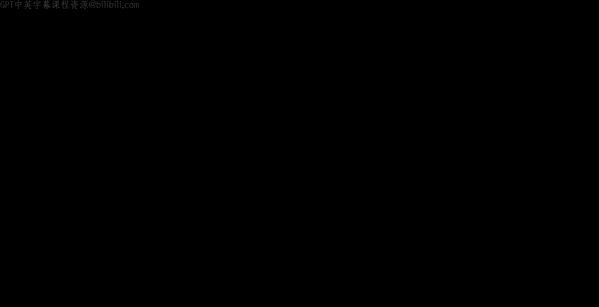
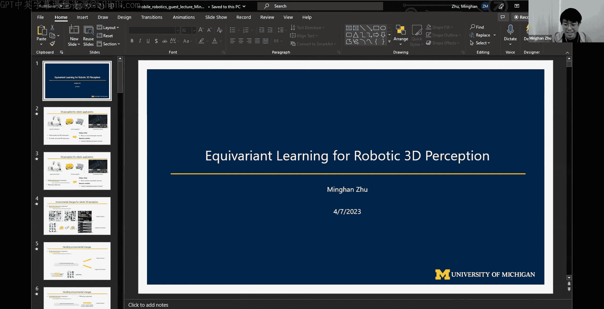
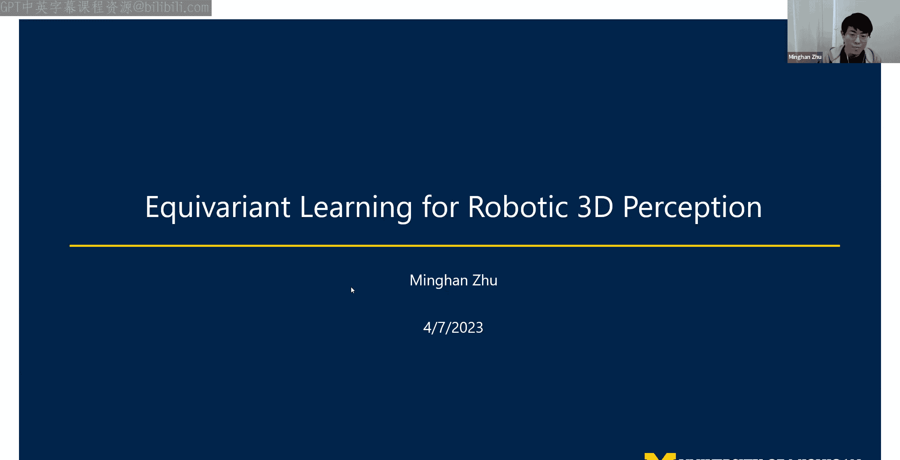
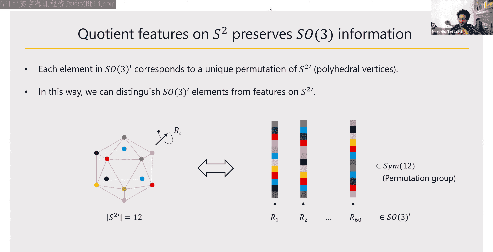
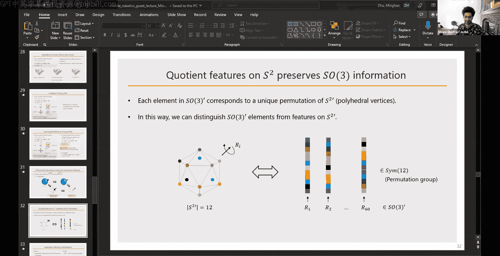

# 025：Guest Lecture - 机器人3D感知中的等变学习

在本节课中，我们将学习一种名为“等变学习”的机器学习框架，特别是在机器人3D感知领域的应用。我们将探讨等变模型如何帮助机器人更可靠、更高效地理解其周围的三维环境。

## 机器人应用与3D感知的重要性

我们身处移动机器人课程中，脑海中会浮现许多机器人应用场景。例如，物体操控，即使用机械臂或手爪抓取和操作物体；室内导航，即让机器人在室内环境中自主移动；以及自动驾驶，这可以看作机器人在复杂室外场景中的导航任务。

对于所有这些任务，3D感知都是至关重要的组成部分。它使机器人能够理解三维环境，更重要的是，为机器人与现实世界中的实体进行交互做好准备。

因此，机器人应用中的卓越感知具有两个非常重要的特性。第一是安全关键性，因为机器人被设计用于与现实世界交互，感知中的错误可能导致灾难性后果。第二是计算资源敏感性，机器人机载的计算能力通常有限，因此感知算法也必须高效，不能依赖需要数百个GPU的庞大模型。

这两个特性对感知算法提出了两个要求：一是需要算法具有可预测的行为，二是需要算法高效运行。

## 可预测行为与环境变化

首先，我们来探讨“可预测行为”的含义。具体来说，我们希望感知算法在各种环境变化下都能给出可预测的结果。

环境变化主要可以分为两类。第一类是“不同实体”，例如，对于识别椅子的算法，世界上有各种形状、样式的椅子，我们希望模型能稳健地处理它们。室内外环境的布局也千差万别。第二类是“同一实体的不同观测”，例如，从不同视角观察同一把椅子，其外观会截然不同；同一棵树或车辆，在不同距离或角度下观测，外观也会有很大变化。

## 传统方法与等变学习的优势

目前，大多数模型以相同的方式处理这些变化：使用足够大、设计良好的模型，去分别识别每一个不同的实体和每一次不同的观测。

然而，这里存在一个自然的问题：既然不同的观测通常来自同一物体，那么我们能否只为同一物体的不同观测学习一次？也就是说，如果一个模型能够识别物体的内在属性，那么无论其外观如何变化，模型都知道它是同一个物体。这样做会带来什么好处？我们又该如何实现？

答案是：利用对称性。如果模型能够捕捉同一物体所有不同观测背后的底层对称性，这将为我们带来巨大好处。将这种对称性嵌入模型，使用保持对称性的模型（即等变模型）来处理所有对称变换，可以帮助模型在所有观测下产生可预测的行为，因为模型知道无论外观如何变化，它都是同一个东西，从而增加了感知系统的鲁棒性。

另一方面，效率也是机器人感知算法的重要部分。既然我们现在可以将所有不同的观测视为同一个物体来处理，就可以节省模型容量，去学习真正不同的实体。这降低了对模型容量的需求，使其能更好地应对现实世界中的环境变化。

## 什么是等变模型？

接下来，我们简要概述什么是等变模型。等变性是描述函数性质的一个概念。如果一个函数对某个变换群 G 保持对称性，那么我们称这个函数对群 G 是等变的。换句话说，应用变换和应用函数的顺序可以互换，不影响最终结果。

最著名的等变学习例子是卷积神经网络，它们具有平移等变性。这意味着，在图像中移动一个物体然后进行分割，与先分割再移动结果，两者是等价的。这个特性使得模型能够泛化到图像中物体的平移变化，模型无需为每个位置单独学习。

然而，CNNs 只对平移等变，对旋转并不等变。例如，旋转一张城市鸟瞰图，CNN 输出的特征图不仅发生了旋转，其内容也发生了改变。这意味着网络无法从旋转图像中学习到可靠的表示。

这正是等变网络发挥作用的地方。我们可以开发对平面旋转群 SO(2) 等变的网络。使用等变模型时，输入图像发生旋转，输出特征图也会发生完全相同的旋转，且特征内容保持稳定。这使得网络能够从旋转图像中学习到可靠且鲁棒的表示。

等变网络将平移等变的思想推广到更一般的变换，例如 SE(2)（二维刚体变换）、SO(3)（三维旋转）和 SE(3)（三维刚体变换）。想象一下，如果我们有一个对 SE(3) 等变的模型，那么给定同一客厅的两个不同视角，网络会知道它们对应完全相同的布局，不会被观察者移动引起的姿态变化所迷惑，这对于导航等任务非常有用。

## 构建等变模型：MLP 与 CNN

等变模型可以从当前深度学习社区常用的各种网络架构构建，例如多层感知机、卷积神经网络、Transformer 和图神经网络。本节课我们将主要关注前两种，即 MLP 和 CNN，因为它们相对简单，适合教学。我们将介绍基于它们的简单等变模型示例，并展示在机器人领域的酷炫应用。

为了让数学部分保持简单易懂，我们不会深入复杂的理论细节，但会让大家了解这些模型的样子以及它们能做什么。

### 基于 MLP 的等变模型：Vector Neurons

首先，我们来看 MLP。我们将聚焦于一个近期具有代表性的工作——“Vector Neurons”，这是一个多层感知机架构，但它被设计为对三维旋转 SO(3) 等变。该工作可应用于点云特征学习，并已在多种机器人任务中使用，包括点云配准、物体操控和 SLAM 系统。

我们可以将 Vector Neurons 视为一个 SO(3) 等变 MLP。我们来比较一下它与传统 MLP 的区别。

对于一个传统的点云处理网络 PointNet，其输入是一个 n x 3 的点云矩阵，每一行是一个点。网络将每个点的三维特征向量映射到更高维的特征，最后通过池化层汇总所有点的特征，得到代表整个点云的单个特征向量。

Vector Neurons 看起来非常相似，但关键区别在于：传统网络中每个点的特征是一个 1 x C 的向量，而在 Vector Neurons 中，每个点的特征是一个 C x 3 的矩阵。也就是说，每个点的特征在末尾增加了一个大小为 3 的维度。

这使得输入点云（n x 3）和输出特征（C x 3）都可以被一个 3x3 的旋转矩阵作用。正是这一点，使得 Vector Neurons 在高层设计上具备了旋转等变的潜力。

下面我们逐步拆解，看看这是如何实现的。

**第一步：特征初始化**
对于传统 MLP，将点坐标 [x, y, z] 映射为特征非常简单，只需乘以一个 C x 3 的权重矩阵，得到一个 C 维向量。
对于 Vector Neurons，给定一个点 [x, y, z]，它首先考虑该点的邻域点，例如图中所示的五个邻域点。我们将这些邻域点的偏移向量堆叠起来，得到一个 m x 3 的矩阵。这样，每个点的特征就从向量提升为了矩阵。然后，类似传统 MLP，我们在左侧应用一个权重矩阵乘法，将其映射到某个隐藏特征维度，例如 C x 3。

**线性层**
传统 PointNet 的线性层是通过在左侧乘以矩阵，将特征向量映射到另一个维度。
Vector Neurons 的线性层操作形式完全相同，只是每个点的特征在末尾多了一个维度。由于权重乘法是在左侧进行的，因此这个额外的维度不受影响。可以验证，这样的层是旋转等变的。根据等变的定义，变换（旋转矩阵右乘）和函数（权重矩阵左乘）的顺序可交换。因为左乘和右乘互不影响，所以该层是 SO(3) 等变的。

**非线性层**
这里以最常用的 ReLU 激活函数为例。
传统 MLP 的 ReLU 是 max(输入, 0)。
Vector Neurons 使用的是向量化版本的 ReLU。它首先估计一个规范方向 K（一个 1x3 的向量），然后截断每个特征向量：与规范方向夹角小于 90 度的向量保持不变，夹角大于 90 度的向量被投影到法平面上。这相当于将截断操作提升到了三维空间，用一个超平面代表零点。可以证明，这个操作也是旋转等变的。

**池化层与置换不变性**
Vector Neurons 也具有置换不变性。这是因为最大池化或平均池化操作本身是置换不变的。由于每个点在 Vector Neurons 中都是独立处理的，因此点的堆叠顺序不影响最终的池化结果。

### Vector Neurons 的应用：点云配准

拥有了这些特性，我们能做什么呢？这是一个非常优雅的网络架构。

考虑两个点云：点云 P 和点云 P‘。P’ 是 P 经过旋转和随机打乱顺序后的版本，其中 R 是旋转矩阵，M 是置换矩阵。我们不知道 P‘ 和 P 之间点的对应关系。

由于等变性和置换不变性，我们知道这个 Vector Neurons SO(3) 等变编码器的输出满足：F(P‘) = F(P) R。也就是说，两个特征只相差一个旋转矩阵 R。

这带来了一个非常好的性质：给定这两个通过 R 关联的度量（现在是深度特征），我们可以应用奇异值分解来求解最终的旋转。这样，我们就在深度特征空间中进行点云配准，而不是在欧几里得空间。

这个策略非常巧妙，因为我们不需要求解两个原始点云之间的点对应关系。现在，深度特征是自动对应的，它们只通过旋转 R 关联，没有置换矩阵 M 的干扰。因此，我们避免了寻找点对应关系的难题。

在实践中，P‘ 可能并不完全是 P 的旋转副本，可能带有噪声。因此，我们还会训练一个解码器（例如用于占据栅格预测）来使特征对噪声更鲁棒，并通过对 SVD 估计的旋转施加损失，鼓励网络找到与真实旋转一致的解。

这种策略由于无需对应点且 SVD 提供了闭式解，因此可以实现与初始化误差无关的点云配准。

### 其他应用

SO(3) 等变特征还有其他应用。
*   **物体操控**：任务中，机器人学习如何以某种姿态抓取物体。在测试时，机器人需要抓取未见过的物体或处于新姿态的物体。SO(3) 等变特征可以帮助可靠地跟踪抓取点，因为特征会随着点云的旋转而旋转。
*   **物体 SLAM**：在这项工作中，SLAM 构建的地图中的物体不是用点云表示，而是用 SO(3) 等变特征表示。由于这些特征可以经历与欧几里得空间点云相同的旋转，因此它们可以融合到 SLAM 的姿态图优化中。

## 基于 CNN 的等变模型：群卷积

接下来，我们看卷积神经网络如何实现等变。正如之前提到的，群卷积可以将等变性扩展到更一般的变换，例如 SE(3)，从而处理更复杂的任务。

在深入如何构建等变卷积之前，我们需要一点关于“群”概念的背景知识。

### 群的概念

在数学中，群是一个集合，配备了一种二元运算，并满足封闭性、结合律、单位元和逆元四个公理。在机器人学中，我们使用群来描述变换，所有的变换都属于某个群。

例如，整数或实数配备加法运算后构成平移群。SO(2)、SO(3)、SE(2)、SE(3) 分别是二维旋转、三维旋转、二维刚体变换和三维刚体变换群。

引入群的概念是为了将卷积神经网络的思想推广到等变版本。

### 从传统卷积到群卷积

传统卷积是定义在欧几里得空间 R^N 上的函数（特征图）与滤波器（核函数）之间的积分运算。由于 R^N 本身在加法运算下构成一个群，因此我们可以将 R^N 推广到任意群 G，从而得到群卷积。

在群卷积中，输入特征图、滤波器和输出特征图都是定义在群 G 上的函数，卷积运算是在群 G 上进行积分。

当 G 是 R^N 时，就回到了传统卷积。当 G 是 SO(2)、SE(2)、SO(3) 等时，我们就得到了对应变换群的等变卷积。

### 群卷积的应用与计算考量

例如，考虑 SE(2) 群卷积。我们将 SO(2) 旋转离散化为 4 个方向（0, π/2, π, 3π/2）。这样，特征图的定义域就从 R^2 提升到了 R^2 × C4，特征图变得更大，每个空间位置现在还关联了 4 个方向。

通过插入不同的群 G，可以实现不同类型的等变性。应用包括：
*   **图像分类**：在旋转后的 MNIST 数字数据集上，等变网络能可靠识别数字。
*   **航空图像目标检测**：等变性帮助网络可靠检测地面不同朝向的物体。
*   **图像关键点检测**：等变网络能可靠检测并匹配旋转图像中的关键点。
*   **3D 点云应用**：如物体姿态估计、重建、室内 RGB-D 物体检测等。等变网络能一致地检测旋转的物体并可靠估计其方向。

### 群卷积的效率问题与改进

尽管群卷积应用广泛且成功，但它存在一个主要限制：效率问题。

群卷积将定义域从 R^N 提升到了更大的群空间 G，这会导致计算成本增加。例如，在三维空间中，一个点不仅要与空间邻居通信，还要与邻居点的所有方向进行通信，连接数大大增加，尤其是当群较大时（如 SE(3)），计算开销会成为问题。

因此，我们实验室的一项工作就是提高群卷积的效率。我们的方法是开发“商空间卷积”。

### 商空间卷积

总体思想是：我们使用商空间 G/H 来代替完整的群 G 进行卷积。就像除法会使结果变小一样，G/H 是一个比 G 小得多的空间。在更小的空间上进行卷积，效率自然更高。

我们将其应用于点云处理。以 SO(3) 等变为例，我们取子群 H 为 SO(2)（平面旋转），则商空间 SO(3)/SO(2) 同构于球面 S^2。这相当于将绕同一轴的所有旋转归为一组，用球面上的一个点来代表。这样，我们将自由度从 6 降到了 5，空间变小了。

在实践中，我们使用一个多面体（如二十面体，12个顶点）来离散化球面。完整的 SO(3) 旋转群（对该多面体的对称旋转）有 60 个元素。而商空间（即顶点）只有 12 个元素。通过这种商操作，我们将特征图的维度从 60 降到了 12。

关键在于，尽管我们只在 12 维特征上操作，但我们仍然可以恢复 60 种旋转。这是因为，如果我们以某种方式排列这 12 个顶点成一个向量，那么多面体的每一种旋转都会导致该向量的一个特定排列。因此，12 个元素的特征图通过其排列可以表示 60 种旋转。

这种策略带来了巨大的计算成本节省。在物体姿态估计、分类、关键点匹配等任务上的实验表明，相比标准的 SE(3) 等变群卷积，商空间卷积能大幅降低内存消耗，并将训练和推理速度提升数倍。

### 高效等变模型的大规模应用

效率的提升使得我们可以将 E(3) 等变学习应用于大规模点云，例如激光雷达数据。

*   **地点识别**：也称为回环检测。激光雷达基于的地点识别对光照和天气变化更鲁棒。我们应用高效的 SE(3) 点卷积来从不同姿态下的点云中提取可靠的全局描述符。等变模型能提取出在姿态变化下非常稳定的描述符。
*   **全景分割**：这是一个结合了语义分割、实例分割和对象跟踪的任务。我们的实验表明，等变学习能够实现更准确的对象分割和跟踪，从而有益于整体的全景分割性能。

## 总结与未来展望

本节课我们一起学习了如何从典型的网络架构（MLP 和 CNN）中学习等变特征，并看到了它们在机器人领域的众多应用。

等变学习虽然是一个几何概念，但由于它能将几何变化（姿态变化）从学习中分离出来，因此不仅有利于几何任务（如配准、地点识别），也有利于语义任务（如分割、检测）。结合两者，可以带来更有趣的应用，如物体 SLAM 和抓取操作。

展望未来，一个自然的方向是扩展对称性保持模型所能处理的情况范围。这样，更多的环境变化可以通过原则性的方式处理，从而减少处理其他变化（如不同实体）所需的数据量和模型大小。

未来的探索方向可能包括：
1.  **其他群对称性**：例如单应性变换，它描述了 3D 变换在 2D 图像上的投影。处理这类对称性可能实现更鲁棒的从图像到 3D 的感知。
2.  **近似等变性**：数据通常被噪声和遮挡破坏，导致不完全服从等变性。如何在这种情况下利用近似对称性？
3.  **从数据中发现对称性**：当前模型大多是我们预先定义想要的对称性。未来可能希望模型能从数据本身学习对称性。
4.  **在机器人应用中更深入地整合对称性**：作为机器人研究者，有更多可能性去探索如何将对称性整合到机器人应用中。

本节课到此结束，希望这些内容能帮助你理解等变学习在机器人 3D 感知中的强大潜力。