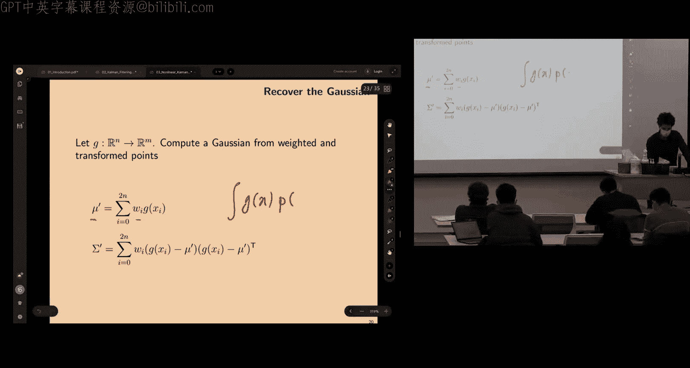
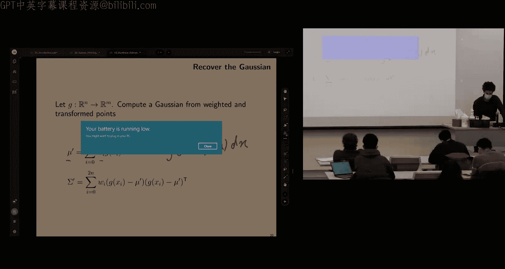
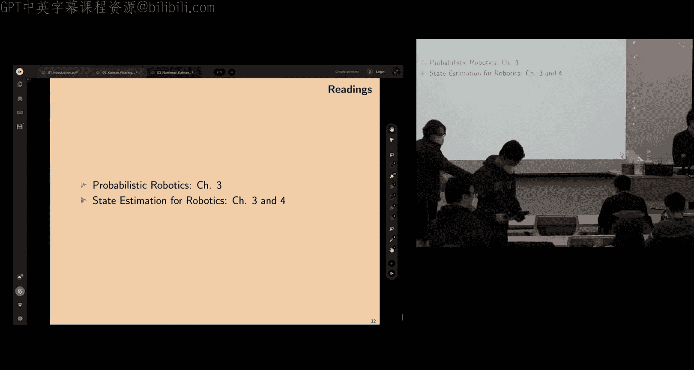
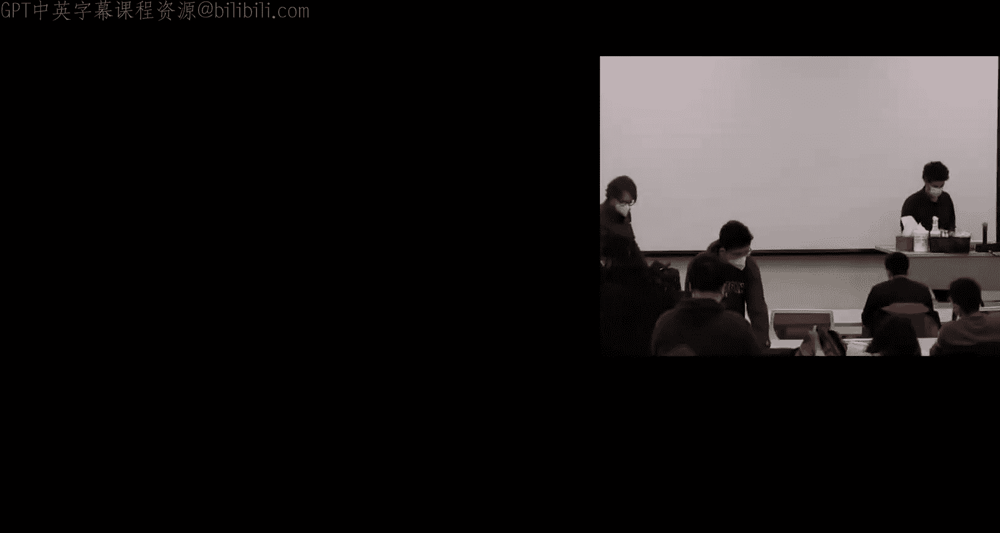

# 移动机器人：方法与算法：03：非线性卡尔曼滤波

## 概述

在本节课中，我们将要学习非线性卡尔曼滤波。这是对上一讲贝叶斯滤波和线性卡尔曼滤波的延续。我们将看到两种处理非线性滤波问题的方法。学完本讲后，你应当能够理解为什么在某些情况下我们需要扩展卡尔曼滤波，而不是直接使用标准卡尔曼滤波，并清楚何时应选择非线性版本。

## 从贝叶斯滤波到非线性问题

上一节我们介绍了贝叶斯滤波的图形化表示，它展示了变量间的因果关系以及状态 `X` 如何随时间演变。这种图形模型有助于我们理解条件独立性，并推导出联合概率分布的因子化形式。

在本节中，我们来看看状态估计问题的核心目标：在给定观测 `Z` 和控制输入 `U` 的情况下，估计状态变量 `X` 的后验概率分布。具体实现这一目标的不同方法，就引出了卡尔曼滤波、粒子滤波等算法。我们关注的是滤波问题，即只估计当前时刻的状态，而不追踪历史。

贝叶斯滤波递归公式包含预测和更新两个步骤。预测步骤利用上一时刻的信念（后验）和运动模型来预测当前时刻的信念。更新步骤则利用贝叶斯规则，结合观测似然和预测的信念（作为先验）来进行修正。

我们之前处理的是线性系统，其模型形式如下：
*   运动模型：`x_t = F * x_{t-1} + B * u_t + w_t`
*   观测模型：`z_t = H * x_t + v_t`

其中 `w_t` 和 `v_t` 是噪声项。模型之所以是概率性的，正是因为这些噪声的存在。

## 非线性滤波的核心挑战

然而，许多实际问题的模型是非线性的。过程模型和观测模型可能具有如下形式：
*   过程模型：`x_t = f(x_{t-1}, u_t, w_t)`
*   观测模型：`z_t = h(x_t, v_t)`

这里的 `f` 和 `h` 是非线性函数。噪声可能是加性的（如 `f(x) + w`），也可能是更一般的乘性形式（噪声与状态耦合在非线性函数内部）。

这就引出了本讲的核心问题：**如何将一个概率分布（例如高斯分布）通过一个非线性映射进行传播？** 对于线性（仿射）映射，我们可以精确地传播高斯分布的均值和协方差。但对于非线性映射，当我们尝试写出新分布均值和协方差的定义并展开时，会遇到无法处理的非线性项，无法得到闭式解。

以下是解决此问题的三种主要思路：
1.  **线性化**：在某个操作点（如当前均值）对非线性函数进行泰勒展开，并仅保留一阶项。这引出了**扩展卡尔曼滤波**。
2.  **确定性采样**：基于当前分布的均值和协方差，按照确定性规则生成一组样本点（Sigma点），将它们通过非线性函数传播，然后用这些输出点的加权均值和协方差来近似新分布。这引出了**无迹变换**及**无迹卡尔曼滤波**。
3.  **随机采样**：从当前分布中随机抽取大量样本，将它们通过非线性函数传播，然后用输出样本的直方图来近似新分布。这属于**蒙特卡洛方法**，是**粒子滤波**的基础。

接下来，我们将详细探讨前两种方法。

## 扩展卡尔曼滤波

扩展卡尔曼滤波的核心思想是在每个滤波步骤中，对非线性模型进行局部线性化。

### 线性化方法

假设有一个非线性函数 `f: R^n -> R^m`。在操作点 `x0` 处进行一阶泰勒展开：
```
f(x) ≈ f(x0) + J_f(x0) * (x - x0)
```
其中 `J_f(x0)` 是函数 `f` 在 `x0` 处的雅可比矩阵（即导数）。对于加性噪声模型 `x_t = f(x_{t-1}, u_t) + w_t`，我们主要需要对状态 `x` 求导。对于更一般的模型 `x_t = f(x_{t-1}, u_t, w_t)`，还需要对噪声 `w` 求导。

### EKF 算法步骤

基于线性卡尔曼滤波算法，我们将其修改以融入线性化步骤。输入是上一时刻的信念均值 `μ_{k-1}` 和协方差 `Σ_{k-1}`，以及当前的控制 `u_k` 和观测 `z_k`。

1.  **预测**：
    *   均值预测：`μ̄_k = f(μ_{k-1}, u_k)` （直接使用非线性模型）
    *   协方差预测：`Σ̄_k = F_k * Σ_{k-1} * F_k^T + W_k * Q * W_k^T`
        *   `F_k` 是 `f` 对状态 `x` 在 `μ_{k-1}` 处的雅可比矩阵。
        *   `W_k` 是 `f` 对过程噪声 `w` 在 `μ_{k-1}` 处的雅可比矩阵。对于加性噪声，`W_k` 是单位阵。
        *   `Q` 是过程噪声协方差。

2.  **更新**：
    *   预测观测：`z̄_k = h(μ̄_k)`
    *   计算新息：`y_k = z_k - z̄_k`
    *   计算新息协方差：`S_k = H_k * Σ̄_k * H_k^T + V_k * R * V_k^T`
        *   `H_k` 是 `h` 对状态 `x` 在 `μ̄_k` 处的雅可比矩阵。
        *   `V_k` 是 `h` 对观测噪声 `v` 在 `μ̄_k` 处的雅可比矩阵。对于加性噪声，`V_k` 是单位阵。
        *   `R` 是观测噪声协方差。
    *   计算卡尔曼增益：`K_k = Σ̄_k * H_k^T * S_k^{-1}`
    *   更新状态估计：`μ_k = μ̄_k + K_k * y_k`
    *   更新协方差估计：`Σ_k = (I - K_k * H_k) * Σ̄_k`

### EKF 的特点与局限性

*   **高效性**：与线性KF一样，计算复杂度是状态维度的多项式级（通常为平方或立方），适合实时应用。
*   **非最优性**：由于线性化近似，EKF失去了线性KF的最优性保证。它只是一个**次优**滤波器。
*   **可能发散**：如果非线性程度很强，或者线性化点选择不佳，线性近似误差会累积，可能导致滤波器发散。
*   **依赖雅可比计算**：需要计算非线性函数的导数，可通过解析、符号计算或自动微分实现。

### 目标跟踪示例

考虑一个二维目标跟踪问题。我们自己的船位于原点，传感器测量目标的距离 `r` 和方位角 `θ`。
*   状态：`x = [x_pos, y_pos]^T`
*   观测：`z = [r, θ]^T`
*   观测模型（非线性）：
    ```
    r = sqrt(x_pos^2 + y_pos^2)
    θ = atan2(y_pos, x_pos)
    ```
*   运动模型：假设目标匀速运动，则 `x_t = x_{t-1} + w_t`（线性）。

在这个例子中，运动模型是线性的，但观测模型是非线性的。我们可以计算观测模型 `h` 的雅可比矩阵 `H`，并在每个滤波步骤中，在预测的均值 `μ̄_k` 处计算 `H_k`，然后应用上述EKF算法。

## 无迹卡尔曼滤波

无迹卡尔曼滤波采用了一种不同的思路：它使用无迹变换来近似非线性传播，而不是进行显式的线性化。

### 无迹变换

UT的目的是计算经过非线性变换后的随机变量的均值和协方差。步骤如下：

1.  **选择Sigma点**：根据当前分布的均值 `μ` 和协方差 `Σ`，按照确定性规则生成一组样本点（Sigma点）。一种常见的方法是：
    *   计算协方差矩阵的乔列斯基分解：`Σ = L * L^T`
    *   设置参数 `κ`（通常对于高斯分布，`κ = 3 - n`，`n`为状态维度）。
    *   生成 `2n + 1` 个Sigma点：
        ```
        χ_0 = μ
        χ_i = μ + sqrt(n + κ) * L_i, for i = 1...n
        χ_{i+n} = μ - sqrt(n + κ) * L_i, for i = 1...n
        ```
        其中 `L_i` 是矩阵 `L` 的第 `i` 列。

2.  **分配权重**：为每个Sigma点分配权重，用于计算加权均值和协方差。
    ```
    w_0^{(m)} = κ / (n + κ)
    w_0^{(c)} = κ / (n + κ) + (1 - α^2 + β)
    w_i^{(m)} = w_i^{(c)} = 1 / [2(n + κ)], for i = 1...2n
    ```
    其中 `α` 和 `β` 是调节参数。简化版本常设 `w_0^{(m)} = w_0^{(c)} = κ/(n+κ)`，其余点为 `1/[2(n+κ)]`。

3.  **传播Sigma点**：将每个Sigma点通过非线性函数 `g` 传播：`Y_i = g(χ_i)`。

4.  **计算近似均值和协方差**：
    *   近似均值：`μ_y ≈ Σ_{i=0}^{2n} w_i^{(m)} * Y_i`
    *   近似协方差：`Σ_y ≈ Σ_{i=0}^{2n} w_i^{(c)} * (Y_i - μ_y)(Y_i - μ_y)^T`





### UKF 算法步骤

将UT融入卡尔曼滤波框架：

1.  **预测**：
    *   利用上一时刻的 `μ_{k-1}`, `Σ_{k-1}` 生成Sigma点。
    *   将每个Sigma点通过过程模型 `f` 传播。
    *   利用传播后的点计算预测均值 `μ̄_k` 和预测协方差 `Σ̄_k`。如果是加性噪声，最后加上过程噪声协方差 `Q`。

2.  **更新**：
    *   利用预测的 `μ̄_k`, `Σ̄_k` 生成一组新的Sigma点。
    *   将每个Sigma点通过观测模型 `h` 传播，得到预测的观测点 `Z_i`。
    *   计算预测观测的均值 `z̄_k` 和协方差 `S_k`（以及状态与观测的互协方差 `Σ_{xz}`）。同样，对于加性观测噪声，需加上 `R`。
    *   计算卡尔曼增益：`K_k = Σ_{xz} * S_k^{-1}`
    *   更新状态和协方差。

### UKF 的特点与局限性

*   **无需导数**：UKF不需要计算雅可比矩阵，实现更方便。
*   **更好的非线性近似**：UT通过采样捕捉了非线性变换的更多特征，通常比一阶线性化更准确。
*   **计算量稍大**：需要生成和传播 `2n+1` 个Sigma点，计算量比EKF略高，但仍在同一数量级。
*   **仍为高斯近似**：输出仍然是用高斯分布来近似后验，对于高度非高斯的结果（如多峰分布）仍然无能为力。
*   **采样效率**：在高维空间中，Sigma点的数量线性增长，可能仍不足以充分捕捉分布形态。

### 极坐标到笛卡尔坐标变换示例

考虑一个简单例子：将一个点在极坐标 `(r, θ)` 中的高斯分布（均值 `[1.5, π/6]`，对角协方差）变换到笛卡尔坐标 `(x, y)`。
*   EKF方法：直接将均值 `[1.5, π/6]` 代入非线性函数 `x = r*cosθ`, `y = r*sinθ` 得到变换后的均值。
*   UKF方法：在极坐标空间生成Sigma点，将它们分别变换到笛卡尔坐标，然后计算这些输出点的加权均值。

有趣的是，这两种方法得到的“均值”可能不同。UKF得到的均值考虑了输入分布的形状经过非线性扭曲后的效果，通常更接近变换后分布的真实均值（通过蒙特卡洛大量采样估计）。而EKF的均值只是函数在输入均值处的取值。

## 总结

本节课我们一起学习了非线性卡尔曼滤波的两种主要方法：扩展卡尔曼滤波和无迹卡尔曼滤波。

*   **EKF**通过对非线性模型进行局部线性化（泰勒展开）来工作。它相对高效，但需要计算导数，且线性化误差在强非线性或不良线性化点下可能导致性能下降甚至发散。
*   **UKF**通过无迹变换来工作，这是一种确定性采样方法。它无需计算导数，通常能提供比EKF更准确的非线性近似，但计算量稍大。

两种方法都假设后验可以用高斯分布充分近似。它们都是次优的，但在许多实际问题中表现良好。选择哪种方法取决于具体问题：如果模型简单、导数易得且非线性不强，EKF是经典选择；如果模型复杂、导数难求或希望得到更稳健的性能，UKF可能更合适。





理解这些方法背后的核心思想——如何处理概率分布通过非线性映射的传播问题——对于掌握更高级的滤波和状态估计技术至关重要。下一讲我们将探讨第三种思路：基于随机采样的粒子滤波，它能处理非高斯的后验分布。