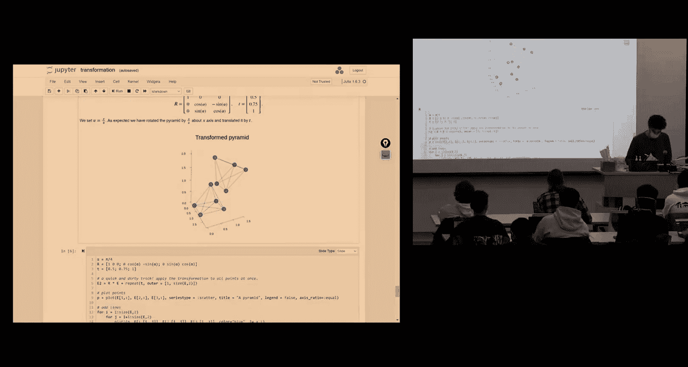
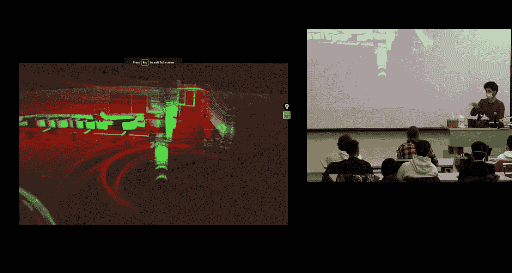
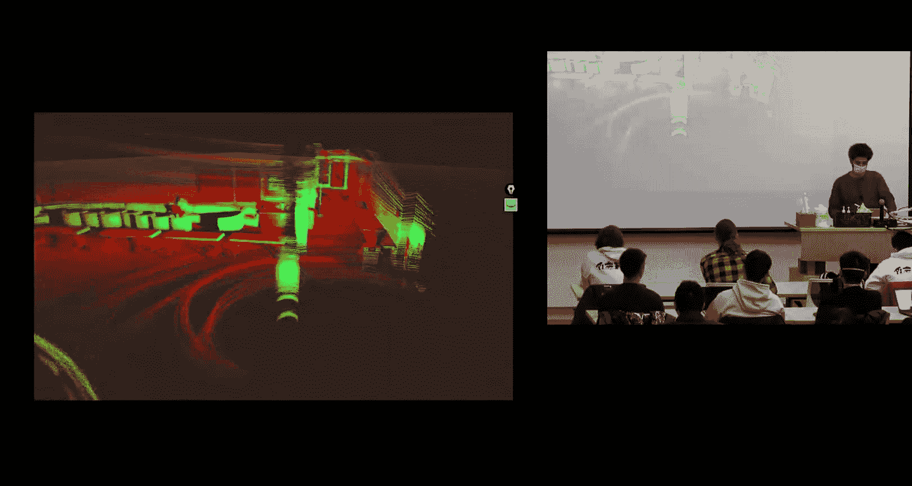
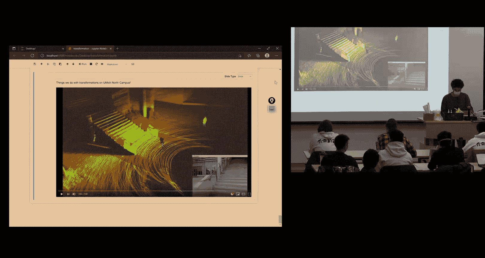

# 移动机器人：方法与算法：05：对称性与刚体运动

在本节课中，我们将学习刚体变换。我们将从基础开始，讨论线性变换，并触及对称性这一主题。我们还将探讨对称性与这些变换之间的关系。课程内容将尽可能简单直白，确保初学者能够理解。

## 线性变换

首先，我们来看看什么是线性变换。线性变换是一种映射，它保持向量空间的两个基本运算：向量加法和标量乘法。这意味着，如果你有一个作用于向量空间的映射，它将保持线性组合的结构。

具体来说，对于一个线性映射 **T**，以及任意向量 **a**、**b** 和标量 **c**，它满足以下性质：
*   **T(c * a) = c * T(a)**
*   **T(a + b) = T(a) + T(b)**

更一般地，对于任意标量 α、β 和向量 **a**、**b**，有：
**T(αa + βb) = αT(a) + βT(b)**

线性变换的一个重要特性是它固定原点。这意味着零向量经过变换后仍然是零向量：**T(0) = 0**。因此，线性变换不会平移整个空间。

在编程中，我们可以轻松验证这些性质。例如，在 Julia 中定义一个 2x2 的变换矩阵 **T** 和两个向量 **a**、**b**，你可以验证 `T * (a + b)` 是否等于 `T*a + T*b`。

以下是线性变换的一些例子：
*   **缩放**：将向量按一定比例放大或缩小。这是一个连续变换。
*   **反射**：关于某条直线或平面对向量进行镜像。这是一个离散变换。
*   **旋转**：围绕一个点或轴转动向量。这是我们研究的重点之一。

那么，平移是线性变换吗？答案是否定的。平移变换的形式是 **T(x) = x + t**。如果我们应用零向量，**T(0) = t**，这并不等于零，因此它不固定原点，违反了线性变换的定义。平移属于仿射变换。

## 旋转矩阵推导

上一节我们介绍了线性变换，本节中我们来看看如何推导旋转矩阵。旋转是一种线性变换，我们可以用矩阵来表示它。

让我们以二维旋转为例进行推导。假设我们有一个标准的二维坐标系，基向量为 **e₁** 和 **e₂**。现在，我们将整个坐标系（作为一个刚体）绕原点旋转一个角度 θ，得到新的基向量 **e₁‘** 和 **e₂’**。

我们的目标是找到这样一个线性映射（矩阵），它能够将原始坐标系下的向量坐标，转换到旋转后的新坐标系下来描述（或者等价地，将向量本身在固定坐标系中旋转 θ 角度）。

关键在于，我们可以将新基向量 **e₁‘** 和 **e₂’** 用原始基向量来表示。通过投影，我们得到：
*   **e₁‘ = [cosθ, sinθ]ᵀ**
*   **e₂‘ = [-sinθ, cosθ]ᵀ**

现在，考虑空间中的一个固定向量 **v**。它在原始坐标系中的坐标为 (v₁, v₂)，即 **v = v₁e₁ + v₂e₂**。在旋转后的坐标系中观察同一个向量，其坐标 (v₁‘, v₂’) 满足 **v = v₁‘e₁’ + v₂‘e₂’**。

将 **e₁‘** 和 **e₂’** 的表达式代入，并比较 **v** 在原始基下的表达式，我们可以推导出坐标变换关系：
```
v₁‘ = cosθ * v₁ - sinθ * v₂
v₂‘ = sinθ * v₁ + cosθ * v₂
```
将其写成矩阵形式：
```
[v₁‘]   [cosθ  -sinθ] [v₁]
[v₂‘] = [sinθ   cosθ] [v₂]
```
这个矩阵就是二维旋转矩阵 **R(θ)**。这种推导方式体现了线性系统的叠加性质。

## 对称性与李群

我们刚刚推导了旋转矩阵，现在让我们思考一个更深层次的概念：对称性。对称性在数学和物理学中至关重要，而李群是描述连续对称性的最佳数学工具。

考虑一个完美的圆。有哪些变换作用于这个圆之后，会使它看起来完全没有变化？显然，绕其圆心的任意角度旋转都不会改变圆的外观。前提是这个变换不能缩放（改变大小）或扭曲圆。这种保持任意两点间距离不变的变换称为**刚体变换**。

因此，所有二维旋转的集合构成了圆的**对称群**。这是一种连续对称性。类似地，一个完美球体的对称群是所有三维旋转的集合。

李群之所以重要，正是因为它完美地捕捉了空间的这种连续对称结构。在机器人学中，我们处理关节、传感器和坐标系的几何关系时，李群会自然而然地出现。

一个有趣的观察是二维旋转与复数单位圆之间的联系。根据欧拉公式，**e^(iθ) = cosθ + i sinθ**，它代表了复平面上的单位圆。用这个复数乘以一个向量（视为复数），等价于将该向量旋转 θ 角度。更重要的是，**角度相加对应于旋转相乘**（**e^(iθ₁) * e^(iθ₂) = e^(i(θ₁+θ₂))**）。这个性质在高维（矩阵旋转）中依然成立，只是乘法的顺序变得重要（矩阵乘法不可交换）。这启示我们可以用代数（加法）来处理几何（旋转乘法）问题，这正是李代数的核心思想：将复杂的几何运算转化为相对简单的向量空间运算。

## 三维旋转与万向节锁



现在，我们将概念扩展到三维空间。三维旋转可以用绕 X、Y、Z 轴的基本旋转矩阵组合而成。例如，绕 Z 轴的旋转矩阵为：
```
R_z(ψ) = [cosψ  -sinψ   0]
         [sinψ   cosψ   0]
         [  0      0     1]
```
绕 X 轴和 Y 轴的矩阵结构类似。


一种常见的组合方式是使用欧拉角（例如 Z-Y-X 顺序），即 **R = R_z(ψ) * R_y(θ) * R_x(φ)**，分别对应偏航角、俯仰角和滚转角。然而，欧拉角存在一个著名的问题：**万向节锁**。




当俯仰角 θ 为 ±90° 时，滚转和偏航轴会重合，导致失去一个旋转自由度。从数学上看，这是因为三维旋转空间（一个三维流形）无法用一个三参数坐标系（如欧拉角）无奇异地覆盖整个空间。在表示旋转时，轴-角对 **(n, θ)** 和 **(-n, -θ)** 表示相同的旋转，这种双重性导致了奇异性。



在实践中，万向节锁是真实存在的问题（例如阿波罗任务中曾遇到）。因此，在许多先进的姿态估计器中，人们使用**四元数**。四元数是复数的扩展，用四个数表示三维旋转，它没有万向节锁问题，尽管每个旋转对应一对符号相反的四元数。



旋转矩阵 **R** 具有两个关键性质：
1.  **正交性**：**Rᵀ R = R Rᵀ = I**，因此其逆等于其转置：**R⁻¹ = Rᵀ**。
2.  **行列式为1**：**det(R) = 1**。这保证了变换是纯旋转（保持手性），而不是反射（行列式为 -1）。

所有满足 **RᵀR = I** 且 **det(R) = 1** 的 3x3 矩阵构成的集合，称为**特殊正交群 SO(3)**。它是描述刚体所有可能朝向的数学空间。

## 刚体运动与齐次坐标

到目前为止，我们主要讨论了旋转。但刚体的完整运动包括旋转和平移。这种组合变换称为**刚体运动**或**欧几里得运动**，其形式为：
**p‘ = R * p + t**
其中 **R** 是旋转矩阵，**t** 是平移向量。

为了更紧凑和方便地处理这种变换（特别是连续变换），我们引入**齐次坐标**。我们将一个三维点 **p = [x, y, z]ᵀ** 表示为四维向量 **[x, y, z, 1]ᵀ**。相应地，平移向量 **t** 表示为 **[t_x, t_y, t_z, 0]ᵀ**。

利用齐次坐标，刚体变换可以表示为一个 4x4 矩阵：
```
    [ R    t ]
H = [        ]
    [ 0ᵀ   1 ]
```
其中 **0ᵀ** 是行向量 [0, 0, 0]。当用 **H** 乘以一个点的齐次坐标 **P = [p, 1]ᵀ** 时：
**H * P = [R*p + t, 1]ᵀ**
这正好实现了旋转加平移的操作。

这种表示法的巨大优势在于，连续施加多个刚体变换只需进行矩阵乘法即可。变换 **H_ab** 表示从坐标系 B 到 A 的变换。那么，从 C 到 A 的变换为：**H_ac = H_ab * H_bc**。矩阵乘法自动处理了旋转和平移的顺序（先旋转后平移）。

所有这种 4x4 刚体变换矩阵构成的集合称为**特殊欧几里得群 SE(3)**。需要注意的是，与旋转一样，刚体变换的乘法也不可交换：**H1 * H2 ≠ H2 * H1**。

## 应用与动机：状态估计中的刚体运动

在移动机器人中，刚体运动是许多核心问题的基础。例如，在**定位**和**建图**中，我们需要持续估计机器人（传感器）相对于一个固定世界坐标系的位姿（即 SE(3) 中的变换）。

考虑一个搭载激光雷达的移动机器人。激光雷达每秒旋转多次，同时机器人自身也在运动。为了构建环境的一致地图，我们必须精确地补偿机器人的运动，将每一时刻扫描到的点云都变换到一个共同的参考系中。这个过程本质上就是在求解一系列随时间变化的 **SE(3)** 变换。

此外，在状态估计（如卡尔曼滤波）中，我们需要对机器人的位姿（属于 **SO(3)** 或 **SE(3)**）及其不确定性进行建模。直接在非线性流形（如旋转矩阵空间）上处理概率分布非常困难。然而，**李群**理论为我们提供了**指数坐标**——一种附着在流形每一点的局部线性空间（李代数）。在李代数中，分布可以近似为高斯分布，许多非线性问题会变得线性化，从而简化滤波器的设计和计算。这揭示了学习李群李代数对于高级机器人状态估计的重要性。

## 总结

本节课中，我们一起学习了刚体运动的核心数学工具。
1.  我们从**线性变换**的定义和性质出发，理解了旋转是一种线性变换，而平移不是。
2.  我们详细推导了**二维旋转矩阵**，并理解了其几何意义。
3.  我们引入了**对称性**和**李群**的概念，认识到旋转群是圆或球体的对称群，李群是描述连续对称性的强大框架。
4.  我们探讨了**三维旋转**的表示方法（旋转矩阵、欧拉角），并指出了欧拉角的**万向节锁**问题。
5.  我们将旋转和平移结合，定义了**刚体运动**，并引入**齐次坐标**和 **4x4 变换矩阵**来方便地表示和计算它，对应的数学结构是 **SE(3)** 群。
6.  最后，我们了解了刚体运动在机器人**定位、建图和状态估计**中的关键作用，并指出了李群李代数在这些问题中用于处理非线性几何约束和不确定性的优势。


这些概念为后续学习机器人运动学、动力学以及高级状态估计方法奠定了坚实的基础。