# 移动机器人：方法与算法：07：矩阵李群在机器人学中的应用 II

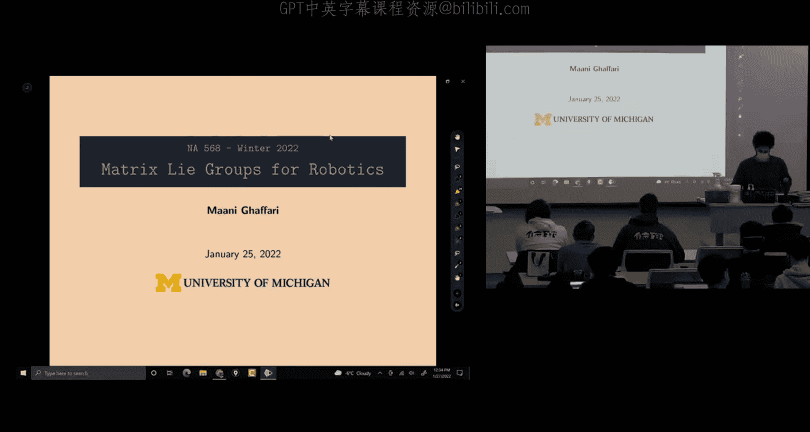

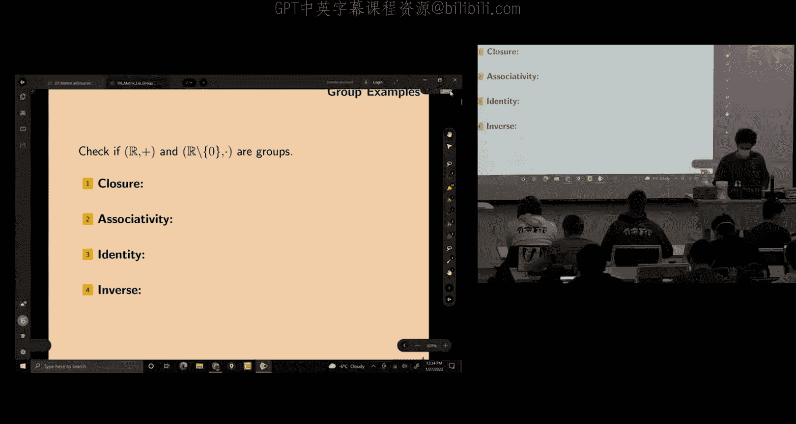


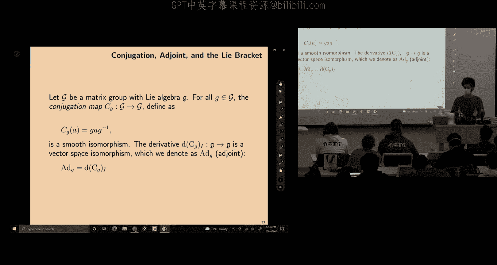


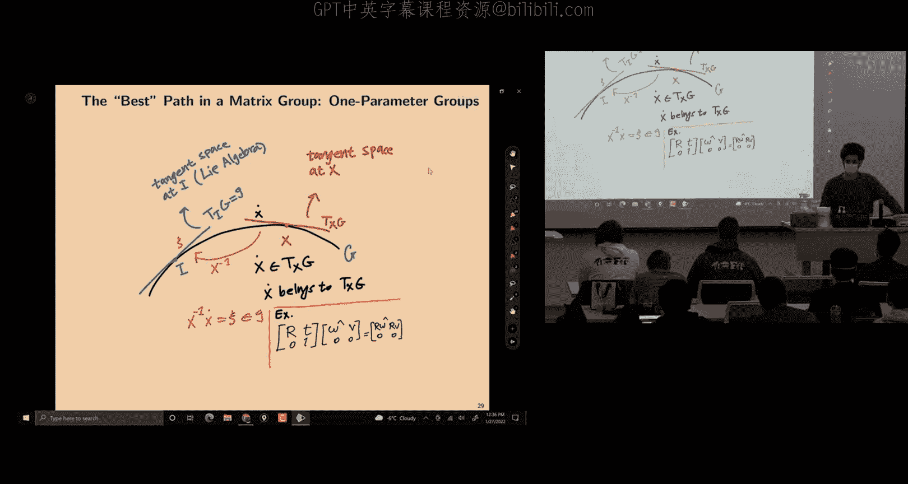


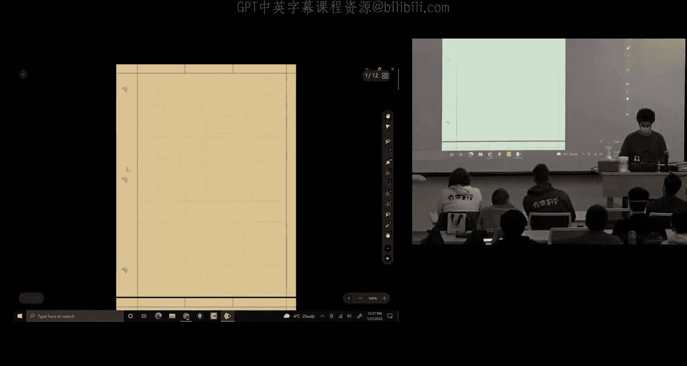

在本节课中，我们将继续学习矩阵李群，特别是如何利用李代数来处理刚体运动中的速度变换问题。我们将从旋转群SO(3)入手，理解其李代数的结构，并推导出描述旋转矩阵随时间变化的微分方程。最后，我们将探讨伴随映射（Adjoint Map）的概念及其在坐标系变换中的重要作用。

---

上一节我们介绍了矩阵李群的基本概念。本节中，我们来看看如何具体应用这些概念来处理机器人学中的实际问题。

首先，我们回顾一下SO(3)群，它由所有满足 **R^T R = I** 且 **det(R) = 1** 的3x3矩阵组成。其对应的李代数so(3)由所有满足 **S^T = -S** 的3x3反对称矩阵组成。

我们可以方便地在向量和矩阵形式之间转换。给定一个角速度向量 **ω = [ω1, ω2, ω3]^T**，我们可以通过“楔积”（wedge）运算将其映射为反对称矩阵：
```
ω^∧ = [ 0, -ω3, ω2;
         ω3, 0, -ω1;
        -ω2, ω1, 0 ]
```
反之，通过“反楔积”（vee）运算可以将反对称矩阵映射回向量：**(ω^∧)^∨ = ω**。

李代数so(3)可以由三个生成元（generator）张成：
```
G1 = [0, 0, 0; 0, 0, -1; 0, 1, 0]
G2 = [0, 0, 1; 0, 0, 0; -1, 0, 0]
G3 = [0, -1, 0; 1, 0, 0; 0, 0, 0]
```
任何角速度对应的反对称矩阵都可以表示为：**ω^∧ = ω1 G1 + ω2 G2 + ω3 G3**。

一个有趣的现象是，两个生成元之间的李括号（Lie Bracket）运算，定义为 **[Gi, Gj] = Gi Gj - Gj Gi**，其结果对应于三维向量叉积。例如，**[G1, G2] = G3**，这类似于 **e1 × e2 = e3**。李括号是向量叉积在李代数空间中的推广，并且适用于更高维度。

---

现在，我们来探讨旋转矩阵的微分方程。从SO(3)的约束 **R^T R = I** 出发，对时间求导可得：
**R^T \dot{R} + \dot{R}^T R = 0**
这意味着 **R^T \dot{R}** 是一个反对称矩阵，因此属于李代数so(3)。我们将其记作 **ω_b^∧**，即：
**R^T \dot{R} = ω_b^∧**
这里，**ω_b** 被解释为在物体坐标系（Body Frame）中测量的角速度。

将等式两边左乘旋转矩阵 **R**，我们得到：
**\dot{R} = R ω_b^∧**
这个微分方程描述了旋转矩阵随时间的变化率。假设在一个微小时间间隔 **Δt** 内角速度 **ω_b** 恒定（零阶保持），我们可以对这个微分方程进行积分，得到离散时间的更新公式：
**R_{k+1} = R_k exp(ω_b^∧ Δt)**
其中 **exp(·)** 是矩阵指数，它将李代数中的元素映射回李群，代表一个微小的旋转增量。

---

然而，从约束 **R^T R = I** 求导，我们还能得到另一个关系：
**\dot{R} R^T = ω_s^∧**
这里，**ω_s** 被解释为在空间坐标系（Spatial Frame，即固定坐标系）中测量的角速度。

为了理解 **ω_b** 和 **ω_s** 之间的关系，我们需要一个关键性质：对于任意旋转矩阵 **R** 和反对称矩阵 **ω^∧**，有：
**R ω^∧ R^T = (R ω)^∧**
利用这个性质，我们可以将 **\dot{R} = R ω_b^∧** 改写为：
**\dot{R} = (R ω_b)^∧ R = ω_s^∧ R**
比较两式，我们得到空间角速度与物体角速度的变换关系：
**ω_s = R ω_b**
这正是一个向量从一个坐标系（物体系）旋转到另一个坐标系（空间系）的标准操作。

因此，旋转矩阵的微分方程有两种等价形式，取决于我们使用哪个坐标系下的角速度：
1.  **\dot{R} = R ω_b^∧** （使用物体系角速度）
2.  **\dot{R} = ω_s^∧ R** （使用空间系角速度）
对应的离散积分公式分别为：
**R_{k+1} = R_k exp(ω_b^∧ Δt)** 和 **R_{k+1} = exp(ω_s^∧ Δt) R_k**

在实现滤波器或状态估计器时，选择其中一种形式并保持一致性至关重要。

---

上述关键性质 **R ω^∧ R^T = (R ω)^∧** 的证明，引出了更一般的概念——伴随映射（Adjoint Map）。

在线性代数中，对于一个线性变换 **A**，在不同基底下表示的矩阵 **T** 和 **A** 通过一个相似变换关联：**T = P A P^{-1}**，其中 **P** 是基变换矩阵。

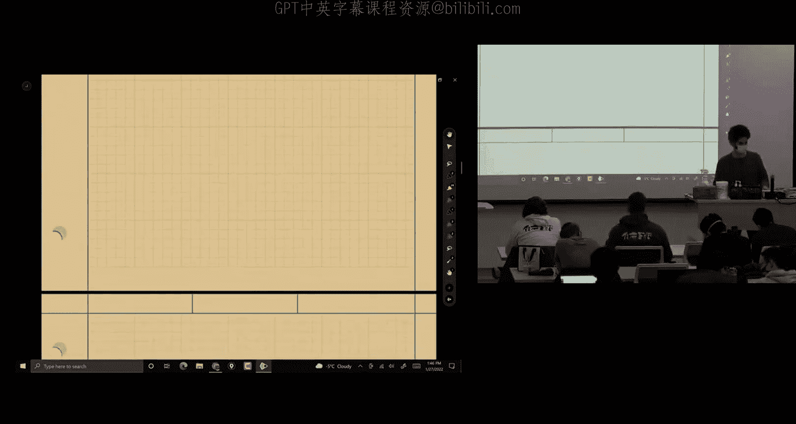

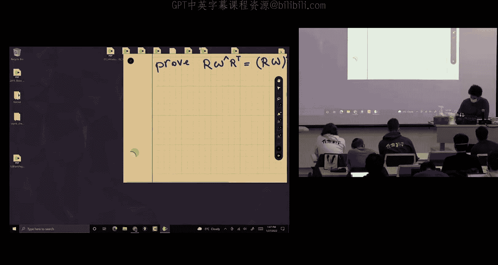

在李群理论中，伴随映射是这种相似变换的推广。对于李群元素 **G** 和李代数元素 **B**，定义伴随作用 **Ad_G** 为：
**Ad_G(B) = G B G^{-1}**
这个运算的结果仍然在李代数中。**Ad_G** 本质上是一个线性变换，可以表示为一个矩阵。对于SO(3)群，**Ad_R** 对应的矩阵就是旋转矩阵 **R** 本身，即 **Ad_R(ω^∧) = R ω^∧ R^T = (R ω)^∧**。

对于包含平移的刚体变换群SE(3)，其李代数se(3)中的元素是“ twists”（包含角速度和线速度）。此时，伴随映射 **Ad_T** 会是一个6x6的矩阵，它不仅包含旋转部分，还包含一个由平移引起的耦合项，这对应于物理中“旋转运动会产生线速度”的现象。

如果我们对伴随映射 **Ad_G(B)** 先关于 **B** 求导，再关于 **G** 求导，就会得到李括号运算。因此，李括号度量了李群的“不可交换性”（非交换性）。在平坦的欧氏空间（可交换），伴随映射是恒等变换；在SO(3)或SE(3)（不可交换）中，伴随映射就变得非常重要。

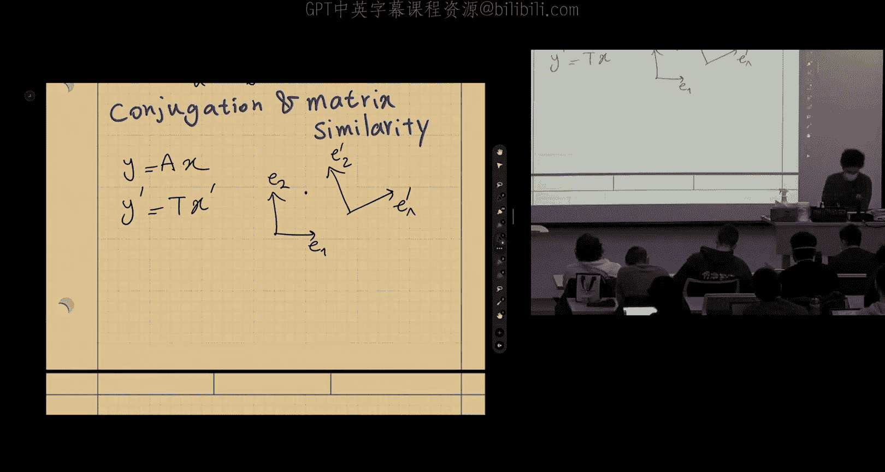

---

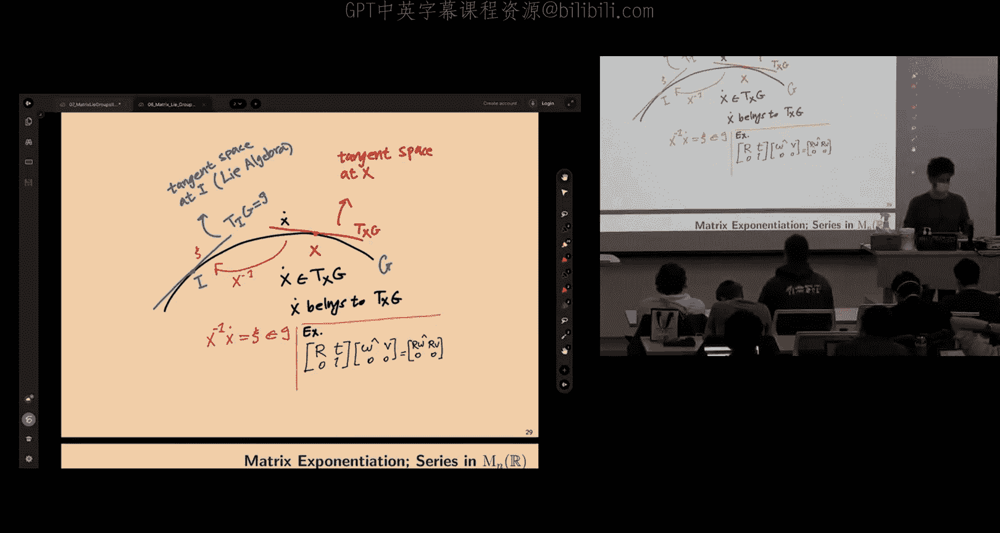

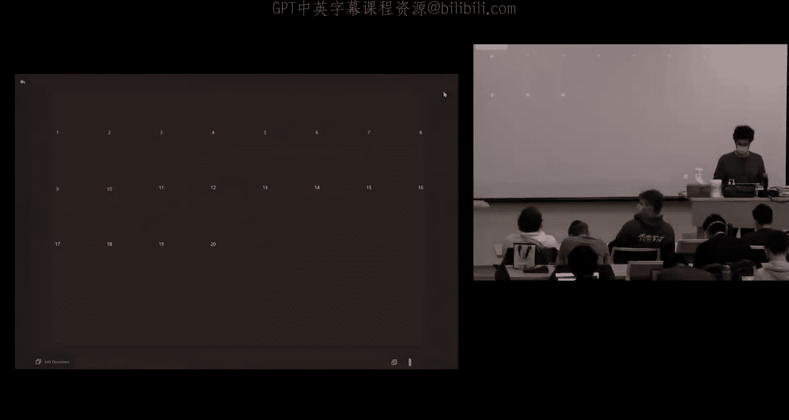

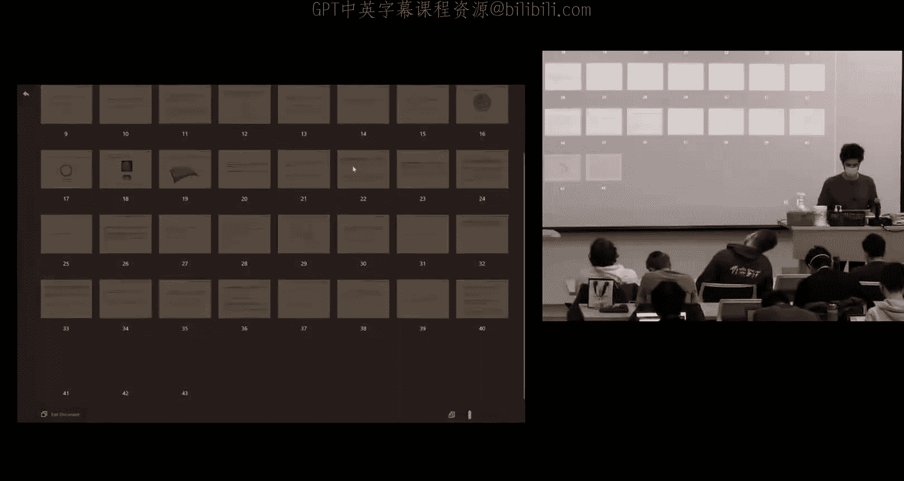

伴随映射的核心作用在于，它允许我们将不同切空间上的向量（如不同位姿处的速度、误差）映射到统一的切空间（通常是单位元处的切空间，即李代数）中进行处理。这对于在向量空间中进行协方差传播、优化等计算至关重要，因为李代数是一个向量空间，而李群是一个流形，直接在其上进行线性运算并不方便。

---

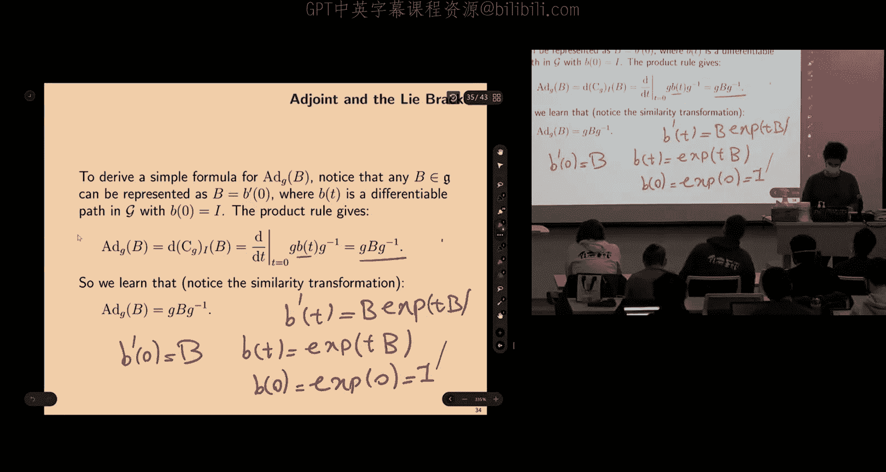

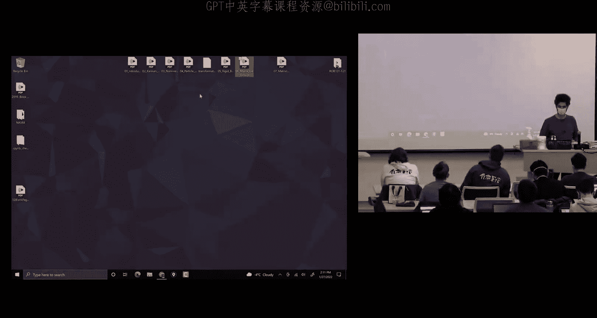

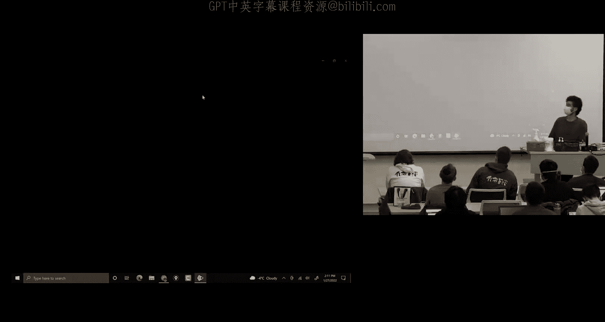

最后，我们提及一个重要的公式：Baker-Campbell-Hausdorff公式。对于李代数中的两个元素 **X** 和 **Y**，矩阵指数的乘积并不等于它们和的指数，除非它们可交换：
**exp(X) exp(Y) ≠ exp(X + Y)**
BCH公式给出了 **Z** 的表达式，使得 **exp(X) exp(Y) = exp(Z)**，其中 **Z** 是一个关于 **X**, **Y** 及其李括号的无穷级数：
**Z = X + Y + 1/2 [X, Y] + 1/12 [X, [X, Y]] - 1/12 [Y, [X, Y]] + ...**
这个公式在非线性系统的线性化（例如扩展卡尔曼滤波中）非常有用，它允许我们在李代数这个向量空间中近似处理李群上的乘法运算。

---

本节课中我们一起学习了：
1.  SO(3)李代数的具体形式及其与向量叉积的联系。
2.  旋转矩阵的微分方程及其物理意义（物体系 vs. 空间系角速度）。
3.  离散时间下的旋转积分公式。
4.  伴随映射（Adjoint Map）的概念、推导及其重要性，它实现了不同切空间向量到李代数的规范映射。
5.  BCH公式的作用，它揭示了李群乘法在李代数中的近似表达。

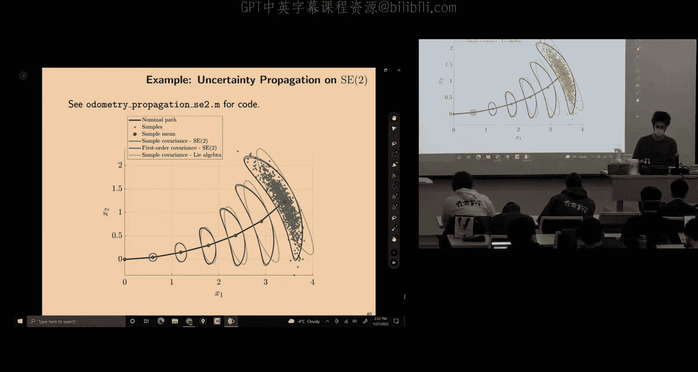

理解这些概念是后续在流形上进行状态估计和传感器融合的基础。下一讲，我们将把这些工具应用于具体的机器人运动模型和传感器模型中。