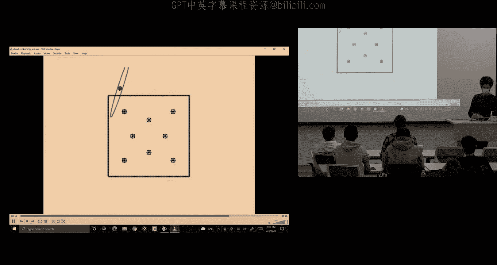
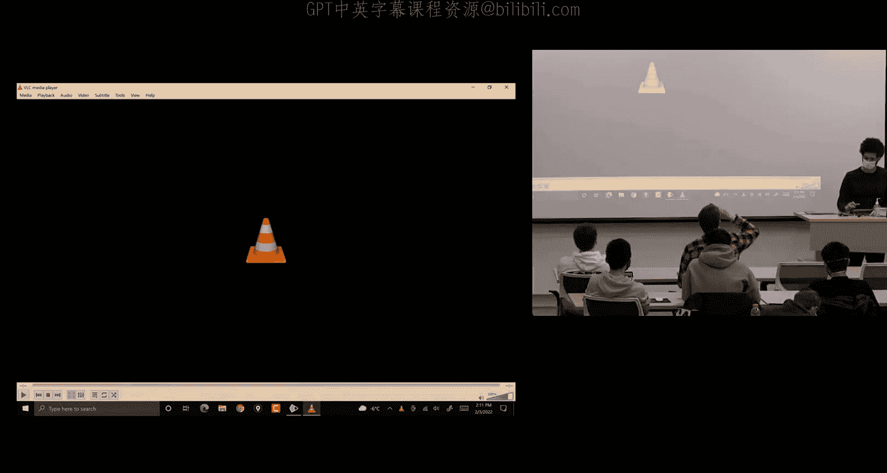
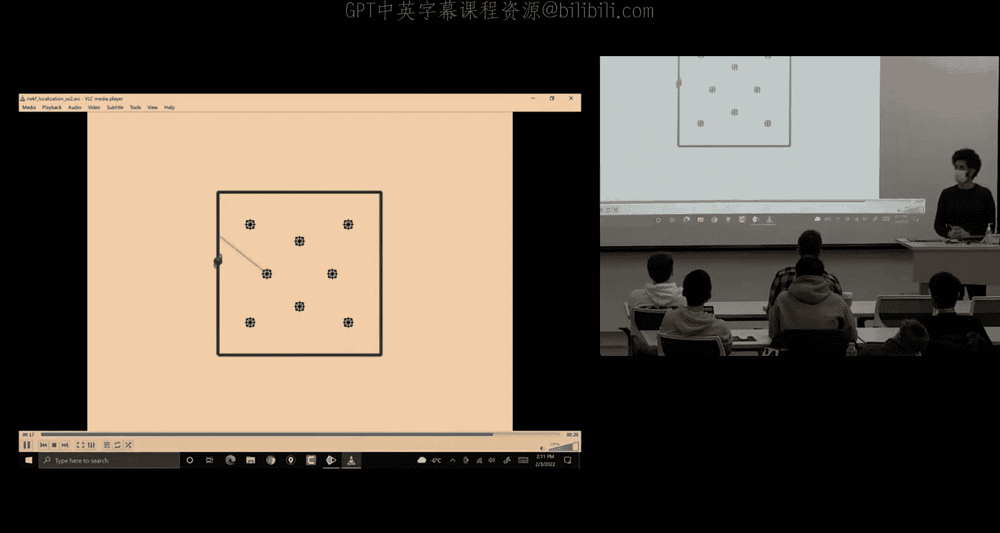
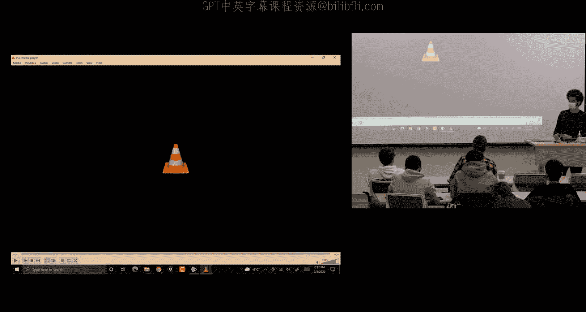
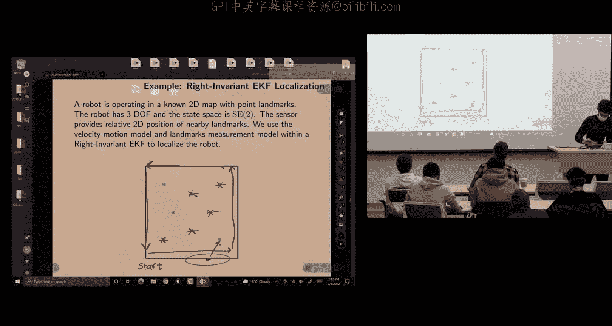
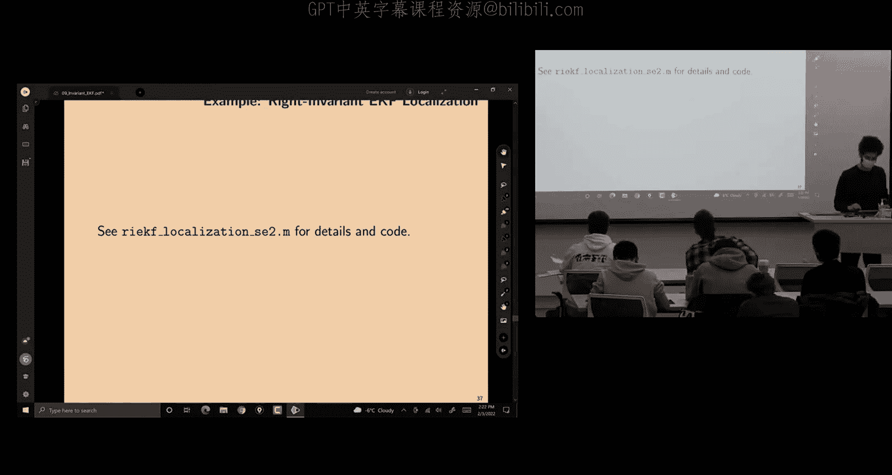

# 移动机器人：方法与算法：09：不变卡尔曼滤波 I

## 概述

在本节课中，我们将学习一种称为**不变卡尔曼滤波**的状态估计方法。这种方法利用了李群和李代数的结构，特别是**指数坐标**，来设计滤波器。它的核心优势在于能够**保持系统的几何对称性**，从而在某些非线性问题上获得比传统扩展卡尔曼滤波更优、更一致的性能。我们将从动机出发，理解其核心思想，并学习如何推导和应用这种滤波器。

---

## 动机：为什么需要不变滤波？

上一节我们介绍了基于李群的误差定义。本节中，我们来看看为什么这种定义方式如此重要。

许多机器人系统（如移动机器人、无人机）的状态自然地存在于矩阵李群上（例如 SE(2), SE(3), SO(3)）。当使用传统的扩展卡尔曼滤波处理这类问题时，如果错误地将旋转和平移的误差分离开来建模，会**破坏系统的几何结构**。

这会导致两个主要问题：
1.  **不一致的协方差传播**：在机器人同时移动和旋转时，滤波器无法正确捕捉不确定性在状态空间中的真实形状（例如产生“香蕉形”分布），可能导致过于乐观或悲观的不确定性估计。
2.  **虚假的相关性**：当系统在某个维度（如航向角）完全不确定时，这种不确定性会被错误地传播到其他不相关的维度（如位置），导致整体估计迅速发散，变得无用。

不变卡尔曼滤波通过**尊重李群结构**的误差定义，能够自然地保持这种对称性，从而避免上述问题，实现更一致、更鲁棒的估计。

---

## 核心思想：从线性系统获得的启示

为了理解不变滤波的设计目标，我们先回顾一个线性系统的理想特性。

考虑一个确定性线性时不变系统：
`dx/dt = A x + B u`
定义估计误差为：`e = x - x_bar`。
对其求导并代入系统方程，我们可以得到误差的动态方程：
`de/dt = A e`

这个结果非常吸引人：
*   **误差动态是自治的**：它**只依赖于误差本身**，而与真实的系统轨迹 `x(t)` 或估计轨迹 `x_bar(t)` 无关。
*   **误差传播可精确求解**：给定初始误差 `e(0)`，我们可以精确地预测未来任意时刻的误差：`e(t) = exp(A t) e(0)`。

这意味着，无论初始估计有多差，误差的演化规律都是独立且可预测的。**不变卡尔曼滤波的目标，就是为满足特定结构的非线性系统（在李群上演化），也找到一种误差定义和坐标，使得误差动态具有类似的自治线性形式。**

---

## 反面教材：欧拉角参数化的问题

让我们通过一个具体例子，看看如果不用李群结构会有什么麻烦。考虑使用IMU中的陀螺仪进行3D姿态估计。

如果选择欧拉角 `q = [φ, θ, ψ]^T` 作为状态，其动力学方程为：
`dq/dt = E(q)^{-1} ω`
其中 `ω` 是陀螺仪测量的角速度，`E(q)` 是依赖于当前欧拉角的矩阵。

定义欧拉角误差为 `δq = q - q_bar`，并对其进行线性化，得到的误差动态方程形如：
`d(δq)/dt ≈ A(q_bar, ω) δq`

这里的关键问题是：**矩阵 `A` 依赖于当前的姿态估计 `q_bar`**。如果初始估计误差很大，那么用于传播误差的 `A` 矩阵本身就是错误的。这会导致“错误的估计 -> 错误的传播 -> 更错的估计”这样的正反馈循环，可能导致滤波器发散。这正是我们想要避免的。

---

## 解决方案：基于李群的不变误差

现在，我们切换到李群的框架下解决同一个问题。

### 不变误差的定义

设真实状态 `X` 和估计状态 `X_bar` 都是李群 `G` 中的元素。我们定义两种不变误差：
*   **右不变误差**：`η_r = X_bar * X^{-1}`
*   **左不变误差**：`η_l = X^{-1} * X_bar`

这里的“不变”是指：如果我们用同一个群元素 `L` 对状态进行变换（例如同时旋转整个坐标系），误差值 `η` 不会改变。这体现了滤波器对系统对称性的尊重。

### 自治误差动态定理（定理一）

对于一个状态在李群上演化的系统，其过程模型为 `dX/dt = f(X, u)`。如果函数 `f` 满足特定的**群仿射**性质，那么对应的不变误差 `η` 的动态方程将具有以下形式：
`dη/dt = g(η, u)`
**关键**：这个方程**不依赖于状态估计 `X_bar`**，只依赖于误差 `η` 和输入 `u`。这与线性系统中的自治误差动态目标一致。

### 对数线性性质定理（定理二）

这是不变滤波的核心理论结果。对于满足群仿射性质的过程模型，如果我们定义李代数中的误差向量 `ξ`（满足 `η = exp(ξ^∧)`），那么 `ξ` 的动态方程是**严格线性**的：
`dξ/dt = A(u) ξ`
并且，这个线性关系是**精确的**，而不仅仅是一阶近似。这意味着，我们可以像处理线性系统一样，精确地预测和传播李代数空间中的误差：
`ξ(t) = Φ(t, 0) ξ(0)`，其中 `Φ` 是状态转移矩阵。

**证明概要（以SO(3)上的左不变误差为例）**：
1.  对于陀螺仪模型 `dR/dt = R ω^∧`，定义左不变误差 `η = R^T R_bar`。
2.  推导出其动态方程：`dη/dt = -ω^∧ η + η ω^∧`。
3.  令 `η = exp(ξ^∧)`，并进行一阶近似（`exp(ξ^∧) ≈ I + ξ^∧`），代入上式。
4.  利用SO(3)李括号的性质 `[A, B] = A^∧ B^∧ - B^∧ A^∧`，化简得到：`dξ^∧/dt ≈ -ω^∧ ξ^∧ + ξ^∧ ω^∧ = [ξ^∧, ω^∧]`。
5.  对于向量，这等价于 `dξ/dt = -ω × ξ = (-ω^×) ξ`。这里 `A = -ω^×`。
6.  可以进一步证明，从精确解出发也能得到相同的线性方程，说明一阶近似在此情况下没有丢失信息，该线性关系是精确的。

这个定理告诉我们，**对于这类系统，在李代数空间中，误差传播是全局线性的**。这为设计高性能滤波器奠定了坚实基础。

---

## 构建不变卡尔曼滤波器

有了理论准备，我们现在可以构建不变扩展卡尔曼滤波器的具体步骤。算法分为预测（传播）和更新（校正）两步。

### 1. 预测步骤

预测步骤负责利用过程模型来推进状态估计和其不确定性。

*   **状态估计传播**：直接积分李群上的过程模型。
    `d(X_bar)/dt = f(X_bar, u)`
    离散形式通常为：`X_bar_{k+1} = X_bar_k * exp((u_k Δt)^∧)`

*   **协方差传播**：
    1.  根据过程模型和选择的误差定义（左不变或右不变），确定李代数空间中的误差动态矩阵 `A`。对于像 `dX/dt = X u^∧` 这样的运动学模型，若选择右不变误差，则 `A = 0`。
    2.  离散化连续时间的协方差微分方程。对于线性误差动态 `dξ/dt = A ξ + w`（`w` 为噪声），其协方差 `P` 的传播方程为：
        `dP/dt = A P + P A^T + Q`
        其中 `Q` 是过程噪声协方差密度矩阵。
    3.  离散化后得到：
        `P_{k+1}^- = Φ_k P_k^+ Φ_k^T + Q_d`
        其中 `Φ_k ≈ exp(A Δt) ≈ I + A Δt` 是离散状态转移矩阵，`Q_d` 是离散化的过程噪声协方差。

### 2. 更新步骤

更新步骤在收到观测值时，修正状态估计和协方差。

*   **观测模型**：为了与不变框架兼容，观测模型需要具有特定形式。例如，对于右不变观测模型：
    `y = X^{-1} * b + v`
    其中 `b` 是一个常向量（例如地图中的地标位置），`v` 是观测噪声。这种形式常见于机器人定位问题，即传感器测量的是地标在机器人本体坐标系下的位置。

*   **创新与增益计算**：
    1.  计算创新（Innovation）：`ν = y - (X_bar^-)^{-1} * b`。注意，这是在李代数空间或对应向量空间中的量。
    2.  计算观测矩阵 `H`：通过线性化观测模型得到，它映射李代数误差 `ξ` 到观测空间。`H` 的具体形式取决于误差定义和观测模型。
    3.  计算卡尔曼增益 `K`：
        `K = P^- H^T (H P^- H^T + R)^{-1}`
        其中 `R` 是观测噪声协方差矩阵。这个公式与标准卡尔曼滤波完全相同。

*   **状态与协方差更新**：
    1.  **状态更新**：更新发生在李群上，通过指数映射将李代数空间的修正量加回到状态中。
        *   对于右不变滤波：`X_bar^+ = exp((K ν)^∧) * X_bar^-`
        *   对于左不变滤波：`X_bar^+ = X_bar^- * exp((K ν)^∧)`
    2.  **协方差更新**：使用标准的卡尔曼更新公式。
        `P^+ = (I - K H) P^-`

---

## 应用实例：机器人定位

考虑一个在平面SE(2)上移动的机器人，它带有测距/测向传感器，可以观测到环境中已知位置的地标。

*   **过程模型**：`dX/dt = X u^∧`，其中 `u = [v, ω]^T` 包含线速度和角速度。这是一个群仿射模型。
*   **观测模型**：机器人观测到地标 `m` 在本体坐标系下的位置。这可以写为：
    `y = X^{-1} * \tilde{m} + v` （其中 `\tilde{m}` 是地标的齐次坐标 `[m_x, m_y, 1]^T`）
    这正是一个**右不变观测模型**（`b = \tilde{m}`）。
*   **滤波器设计**：由于过程模型是群仿射，且观测模型是右不变的，我们可以构建一个**右不变扩展卡尔曼滤波器**。
    *   **预测**：`A = 0`，因此协方差传播简化为 `P_{k+1}^- = P_k^+ + Q_d`。
    *   **更新**：需要计算该观测模型对应的 `H` 矩阵。通过推导可得，对于单个地标，`H` 矩阵能揭示系统的可观测性：仅观测一个地标无法确定机器人的绝对航向；但同时观测两个不共线的地标，则整个状态（位置和航向）都是可观测的。

通过仿真可以看到，使用不变卡尔曼滤波，即使在观测稀疏的情况下，协方差椭圆也能更真实地反映机器人实际的不确定性（例如在旋转时保持不确定性主要分布在切向方向），并且滤波器表现更加稳定。

---

## 总结

本节课我们一起学习了不变卡尔曼滤波器的基本原理和设计方法。

*   **核心动机**：传统EKF在处理李群状态时可能破坏几何结构，导致不一致的估计。不变滤波通过保持对称性来解决这一问题。
*   **理论基础**：关键在于定义**左不变或右不变误差**，并利用**群仿射**系统特有的两个定理，使得李代数空间中的误差动态是**自治且线性**的。
*   **滤波器结构**：算法流程与EKF类似，但状态更新在李群上进行（指数映射），误差和协方差在李代数（向量空间）中处理。预测步需要求取误差动态矩阵 `A`，更新步需要求取观测矩阵 `H`。
*   **优势**：能提供更一致、更鲁棒的估计性能，特别适用于状态在李群上演化、且传感器模型符合不变形式的机器人定位、姿态估计等问题。

下一节课，我们将探讨如何将不变卡尔曼滤波器应用于更复杂的IMU/GPS组合导航问题。