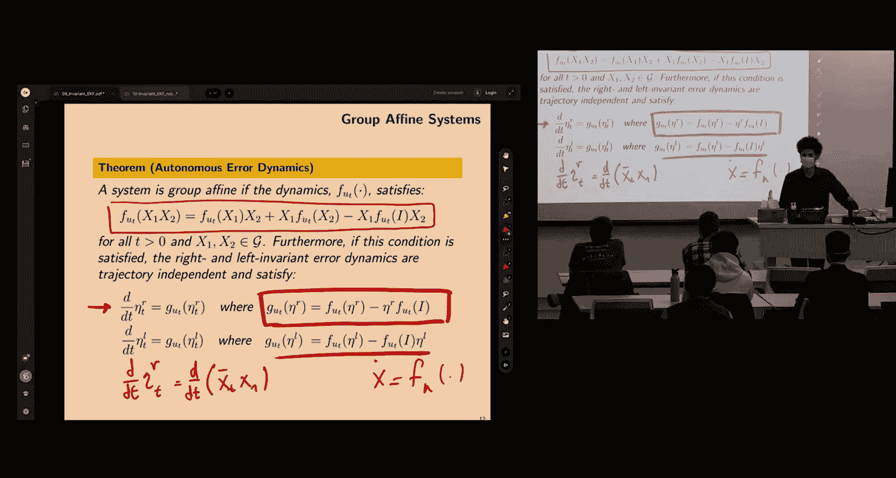
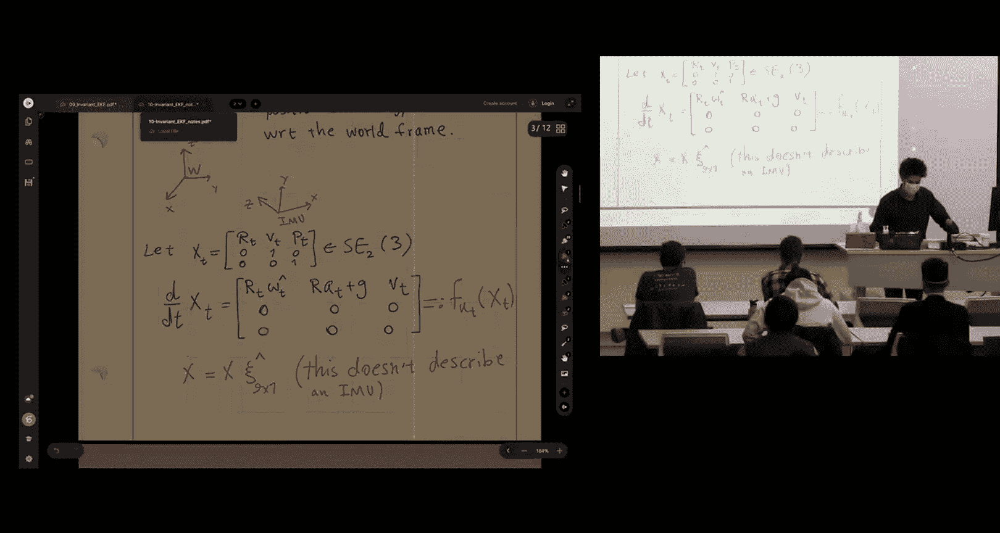
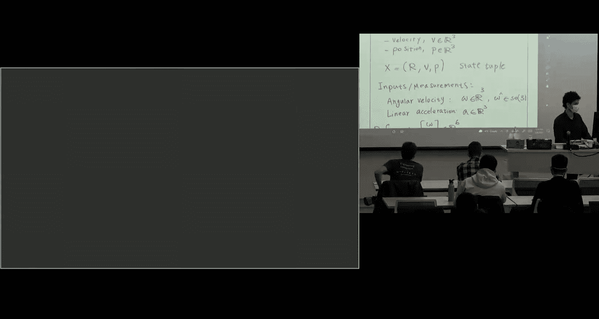
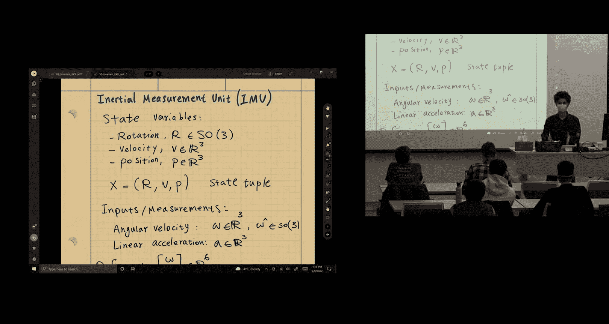
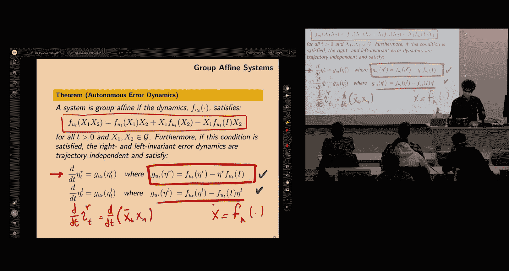
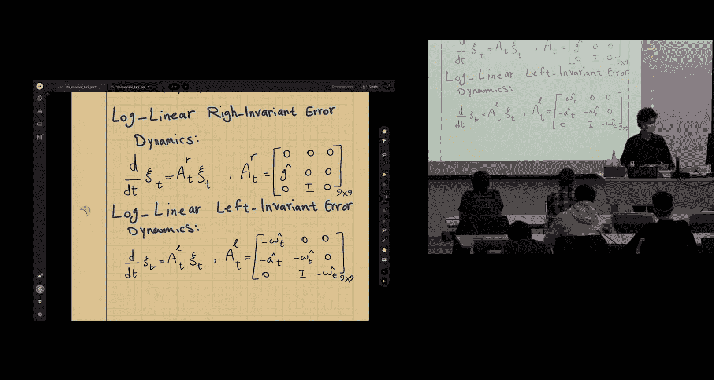
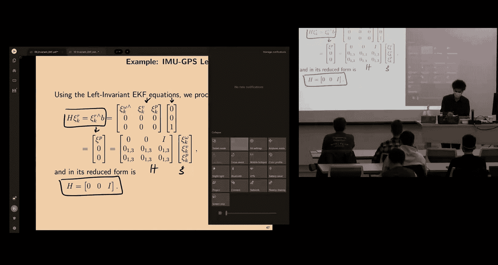
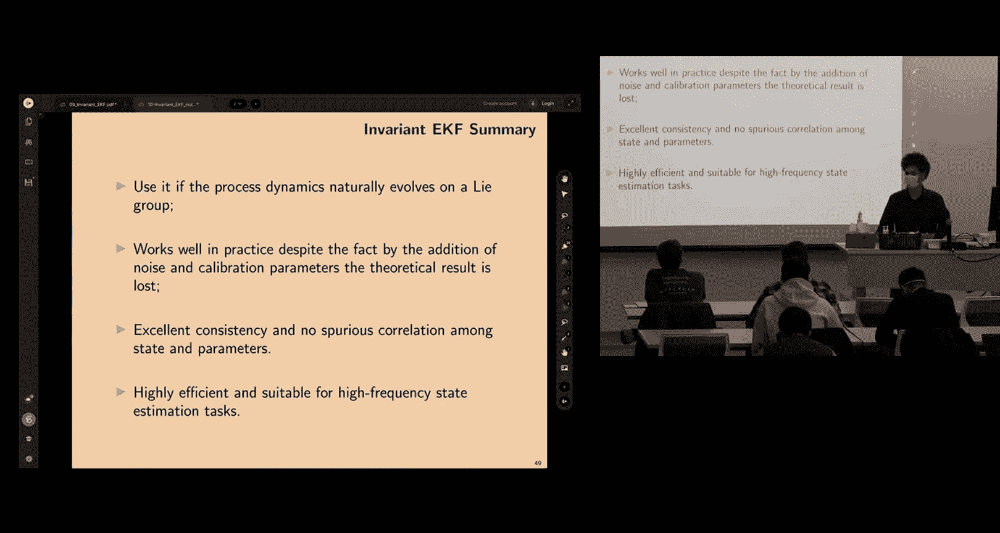

# 移动机器人：方法与算法：10：不变卡尔曼滤波 II

## 概述

在本节课中，我们将继续学习不变状态估计。我们将深入探讨一个非常有趣的传感器——惯性测量单元（IMU），并学习如何将其建模并融入不变状态估计的框架中。我们将通过一个结合IMU和GPS的左不变扩展卡尔曼滤波（IEKF）示例，来理解为什么观测模型有“左”或“右”之分，以及如何推导误差更新方程。

---

## IMU传感器建模

上一节我们介绍了不变扩展卡尔曼滤波的基本思想和示例。本节中，我们来看看如何对惯性测量单元（IMU）进行数学建模。

IMU是一种小型传感器，常见于智能手机中。其最基本的形式包含一个陀螺仪和一个线性加速度计。
*   **陀螺仪**：测量传感器自身坐标系下的旋转角速度。
*   **线性加速度计**：测量传感器自身坐标系下的线性加速度。

传感器的精度和成本相关。我们关注的是其数学模型和算法，而非硬件设计。

### 状态变量

我们需要跟踪传感器的姿态、速度和位置。状态变量定义如下：
*   **旋转 R**：属于特殊正交群 **SO(3)**，是一个旋转矩阵。
*   **速度 V**：传感器相对于某个世界坐标系的速度（三维向量）。
*   **位置 P**：传感器相对于世界坐标系的位置（三维向量）。

为了有序地组织这些不同类型的变量（矩阵和向量），我们使用**元组**来表示状态：**X = (R, V, P)**。元组能保持顺序，而集合则不能。一旦选定顺序，在后续所有矩阵运算中必须保持一致。

### 输入（测量值）

IMU直接提供的测量值（输入）为：
*   **角速度 ω**：三维向量。
*   **线性加速度 a**：三维向量。

我们可以将输入定义为六维向量：**u = [ω^T, a^T]^T**。这些测量值都是在传感器自身坐标系（即“机体坐标系”）下读取的。

### 为何需要速度状态？

因为加速度是位置的二阶导数。为了建立一阶常微分方程组（ODE）并进行级联积分，我们需要引入速度作为中间状态。传感器提供加速度，一次积分得到速度，二次积分得到位置。积分次数越多，误差累积越快，这是IMU定位的主要挑战之一。

---

## 双直接等距群 SE₂(3)

为了在群论框架下对IMU状态进行建模，我们引入一个矩阵李群：**双直接等距群 SE₂(3)**。这个群是SE(3)群的扩展，额外包含了一个速度向量空间。

### 群元素

该群中的矩阵形式如下：

```
X = [ R   V   P ]
    [ 0   1   0 ]
    [ 0   0   1 ]
```

其中 **R ∈ SO(3)**, **V ∈ R³**, **P ∈ R³**。这是一个5x5的矩阵。该群的维度是9（旋转3维 + 速度3维 + 位置3维）。

### 李代数

对应的李代数元素（广义的“ twist ”）是一个九维向量：

```
ξ = [ ω, v, p ]^T
```

其“楔形”运算符（∧）将其映射为李代数矩阵：

```
ξ^∧ = [ ω^∧   v   p ]
      [   0    0   0 ]
      [   0    0   0 ]
```

### 伴随映射

伴随映射 **Ad_X** 是一个9x9的矩阵，其形式取决于状态变量的顺序。对于上述顺序，其结构大致如下：

```
Ad_X = [  R     0     0 ]
       [ V^∧R   R     0 ]
       [ P^∧R   0     R ]
```

伴随映射的作用与在SO(3)和SE(3)中类似：用于在不同点之间映射“速度”或协方差。所有为矩阵李群推导的公式（如协方差传播方程）对此群同样成立，这体现了该框架的便利性——无需为每个新问题重新推导。





---




## IMU过程模型



现在，我们为IMU建立连续时间过程模型。我们假设跟踪传感器相对于一个固定世界坐标系的姿态、速度和位置。

### 确定性模型

运动学方程如下：
1.  **旋转**：**Ṙ = R ω^∧**
2.  **速度**：**V̇ = R a - g** （其中 **g** 是世界坐标系下的重力向量）
3.  **位置**：**Ṗ = V**

将上述方程写成矩阵形式，状态 **X** 的导数为：

```
Ẋ = [ Ṙ   V̇   Ṗ ]   =   [ R ω^∧   R a - g   V ]
    [ 0    0    0 ]       [   0       0       0 ]
    [ 0    0    0 ]       [   0       0       0 ]
```

可以验证，这个确定性过程模型满足**群仿射**性质。这意味着，尽管模型是非线性的，但其误差动力学具有**对数线性**的优良性质。因此，在确定性情况下，我们可以精确地积分状态并传播协方差，无需线性化近似。

### 含噪声模型



现实中，IMU测量存在噪声。我们通常在测量源处添加噪声：
*   **陀螺仪测量**：**ω_m = ω + n_ω**
*   **加速度计测量**：**a_m = a + n_a**

其中 **n_ω** 和 **n_a** 是零均值加性高斯白噪声。将噪声代入确定性模型，得到随机过程模型：

```
Ẋ = [ R (ω_m^∧ - n_ω^∧)   R (a_m - n_a) - g   V ]
    [          0                   0            0 ]
    [          0                   0            0 ]
```



这可以整理为 **Ẋ = f(X, u) - X (n^∧)** 的形式，其中 **n = [n_ω, n_a, 0]^T** 是一个九维噪声向量。这种噪声结构是从传感器物理模型中自然推导出来的。

### 偏置

实际IMU还存在随时间缓慢变化的偏置。完整的模型需要将角速度偏置 **b_ω** 和加速度偏置 **b_a** 作为状态变量进行估计，并从测量值中减去：**ω = ω_m - b_ω**, **a = a_m - b_a**。加入偏置会破坏完美的群对称性，但滤波器在实际中仍能表现优异。

---

## 左不变EKF的传播步骤

我们将构建一个融合IMU（用于预测）和GPS（用于校正）的**左不变扩展卡尔曼滤波器**。

### 离散化

我们需要对连续时间模型进行离散化以在计算机上实现。假设在一个采样周期 **Δt** 内，IMU的角速度和加速度测量值保持恒定（零阶保持），我们可以对过程模型进行精确积分。

离散化的状态转移方程形式如下：

```
X_{k+1} = X_k * exp( (A(u_k) * Δt)^∧ )
```

其中 **A(u)** 是来自对数线性误差动力学的系统矩阵。对于左不变误差定义，该矩阵为：

```
A^L = [ 0     0    0 ]
      [ a^∧   0    0 ]
      [ 0     I    0 ]
```

离散化还会产生一些积分项（如 **Γ₀, Γ₁, Γ₂**），它们是关于 **ω** 的矩阵指数及其积分的函数，有闭式解。

### 协方差传播

连续时间下的协方差传播遵循李雅普诺夫方程：

```
Ṗ = A P + P A^T + Q
```

其中 **Q** 是过程噪声协方差矩阵的连续时间等效。该方程可以从离散时间卡尔曼滤波的协方差更新公式，通过一阶近似（**Φ ≈ I + A Δt**）并取 **Δt → 0** 的极限推导出来。

在离散时间实现中，我们使用离散化的状态转移矩阵 **Φ** 和离散过程噪声协方差 **Q_d** 来传播协方差：**P_{k+1|k} = Φ P_{k|k} Φ^T + Q_d**。

---

## GPS观测模型与校正

预测步骤由IMU处理。现在，我们来看校正步骤，即如何将GPS观测融入滤波器。

### 观测模型

GPS提供传感器在世界坐标系中的位置测量 **z_GPS**。我们的状态矩阵 **X** 中包含位置 **P**。因此，观测方程可以写为：

```
z = H * X   （左不变观测模型）
```

其中观测矩阵 **H** 用于从状态矩阵中“提取”位置。为了匹配矩阵乘法维度，我们定义：

```
H = [ 0  0  I ] （一个3x5的矩阵）
B = [ 0  0  I ]^T （一个5x3的矩阵）
```

使得 **z = H X = P**。这正是一个**左不变观测模型**的形式：**z = B^T X**。

### 观测雅可比矩阵

对于左不变EKF，我们需要计算观测雅可比矩阵 **H**。根据公式 **H = (B^T ξ^∧)^∨** 进行计算，可以得到一个常数矩阵：

```
H = [ 0  0  I ] （一个3x9的矩阵，去除了冗余零行）
```

这意味着校正与状态估计值无关，这非常简洁。

---

## 实践挑战与总结

### 实施挑战

在实际构建该滤波器时，可能会遇到以下挑战：
1.  **数据同步与速率**：IMU频率高（如100Hz），GPS频率低（如10Hz），需要处理不同步的测量。
2.  **偏置估计**：必须估计并补偿IMU的偏置，否则在GPS更新间隔内会产生显著漂移。
3.  **传感器标定**：IMU和GPS可能安装在不同位置，需要知道它们之间的刚性变换（外参），并将GPS测量值转换到IMU坐标系。
4.  **噪声调参**：GPS数据可能跳跃较大，需要仔细调整过程噪声和观测噪声的协方差矩阵。
5.  **环境限制**：GPS在室内、城市峡谷或多路径效应严重的区域不可靠。

### 左右不变滤波器的关系

左不变和右不变滤波器可以通过伴随映射 **Ad_X** 相互转换误差和协方差。即使因为加入偏置而破坏了完美的理论性质，这种映射关系仍然近似存在，为灵活设计滤波器提供了可能。



### 总结

本节课中，我们一起学习了：
1.  如何对**惯性测量单元（IMU）**进行数学建模，并将其状态定义为**双直接等距群 SE₂(3)** 的元素。
2.  IMU的确定性过程模型具有**群仿射**性质，导致其误差动力学是**对数线性**的，允许精确的协方差传播。
3.  如何建立IMU的含噪声过程模型，并离散化用于预测步骤。
4.  如何将**GPS**的位置测量建模为**左不变观测模型**，并推导其常数观测雅可比矩阵。
5.  构建了一个**IMU-GPS左不变扩展卡尔曼滤波器**的理论框架，并讨论了实际应用中可能遇到的挑战。



不变卡尔曼滤波为处理自然演化在李群上的状态估计问题提供了一个强大且一致的框架，尽管存在噪声和偏置等非理想因素，它在实践中仍然是首选方法，性能优于许多替代方案。