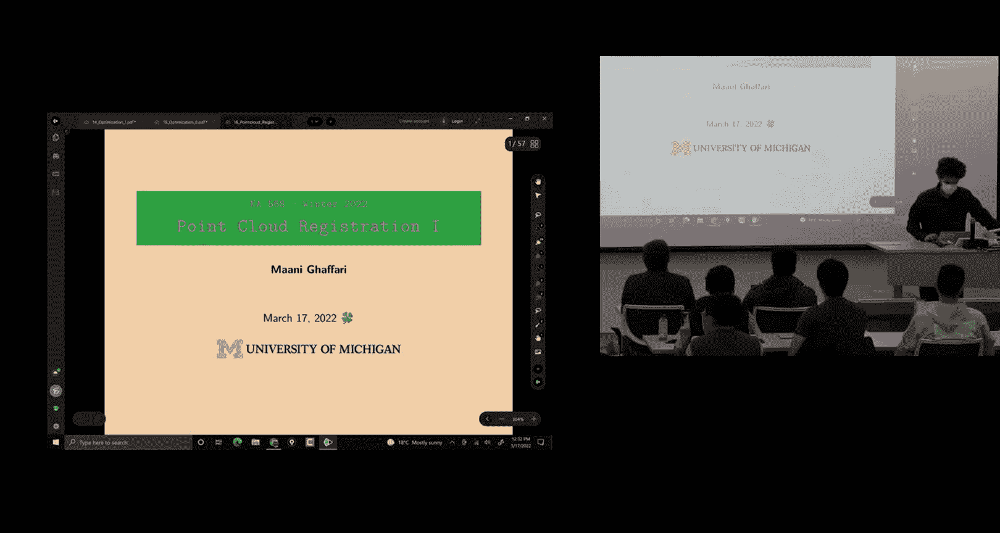
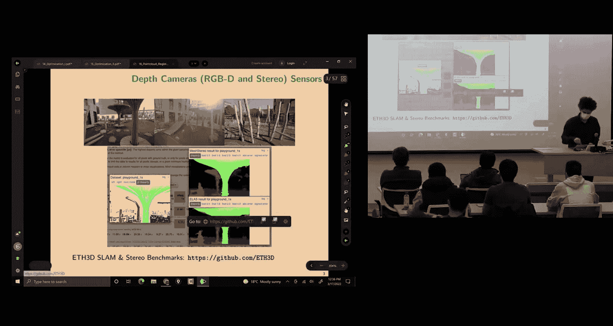
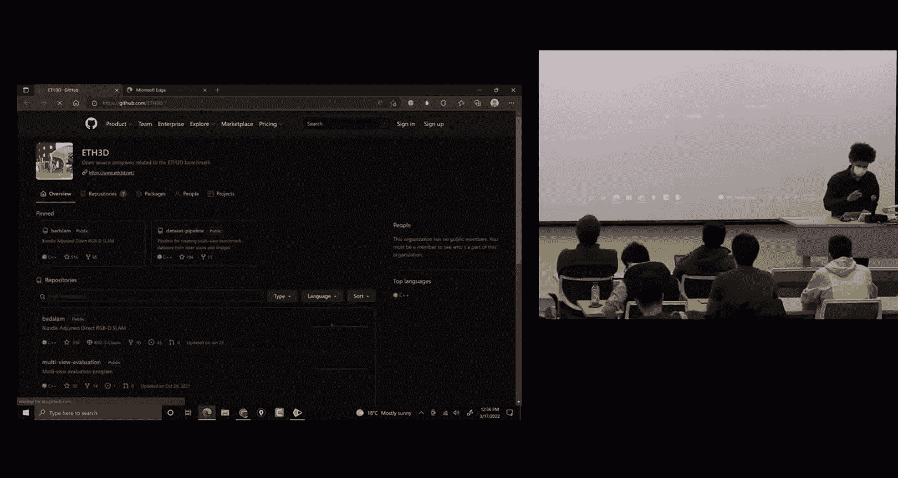
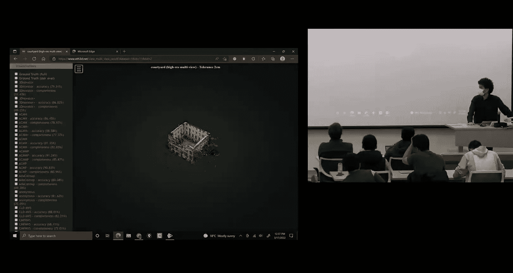
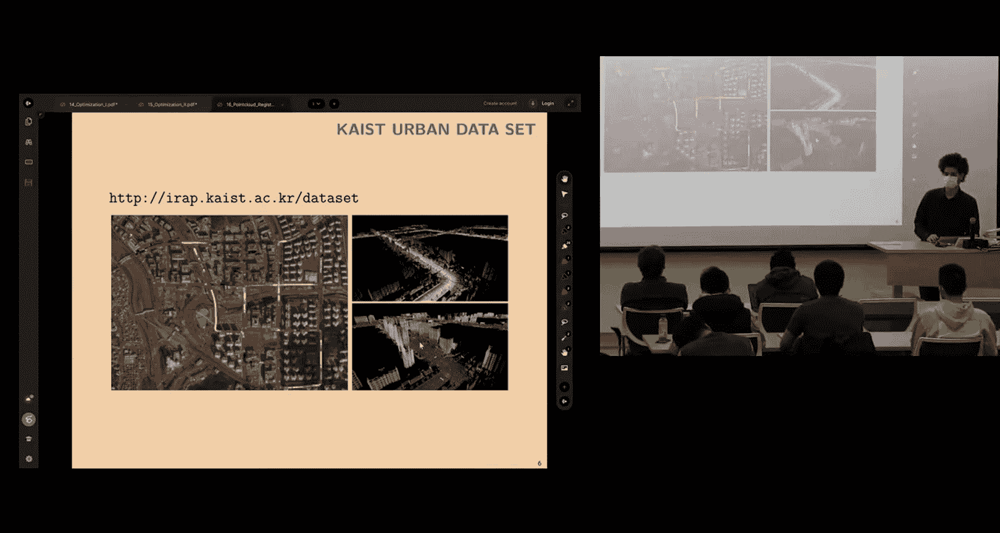
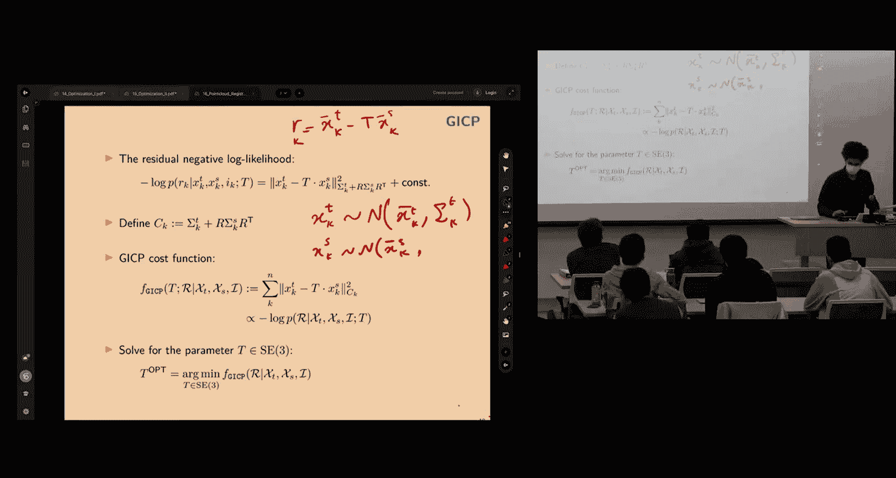
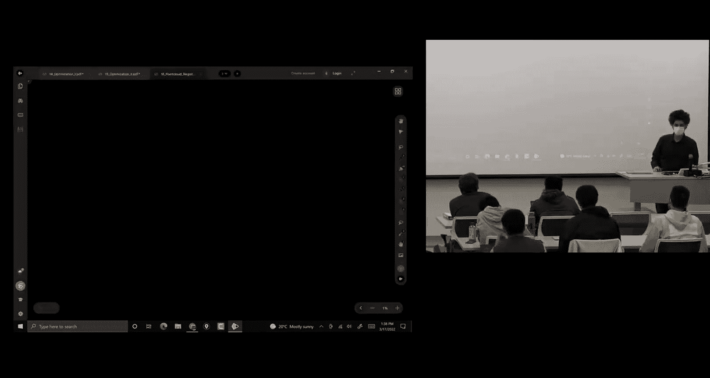
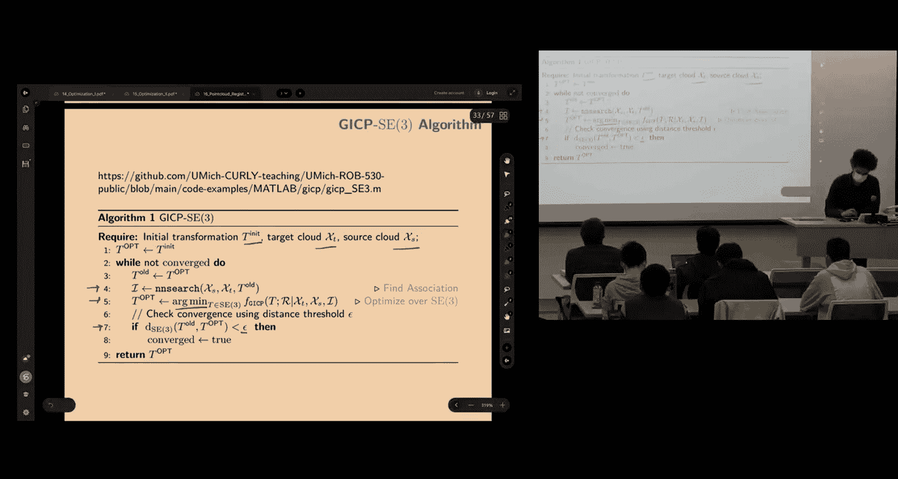
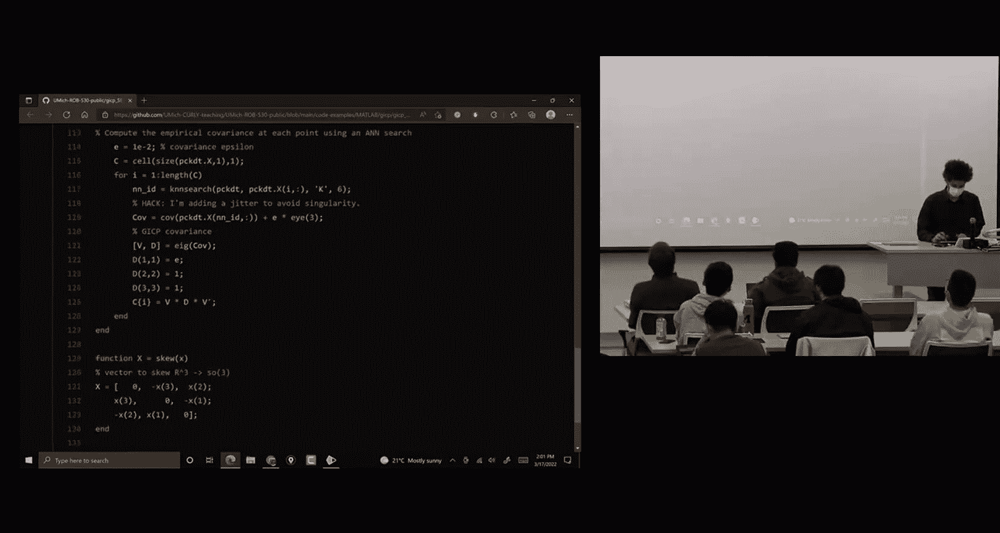
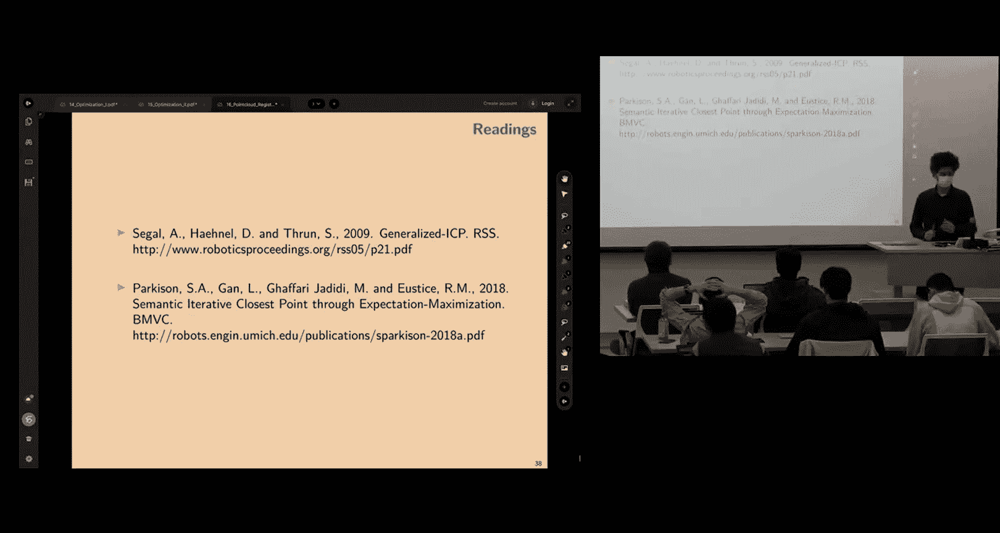

# 移动机器人：方法与算法：16：点云配准 I 🧩

在本节课中，我们将要学习点云配准的基础知识。点云配准是机器人感知中的一个核心问题，旨在找到两个点云数据集之间的几何变换关系。我们将从问题定义开始，介绍经典的迭代最近点算法及其改进版本，并探讨实际应用中的挑战与解决方案。

## 点云数据来源 📷

上一节我们介绍了点云配准的基本概念，本节中我们来看看点云数据通常从哪些传感器获取。

以下是几种常见的点云数据来源：

*   **RGB-D相机**：这类深度相机能提供三维点坐标、深度值以及对应的RGB彩色图像。每个RGB像素都有一个对应的深度值，从而生成密集的深度图。它们通常适用于室内环境，有效范围通常在10米以内。
*   **立体相机**：通过左右两个图像，利用视差原理计算像素的深度值。这是一种被动式深度感知方法。著名的ELAS库可用于从图像对中恢复深度。
*   **激光雷达**：一种主动式传感器，通过发射光束并测量飞行时间来获取距离信息。它不依赖环境光照，通常提供点云的反射强度信息，但不直接提供颜色。

## 什么是配准问题？ 🎯

在了解了数据来源后，我们正式定义点云配准问题。

点云配准问题是指**寻找两个数据集之间的几何关系**。在机器人学背景下，数据通常来自传感器（如激光雷达或深度相机）。我们通常寻找的几何关系是一个**刚体变换**。

我们可以将配准算法按不同维度分类：

*   **分辨率**：分为**粗配准**（快速获取大致变换，用于先验或地点识别）和**精配准**（追求精确对齐，用于场景重建）。
*   **方法**：分为**直接法**（使用原始观测值，如原始点云）和**间接法**（使用从数据中提取的**特征**，如SIFT、ORB等具有尺度或旋转不变性的特征）。
*   **求解范围**：分为**局部求解**（需要较好的初始猜测）和**全局求解**（能处理更大的初始不对齐，但通常更慢）。

## 问题形式化与ICP算法 🔄

现在我们已经对问题有了基本认识，本节我们来形式化点云配准问题并介绍经典的ICP算法。

我们有一个由三维点组成的集合，每个点有3个坐标：`x_i ∈ R^3`。

一个刚体变换的作用定义为：`T(x) = R * x + p`，其中 `R ∈ SO(3)` 是旋转矩阵，`p ∈ R^3` 是平移向量。因此，变换参数 `T = (R, p)` 是特殊欧几里得群 `SE(3)` 的一个元素，这正是我们需要估计的参数。

我们定义两个点云：
*   **目标点云**：被视为位于固定参考系中的点云。
*   **源点云**：我们需要对其应用变换 `T`，使其与目标点云对齐。

**迭代最近点** 算法是解决该问题最著名的方法之一，其核心思想分为两步：
1.  **关联查找**：给定当前变换猜测，为源点云中的每个点，在目标点云中寻找**最近邻点**作为对应点。
2.  **求解变换**：根据找到的对应点对，通过最小化点对之间的距离来求解最优变换。

然后迭代重复这两个步骤，直到收敛。

为什么需要关联查找？因为传感器只提供点云，我们**不知道**源点云中的哪个点对应目标点云中的哪个点。如果我们知道完美的对应关系，问题有闭式解。但在现实中，对应关系是未知的，ICP通过迭代最近邻来近似。

距离残差通常定义为对应点之间的欧氏距离：`r_i = y_i - (R * x_i + p)`，其中 `(x_i, y_i)` 是一对对应点。优化问题是最小化所有残差的平方和。

## 广义ICP与概率模型 📊

基本的ICP算法存在局限性，例如对初始猜测敏感、容易陷入局部最优。本节我们介绍其改进版本——广义ICP，它引入了概率模型。

GICP的核心思想是**不再将点视为精确位置，而是视为具有不确定性的高斯分布**。我们为每个点估计一个局部协方差矩阵，该矩阵描述了该点周围的局部形状（例如，墙面上的点，其法线方向的方差很小）。

通过**特征值分解**，我们可以调整协方差矩阵，使其在假设的表面法线方向变得“平坦”（即特征值很小）。这样，配准就从**点对点**匹配变成了**概率分布对概率分布**的匹配。

在新的概率模型下，残差 `r_i = y_i - T(x_i)` 被视为两个高斯分布的差，其协方差为：`C_i = Σ_{y_i} + R * Σ_{x_i} * R^T`。

优化目标变为最小化**马氏距离**：`∑ r_i^T * C_i^{-1} * r_i`。这等价于在假设观测为高斯分布下的**最大似然估计**。这种加权距离度量能更好地利用环境的结构信息，提高配准的鲁棒性和准确性。

## 实现细节与挑战 ⚙️

理解了GICP的原理后，我们来看看具体的实现细节以及实际应用中面临的挑战。

**最近邻搜索**：高效查找最近邻是关键。通常使用 **KD-Tree** 数据结构，它可以将搜索复杂度从 `O(n)` 降低到 `O(log n)`。常用的库包括FLANN和nanoflann。

**在SE(3)上优化**：我们需要在流形 `SE(3)` 上求解优化问题。通过定义扰动 `Δξ`（一个李代数元素），我们可以计算残差关于扰动的雅可比矩阵，然后使用高斯-牛顿或列文伯格-马夸尔特方法迭代求解。

**代码流程概述**：
1.  输入目标点云、源点云和初始变换猜测（常设为单位阵）。
2.  为每个点计算局部协方差矩阵。
3.  **While** 未收敛且未超最大迭代次数：
    *   用当前变换移动源点云。
    *   在目标点云中为移动后的源点寻找最近邻（可设置最大距离阈值剔除离群点）。
    *   构建雅可比矩阵和残差，求解增量 `Δξ`。
    *   更新变换：`T_{k+1} = exp(Δξ) · T_k`。
    *   检查变换更新量是否小于阈值以判断收敛。

**主要挑战**：
*   **未知对应关系**：这是根本难点。
*   **需要良好初始猜测**：非线性优化易陷入局部最优。
*   **部分与未知重叠**：两个点云可能只有部分区域重叠，且重叠区域未知。
*   **离群点**：错误关联会严重干扰优化。

**应对策略**：
*   使用**鲁棒损失函数**（如柯西损失）替代平方损失，以软忽略离群点。
*   结合其他传感器（如IMU）提供初始猜测。
*   在序列配准中，使用上一帧的结果作为下一帧的初始值。

## 扩展：语义ICP 🏷️

最后，我们探讨一个现代扩展方向——语义ICP，它利用点云的语义信息来改进配准。

基本思想是：如果知道每个点的语义类别（如“道路”、“建筑”、“车辆”），那么配准时应主要让**同类别的点**相互匹配。这可以极大地缩小数据关联的搜索空间，减少歧义。

实现上，可以将语义概率信息融入GICP的框架。通过**期望最大化** 步骤，软性地计算点与点之间属于同一类别的权重，并将此权重融入关联和加权过程中。这相当于在几何距离的基础上，增加了一个语义相似性度量，从而能更准确地引导变换求解。

实验表明，语义ICP能在传统GICP的基础上，进一步提升配准精度，尤其是在平移估计方面。

## 总结 📝

本节课中我们一起学习了点云配准的基础知识。我们从问题定义出发，介绍了点云数据的常见来源。然后，我们详细讲解了经典的ICP算法及其核心迭代步骤：关联查找与变换求解。为了克服ICP的局限性，我们引入了广义ICP，它通过概率模型和局部协方差描述，将点对点匹配提升为分布对分布匹配，提高了鲁棒性。我们还讨论了实现中的关键细节，如KD-Tree搜索和在SE(3)流形上的优化，并指出了实际应用中的主要挑战。最后，我们展望了利用语义信息进一步改进配准的语义ICP方法。点云配准是机器人感知、SLAM和三维重建的基石，理解这些基本方法为进一步探索更先进的算法打下了坚实基础。