# 移动机器人：方法与算法：20：SLAM II

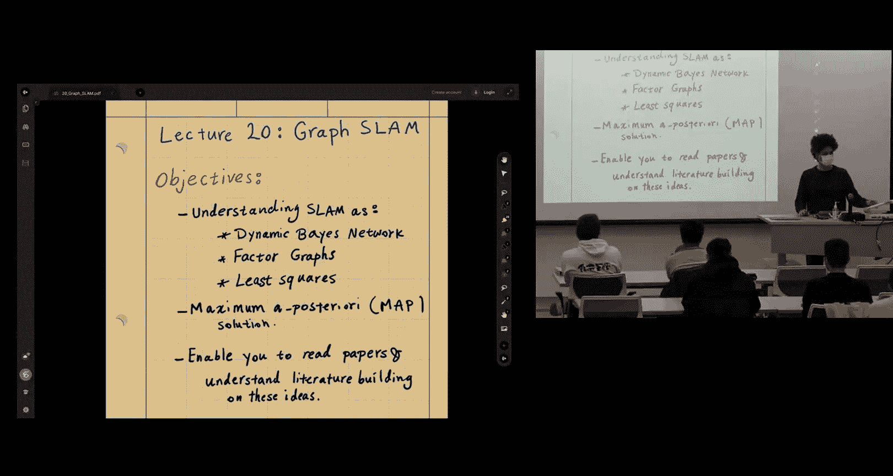

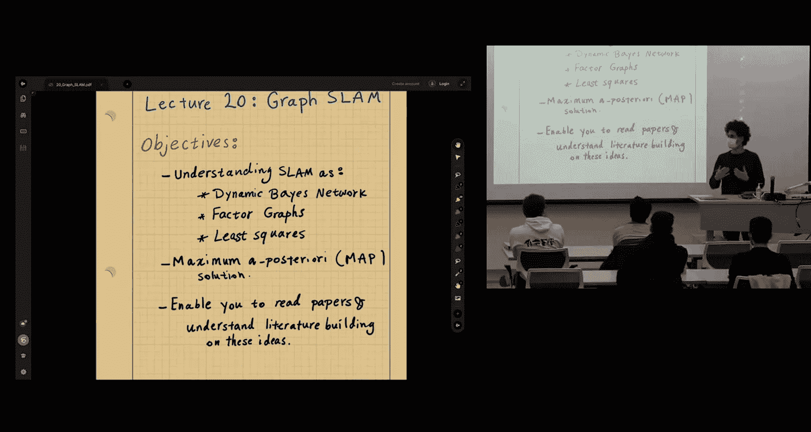

在本节课中，我们将要学习图优化SLAM。我们将理解动态贝叶斯网络、因子图与最小二乘法的关系，并探讨最大后验概率估计如何将SLAM问题转化为非线性最小二乘问题。掌握这些核心概念对于阅读SLAM领域的文献至关重要。

## 预备知识：加权范数

我们首先定义加权范数，这在后续推导中会用到。对于向量 `e` 和权重矩阵 `Σ`（通常是协方差矩阵的逆，即信息矩阵），加权范数定义为：

`||e||_Σ^2 = e^T Σ e`

通过Cholesky分解，可以将加权范数转换为标准的欧几里得范数。设 `Σ = L L^T`，其中 `L` 是下三角矩阵，则：

`||e||_Σ^2 = e^T (L L^T) e = (L^T e)^T (L^T e) = ||L^T e||^2`

这样，加权最小二乘问题就转化为了标准的最小二乘问题。

## 问题建模与联合分布

在SLAM中，我们处理一组状态变量 `X_{0:K}`（例如位姿、速度）和一组观测变量 `Z_{1:K}`。我们的目标是估计给定所有观测数据后，所有状态变量的联合后验概率分布 `P(X_{0:K} | Z_{1:K})`。

根据贝叶斯定理和马尔可夫假设，我们可以将这个联合分布分解为一系列更简单的概率因子的乘积：

`P(X_{0:K}, Z_{1:K}) = P(X_0) ∏_{i=1}^{K} P(X_i | X_{i-1}) ∏_{j=1}^{K} P(Z_j | X_{j})`

其中：
*   `P(X_0)` 是先验概率。
*   `P(X_i | X_{i-1})` 是运动模型（或状态转移模型）。
*   `P(Z_j | X_{j})` 是观测模型（或似然模型）。

这种分解可以用**动态贝叶斯网络**（一种有向图模型）直观地表示。图中的节点代表随机变量（状态 `X` 和观测 `Z`），箭头表示变量间的条件依赖关系。这种图模型清晰地编码了变量间的条件独立性，使得复杂的联合分布易于处理和建模。

## 因子图：一种更通用的建模框架

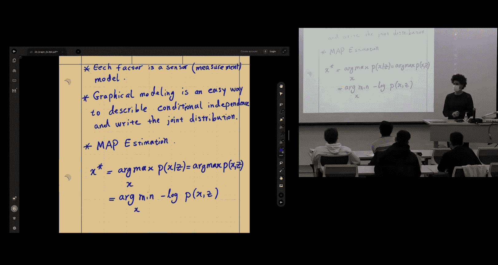

虽然动态贝叶斯网络很直观，但**因子图**为概率建模提供了更通用和模块化的框架。因子图是一种二分图，包含两种节点：
*   **变量节点**：用圆圈表示，对应我们要估计的状态变量（如 `x0`, `x1`, `z1`）。
*   **因子节点**：用黑色小方块表示，代表连接变量节点之间的关系或约束。

在SLAM的上下文中，这些因子对应着我们的概率模型：
*   先验因子 `φ_0(x0)` 对应 `P(X_0)`。
*   二元因子 `ψ_{ij}(x_i, x_j)` 对应运动模型 `P(X_j | X_i)`。
*   二元因子 `α_{ij}(x_i, z_j)` 对应观测模型 `P(Z_j | X_i)`。

因子图的强大之处在于，整个联合概率分布简单地等于所有因子的乘积：

`P(所有变量) ∝ ∏ (所有因子)`

这种模块化特性使得添加新的传感器或约束（只需定义新的因子类型）变得非常容易，也便于实现像GTSAM这样的优化库。

## 最大后验概率估计与非线性最小二乘

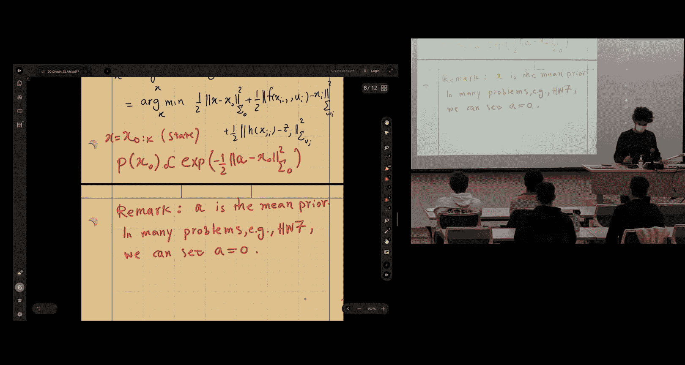

我们的目标是通过最大化后验概率 `P(X | Z)` 来估计最优状态 `X*`，这称为最大后验概率估计。由于对数函数是单调的，最大化后验概率等价于最小化其负对数：

`X* = argmax_X P(X | Z) = argmin_X -log P(X | Z)`

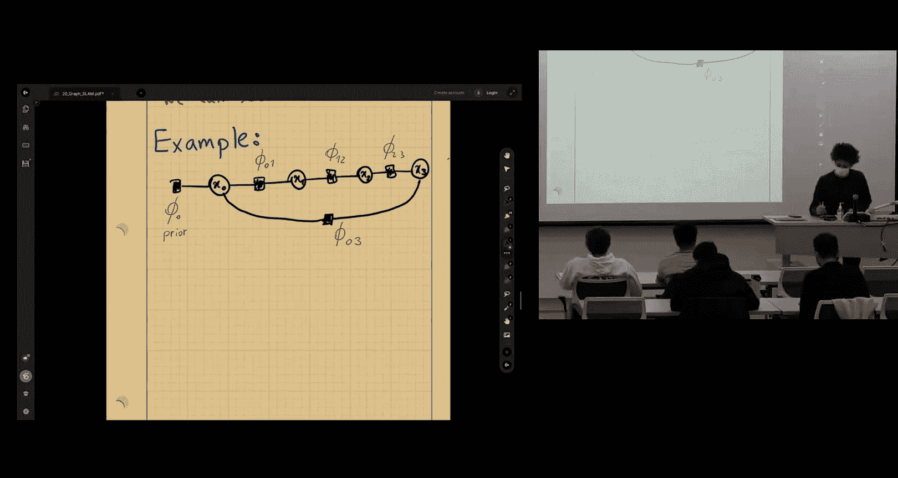

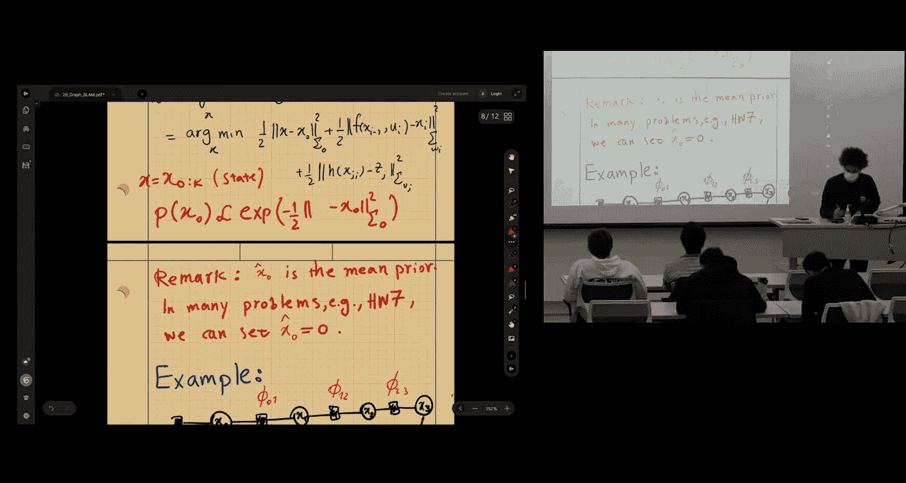

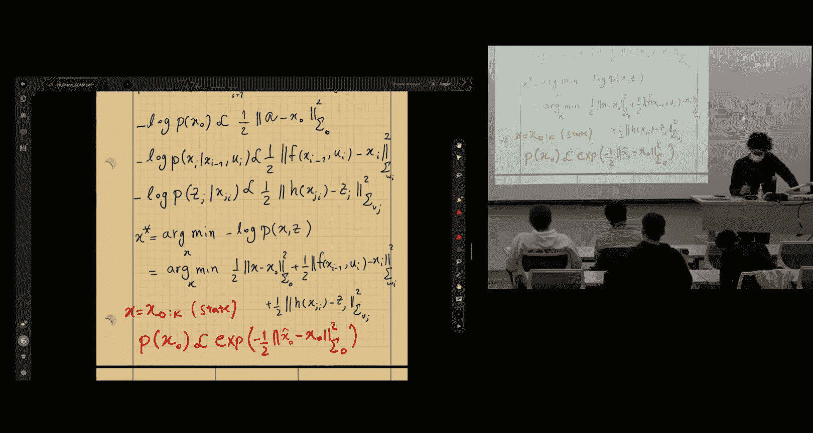

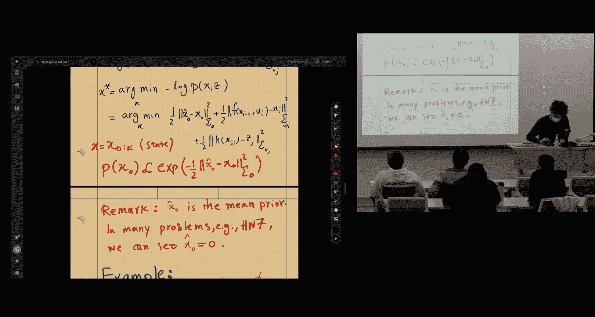

将前面因子化的联合分布代入，并假设运动噪声和观测噪声均为零均值高斯噪声，我们可以得到具体的优化目标函数。

假设运动模型和观测模型如下：
*   运动模型：`x_j = f(x_i, u_{ij}) + w_{ij}`， 其中 `w_{ij} ~ N(0, Σ_{ij})`
*   观测模型：`z_k = h(x_k) + v_k`， 其中 `v_k ~ N(0, Σ_ k)`

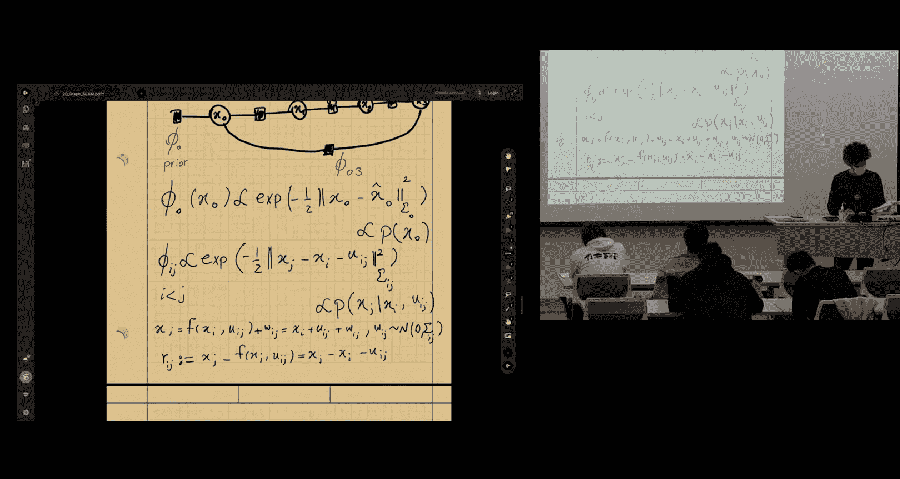

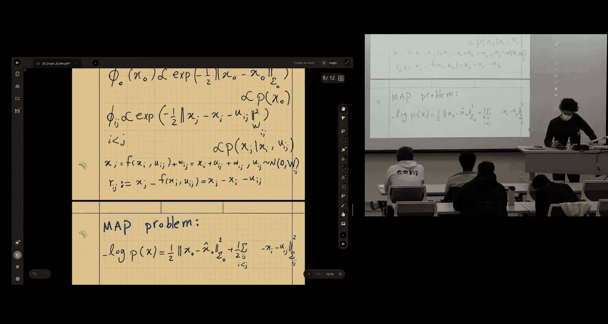

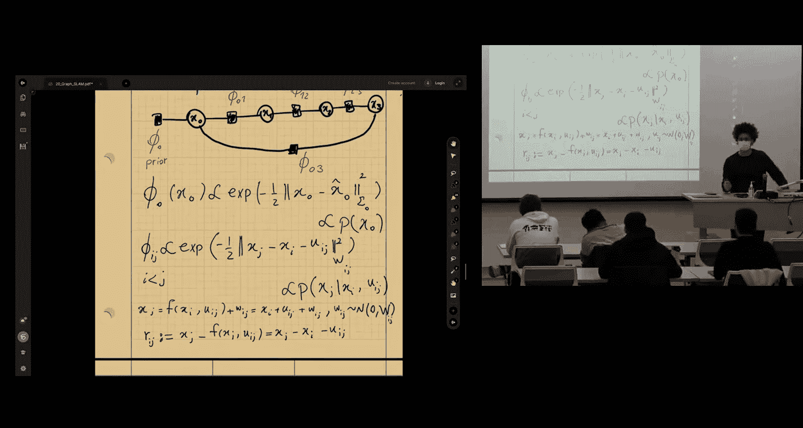

在高斯噪声假设下，概率因子具有指数形式。取负对数后，指数项被消除，最终我们得到一个**非线性最小二乘问题**：

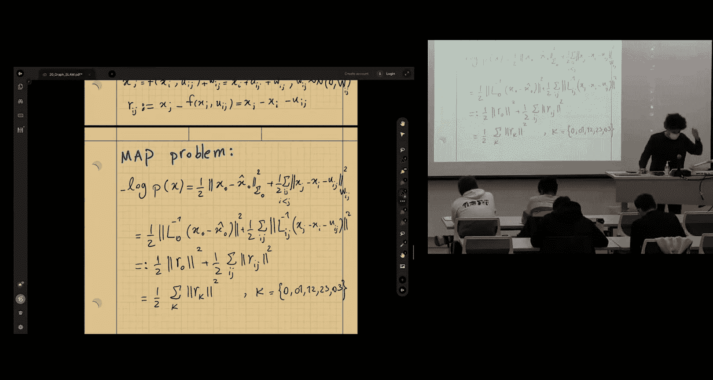

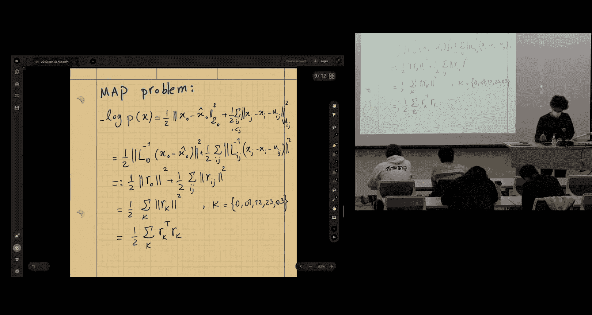

`X* = argmin_X { ||r_0||^2 + ∑_{运动边} ||r_{ij}||_{Σ_{ij}}^2 + ∑_{观测边} ||r_k||_{Σ_k}^2 }`

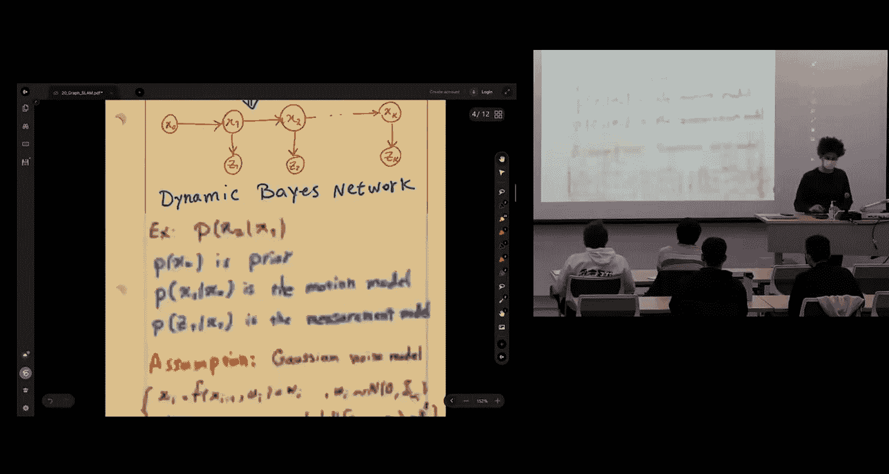

其中：
*   `r_0 = L_0^T (x_0 - a)` 是先验残差（`a` 是先验均值，`L_0` 是 `Σ_0` 的Cholesky因子）。
*   `r_{ij} = L_{ij}^T (x_j - f(x_i, u_{ij}))` 是运动残差。
*   `r_k = L_k^T (z_k - h(x_k))` 是观测残差。

至此，我们将SLAM问题转化为了一个可以通过高斯-牛顿法、列文伯格-马夸尔特法等优化算法求解的非线性最小二乘问题。

## 实例：构建与求解线性系统

为了更具体地理解，我们来看一个简单的位姿图优化例子。考虑一个包含4个位姿节点（`x0`, `x1`, `x2`, `x3`）的因子图，它具有以下因子：
1.  先验因子连接 `x0`。
2.  运动因子连接 `x0-x1`, `x1-x2`, `x2-x3`。
3.  一个回环因子连接 `x3-x0`。

假设模型都是线性的（例如 `f(x_i, u) = x_i + u`），那么每个因子都对应一个线性约束。将所有因子的残差堆叠起来，我们可以构建一个线性最小二乘问题 `A x = b`。

其雅可比矩阵 `A` 具有高度的稀疏性。每一行对应一个因子（一个约束），每一列对应一个状态变量。对于连接变量 `x_i` 和 `x_j` 的因子，其对应的行只在第 `i` 列和第 `j` 列有非零块（分别是负和正的雅可比矩阵），其余列全为零。这种稀疏模式是由因子图的结构直接决定的：只有被因子直接连接的变量才会在该因子对应的行中产生非零项。

正是这种稀疏性，使得我们可以使用高效的稀疏矩阵分解算法（如稀疏Cholesky分解或QR分解）来求解大规模的最小二乘问题，这是图优化SLAM能够实时处理成千上万个变量的关键。

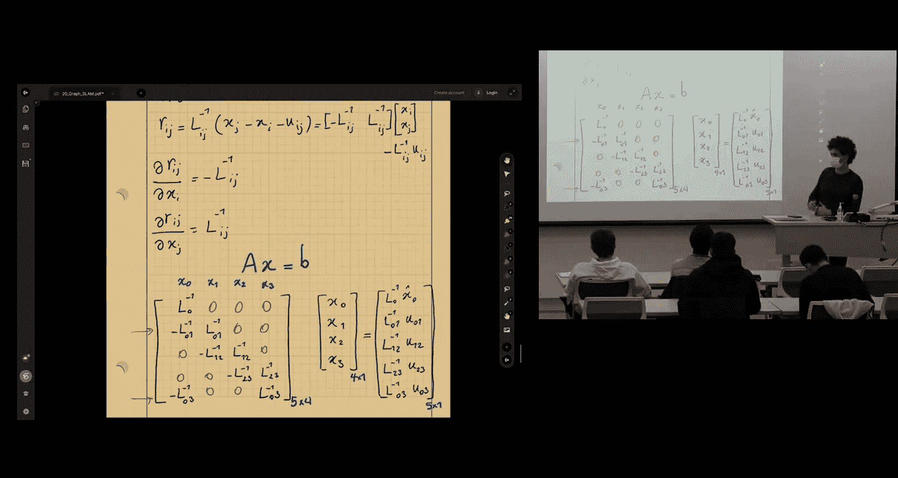

## 总结

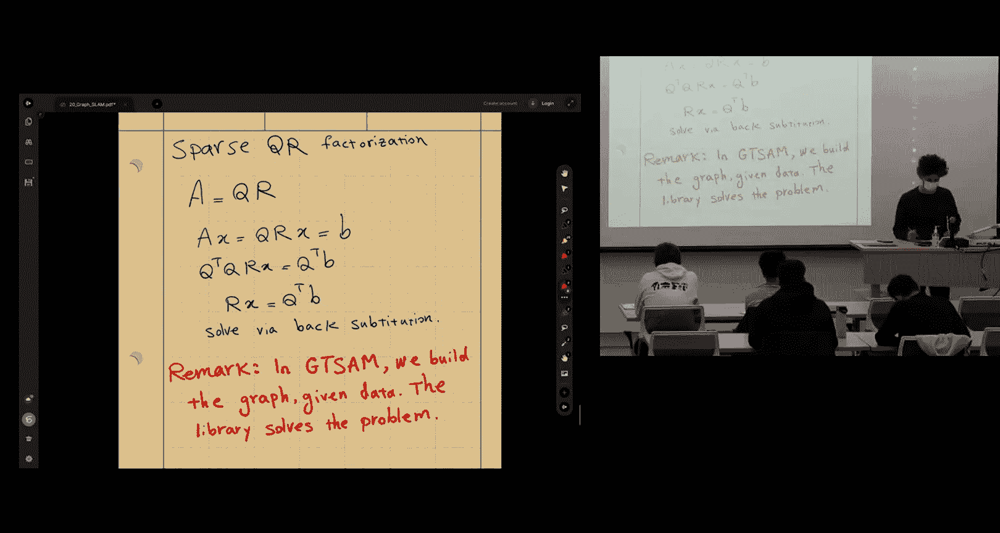

本节课我们一起学习了图优化SLAM的核心内容。我们首先从概率角度将SLAM问题表述为求解状态变量联合后验分布的问题，并通过马尔可夫假设将其分解。接着，我们引入了因子图这一强大且模块化的建模工具来描述问题。在高斯噪声假设下，最大后验概率估计自然地导出了一个非线性最小二乘优化问题。最后，通过一个简单实例，我们看到了如何构建并利用问题的稀疏性来高效求解。理解这一套从概率图模型到稀疏非线性优化的框架，是深入阅读现代SLAM文献和算法的基础。