# 移动机器人：方法与算法：Guest Lecture：从经典SLAM到3D空间感知

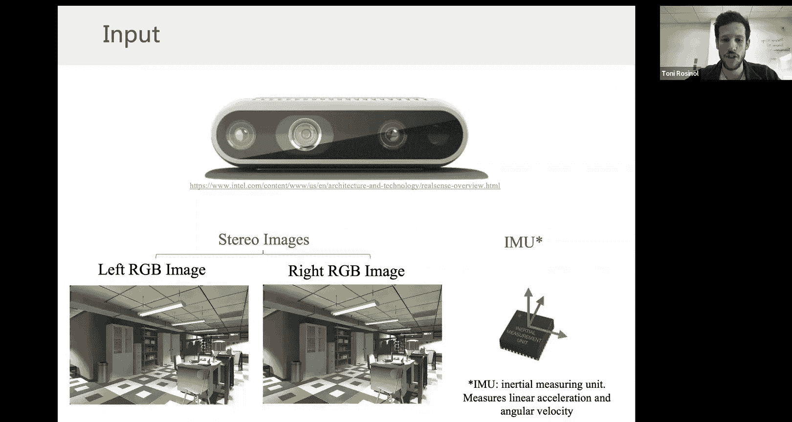

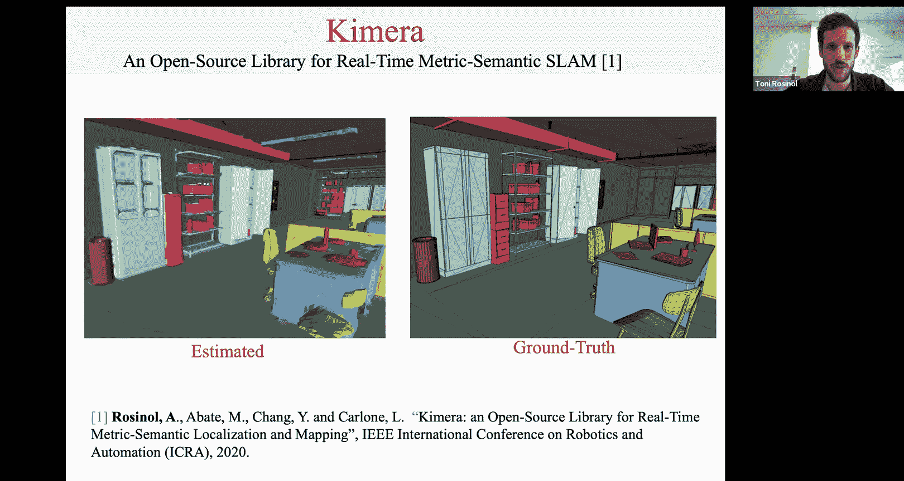

在本节课中，我们将跟随MIT的Antoni Rosinol博士，探讨如何将经典的SLAM（同时定位与建图）技术提升至3D空间感知的层次。我们将了解其核心工作Kimera，一个能够从RGB-D和IMU数据生成稠密3D度量语义地图的系统，并进一步探索其扩展——3D动态场景图，这是一种包含高级语义和拓扑信息的环境表示方法。

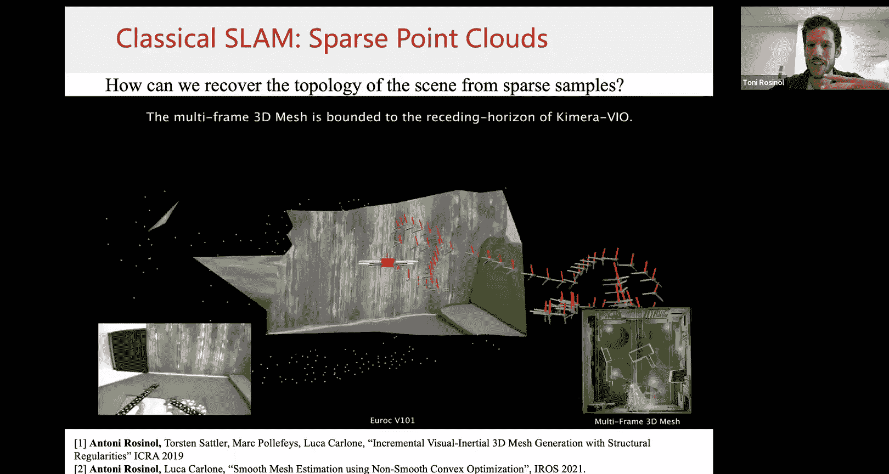

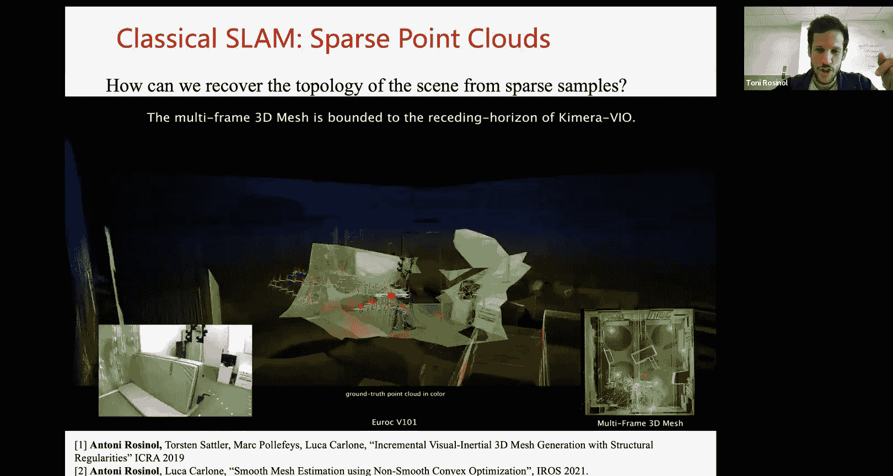

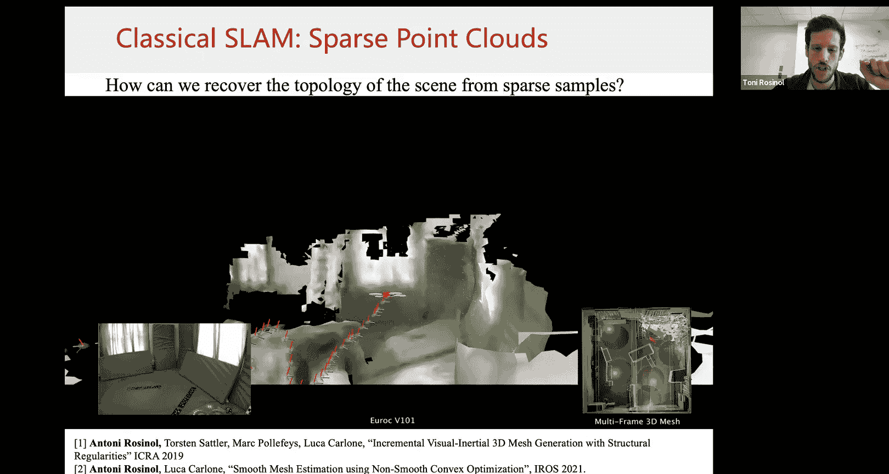

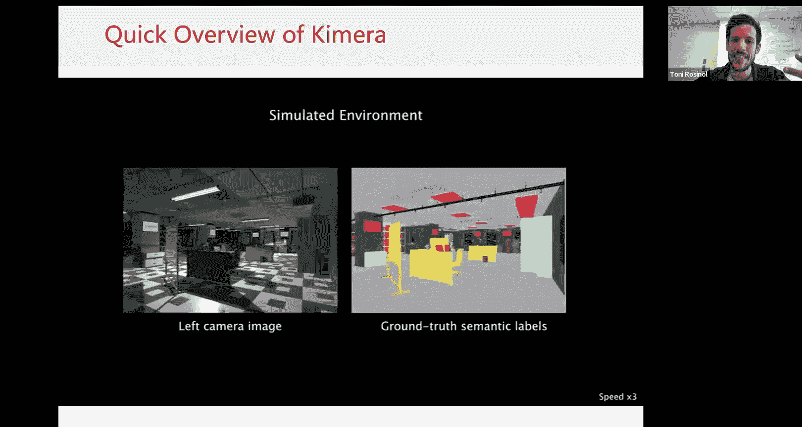

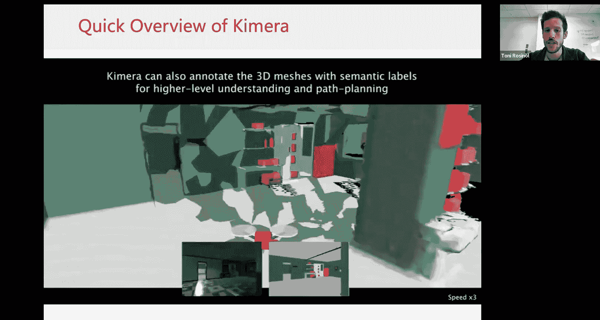

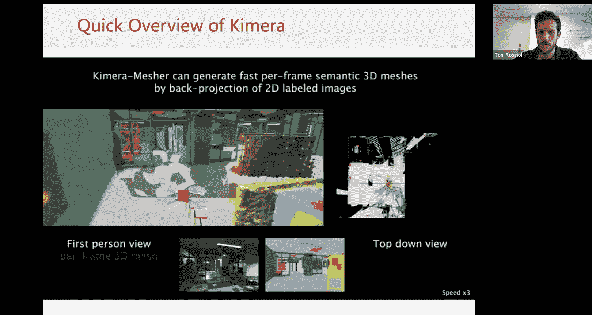

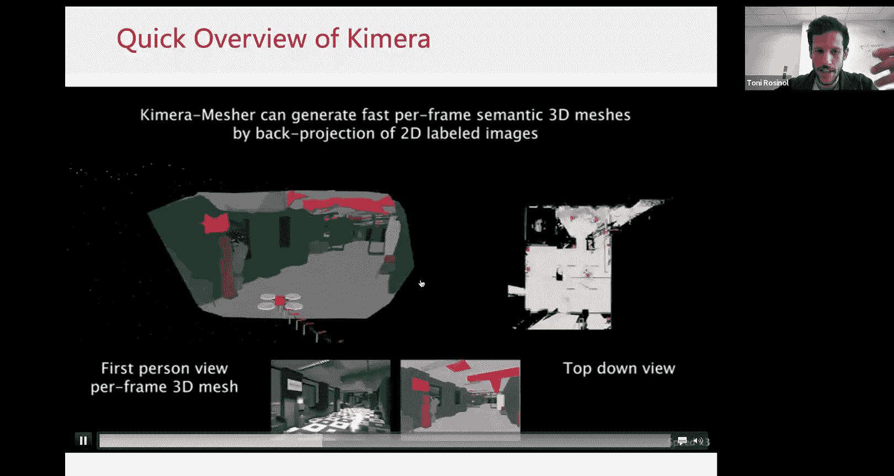

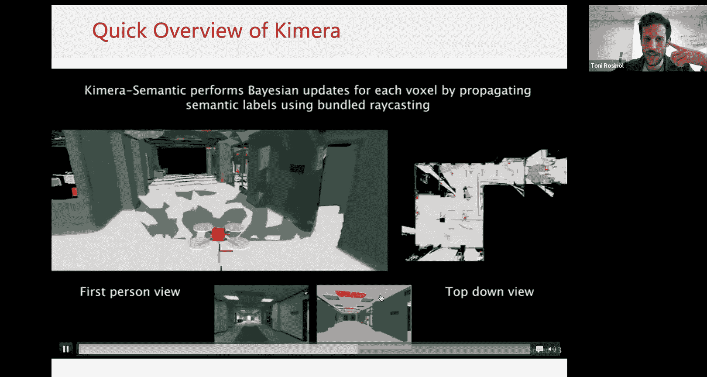

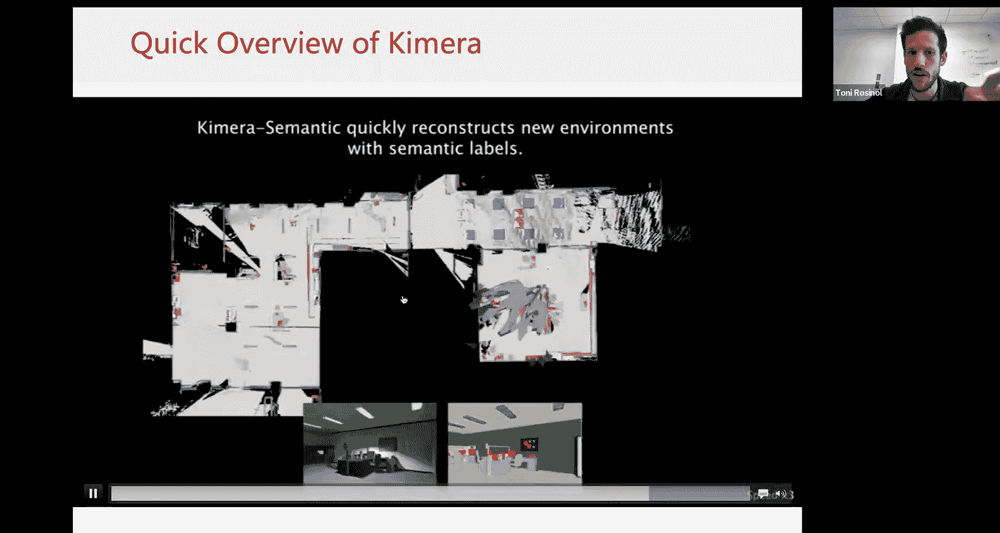

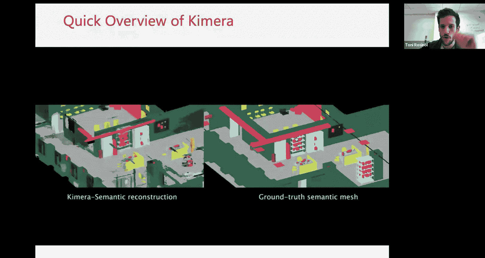

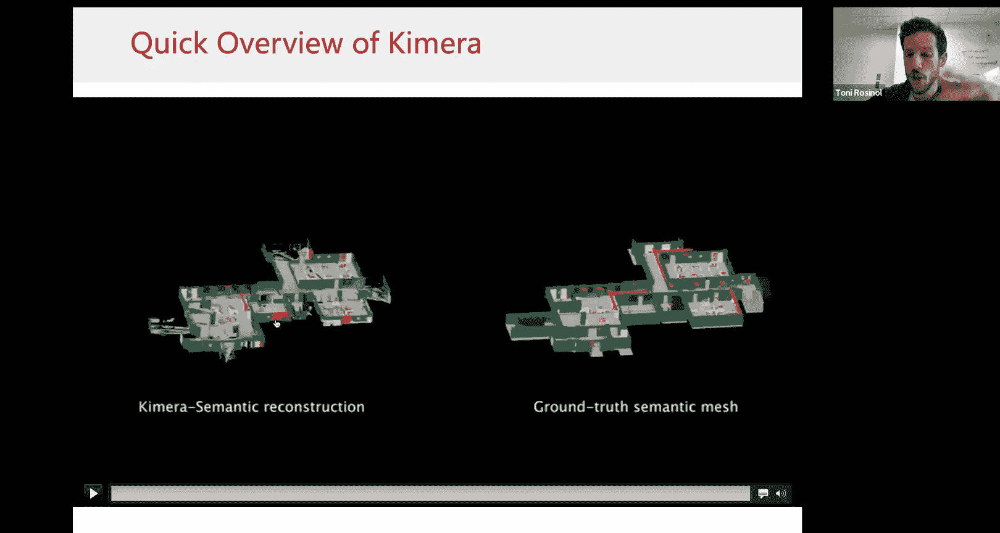

## 从图像到3D度量语义地图

上一节我们介绍了课程背景，本节中我们来看看Kimera系统的核心目标：从传感器输入生成一个稠密的、带有语义标签的3D地图。

Kimera的输入是一个RGB-D相机和一个惯性测量单元（IMU）。IMU提供线性加速度和陀螺仪信息。系统的目标是将一系列图像转换为一个**稠密的3D度量语义地图**。一个理想的结果是一个3D网格，其中场景中的物体（如椅子、笔记本电脑）被赋予不同的颜色标签，地板和墙壁等结构也被清晰地重建出来。

虽然早期成果已接近真实情况，但仍存在一些挑战，例如物体重建不完整、不同物体在网格中错误连接，以及需要处理动态物体（如移动的人）。

## Kimera的核心架构与流程

上一节我们了解了Kimera的目标输出，本节中我们来看看它是如何一步步实现这个目标的。Kimera的核心是一个经典的稀疏视觉惯性里程计（VIO）管道。

**Kimera的核心流程如下：**
1.  **稀疏VIO**：系统首先运行一个状态领先的视觉惯性里程计管道（Kimera-VIO），从图像和IMU数据中估计出相机的3D位姿和稀疏的3D路标点。这些路标点是通过三角化图像中跟踪的特征点得到的，能提供场景深度的粗略估计，主要用于避障。
2.  **稠密重建**：利用估计出的位姿，系统将RGB-D相机提供的稠密深度信息融合到一个**体素网格**表示中。这个过程类似于占用网格映射，使用贝叶斯更新来估计每个体素被占据的概率。
3.  **语义融合**：为了获得语义信息，系统将左相机图像输入一个卷积神经网络（CNN）来获取像素级的语义标签。然后，将这些标签与对应的3D点云一起，融合到上述的体素表示中。每个体素不仅存储占据概率，还存储一个**分类概率分布**，表示它属于各个语义类别（如“椅子”、“墙”）的概率。
4.  **系统集成**：Kimera-VIO模块提供位姿和稀疏路标点。稀疏路标点用于快速生成每帧的局部3D深度图，然后被融合成多帧的3D图像。同时，位姿被送入Kimera-PGO模块进行位姿图优化，以减小漂移。所有这些信息（优化后的位姿、深度、语义）最终被送入Kimera-Semantics模块，在线生成全局的、实时的度量语义重建。

整个系统设计高效，大部分模块（除神经网络推理外）可在CPU上以约10Hz的频率运行。

## 从地图到高级理解：3D动态场景图

上一节我们看到了Kimera如何构建稠密的几何语义地图，本节中我们来看看为什么这还不够，以及如何引入更高层次的环境理解。

一个仅包含几何和物体类别标签的地图，对于执行“去厨房给我拿杯咖啡”这样的自然语言命令仍然不够。机器人需要理解更高级的概念，例如：
*   **房间**：什么是厨房、走廊、卧室。
*   **可通行路径**：环境中可以从A点移动到B点的拓扑结构。
*   **物体实例**：区分“椅子1”和“椅子2”，而不仅仅是“椅子”这个类别。
*   **动态实体**：处理在场景中移动的人和物体。

为了捕获这些信息，研究团队提出了**3D动态场景图**的概念。这是一种树状的分层表示，从底层的度量语义网格（Kimera的输出）中提取高级抽象。

**3D动态场景图的层次结构如下：**
1.  **度量语义层**：基础层，即Kimera生成的3D网格。
2.  **物体与智能体层**：
    *   **物体**：静态物体（如沙发、椅子）。进一步分为有已知CAD模型可拟合的物体，和没有先验模型的未知物体。
    *   **智能体**：动态实体（如机器人、人）。通过检测并跟踪每帧图像中的人体网格（形状和姿态参数）来实现。
3.  **位置与结构层**：
    *   **位置**：机器人可以占据且不与障碍物碰撞的3D空间点，它们之间通过边连接形成**拓扑地图**。
    *   **结构**：从语义标签中提取的静态结构元素，如墙、地板、天花板。
4.  **房间层**：通过对位置拓扑图进行分割得到。分割方法利用了从体素地图中计算出的**截断符号距离函数（TSDF）** 和**欧几里得符号距离函数（ESDF）**。ESDF给出了空间任一点到最近障碍物的距离，其2D切片可以近似为楼层平面图，进而用于识别和连接不同的房间。
5.  **建筑层**：最顶层，包含所有房间和位置。

在这个表示中，每个节点（如一个物体）都知道其父节点（如它所在的房间），形成了一个丰富的、可查询的语义关系网络。例如，要“去沙发4”，机器人可以先导航到对应的房间，再通过拓扑地图找到该沙发所在的位置。

## 处理动态物体与系统优化

上一节我们构建了高级的场景理解表示，本节中我们来看看实现过程中的两个关键挑战：动态物体处理和全局一致性优化。

**处理动态物体**：
在重建静态场景时，移动的人会造成“重影”问题。Kimera采用两种策略：
1.  **动态掩码**：在融合深度信息到体素网格时，如果某个像素被识别为动态物体（如“人”），则忽略该像素的深度信息，避免将其集成到静态地图中。
2.  **IMU辅助**：利用IMU信息帮助VIO模块区分静态和动态的特征点，防止动态物体的特征点污染位姿估计。

**位姿图与网格联合优化（Kimera-PGMO）**：
经典的SLAM在检测到回环后，会进行位姿图优化来校正漂移。但这只会优化相机位姿，而之前重建的3D网格会与之脱节。Kimera-PGMO将这个问题形式化为一个联合优化问题。
*   **优化变量**：不仅包括机器人位姿，还包括从3D网格中**采样**的一部分顶点。
*   **约束边**：包括来自原始3D测量的约束、顶点与观察到它的位姿之间的可见性约束、里程计约束以及回环约束。
*   **效果**：通过求解这个优化问题，可以同时得到校正后的位姿和与之对齐的、变形后的3D网格，从而保证地图的全局一致性。

## 前沿展望与未来方向

上一节我们探讨了Kimera系统的具体实现，本节中我们来看看该领域仍面临的挑战和未来的研究方向。

**紧密耦合学习与SLAM推理**：
目前，Kimera将深度学习（如语义分割、深度估计）当作黑盒使用，SLAM流程不反馈信息给神经网络以改进其权重。未来的方向是**以SLAM为环来训练神经网络**。这可以通过一个双层优化问题实现：内层是SLAM推理（优化位姿和地图），外层是优化神经网络参数，使得内层SLAM估计出的轨迹尽可能接近真实轨迹。这需要可微分的因子图优化框架和大型逼真数据集的支持。

**可微分渲染用于SLAM**：
神经辐射场（NeRF）等可微分渲染技术展示了令人印象深刻的场景建模能力。它们通过一个多层感知机（MLP）将3D坐标和视角映射为颜色和密度，并能通过比较渲染图像和真实图像来优化MLP参数。将这类技术引入SLAM，可以：
*   **实现更完整、连续的场景表示**：克服传统网格重建的不完整性。
*   **支持联合优化**：像iMAP等工作所示范的，可以同时优化场景表示（NeRF）和相机位姿。
*   **赋能高级应用**：与3D场景图结合，可以实现逼真的光照效果模拟和场景编辑，为机器人提供更灵活的环境模型。

## 总结

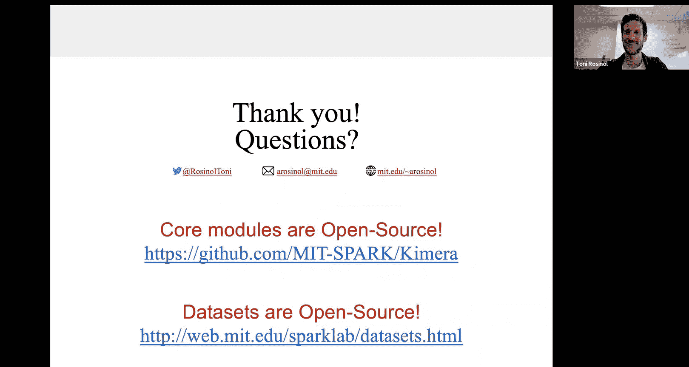

本节课中我们一起学习了从经典SLAM迈向3D空间感知的旅程。我们从Kimera系统开始，了解了如何构建稠密的3D度量语义地图。接着，我们探索了3D动态场景图，这是一种分层表示，能捕获环境中的物体、房间、拓扑等高级语义信息，使机器人能理解并执行复杂的自然语言指令。最后，我们展望了通过紧密耦合学习与SLAM、以及利用可微分渲染技术来推动该领域发展的未来方向。这些进展共同致力于让机器人能够在我们的家庭、办公室等复杂环境中实现完全自主的导航与交互。