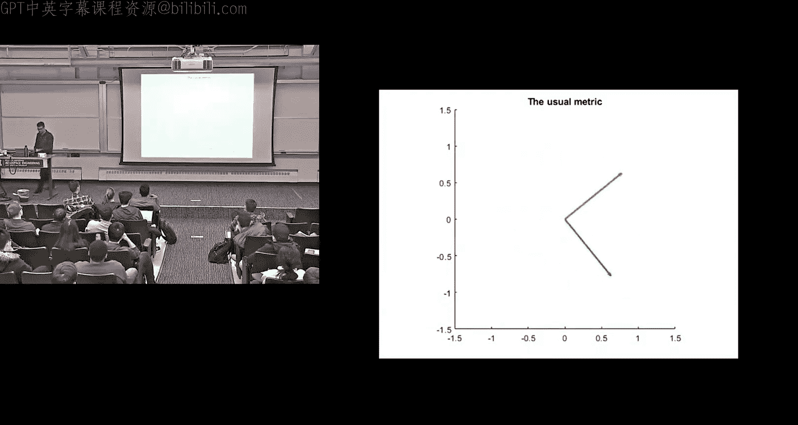
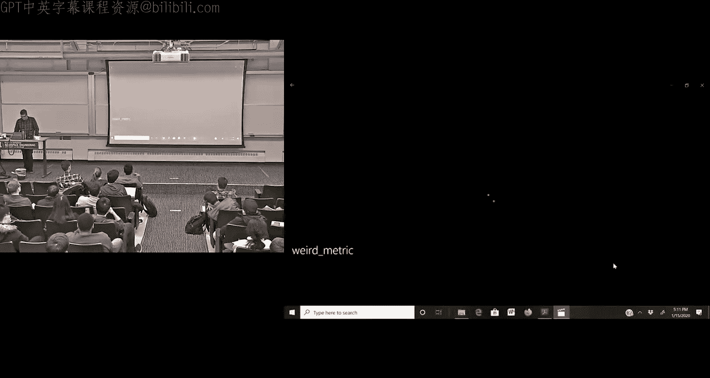
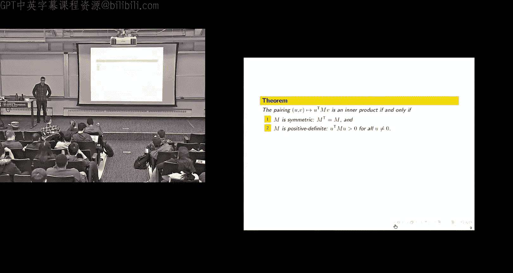
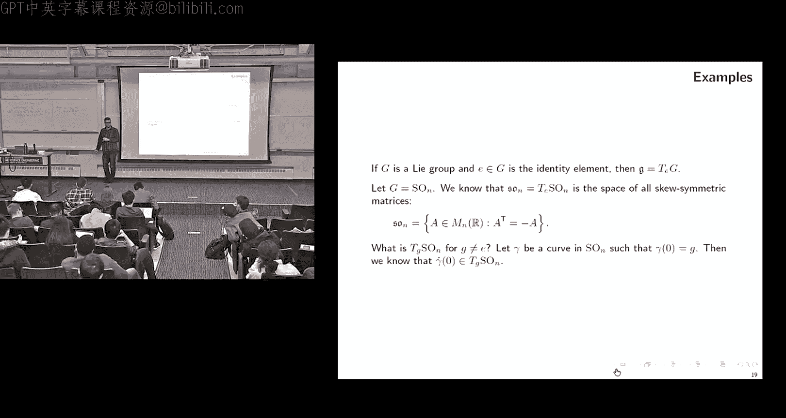
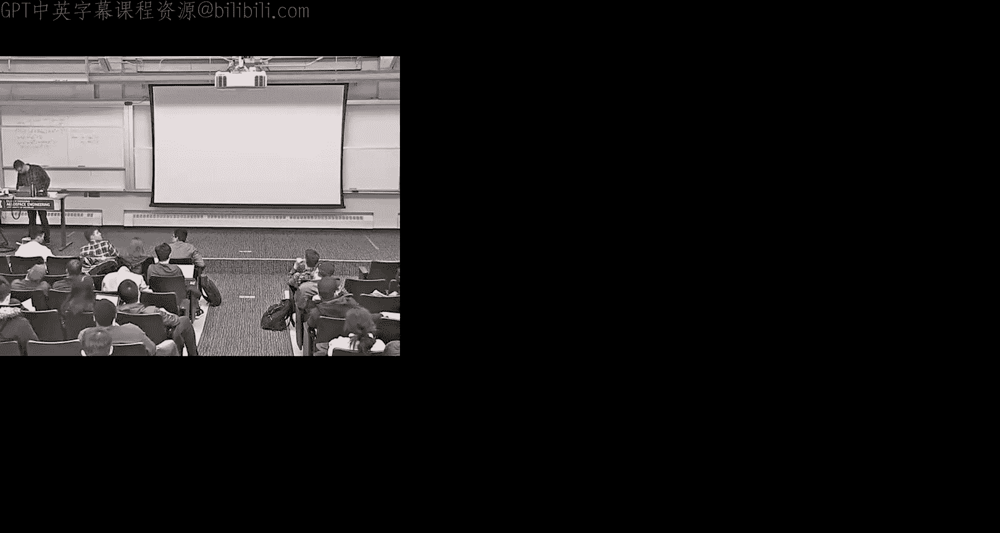
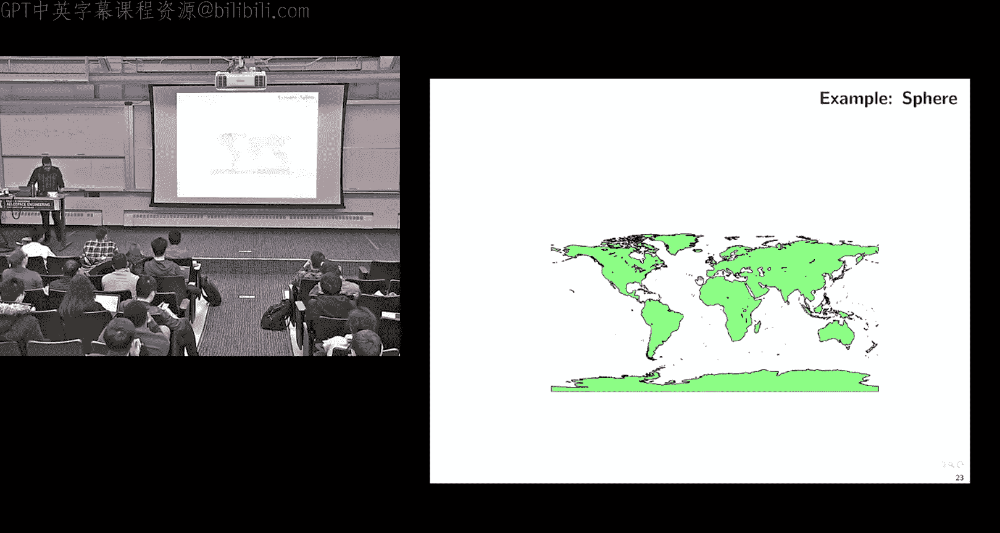
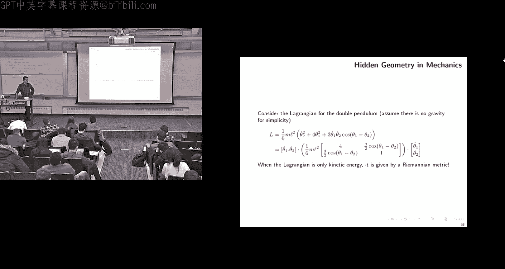

# 移动机器人：方法与算法：23：黎曼几何

## 概述
在本节课中，我们将学习黎曼几何的基础知识。黎曼几何是研究弯曲空间（即流形）上几何性质的数学分支。我们将从理解如何在流形上定义长度和角度开始，最终学习如何将黎曼几何应用于实际问题，例如梯度下降和图像配准。

---

## 流形与切空间

上一节我们介绍了矩阵群和流形。本节中，我们来看看如何在这些结构上进行几何测量。

流形是局部看起来像平坦空间（如平面）的对象。例如，地球表面是一个流形，因为从我们站立的位置看，它看起来是平的。流形的正式定义涉及将其分割成多个“图册”，每个图册都能平滑地映射到平坦空间。

与流形密切相关的是切空间的概念。给定流形上一点，该点的切空间包含了所有可能通过该点的曲线的速度向量。切空间本身是一个向量空间，其维度与流形的维度相同。

对于矩阵群（如旋转群SO(3)或特殊欧几里得群SE(3)），其李代数就是单位元处的切空间。例如，SO(3)的李代数由所有反对称矩阵组成。

---

## 几何学基础：长度与角度

为了在流形上进行几何测量，我们需要定义长度和角度。让我们从熟悉的平坦空间R²开始。

假设我们有两条在点0处相交的曲线γ₁和γ₂。这两条曲线之间的夹角如何计算？我们计算它们在交点处的切线之间的夹角。具体公式如下：

**角度公式**：
\[
\cos(\theta) = \frac{\langle \dot{\gamma}_1(0), \dot{\gamma}_2(0) \rangle}{\|\dot{\gamma}_1(0)\| \cdot \|\dot{\gamma}_2(0)\|}
\]

其中，\(\langle \cdot, \cdot \rangle\) 表示点积，\(\|\cdot\|\) 表示向量的长度（范数）。

接下来，考虑一条从0到1的曲线γ(t)。其长度如何计算？我们对其速度向量的长度进行积分。

**长度公式**：
\[
L(\gamma) = \int_0^1 \|\dot{\gamma}(t)\| \, dt
\]

从这两个公式可以看出，定义角度和长度的核心在于**点积**和**范数**。实际上，范数可以由点积定义（\(\|v\| = \sqrt{\langle v, v \rangle}\)）。因此，几何学的核心就是理解点积。

---

## 内积与度量矩阵

在向量空间Rⁿ中，标准的点积定义为 \(u^T v\)。但我们可以将其推广为更一般的**内积**。

内积是一个将两个向量映射为一个实数的函数，它必须满足三个条件：
1.  **对称性**：\(\langle u, v \rangle = \langle v, u \rangle\)
2.  **双线性**：对任意标量α, β，有 \(\langle \alpha u_1 + \beta u_2, v \rangle = \alpha \langle u_1, v \rangle + \beta \langle u_2, v \rangle\)（对第二个变量同理）
3.  **正定性**：\(\langle v, v \rangle \ge 0\)，且等号成立当且仅当 \(v = 0\)

在Rⁿ中，每一个这样的内积都可以表示为一个**对称正定矩阵M**的作用：
\[
\langle u, v \rangle_M = u^T M v
\]
这个矩阵M被称为**度量矩阵**。它决定了我们如何测量向量的长度和夹角。改变M，就相当于以扭曲或拉伸的方式来看待空间，从而改变了“正交”和“单位长度”的含义。

---

## 黎曼度量

现在，我们将内积的概念推广到流形上。一个**黎曼流形**是一个配备了**黎曼度量**的流形。

黎曼度量在流形M的每一点x上，都给出了其切空间TₓM上的一个内积。也就是说，对于每一点x，我们都有一个对称正定矩阵G(x)，它定义了该点切向量之间的点积：
\[
\langle u, v \rangle_x = u^T G(x) v, \quad \forall u, v \in T_xM
\]
因此，黎曼度量本质上是一个在流形上变化的矩阵值函数 \(x \mapsto G(x)\)。正是这种变化编码了空间的曲率。

**例子：球面上的度量**
用经纬度坐标(θ, φ)参数化单位球面。其上的黎曼度量矩阵为：
\[
G(\theta, \phi) = \begin{bmatrix}
1 & 0 \\
0 & \sin^2(\theta)
\end{bmatrix}
\]
这个矩阵在极点（θ=0或π）处会退化（sin(θ)=0），这反映了在标准经纬度坐标下，极点处的奇异性。

---

## 梯度与“音乐同构”

在优化问题中，我们经常需要计算函数的梯度以进行梯度上升/下降。在欧几里得空间中，梯度向量grad f是函数微分df（一个行向量，或称**余向量**）的转置。

然而，在配备了黎曼度量G的流形上，从微分df到梯度grad f的转换更为复杂。这涉及到所谓的“音乐同构”：
*   **降号(♭)**：将向量v映射为余向量v♭，定义为 \(v♭(w) = \langle v, w \rangle\)。
*   **升号(♯)**：是降号的逆运算，将余向量α映射为向量α♯。

具体公式如下：
*   向量 \(u\) 对应的余向量：\(u^♭ = u^T G\)
*   余向量 \(p\) 对应的向量：\(p^♯ = G^{-1} p^T\)

函数的梯度则定义为其微分的升号：
\[
\text{grad } f = (df)^♯
\]
在标准欧几里得度量下（G=I），这简化为普通的转置操作。

---

## 应用：梯度流与测地线

黎曼几何的一个核心应用是定义和计算流形上的**梯度流**。如果我们想在流形M上最大化一个函数F，我们可以沿着其梯度的方向移动：
\[
\dot{x} = \text{grad } F(x)
\]
这个微分方程的解曲线给出了上升最快的路径。在图像配准等问题中，我们需要在SE(3)这样的矩阵群上优化一个目标函数（如点云重叠度），梯度流提供了求解的数值方法。

另一个重要概念是**测地线**，即流形上的“直线”（局部最短路径）。拉格朗日力学中的运动方程，在特定条件下（动能由黎曼度量定义，且无外力），描述的正是测地线流。

例如，对于之前给出的球面度量，将其代入欧拉-拉格朗日方程，得到的解就是球面上的大圆（测地线）。

---

## 总结

本节课中我们一起学习了黎曼几何的基础知识。我们从流形和切空间的定义出发，理解了在弯曲空间上进行几何测量的核心在于定义每一点切空间上的内积（即黎曼度量）。我们学习了如何通过度量矩阵计算长度、角度以及函数的梯度。最后，我们看到了黎曼几何在梯度优化算法和描述物理系统（如拉格朗日力学）中的关键应用。掌握这些概念，是理解后续在矩阵群上进行高级算法（如图像配准）的基础。