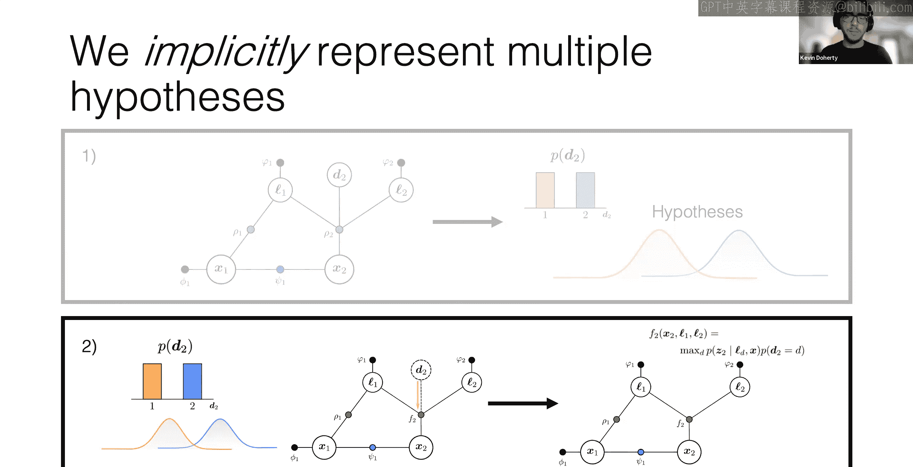
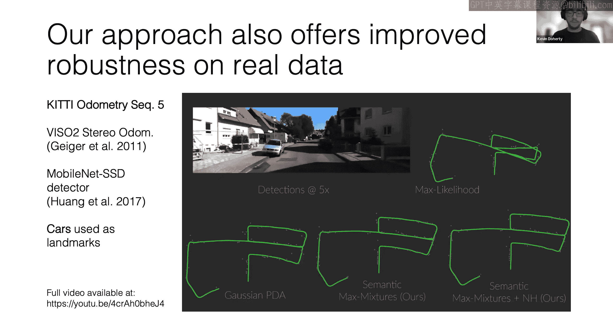
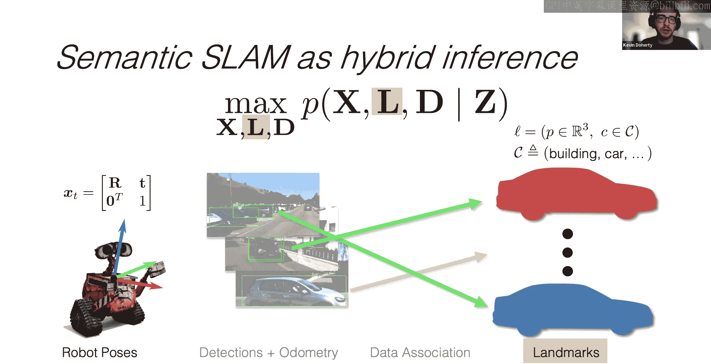
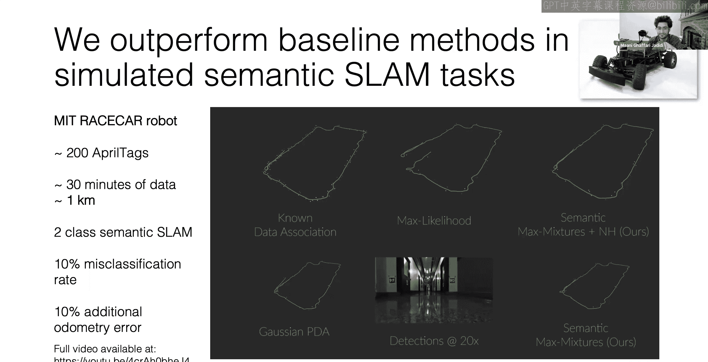
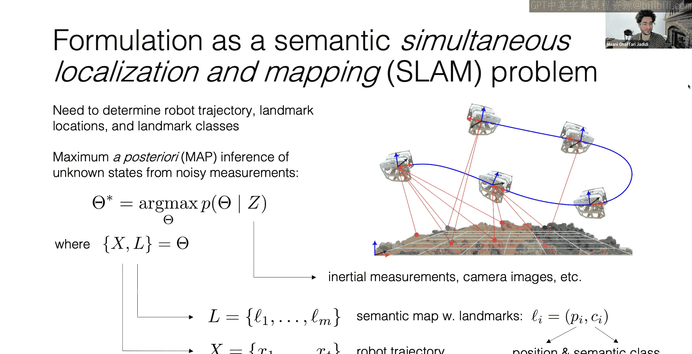

# 移动机器人：方法与算法：24：混合感知问题的因子图表示

## 概述
在本节课中，我们将学习如何利用因子图表示法来解决混合感知问题。混合感知问题涉及同时推理连续状态（如机器人位姿）和离散状态（如数据关联、语义类别）。我们将探讨因子图如何为这类问题提供优雅的建模框架，并介绍一种高效的交替优化求解算法。

---

## 研究背景与动机
上一节我们概述了课程内容，本节中我们来看看本次讲座的研究背景。本次讲座由麻省理工学院的Kevin Doherty博士主讲，他的研究兴趣集中在机器人感知、状态估计、导航和机器学习，尤其关注野外机器人和海洋机器人应用。

他的博士研究工作主要受到以下问题启发：假设一个机器人在一个未知环境中探索，它需要知道自己在环境中的位置（定位）、环境中物体的位置（建图），以及这些物体是什么（语义理解）。这在环境监测、基础设施检查、自动驾驶和家用机器人等场景中都有广泛应用。

数学上，这可以表述为一个**语义SLAM**问题，即从一组噪声测量中推断机器人的轨迹、环境地标的位置以及每个地标的语义类别。由于测量存在噪声，我们将其表述为一个贝叶斯推断问题。

---

## 混合感知问题的核心挑战
在介绍了问题背景后，本节我们来看看解决该问题的核心挑战。主要有两点：

1.  **将语义信息整合到传统几何估计中**：用于获取语义信息的学习模型（如目标检测器）在实践中可能不可靠，尤其是在部署环境与训练数据不匹配时。它们的预测可能存在误差或歧义。
2.  **处理异常值和错误的数据关联**：不可靠的语义预测会导致测量异常或错误的数据关联（即无法确定测量对应哪个地标）。这可能导致SLAM系统发生灾难性故障。处理这些问题需要解决离散估计问题。

这两个挑战都涉及对**离散不确定性源**的推理。因此，核心问题是如何表示离散状态与连续状态之间的耦合关系，并找到最可能的未知状态赋值。

一个自然的方法是将问题建模为在给定测量`Z`的情况下，最大化连续变量`C`和离散变量`D`的联合后验概率：
`argmax_{C,D} P(C, D | Z)`

---

## 因子图：统一的建模框架
面对上述挑战，我们需要一个强大的建模工具。因子图恰好提供了这样一个框架。

因子图是一种概率图模型，它允许我们将复杂的联合分布分解为更简单的因子乘积。**混合因子图**特指那些同时包含连续状态（用蓝色表示）和离散状态（用红色表示）的因子图。

以下是两个例子：
*   **切换系统**：估计行人在图像中的连续运动，其运动模式受离散决策（如左转/右转）影响。
*   **鲁棒SLAM**：估计机器人轨迹（连续状态），同时引入离散变量来控制是否将闭环检测测量视为内点（保留）或外点（剔除）。

因子图使我们能够清晰地写出这些问题的模型。然而，尽管GTSAM等现有库能很好地处理连续因子图，却缺乏直接解决这类混合问题的通用优化器。

---

## DCSAM：混合因子图的求解库
既然现有工具存在不足，本节我们来看看为解决此问题而开发的工具：DCSAM库。

DCSAM（离散连续平滑与建图）是一个C++库，它将GTSAM扩展到了混合因子图设置。它包含一个默认的优化器，并易于扩展以建模新问题或集成新的优化方法。

其核心求解算法的**关键思想**是：虽然对混合因子图进行精确推断通常是计算困难的（离散状态组合数随规模指数增长），但这些问题通常可以分解为易于求解的子问题。具体来说，**当固定连续状态时，对剩余离散状态的推断通常会解耦或形成结构简单的图**（如链式结构），从而可以用维特比算法等高效方法求解。反之，固定离散状态后，连续状态的优化则是一个标准的非线性最小二乘问题，可用高斯-牛顿法等高效求解。

因此，DCSAM采用的算法是**交替优化**：
1.  给定当前连续状态估计 `C_i`，求解最优的离散状态赋值 `D_{i+1}`。
2.  固定离散状态为 `D_{i+1}`，对连续状态执行一步优化（如梯度下降），得到 `C_{i+1}`。
3.  重复迭代直至收敛。

这种方法的一个著名特例是**迭代最近点算法**，它可以被表示为对一个特定混合因子图进行交替优化。

该方法的优势在于，它通常能高效处理成千上万的离散变量，而无需对离散假设空间进行剪枝。在鲁棒SLAM任务中，它能在保持与先进方法相当精度的同时，实现更快的求解速度。

---

## 应用：基于DCSAM的语义SLAM系统
在了解了核心求解工具后，本节我们来看一个具体应用：利用DCSAM构建一个语义SLAM系统。

系统需要联合估计：
*   机器人位姿（连续状态）
*   语义地标：包含3D位置（连续）和语义类别（离散）
*   数据关联变量（离散）：表示每个测量与地图中地标的对应关系

系统工作流程如下：
1.  当新的物体检测到来时，计算其与现有地图中所有地标的测量似然。
2.  如果最大似然低于阈值，则认为该检测对应一个**新地标**，将其加入地图。
3.  如果高于阈值，则认为它对应一个**已知地标**。此时，我们维护多个最有可能的关联假设，而不是只选一个。
4.  系统还允许“空假设”，以拒绝可能是误检的测量（即视为外点）。

一个重要的技巧是，我们可以通过**边缘化数据关联变量**，将问题隐式地表示为仅关于机器人位姿和地标（位置和类别）的优化问题，从而显著减少需要显式维护的离散变量数量。

实验表明，在模拟和真实数据集（如KITTI）上，这种能够考虑多假设数据关联的方法，比仅采用最大似然关联的基线方法更加鲁棒，能有效应对检测噪声和动态物体干扰。

---

## 总结与未来展望
本节课中，我们一起学习了如何利用因子图表示和求解混合感知问题。

**核心总结如下**：
1.  **问题**：机器人语义感知等任务需要联合推理连续状态（几何）和离散状态（语义、数据关联、外点），这具有挑战性。
2.  **建模工具**：混合因子图为这类问题提供了清晰、统一的建模框架。
3.  **求解方案**：DCSAM库提供了建模和求解混合因子图的通用工具。其核心算法利用因子图的条件独立结构，通过交替优化连续和离散状态来实现高效推断。
4.  **应用验证**：基于DCSAM构建的语义SLAM系统能够处理数据关联歧义和类别噪声，比传统方法更鲁棒。

**未来可能的研究方向包括**：
*   开发更具表现力的混合模型，例如结合物体形状和类别的推理。
*   将层次化和抽象化知识（如场景图）纳入因子图框架。
*   探索如何将大语言模型与场景几何基础通过因子图进行结合。
*   利用基于对象的SLAM系统生成多视图一致的数据，用于自监督或半监督学习，以微调感知模型。

---

## 问答环节摘要
*   **关于离散子图求解**：当固定连续状态后，离散子图若为链式结构，则可使用高效的维特比算法。若子图连接复杂，则精确求解可能很慢，此时可考虑使用坐标下降等局部优化方法替代。
*   **关于传感器融合**：从工程角度，结合多传感器信息（冗余）通常比依赖单一传感模态更可靠。
*   **关于离散变量**：DCSAM中的离散变量不限于二值，可以是多类（如多种语义类别）。
*   **关于初始化**：算法通常需要较好的连续状态初始猜测（如来自里程计）。离散状态则无需初始化，因为第一步就是求解给定连续状态下的最优离散赋值。在极端情况下（如多机器人无共同初始参考系），初始化可能很困难，可考虑结合其他全局方法进行引导。
*   **关于全局搜索**：交替优化是一种局部方法。可以探索将其与分支定界等全局搜索策略结合，以降低对初始值的敏感度，但这通常会牺牲效率。MHT、MH-iSAM2等方法正在这个方向探索。
*   **关于语义SLAM中的地标表示**：在所示系统中，地标位置简单地取自检测边界框的中心和中值深度。未来可以探索使用带语义标签的关键点或分割掩码等更精细的表示。