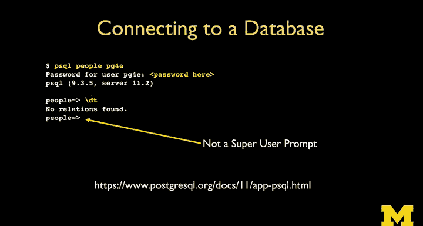

# 004：SQL架构解析


在本节课中，我们将学习如何运行SQL命令与数据库服务器进行通信。我们将了解客户端与服务器的关系，学习如何创建数据库、用户和表，并初步探索SQL命令的结构。

## 客户端与服务器架构

上一节我们介绍了SQL的基本概念，本节中我们来看看SQL命令是如何与服务器交互的。

SQL通常运行在客户端-服务器架构上。即使所有软件都运行在你的笔记本电脑上，从逻辑上理解，**客户端**和**服务器**也是不同的软件实体。

*   **服务器**是核心，它由众多聪明的开发者历经数十年打造，负责高效地处理数据存储、检索、连接（JOIN）等复杂操作。
*   **客户端**是我们用来向服务器发送SQL命令的工具。它接收我们的输入，将其转发给服务器，并将服务器的响应返回给我们。

客户端可以是网页应用（如pgAdmin）、桌面软件，也可以是命令行工具。本课程将主要使用**命令行客户端**，因为它易于教学、文档化，并且对视觉障碍用户更友好。

## 在命令行中使用PostgreSQL

我们将主要在Linux环境下进行教学。虽然大部分命令在Mac OS的终端或Windows的Bash shell中同样适用，但考虑到服务器领域广泛使用Linux，直接学习Linux命令更具实际意义。

### 连接与权限

要使用数据库，首先需要连接。连接时需要提供账户和密码，服务器根据这些信息授予相应的操作权限。

安装PostgreSQL时会创建一个默认的**超级用户**，名为`postgres`。超级用户拥有最高权限，可以执行所有操作，包括创建其他用户和数据库。在Linux命令行中，超级用户的提示符通常是`#`。

以下是查看现有数据库的命令：
```sql
\l
```
执行此命令会列出服务器上的所有数据库。初始安装后，你会看到一些由`postgres`用户拥有的系统数据库（如`postgres`, `template0`, `template1`）。**请不要修改或删除这些数据库**，它们是PostgreSQL自身用来高效管理元数据所必需的。

### 创建用户与数据库

作为最佳实践，我们不应使用超级用户进行日常操作，而应创建专属的普通用户和数据库。

以下是创建新用户和数据库的SQL命令：
```sql
CREATE USER pg4e WITH PASSWORD 'secret';
CREATE DATABASE people WITH OWNER pg4e;
```
*   `CREATE USER` 创建了一个名为 `pg4e` 的新用户，并设置其密码为 `'secret'`。
*   `CREATE DATABASE` 创建了一个名为 `people` 的新数据库，并指定其所有者为我们刚创建的 `pg4e` 用户。

完成创建后，可以使用 `\q` 命令退出当前的SQL会话。

### 使用普通用户连接

现在，我们可以使用新创建的普通用户身份连接到专属数据库。

连接命令的格式如下：
```bash
psql -d people -U pg4e
```
*   `-d people` 指定要连接的数据库名为 `people`。
*   `-U pg4e` 指定使用用户 `pg4e` 进行连接。

连接成功后，命令行提示符会发生变化（不再是`#`），这表示我们当前是以普通用户权限进行操作。这种权限最小化原则有助于提高系统安全性。

连接后，可以使用 `\dt` 命令查看当前数据库中有哪些表。初始状态下，`people` 数据库是空的，所以会显示“没有找到任何关系”。“关系”是数据库理论中对“表”的学术称呼。

## 创建数据表



现在我们的数据库是空的，接下来我们学习如何创建存储数据的表。

创建表需要使用 `CREATE TABLE` 语句，并定义表的**模式**。模式就像我们与数据库签订的一份“契约”，它明确规定表的结构：有哪些列，每列存储什么类型的数据。

以下是创建一个简单用户表的SQL命令：
```sql
CREATE TABLE users (
    name VARCHAR(128),
    email VARCHAR(128)
);
```
*   `CREATE TABLE users` 声明要创建一个名为 `users` 的表。
*   括号 `()` 内定义了表的列。
*   `name VARCHAR(128)` 定义了一个名为 `name` 的列，其数据类型为 `VARCHAR`，最大长度为128个字符。
*   逗号 `,` 用于分隔不同的列定义。
*   语句以分号 `;` 结束。

定义精确的模式（如`VARCHAR(128)`）非常重要。数据库引擎会利用这些信息以最高效、最紧凑的方式存储和检索数据。如果你试图存入超过128个字符的数据，PostgreSQL会报错，因为它正在严格执行你设定的“契约”。当然，SQL也提供了更灵活的数据类型（如`TEXT`）来处理长度不确定的数据。

创建表后，再次使用 `\dt` 命令，就能看到新创建的 `users` 表。如果想查看这个表的详细结构（模式），可以使用 `\d+ users` 命令。

## 总结


本节课中我们一起学习了SQL的客户端-服务器架构，并动手实践了从连接数据库到创建表的一系列操作。我们了解了超级用户与普通用户的区别，学会了创建专属的用户和数据库，并掌握了定义数据表模式的基本方法。下一节，我们将学习如何向表中插入数据、查询数据、更新和删除数据，即完整的CRUD操作。