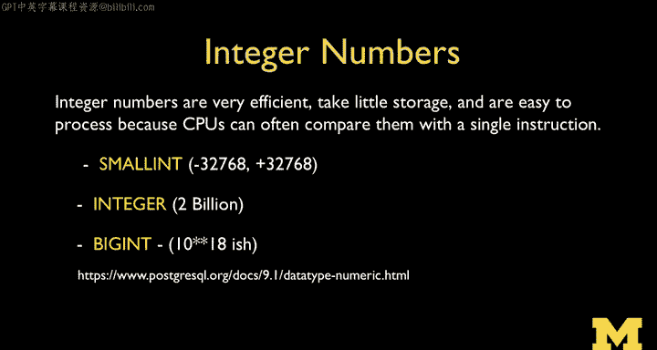
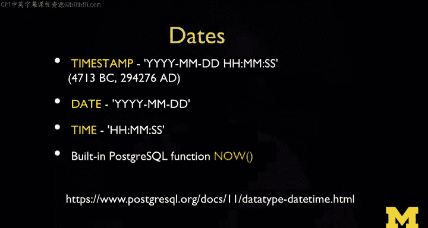
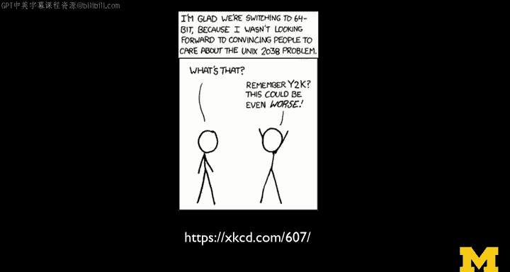

# 010：PostgreSQL数据类型详解

在本节课中，我们将要学习PostgreSQL中可用的各种数据类型。理解这些类型对于设计高效、准确的数据库表结构至关重要。我们将探讨文本、数字、二进制、日期等类型，并了解它们各自的特点和适用场景。

## 文本与字符类型

上一节我们介绍了CRUD操作和WHERE子句等基本命令，本节中我们来看看可以在表模式中定义哪些数据类型。

我们拥有文本字段、二进制字段（有时称为BLOB）、数字字段以及自增字段。

以下是主要的文本类型及其特点：

*   **VARCHAR**：这是我们之前使用过的类型。它是一种高效的存储方式，适用于长度可变的字符，范围可以从一个字符到128个字符或更多。
*   **CHAR**：这是一种固定长度的空间，通常用于较短的字符串。当字符串长度超过64个字符时，如果使用CHAR且字符串未填满，可能会浪费空间。但在某些情况下，例如存储全局唯一标识符（GUID）时，如果其长度固定为64个字符，使用CHAR是合适的。数据库在处理完全填满的固定长度字段时效率更高。
*   **TEXT**：这是一种文本字段，数据库不会强制限制其长度。它可以存储短、中、长文本。其开头有一个长度计数，但影响不大。关键点在于，通常不将TEXT字段用于索引和排序，也不建议在ORDER BY或WHERE子句中使用。你可能会在LIKE子句中使用它，但要知道这会导致全表扫描。因此，它非常适合存储博客文章、评论甚至整个网页内容。

PostgreSQL只提供一种TEXT类型，这简化了选择。许多其他数据库则提供一长串不同的文本类型。基本思路是区分已知长度的数据和未知长度的数据。

CHAR、VARCHAR和TEXT都支持字符集。这意味着它们不仅仅是简单的8位字符。传统的西方字符集（通常称为Latin-1或ASCII）包含127个字符，恰好适合8位（一个字节），非常高效。而对于拉丁字符集之外的字符，如西里尔字母或亚洲字符集，它们可能超过8位，可能是16位甚至32位。因此，100个这样的字符可能占用多达400字节。这对于处理用户通过表单或博客评论输入的各种语言字符至关重要。此外，不同字符集的排序规则也不同。数据库已经为我们妥善处理了字符集、索引、排序和用户输入等问题。

那么，为什么我要强调字符集呢？因为你也可以存储没有字符集的数据。

## 二进制与数字类型

以下是二进制和数字类型：

*   **BYTEA**：用于存储数据库不知道其字符集的数据。你可以存储二进制大对象（BLOB）信息，例如小图像等。
*   **整数**：有多种整数大小。我们通常使用的标准整数是32位整数，范围约±21亿，适用于大多数情况。你可以使用SMALLINT来节省空间，但范围受限。BIGINT则远大于21亿。大多数情况下，我们只需创建INTEGER列。

以下是浮点数和精确数字类型：

*   **REAL**：这是一个32位浮点数，具有7位精度。这里的“精度”是指它有7个准确数字，但小数点可以放在任何位置。这种32位实数自计算诞生之初就存在，仅适用于近似计算。例如，计算长期的平均气温可能足够，但对于需要高精度的科学计算（如计算恒星碰撞的力），REAL就不够用了，因为只有7位精度，误差会累积。
*   **DOUBLE PRECISION**：我们称之为双精度，因为它的大小是REAL的两倍。通常用于需要进行大量重复计算的科学计算（如模拟），此时应使用DOUBLE PRECISION。
*   **NUMERIC**：REAL和DOUBLE PRECISION都不适合存储货币。因为它们在分母中用2的幂来表示分数，而像美分（1/100美元）这样的分数无法在其中精确表示。NUMERIC类型允许你指定精度，例如14位数字带2位小数，这样就能完美表示货币。有许多电影都探讨过无法精确表示货币时会发生什么（比如未被精确表示的利息零头等问题）。所以，处理货币时，请使用NUMERIC。

## 日期与时间类型

日期有很多重要方面，包括日期和时间。

我们经常使用的一种类型叫做**TIMESTAMP**。时间戳是一个64位数，表示从公元前4713年以来的分钟和秒数。过去，它曾是一个32位数，我们遇到了Unix时间（自1970年1月1日以来的秒数，32位）将在2038年耗尽空间的问题。PostgreSQL已切换到64位时间戳。如果他们当时没有切换，仍在2038年使用32位时间戳，那么所有Linux系统和数据库都可能崩溃。而使用64位后，我们几乎可以再使用30万年而不会耗尽空间。所以，我们不必再担心2038年时间戳耗尽的问题。

## 性能考量

接下来，我们将讨论我一直以来都在提及的内容：这些数据类型如何影响性能以及它们的运行速度等。

---

本节课中我们一起学习了PostgreSQL的核心数据类型。我们了解了文本类型（CHAR, VARCHAR, TEXT）如何根据长度和字符集需求进行选择，数字类型（整数, REAL, DOUBLE PRECISION, NUMERIC）如何根据精度和范围（尤其是货币计算）进行区分，以及日期时间类型（特别是TIMESTAMP）的存储原理和64位升级的重要性。理解这些类型的特点，是设计出高效、可靠数据库模式的基础。