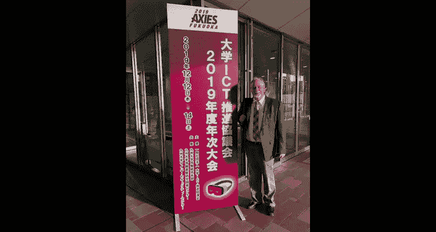

# 014：日本京都办公时间

大家好，我是Chuck。我们现在在日本京都。这是第一次在卡拉OK包厢里举行的办公时间。我们没有唱歌，但吃了很多食物。这主要是一个安静、私密的房间，我可以使用。因此，我认为未来可能会开始使用卡拉OK包厢作为会议地点，因为效果很好。

和往常一样，我想让大家互相认识一下，请各位挥挥手，打个招呼，并简单谈谈对这门课程的感受。

以下是参与本次办公时间的同学介绍：

*   Barrett：我来自美国，但住在日本，目前教英语。我希望在Dr. Chuck的帮助下，能转型从事教育编程。
*   Gary：我来自中国。我在Coursera上学习了由Chuck教授指导的Web开发课程。我认为他是一个非常有趣的人。如果你上他的课，永远不会感到无聊。
*   Se：我今天早上刚从韩国飞过来。很高兴能来到这里参加这次活动，成为其中一员。我很荣幸你能花这么多时间来看我们，谢谢。
*   Heri：我来自印度尼西亚。我的背景是林业。我……（此处录音不清晰）来帮助我的学习。谢谢Chuck解答问题。
*   Yuki Shaakai：我来自日本。我非常喜欢学习，并且乐于学习Python和编程。很高兴见到你。
*   You：我来自日本，很高兴见到你。
*   Shoji：这是我的好朋友Shoji。他是京都大学的教员，也是京都大学MOOC项目的一部分。我和Shoji认识很久了，通常当Shoji去美国时，我们会一起唱卡拉OK，一起参加会议。所以我们现在在京都。

我不完全知道我接下来要去哪里。但我对2020年有一个计划。

我打算取消很多常规旅行，尝试去一些我以前从未去过的地方。因为世界各地有很多Python会议，所以我认为我会开始参加越来越多非传统会议地点的Python会议，走遍世界各地。也许我很快就会来到你附近的国家。我们线上见。

在本节课中，我们通过一次特别的办公时间，认识了来自世界各地的几位课程学员，并了解了讲师Chuck未来的旅行计划。

我们一起了解了不同背景的学习者如何聚集在一起交流，以及讲师对于探索新地点、参与全球Python社区活动的展望。