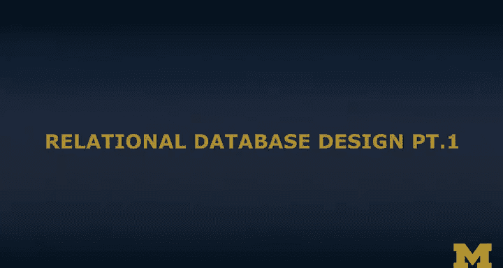
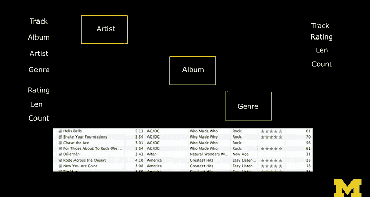

# 015：关系型数据库设计（第一部分）

## 概述

在本节课中，我们将要学习关系型数据库设计的核心概念。我们将探讨如何将用户界面中的数据需求，转化为一个高效、无冗余的数据库结构。核心在于理解并避免数据的垂直复制，并通过建立表与表之间的关系来组织数据。

## 数据库设计的基本理念

数据库设计的最终目标是绘制出一幅数据的“形状图”。这幅图由代表数据表的方框和代表表之间关系的连线（即外键）组成。绘制这幅图的过程，就是为应用程序构建数据模型的过程。这个数据模型是应用程序的核心与灵魂，它决定了数据如何被存储和访问。

上一节我们介绍了数据库设计的目标是绘制数据模型图，本节中我们来看看为什么需要这样的设计。

## 为何要避免垂直复制

如果将所有数据简单地存储在一个类似CSV文件的结构中，对于少量数据或许可行。但当数据量增长到数百万甚至数亿条时，这种方法的效率会急剧下降。关系型数据库的优势在于，即使面对海量数据，它依然能保持高效的查询性能。

CSV或电子表格方法的一个根本缺陷在于会导致“垂直复制”。例如，在录入音乐库时，你会反复输入“Black Sabbath”这个艺术家名字。这看似方便，但会带来问题：

*   如果你在首次输入时拼错了名字（例如“Blak Sabbath”），这个错误会被复制到所有相关记录中。
*   当你需要更正这个错误时，就必须找到并修改所有出现该拼写错误的地方，这在海量数据中几乎是不可能的。

理想的情况是，像“Black Sabbath”这样的字符串在数据库中只存储一次。我们为它分配一个唯一的数字标识（例如 `42`），然后在所有需要引用“Black Sabbath”的地方，都使用这个数字 `42`。这样，如果需要更正拼写，只需在存储它的那个唯一位置修改一次即可。

**核心概念**：避免字符串数据的垂直复制。这是构建数据模型时最重要的原则。

## 从用户界面到数据模型

你可能会想，既然用户界面（例如一个音乐列表）需要显示所有这些重复的信息，为什么数据库不能也这样存储呢？关键在于区分**展示逻辑**和**存储逻辑**。

我们接受用户界面的设计需求，因为它对用户来说是直观和方便的。用户希望看到完整的艺术家名、专辑名等信息，并能进行搜索和排序。我们不应要求改变用户界面。

我们的任务是，在数据库层面设计一个高效、无冗余的数据模型，然后通过查询和程序逻辑，从这个模型中**重建**出用户所期望的界面。数据模型服务于存储效率和数据一致性，而应用程序负责将数据以友好的形式呈现给用户。

## 设计过程简介

设计过程始于分析数据中的每个独立信息单元（例如艺术家、专辑、曲目、流派）。你需要决定每个信息单元应该存放在哪个表中，有时甚至需要创建新的表来专门存放它们。

以下是设计过程中的关键步骤：
1.  **识别实体**：找出需要独立管理的事物，如“艺术家”、“专辑”、“曲目”。
2.  **创建表**：为每个实体创建一张数据表。
3.  **建立关系**：确定这些实体之间的关系（例如，一张专辑“属于”一位艺术家），并通过外键连线在图中表示出来。
4.  **分配键**：为每条记录分配唯一标识符（主键），并在关联处使用这些标识符（外键）。

最终，你会得到一幅由方框（表）和连线（关系）构成的图表，这就是你的数据库蓝图。

## 总结

本节课中我们一起学习了关系型数据库设计的起点。我们明白了为何要避免数据的垂直复制，这是为了提升数据一致性、维护效率和查询性能。我们也理解了数据库设计的目标是根据用户界面需求，构建一个底层的高效存储模型，而非直接复制界面上的数据结构。在接下来的部分，我们将动手实践，一步步构建这样的数据表模型图。