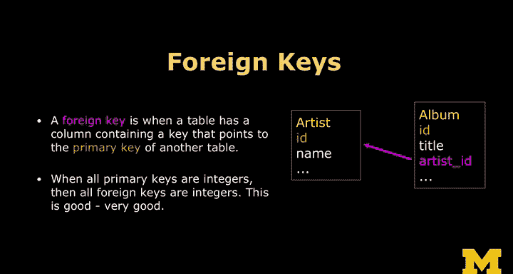

# 017：数据库键详解 🔑

在本节课中，我们将要学习数据库中的三种关键概念：主键、逻辑键和外键。理解这些键的类型和作用，是设计高效、规范数据库的基础。

## 主键、逻辑键与外键

现在我们来讨论不同类型的键。键是连接点，我们使用键来连接一行数据与另一行数据，或者通过键在数据库表中查找某一行数据。键主要有三种类型。

### 主键

表中的每一行数据都有一个我们称之为**主键**的标识。它就像是一个句柄，用于唯一地指代那一行数据。例如，AC行可能是编号42，Zeppelin行是编号75，C7 at Uish行是编号120453。这些编号就是主键。它是一个单一的字符串（通常是数字），并且这个数字会在数据库的许多地方被复制引用。所以，主键是行的唯一标识符。

### 逻辑键

在大多数表中，还存在我们所说的**逻辑键**。主键可能不会直接出现在用户界面的URL或其他地方。你几乎不会直接知道或使用主键是什么。而逻辑键则是你，或者说外部世界，用来识别数据的东西。例如，你的电子邮件地址、曲目的标题、专辑的名称，或者登录用户的电子邮件地址等。如果你想象外部世界需要找到某个特定的人或曲目，他们会使用逻辑键。在用户界面中，如果你有一个搜索框，你在里面输入的内容就是逻辑键。这是外部世界用来查找一行的东西。

### 外键

另一种在数据库内部使用的键叫做**外键**。它是一个表中的整数，指向另一个表中的某一行数据。我们称之为外键，是因为它指向的是“外部”的表。这个外部表是“外”表，而包含外键的表是“本地”表。

## 命名约定与最佳实践

不同的组织和软件会使用不同的命名约定。我选择了一种较为常见的约定：在每个表中，主键字段都命名为 `ID`。例如，在专辑表中，`ID` 字段就是主键。这样，无论我们给表起什么名字，我们都知道主键字段叫 `ID`。

逻辑键的命名则根据实际情况而定。

对于外键，我们使用一种约定：`表名_ID`。例如，`artist_ID` 就指向艺术家表中的一行。通过这个约定，我一看就知道 `artist_ID` 指向的是 `artist` 表。

当你加入一个组织时，数据库设计的一个重要部分是遵循该组织用于保持自身有序的一套规则和约定。他们会告诉你如何命名字段。你可能会想：“等等，我大学时教授教的是另一种命名方式。”但请不要这么说。你应该说：“太好了，我很喜欢在这里工作。”然后遵循他们的规则。因为最终，选择哪套规则并不如在这些规则内部保持一致性重要。我选择了一套相当常见的规则，你在很多地方都会看到相同的规则。但一个组织使用不同的数据库列命名规则，并不意味着他们就是错的。

## 为什么使用整数主键？

主键的概念对很多人来说有些反直觉。你可能会想：“电子邮件地址就是电子邮件地址，为什么不在任何地方都使用它呢？”确实有一些数据库专家可能会告诉你这是个好主意，但这并不是一个好主意，那些专家是错的。

关键在于，无论你使用什么数据库系统，使查询速度极快的原因，正是这种从字符串到数字的映射。那些建议你可以将逻辑键用作主键（意味着你可以到处使用电子邮件地址）的人，实际上是在使用数据库层来模拟这一点，底层仍然有一个数字，只是你没有直接处理它。既然如此，你不如直接处理这个数字。

此外，像电子邮件地址这样的逻辑键可能会改变。例如，在密歇根大学，你可以来注册一个账户，之后你可能结婚、离婚，或者只是不喜欢你的名字（因为我们的账户名是由你名字的一部分组成的，有时效果并不理想），你可以填写表格更改你的逻辑键。但在我们的校园系统中，一旦你开始注册课程，我们仍然可以更改你的逻辑键。请记住，它是一个字符串。如果系统架构得当，这个更改只需要在一个地方进行。但在大学里，你可能有多达20个大型系统。如果我们更改了你的电子邮件地址，我们必须通知所有20个系统，告诉他们这个人的电子邮件地址在某天从A改成了B。然后这20个系统都需要更改。但在每个系统内部，它们只有一个地方需要更改，即在用户表或其他相关表中更改逻辑键。因此，不要过于相信电子邮件地址永远不会改变，尽管平均而言它们变化得很慢。

所以，如果你使用字符串（而不是数字）作为主键，或者使用像GoUIDs（一长串随机数字）这样的东西，并在其上连接，这些方式的效率并不高。尽管在某些数据库中，它们会模拟这种效率。最简单的方法就是使用整数作为你的外键，整数作为你的主键，而字符串或其他类型作为你的逻辑键。这样，无论你使用什么数据库，你的系统都能非常高效地运行。

## 外键的作用

正如前面所说，外键是一个指向另一个表主键的键。因此，如果我们指向艺术家表中的一行，我们会将其命名为 `artist_ID`。最后再强调一次：当主键是整数时，外键也应该是整数。系统可以非常高效地进行这种整数匹配。

## 总结与预告

本节课中，我们一起学习了数据库中的三种键：**主键**（行的唯一数字标识）、**逻辑键**（外部世界用来查找数据的标识，如电子邮件或标题）和**外键**（指向其他表主键的整数，用于建立表间关系）。我们还讨论了使用整数作为主/外键的效率和一致性优势，以及遵循组织内部命名约定的重要性。

接下来，我们将开始使用这些外键和主键来连接数据，这个过程称为**数据库规范化**。我们将把这些概念整合起来，并真正开始编写代码。