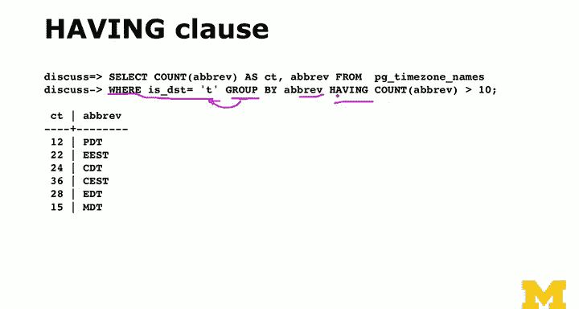

# 032：DISTINCT与GROUP BY语句 🗂️


在本节课中，我们将学习如何使用 `DISTINCT` 和 `GROUP BY` 语句来处理查询结果中的重复数据。这两个功能是SQL中用于精简和汇总数据的重要工具。

## 概述：理解垂直重复数据

在上一节关于数据建模的讨论中，我们介绍了如何通过规范化来移除数据中的垂直重复。然而，当我们通过连接（JOIN）操作将多个表的数据合并时，垂直重复有时会重新出现。`DISTINCT` 和 `GROUP BY` 语句的作用，就是在执行 `SELECT` 查询后，进一步处理这些重复的数据行。

`DISTINCT` 用于简单地移除完全相同的行。`GROUP BY` 则更为强大，它在合并重复行的同时，允许我们对其他列进行聚合计算（如计数、求和、求平均值等）。

## 使用 DISTINCT 移除重复行

`DISTINCT` 是最简单的去重方法。它的逻辑是：执行 `SELECT` 语句后，如果结果中有多行数据完全相同，则只保留其中一行。

为了更好地理解 `SELECT` 语句的威力，我们需要明白，只选择你真正需要的列（而不是使用 `SELECT *`）是高效查询的关键。这缩小了查询结果的“宽度”，让数据库能以最有效的方式返回数据。`DISTINCT` 正是在这个被缩窄的结果集上工作的。

以下是一个简单的示例。假设我们有一个包含多辆赛车的表格，其中“车型”列存在重复：

```sql
SELECT DISTINCT model FROM racing_cars;
```

这条语句只返回唯一的车型名称，所有重复的车型都会被移除。

## 使用 DISTINCT ON 进行条件去重

`DISTINCT ON` 用于更复杂的情况：你希望基于**部分列**的组合来去重，而允许其他列存在重复。

例如，如果你执行 `SELECT DISTINCT ON (model) make, model, year`，数据库会确保 `model` 列的值是唯一的。这意味着，即使 `make`（制造商）列有重复（例如，不同制造商可能有同名车型），只要 `model` 是第一次出现，该行就会被保留。

## 使用 GROUP BY 进行分组聚合

现在，让我们进入更强大的 `GROUP BY`。与 `DISTINCT` 只是简单地丢弃重复行不同，`GROUP BY` 在合并重复行时，可以对其他列执行聚合函数。

我们可以把 `GROUP BY` 想象成一个Python字典：它将某一列（或几列）中值相同的行“分组”到一起，然后对每个组进行计算。

以下是一个使用 `timezone` 表数据的例子，计算每个时区缩写出现的次数：

```sql
SELECT abbr, COUNT(*) FROM timezone GROUP BY abbr;
```

这条语句会为每个唯一的 `abbr`（时区缩写）生成一行结果，并显示该缩写出现了多少次。`COUNT(*)` 就是一个聚合函数，它计算每个分组中的行数。

## WHERE 与 HAVING 子句的区别

在使用 `GROUP BY` 时，过滤条件的位置至关重要，这涉及到 `WHERE` 和 `HAVING` 两个子句的区别。

*   **WHERE 子句**：在分组**之前**进行过滤。它作用于原始数据行，决定哪些行有资格进入分组。
    ```sql
    -- 只对非夏令时的时区进行分组计数
    SELECT abbr, COUNT(*) FROM timezone WHERE isdst = false GROUP BY abbr;
    ```

*   **HAVING 子句**：在分组**之后**进行过滤。它作用于分组聚合后的结果，决定哪些分组可以出现在最终结果中。
    ```sql
    -- 只显示出现次数超过10次的时区缩写
    SELECT abbr, COUNT(*) AS count FROM timezone GROUP BY abbr HAVING COUNT(*) > 10;
    ```

简单来说，`WHERE` 是“分组前的筛选”，而 `HAVING` 是“分组后的筛选”。你不能在 `WHERE` 子句中直接使用聚合函数（如 `COUNT(*)`），但可以在 `HAVING` 子句中使用。

## 总结

本节课我们一起学习了处理SQL查询结果中重复数据的两个核心语句。

1.  **`DISTINCT`**：用于移除 `SELECT` 结果集中所有列都完全相同的重复行。
2.  **`GROUP BY`**：用于将数据按指定列分组，并在合并重复项的同时，使用聚合函数（如 `COUNT`, `SUM`, `AVG`）对每个组进行计算。




我们还明确了 `WHERE` 和 `HAVING` 子句在分组查询中的不同角色：`WHERE` 在分组前过滤行，`HAVING` 在分组后过滤组。掌握这些概念，能帮助你更精确地控制和汇总数据库查询结果。