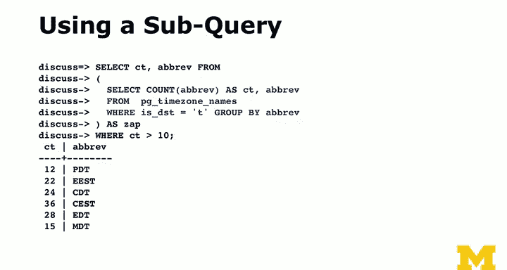

# 035：子查询技术解析 🧠


在本节课中，我们将要学习SQL中的子查询技术。子查询是一种强大的工具，它允许我们在一个查询内部嵌套另一个查询。我们将探讨子查询的基本概念、工作原理、使用场景，以及为什么数据库管理员有时会对它持保留态度。

## 什么是子查询？ 🤔

上一节我们介绍了基本的查询结构，本节中我们来看看子查询。子查询本质上是一个嵌套在另一个查询内部的查询。它允许你用另一个`SELECT`语句的结果，来替换查询中的某个值或一组值。

例如，假设我们想找到与账户名为“Ed”相关的所有评论。传统方法可能需要两步：

1.  首先查询账户ID：`SELECT id FROM account WHERE name = 'Ed';` （假设结果为7）
2.  然后使用这个ID：`SELECT * FROM comment WHERE account_id = 7;`

子查询允许我们将这两步合并为一个语句：

```sql
SELECT * FROM comment WHERE account_id = (SELECT id FROM account WHERE name = 'Ed');
```

在这个例子中，括号内的`SELECT`语句会先执行，返回一个值（7），然后外层查询使用这个值进行过滤。只要内层查询返回**单个值**，这种用法就是有效的。

## 处理返回多行的子查询 📊

如果内层查询可能返回多个结果，我们就需要使用`IN`操作符，而不是等号。

以下是使用`IN`操作符处理集合的例子：

```sql
SELECT * FROM comment WHERE account_id IN (SELECT id FROM account WHERE name LIKE 'E%');
```

这条语句会查找所有账户名以‘E’开头的账户所发布的评论。内层查询可能返回多个ID（例如40个），`WHERE`子句会智能地检查`account_id`是否在这个ID集合中。

这是一种非常方便的表达复杂查询意图的方式。

## 性能考量：为什么DBA有时不喜欢子查询？ ⚠️

虽然子查询在表达上很优雅，但在性能上可能存在争议。数据库管理员（DBA）通常鼓励寻找不使用子查询的替代方案，原因如下：

当向数据库发送一个查询时，数据库会进行“查询优化”。优化器会分析整个查询，决定最有效的执行路径（例如使用哪个索引，如何连接表）。

子查询的问题在于，它在某种程度上“告诉”数据库如何执行：必须先执行内层查询，产生一个中间结果（通常是一个临时表），然后外层查询再基于这个结果执行。这相当于将优化过程分成了两个相对独立的部分，限制了优化器从全局视角进行优化的能力。

因此，对于数据库来说，一个包含子查询的复杂语句，其优化潜力可能不如一个精心编写的、使用`JOIN`或窗口函数等的单一查询。在在线交易处理（OLTP）系统中，每秒可能有成千上万的查询，每个查询慢几毫秒，累积起来的影响会非常显著。

不过，在数据分析或数据挖掘场景下，查询执行的频率较低，更看重开发的便捷性和查询语句的表达清晰度，此时使用子查询通常是可接受的权衡。

## 子查询与HAVING子句的替代方案 🔄

回顾一下，`HAVING`子句用于对`GROUP BY`分组后的结果进行过滤，因为它可以访问聚合函数的结果（如`COUNT`, `SUM`），而`WHERE`子句在分组前执行，不能直接使用聚合函数。

假设我们没有`HAVING`子句，想要筛选出评论数超过10条的用户，我们可以用子查询来模拟：

```sql
SELECT COUNT(account_id), account_id
FROM (
    SELECT account_id, COUNT(*) AS cnt
    FROM comment
    GROUP BY account_id
) AS zap
WHERE cnt > 10;
```

在这个例子中：
1.  内层查询首先执行，按`account_id`分组并计算每个组的评论数（`cnt`）。
2.  这个结果集被当作一个临时表（这里别名为`zap`）。
3.  外层查询再从`zap`这个临时表中，筛选出`cnt > 10`的记录。

这确实能达到和`HAVING`子句相同的效果：

```sql
SELECT account_id, COUNT(*)
FROM comment
GROUP BY account_id
HAVING COUNT(*) > 10;
```



显然，使用`HAVING`的版本更简洁、更直接地表达了我们的意图。对于数据库优化器来说，`HAVING`版本也更容易理解和优化，因为它是一个完整的、声明式的查询，而不是分步骤的过程性描述。这就是DBA更倾向于后者的原因——它为数据库提供了更大的优化空间。

## 总结与下节预告 📝

本节课中我们一起学习了SQL子查询技术。我们了解了子查询是将一个查询嵌套在另一个查询中的强大工具，它可以用`SELECT`语句的结果来动态提供值或集合。我们探讨了其基本语法，包括使用`=`处理单值返回和`IN`处理多值返回的情况。

我们也深入讨论了子查询的优缺点：它提升了代码的表达能力和编写便捷性，尤其在复杂过滤和数据分析中非常有用；但另一方面，它可能阻碍数据库查询优化器的全局优化，在需要高性能的在线事务处理系统中可能成为性能瓶颈。我们还比较了使用子查询模拟`HAVING`功能与直接使用`HAVING`子句的区别，后者通常更受青睐。


下一节我们将探讨一个至关重要的新话题：**并发**。并发控制主要在处理像银行交易这样的在线系统时至关重要，当多个事务同时访问和修改数据时，如何保证数据的一致性和完整性是数据库设计的核心挑战之一。