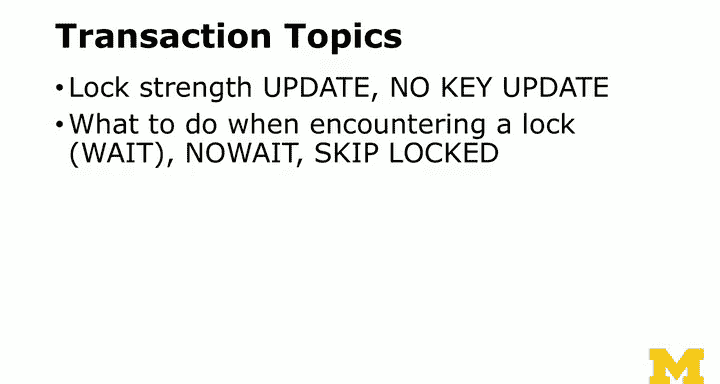

# 037：并发控制与事务处理 🧵


在本节课中，我们将要学习数据库中的并发控制与事务处理。理解这些概念对于构建多用户在线应用至关重要，它能确保数据在同时被多人访问和修改时依然保持正确和一致。

## 概述

并发控制是数据库管理系统在多用户同时访问时，确保数据一致性和完整性的核心机制。本节将解释并发问题的本质、数据库如何通过原子操作和锁来解决这些问题，并介绍事务的基本用法。

## 并发问题与原子性

上一节我们介绍了数据库的基本操作，本节中我们来看看当多个用户同时操作同一数据时会发生什么。

数据库通常被设计为多用户系统。假设有100个用户同时在线，他们都在尝试更新同一行数据（例如，将计数器 `count` 加1）。如果数据库没有并发控制，可能会发生以下情况：
1.  第一个事务读取 `count` 的旧值（例如100）。
2.  第二个事务也读取了相同的旧值（100）。
3.  第三个事务同样读取了旧值（100）。
4.  三个事务各自将值加1（得到101），并写回数据库。
最终，尽管执行了三次“加1”操作，`count` 的值却只从100变成了101，而不是预期的103。

**核心问题**在于，多个操作在时间上重叠，导致读取了过时的数据。数据库必须强制规定：对同一数据的“读取-修改-写入”操作序列必须作为一个不可分割的单元执行，这就是**原子性**。

## 锁机制

数据库通过**锁机制**来实现原子性。其基本模式非常简单：
1.  事务需要更新数据前，必须先获得该数据的锁。
2.  获得锁后，事务可以安全地读取数据、进行计算、写入新值。
3.  操作完成后，事务释放锁。
4.  如果另一个事务试图获取已被锁定的数据，它必须等待，直到锁被释放。

这个过程保证了操作的顺序执行。例如，三个“加1”事务会依次获得锁、读取当前值（100、101、102）、计算新值（101、102、103）并写入，最终结果正确为103。

每个以分号结束的SQL语句（如 `UPDATE`、`INSERT`）在默认情况下都是原子的。数据库的锁实现（如锁的粒度、性能、内存消耗）是其核心竞争力的体现。

## 利用原子性的高级技巧

理解了原子操作后，我们可以利用它来编写更高效、更安全的SQL语句。

### 使用 `RETURNING` 子句

在一条SQL语句中完成操作并立即获取结果，可以避免额外的查询，并保证在并发环境下看到的是操作后的最新值。

**代码示例：**
```sql
-- 增加计数并立即返回新值
UPDATE likes SET how_much = how_much + 1
WHERE post_id = 1 AND account_id = 1
RETURNING how_much;
```
即使多个用户同时点击“点赞”按钮，这条语句也能确保返回正确的累计数（如80, 81, 82...）。

### 使用 `INSERT ... ON CONFLICT` (UPSERT)

有时我们希望：如果记录不存在则插入，如果存在则更新。这可以通过 `ON CONFLICT` 子句在一个原子语句中完成。

**代码示例：**
```sql
-- 尝试插入，如果冲突（因唯一约束）则执行更新
INSERT INTO likes (post_id, account_id, how_much)
VALUES (1, 1, 1)
ON CONFLICT (post_id, account_id) -- 指定冲突检测的约束
DO UPDATE SET how_much = likes.how_much + 1
RETURNING *;
```
这条语句相当于一个“尝试-捕获”逻辑。无论初始记录是否存在（`how_much` 为0或79），它都能原子性地将其设置为1或80，并返回更新后的记录。

## 显式事务控制

对于更复杂的多步骤操作，我们需要使用显式事务（`BEGIN`、`COMMIT`、`ROLLBACK`）和行级锁（`SELECT ... FOR UPDATE`）来保证一系列操作的原子性。

以下是显式事务的典型流程：
1.  `BEGIN;` 开始一个事务。
2.  使用 `SELECT ... FOR UPDATE` 查询并锁定目标行。其他尝试锁定同一行的事务必须等待。
3.  在事务内执行业务逻辑（如检查状态、计算）。
4.  根据业务逻辑决定最终操作：
    *   `COMMIT;` 提交事务，所有修改永久生效并释放锁。
    *   `ROLLBACK;` 回滚事务，放弃所有修改并释放锁。

**代码示例：**
```sql
BEGIN; -- 开始事务

-- 1. 锁定要操作的行，防止其他并发修改
SELECT * FROM game_sessions
WHERE status = 'waiting'
FOR UPDATE SKIP LOCKED -- 跳过已被锁定的行
LIMIT 1;

-- 2. 在事务内进行业务判断和更新
-- （例如，匹配玩家、更新游戏状态）

-- 3. 根据情况提交或回滚
COMMIT; -- 或 ROLLBACK;
```
在这个例子中，`FOR UPDATE` 锁定了符合条件的行，`SKIP LOCKED` 选项避免了等待已被锁定的行，提高了并发效率。

## 其他锁特性简介

除了基本用法，PostgreSQL 还提供了更精细的锁控制：
*   **`FOR NO KEY UPDATE`**：获取一个较弱的锁，表示不会更新该行的键字段。
*   **`FOR UPDATE NOWAIT`**：如果无法立即获得锁，直接报错而不是等待。
*   **`FOR UPDATE SKIP LOCKED`**：在 `SELECT` 多行时，只返回当前未被锁定的行。



这些高级特性在构建高并发应用时非常有用。

## 总结


本节课中我们一起学习了数据库并发控制的核心知识。我们首先了解了多用户同时操作可能引发的数据不一致问题，然后探讨了数据库如何通过**锁机制**和**原子性**来保证操作的顺序执行。接着，我们学习了利用 `RETURNING` 和 `INSERT ... ON CONFLICT` 子句编写高效原子语句的技巧。最后，我们介绍了使用 `BEGIN`、`COMMIT`、`ROLLBACK` 和 `SELECT ... FOR UPDATE` 进行显式事务控制的方法，以处理复杂的多步骤操作。理解这些概念是构建健壮、可靠的多用户应用的基础。