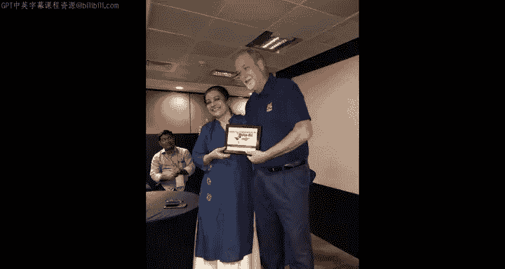

# 041：印度海得拉巴PyCon办公时间记录

## 概述
在本节课中，我们将回顾密歇根大学《PostgreSQL for Everybody》课程中，讲师在印度海得拉巴PyCon大会期间举行的办公时间片段。本节内容并非技术教程，而是记录了讲师与来自印度的课程学员的首次见面与交流，展现了全球学习社群的活力。

---

## 初访印度的感受
在开始记录办公时间的具体交流前，我想先分享首次访问印度的个人感受。

我来到印度是为了在第十届印度Python年度大会上发表演讲。印度的许多体验与我预期完全一致。这里充满活力、色彩斑斓、节奏快速、声音嘈杂、视觉冲击力强，而且食物非常美味。

但有一个方面是我未曾预料到的。或许是因为我在计算机领域学习和工作了超过四十年，我立刻在印度人民中间感到宾至如归。每个人都热情友好，很容易结交新朋友。

---

## 办公时间开场与学员介绍
上一节我们分享了背景感受，本节中我们来看看办公时间的具体开场。以下是讲师与到场学员的互动记录。

大家好，欢迎来到我在印度的第一天，也是我在印度的第一次办公时间。我来到2018年印度PyCon大会，当然要做一个关于本课程的演讲。我看到了一个非常庞大的办公时间聚会，而且我觉得随着时间推移人会越来越多。所以我想先开始，让大家认识一些来自印度的同班同学。

好的，那么嗨，你叫什么名字？如果你愿意，可以说说关于课程的感想。

*   **学员1**：我叫……，我是这门课的超级粉丝。我在2015年学习了这门课，已经三年了，感觉非常棒。
*   **学员2**：这门课程的设计方式，即使是对计算机科学一无所知的人也能学会Python并进入编程世界。所以我推荐每个人都来学习这门课。这正是我……另外，我也是Chuck博士的粉丝。我来自金奈，2015年开始学习这门课。我的第一门课是《Python for Everybody》。我最初尝试学习过很多编程语言，然后Python给了我真正上手实践的机会，并开发了一些小型应用。我的意思是，我非常认同讲座的内容。我感到非常自豪。
*   **讲师**：我真的很为你感到骄傲，因为你对这门学科有奉献精神。
*   **学员3**：嗨，我叫Anwe，目前就职于埃森哲。就在上周我刚报名了这门课的考试，并在三天内完成了所有内容。我只是想尽可能多地学习，所以谢谢你。
*   **讲师**：非常感谢你，谢谢你的到来。
*   **学员4**：大家好，我叫Ernab，目前正在学习《Python for Everybody》。我非常喜欢这门课，Chuck博士太棒了，谢谢你。
*   **学员5**：嗨，我叫Vikran，目前正在学习《Python for Everybody》。这是我第一次上Chuck博士的课，能在这里见到Chuck博士本人很有趣，谢谢你。
*   **学员6**：我叫True O‘bri，来自加尔各答。我已经完成了你五门Python课程中的三门。
*   **学员7**：嗨，我是Chenz，我已经完成了完整的Python课程，这是我的证书。这是我的证书，很高兴见到Chuck博士，我今年完成了这门课。
*   **学员8**：我是Kosha，我在2018年完成了《Programming for Everybody》，这是我上过的最好的Python课程之一。谢谢你，Chuck博士。它也是世界上规模最大的Python课程之一。
*   **学员9**：致所有人，我叫Jane Shirma，来自喀拉拉邦，那是我的家乡。我已经完成了五门课程中的两门，现在正在学习后续课程。我是Z博士的超级粉丝，我喜欢他的“blah blah blah blah blah”。他的课非常好，谢谢。
*   **讲师**：我说“blah blah blah”是因为我知道，如果我一时想不起要说什么，我需要给你一些时间思考。
*   **学员10**：我是Tarons，来自迈索尔。我完成了第一门课。
*   **学员11**：嗨，我是Ivin，我在2016年学习了这门课。我认为这门课实际上是我整个职业生涯的起点。我想说，我对你非常感激。
*   **讲师**：这正是我想听到的。
*   **学员12**：大家好，我叫Mo，我在2070年学习了《Python for Everybody》，是Chuck博士的超级粉丝，非常感谢。
*   **讲师**：谢谢，还有那些不想发言的朋友吗？我叫G，我只是不想占用屏幕时间。谢谢你们的到来。
*   **学员13**：嗨，我叫Raji，我在2014年学习了Python课程，非常喜欢它。谢谢你，Chuck博士，开发了如此优秀的学习材料。
*   **讲师**：还有其他人吗？我们都到齐了。好的，我们都结束了，好的。

---

## 结束语与未来展望
以上就是办公时间开始时的记录。到目前为止，这只是个开始，我期待着一场真正精彩的办公时间。在所有奇怪的事情中，尽管我年纪不小了，但我从未去过印度。不过我将于十二月再次到访，我会去孟买，去孟买和班加罗尔。这就像是我一生都没来过这里，而现在三个月内要来两次印度。我期待着在那些城市也能在办公时间见到大家。干杯。

---

## 总结
本节课中我们一起回顾了课程讲师在印度海得拉巴PyCon大会上的办公时间片段。我们看到了来自印度各地学员的热情分享，他们讲述了学习本课程的体验、收获以及对讲师的感谢。这次交流不仅是一次简单的见面，更体现了在线教育如何跨越地理界限，构建起一个充满活力与支持的全球学习社群。讲师也表达了对印度文化和人民的喜爱，并预告了未来的访问计划。