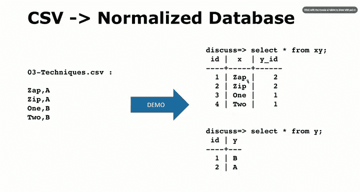

# 043：文件读取与解析演示 🗂️


在本节课中，我们将学习如何通过自动化脚本，将一个非规范化的CSV文件转换为规范化的数据库表。我们将重点演示如何使用SQL的`SELECT`、`DISTINCT`和子查询等核心功能，来实现数据的自动去重和关联表创建。

---

## 概述与目标

在之前的课程中，我们曾手动处理数据中的垂直重复问题。例如，一个包含“品牌”和“型号”两列的数据集，其中“品牌”信息存在大量重复。我们通过创建独立的查找表（Lookup Table）并使用外键关联来解决这个问题。本节课的目标是将这个过程自动化，使其能够处理任意CSV文件，并生成规范化的数据库结构。

上一节我们介绍了数据规范化的基本概念，本节中我们来看看如何用代码实现这一过程。

---

## 核心思路与演示说明

我将通过一个单独的屏幕录制来演示整个过程，以便你能跟随操作。但在这里，我会详细解释其背后的逻辑。

基本思路是：我们有一个CSV文件，其中包含重复数据的列（例如“品牌”）。我们的目标是：
1.  自动提取该列的所有**不重复值**（`DISTINCT`）。
2.  将这些不重复值插入到一个新建的查找表中，并为每一行生成一个唯一的ID。
3.  修改原表，将原来的文本列替换为指向查找表ID的外键列。



这个过程虽然可能不是在线应用程序的最佳实践，但对于**批量处理**CSV文件并快速获得一个规范化数据库来说，是非常高效和便捷的方法。

---

## 关键技术点

以下是我们将在这个自动化脚本中使用的主要SQL技术：

*   **`SELECT DISTINCT`**：用于从列中提取所有唯一值。
    ```sql
    SELECT DISTINCT brand FROM raw_table;
    ```

*   **子查询（Subselect）**：在`INSERT`或`UPDATE`语句中嵌套使用`SELECT`查询，实现动态数据关联。
    ```sql
    UPDATE main_table
    SET brand_id = (SELECT id FROM lookup_table WHERE lookup_table.brand_name = main_table.brand);
    ```

*   **外键约束**：确保主表与查找表之间的引用完整性。

这个演示将综合运用我们在近期课程中学到的大部分`SELECT`语句相关概念。

---

## SELECT语句的重要性总结

在数据库的“增删改查”四大操作中，`SELECT`（查）常常被最后讨论，因为我们需要用它来验证其他操作的结果。然而，正如之前强调的，`SELECT`语句才是体现关系型数据库强大威力的核心所在。

通过`SELECT`，我们可以：
*   **缩小数据视图**，从而显著提升查询性能。
*   利用`DISTINCT`等操作进行数据去重和整理。
*   实现复杂的数据关联和聚合。

我们目前所探讨的，可能还不到PostgreSQL中`SELECT`语句功能的一半。在完成所有数据规范化和优化之后，如何“查询”数据变得至关重要且充满技巧。到目前为止，我们已经很好地覆盖了`SELECT`语句的多种常见用法。

---

## 后续内容预告

接下来，在后续的课程中，我们将更深入地探讨**文本数据**在SQL中的处理。本次演示也会初步涉及一些文本操作，但后续会有更多关于文本搜索、JSON处理乃至自然语言处理（NLP）相关的内容。


本节课中我们一起学习了如何通过自动化脚本解析CSV文件并构建规范化数据库表，并再次认识到`SELECT`语句在数据查询与转换中的核心作用。