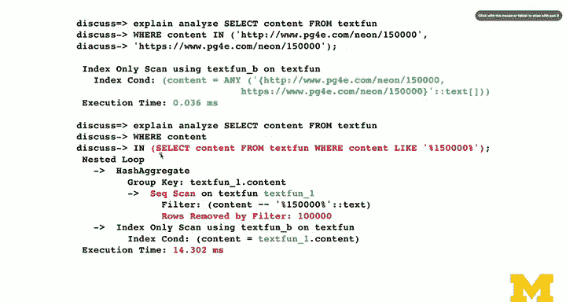

# 049：文本处理函数应用


在本节课中，我们将学习如何在 PostgreSQL 中处理文本数据。我们将探讨各种文本操作函数、`WHERE` 子句的使用，并深入理解查询性能，特别是索引如何影响查询速度。

## 概述

我们已经将一些文本数据存入数据库，现在将讨论如何使用函数和 `WHERE` 子句等工具来操作这些数据。本节将介绍一些标准操作，并指出 PostgreSQL 的一些独特之处。我们将重点关注文本处理函数及其在查询中的应用，同时分析不同查询方式的性能差异。

## 文本操作基础

上一节我们介绍了如何生成和插入数据，本节中我们来看看如何查询和操作这些文本数据。

`WHERE` 子句中的等号（`=`）操作符非常重要，因为它能提供最佳性能，尤其是在字符串列上建有索引时。

`LIKE` 操作符使用简单的通配符进行模式匹配。`SIMILAR TO` 操作符功能类似正则表达式，但许多人因其复杂性而不常使用。我们后续会介绍正则表达式，一旦掌握，其知识可通用到 Unix、Linux 等环境。因此，`LIKE` 在 PostgreSQL、MySQL 等数据库中更为标准和常用。

此外，还有基本的比较操作符：`=`、`>`、`<`、`>=`、`<=`、`BETWEEN` 和 `IN`。`IN` 操作符用于匹配一组值，值列表写在方括号 `[ ]` 内。例如：`WHERE column IN [value1, value2]`。

你还可以使用函数来操作 `SELECT` 的结果，例如 `LOWER()`（转小写）、`UPPER()`（转大写）、`SUBSTR()`（取子串）。这些函数同样可以用于 `WHERE` 子句中。

我们将讨论查询性能：数据库引擎会尝试优化查询，但有时它必须拉取所有结果，然后在内存中应用 `WHERE` 条件进行过滤。后续会有很好的例子来说明这一点。

PostgreSQL 提供了优秀的官方文档，其中有两页专门用简单示例介绍了这些函数，非常清晰易懂。你可以随时查阅这份免费在线的开源项目文档。

值得注意的是，Python 的字符串方法名与 PostgreSQL 的函数名有一些共通之处，这使得它们更容易记忆，就像 `generate_series` 函数感觉有点像 Python 的 `range` 函数。

## 创建示例表与索引

我们将从创建一个示例表开始。

首先，我创建一个名为 `text_fun` 的表，它包含一个不限长度的文本字段。我们稍后会讨论字段长度。然后，我为这个字段创建一个索引。默认情况下，这会创建一个 B-tree 索引（我将其命名为 `text_fun_b` 以作提醒）。B-tree 索引适用于排序、精确查找、前缀查找和范围查找，是大多数数据库中的通用索引类型。我们也会简单提及哈希索引，它有时占用空间更少，但有其自身的权衡。当你使用 `CREATE INDEX` 时，PostgreSQL 通常会创建一个 B-tree 索引。

以下是几个有用的函数，用于在空间和速度之间进行权衡：
*   `pg_relation_size`：显示表或索引当前占用的数据量。
*   `pg_indexes_size`：显示索引占用的空间大小。

你会注意到，即使表是空的，索引也已经占用了一些空间。索引的核心思想就是用空间换取速度。在现代计算机和磁盘上，空间通常不是问题，速度才是。因此，创建索引的目标是提升插入、删除、更新和读取操作的速度，而不是一味追求最小化空间占用。

## 生成测试数据

现在，我将展示如何生成测试数据，这用到了上一节的知识。

以下是一个完整的 SQL 语句（注意中间没有分号）：
```sql
INSERT INTO text_fun (content)
SELECT
    CASE WHEN random() < 0.5
        THEN 'https://www.racingcar.com/' || generate_series
        ELSE 'http://www.lemoncar.com/' || generate_series
    END
FROM generate_series(100000, 200000);
```

我向 `text_fun` 表插入数据。通常使用 `VALUES` 子句，但这里我使用了一个 `SELECT` 语句来生成一组行，然后将这些行插入到表中。

这里使用了 `CASE` 语句。SQL 不是过程式语言，没有 `IF...THEN...ELSE` 这样的流程控制语句。`CASE` 语句是 SQL 的标准条件表达式，它针对每一行数据判断条件并返回一个值。在这个例子中，当 `random()` 小于 0.5 时，生成以 `'https://www.racingcar.com/'` 开头的字符串，否则生成以 `'http://www.lemoncar.com/'` 开头的字符串。然后，这个字符串与 `generate_series(100000, 200000)` 生成的一系列数字拼接起来。

这条语句将一次性生成 10 万条记录。

生成数据后，我们查看表和数据大小。现在表数据约占 6 MB，而索引更大，约占 8.5 MB。这里的问题是，我们使用了一个很长的文本字段。对于 B-tree 索引，为了进行精确匹配，它需要完整地复制被索引列（`content`）的值。因此，这些字符串在数据库中有两份拷贝。在这个简单的单列表例子中，索引甚至比原始数据还大。在实际应用中，表通常会有更多列，数据总量会更大，索引相对数据的比例会显得更合理。但请注意，为长文本字段建立索引不一定是最佳实践。

查看前五条记录，可以看到随机生成的数据：有些以 `HTTPS` 开头，有些以 `HTTP` 开头，后面跟着不同的数字。我们将在这些数据上应用文本函数。

## 文本处理函数应用

数据准备就绪后，我们可以使用 `LIKE` 子句进行查询。

`LIKE` 子句使用百分号 `%` 作为通配符，匹配任意数量的字符。例如，`WHERE content LIKE '%150000%'` 表示在字符串中任意位置查找 `150000`。

你可以在查询中使用函数，例如 `UPPER()` 和 `LOWER()` 来改变大小写。还有一些截取函数，例如 `RIGHT(content, 4)` 返回字符串最右边的 4 个字符，`LEFT(content, 4)` 返回最左边的 4 个字符。这些函数同样可以用于 `WHERE` 子句。

另一个有用的函数是 `STRPOS()`，它返回子串在字符串中的起始位置。例如，`STRPOS(content, 'HTTPS')` 会返回 `HTTPS` 在 `content` 字段中开始的位置（在这个例子中是 2）。

`SUBSTR()` 函数用于提取子串。例如，`SUBSTR(content, 2, 5)` 表示从第 2 个字符开始，提取 5 个字符，结果是 `HTTPS`。

`SPLIT_PART()` 函数用于分割字符串。由于 SQL 中没有循环，你必须指定要获取分割后的第几部分。例如，`SPLIT_PART(content, '/', 4)` 表示用 `/` 分割字符串，然后返回第 4 部分（从 0 开始计数），结果可能是 `neon` 或 `lemon`。

`TRANSLATE()` 函数来自 Unix 的 `tr` 命令，它进行字符的一对一替换。你需要提供两个长度相同的字符串作为映射。例如，`TRANSLATE(content, 'thp./', 'THP!_')` 会将所有小写 `t` 转为大写 `T`，小写 `h` 转为 `H`，`.` 转为 `!`，`p` 转为 `P`，`/` 转为 `_`。这是一个演示功能的例子，实际用途可能有限。

## 查询性能分析

现在我们来讨论查询性能，这是第一次使用 `EXPLAIN ANALYZE` 命令。

`SELECT content FROM text_fun WHERE content LIKE 'racing%';` 这个查询使用前缀匹配，这在 B-tree 索引上效率很高。我们不直接执行它，而是使用 `EXPLAIN ANALYZE` 命令。这不是标准 SQL 命令，而是 PostgreSQL 的命令，用于分析查询计划。

查看输出，关键点是 `Index Only Scan`，这是我们希望看到的，而不是对整个表进行 `Sequential Scan`（顺序扫描）。它使用了我们定义的 B-tree 索引 `text_fun_b`。PostgreSQL 将 `LIKE 'racing%'` 转换成了索引条件：查找大于等于 `'racing'` 且小于 `'racing'` 之后的下一个字符串的所有记录。由于索引是有序的，它可以快速定位到这个范围。`EXPLAIN ANALYZE` 会实际运行查询并报告耗时，本例中仅用了 0.1 毫秒，速度非常快。

然而，如果我将查询改为 `WHERE content LIKE '%racing%';`（在任意位置匹配），`EXPLAIN` 会显示 `Sequential Scan`。这意味着查询性能很差。数据库无法利用索引，必须读取所有 10 万行数据，逐行检查，然后丢弃不匹配的行。这次查询耗时约 10.27 毫秒。

虽然 10 毫秒看起来不多，但问题是：1. 这只是一个 10 万条记录、单列的小表。2. 实际表通常有更多列和更长的记录。顺序扫描的时间会随着数据量和数据宽度的增长而线性增长，而索引查找的速度则稳定得多。在这个小例子中，顺序扫描比索引查找慢了约 100 倍。

另一个例子是使用 `ILIKE` 进行不区分大小写的匹配。即使它是前缀匹配（`WHERE content ILIKE 'racing%'`），性能也很差，比区分大小写的 `LIKE` 慢了三倍。因为数据库需要先转换数据的大小写，然后再进行比较，这无法有效利用索引。

因此，作为开发者，你需要警惕那些会导致顺序扫描的查询模式，例如在 `LIKE` 模式的开头使用通配符 `%`。B-tree 索引擅长精确匹配、排序和前缀匹配，但对于非前缀的模式匹配则无能为力。

## 顺序扫描与 LIMIT 子句

让我们看看顺序扫描是如何工作的，以及 `LIMIT` 子句的影响。

`WHERE content LIKE '%150000%'` 这个查询会导致顺序扫描，但它实际上会匹配到一行数据。数据库必须读取所有行，因为它不知道匹配的行会在哪里出现。我们知道在 10 万到 20 万之间只有一个匹配项。

如果我们加上 `LIMIT 1`，即 `WHERE content LIKE '%150000%' LIMIT 1`，会发生什么？当数据库在顺序扫描过程中找到第一行匹配的数据时，它就可以停止扫描。因此，查询时间从约 14 毫秒降到了约 8.7 毫秒。如果匹配项在数据集开头，速度会更快；如果在末尾，则接近全表扫描的时间。所以，在可能的情况下，为顺序扫描查询添加 `LIMIT` 子句可以提升性能。

## IN 子句与子查询性能

最后，我们看一下 `IN` 子句的例子。

`SELECT * FROM text_fun WHERE content IN ('https://www.racingcar.com/100000', 'http://www.lemoncar.com/150000');` 这个查询使用 `IN` 来匹配一组值。查看 `EXPLAIN ANALYZE` 的输出，它使用了 `Index Only Scan`。数据库引擎将这个 `IN` 条件转换成了对索引的两次探测（一次对应一个值），因此速度仍然很快，虽然比单个等值匹配稍慢。

但是，要避免使用低效的子查询来构造 `IN` 的列表。例如：
```sql
SELECT content FROM text_fun
WHERE content IN (
    SELECT content FROM text_fun WHERE content LIKE '%150000%' OR content LIKE '%100000%'
);
```
这个查询中，内部的子查询 `SELECT content FROM text_fun WHERE content LIKE '%150000%' OR content LIKE '%100000%'` 会触发顺序扫描，速度很慢。然后外部的 `IN` 查询虽然快，但整体的时间被慢速的子查询拖累。这再次说明了为什么需要谨慎使用子查询，特别是性能低下的子查询。

## 总结




本节课中，我们一起学习了 PostgreSQL 的文本处理函数，如 `LIKE`、`UPPER()`、`LOWER()`、`SUBSTR()`、`SPLIT_PART()` 和 `TRANSLATE()`。我们重点探讨了查询性能，理解了 B-tree 索引如何加速前缀匹配和等值查询，而通配符在模式开头会导致顺序扫描，严重影响性能。我们还通过 `EXPLAIN ANALYZE` 工具分析了查询计划，并看到了 `LIMIT` 子句对顺序扫描的优化作用，以及低效子查询可能带来的性能陷阱。下一节，我们将讨论字符集。