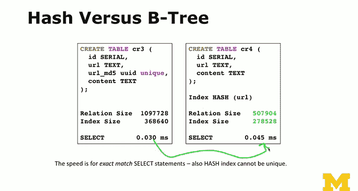

# 054：索引选择与优化技术


## 概述

在本节课中，我们将学习PostgreSQL中不同的索引策略及其对性能的影响。我们将通过一个网络爬虫应用的例子，探讨如何为长文本字段（如URL）选择合适的索引类型，以优化查询速度并节省存储空间。我们将比较B树索引、哈希索引以及使用MD5哈希函数创建表达式索引等方法的优劣。

---

## 从哈希与索引到性能优化

上一节我们介绍了哈希和索引的基本概念。本节中，我们将更深入地探讨性能优化。我们将使用一个假设的网络爬虫应用作为示例。

网络爬虫的工作方式是：它从互联网抓取一个页面，解析页面中的所有链接，然后将这些链接添加到一个队列中。我们需要一个数据库来记录已经访问过的URL，因为许多网页会指向相同的链接（例如左侧导航栏）。此外，由于网络爬取过程可能耗时很长（例如获取10000个URL可能需要12小时），我们需要能够随时重启任务，而不是每次都从零开始。因此，数据库对于网络爬虫至关重要。

我们将处理大量的URL，并需要快速判断某个URL是否已被访问过。

---

## 初始方案：使用文本字段与B树索引

在构建此类应用时，一个常见但不一定正确的做法是：假设URL长度固定，例如使用`VARCHAR(128)`并加上唯一索引。如果URL确实不超过128个字符，这没有问题。

**示例表结构：**
```sql
CREATE TABLE crawler (
    url VARCHAR(128) UNIQUE,
    content TEXT
);
```

这里，`content`字段存储页面内容，`url`字段存储URL。你可以设置唯一约束，或者将长度设为1024。但问题是，现实中的URL长度并不固定。如果我们设置的长度为128，但尝试插入一个更长的URL，PostgreSQL会报错。你可以选择截断URL，但这取决于你的应用需求。

更简单的做法是将`url`字段设为`TEXT`类型（长度不限）。但这会带来另一个问题。

---

## 长文本索引的挑战

以下是我们创建的一个示例表`cr2`，其中`url`是无限长度的文本字段。我们插入了5000行数据，每行的URL长度为4000个字符，总数据量约为5MB，并且没有创建任何索引。

```sql
-- 示例：插入长URL数据
INSERT INTO cr2 (url) VALUES (...);
```

接下来，我们创建一个**唯一索引**。唯一索引本质上是一个不允许重复值的B树索引。

```sql
CREATE UNIQUE INDEX cr2_url_idx ON cr2 (url);
```

创建索引后，你会发现索引大小几乎与数据本身一样大。这是因为索引存储了完整的URL文本（每个4000字符）。随着URL变长，索引会变得非常庞大。如果我们开始存储页面内容，数据部分的增长会远快于索引，但长URL的索引本身仍然是个负担。

---

## 优化策略一：使用MD5哈希的表达式索引

为了减小索引大小，我们可以创建一个基于`MD5`哈希值的表达式索引，而不是完整的URL。

首先，删除之前的索引：
```sql
DROP INDEX cr2_url_idx;
```

然后，创建一个新的唯一索引，索引项是URL的MD5哈希值：
```sql
CREATE UNIQUE INDEX cr2_md5_idx ON cr2 (md5(url));
```

这样，索引存储的是固定长度（128位）的MD5哈希值，而不是长达4000个字符的URL，因此索引尺寸大大减小。

**重要提示：** 由于索引是基于`md5(url)`表达式构建的，查询时必须使用相同的表达式才能利用该索引。

*   以下查询**不会**使用索引，因为它直接比较`url`字段：
    ```sql
    SELECT * FROM cr2 WHERE url = 'http://example.com';
    ```
*   以下查询**会**使用索引，因为`WHERE`子句匹配了索引表达式：
    ```sql
    SELECT * FROM cr2 WHERE md5(url) = md5('http://example.com');
    ```

使用`EXPLAIN ANALYZE`命令可以查看查询计划和执行时间。使用索引的查询速度（约0.14毫秒）比不使用索引的全表扫描（约1.7毫秒）快大约10倍（在5000行数据的情况下）。

---

## 优化策略二：预计算哈希列并建立索引

另一种常用技巧是预先计算MD5哈希值，并将其存储在一个单独的列中，然后在该列上建立索引。PostgreSQL提供了`UUID`数据类型，其宽度正好适合存储MD5哈希值。

1.  创建包含`url_md5`列的表（或添加该列）：
    ```sql
    ALTER TABLE cr3 ADD COLUMN url_md5 UUID;
    ```
2.  更新该列，计算URL的MD5并转换为UUID类型：
    ```sql
    UPDATE cr3 SET url_md5 = md5(url)::UUID;
    ```
3.  在`url_md5`列上创建唯一索引：
    ```sql
    CREATE UNIQUE INDEX cr3_md5_idx ON cr3 (url_md5);
    ```

现在，查询时可以直接使用这个预计算的哈希列：
```sql
SELECT * FROM cr3 WHERE url_md5 = md5('http://example.com')::UUID;
```

这种方法会使表数据稍微变大（因为多了一个列），但索引更小，查询速度极快。

---

## 优化策略三：直接使用哈希索引

PostgreSQL还支持**哈希索引**。哈希索引只适用于等值查询（`=`），但不支持范围查询（`<`, `>`）或排序。在早期版本中，哈希索引不够稳定，但现代版本（如PostgreSQL 10+）已大大改进。

创建哈希索引的语法如下：
```sql
CREATE INDEX cr4_hash_idx ON cr4 USING HASH (url);
```

哈希索引的尺寸通常比B树索引更小。对于等值查询，它非常高效：
```sql
SELECT * FROM cr4 WHERE url = 'http://example.com';
```

**注意：** 哈希索引仅能加速精确匹配查询。对于使用`LIKE`操作符（尤其是以`%`开头的模式）或范围查询，哈希索引无法提供帮助。

---

## 不同索引策略对比

以下是几种策略的简单对比：

| 策略 | 描述 | 关系大小 | 索引大小 | 查询速度 | 适用场景 |
| :--- | :--- | :--- | :--- | :--- | :--- |
| **无索引** | 直接在长文本字段上查询。 | 5 MB | 0 MB | 慢 (1.7 ms) | 数据量极小或仅插入。 |
| **B树索引 (完整URL)** | 在`TEXT`类型URL上建B树索引。 | 5 MB | ~5 MB | 快 (使用索引时) | URL长度较短且稳定。 |
| **表达式索引 (MD5)** | 在`md5(url)`表达式上建B树索引。 | 5 MB | 小 | 很快 (0.14 ms) | 需要精确匹配，且URL很长。 |
| **预计算列索引** | 新增MD5列并建索引。 | 略大于5 MB | 小 | 极快 | 频繁进行等值查询，可接受额外存储。 |
| **哈希索引** | 在URL字段上直接建哈希索引。 | 5 MB | 很小 (2 MB) | 快 (等值查询) | **仅**进行精确等值匹配查询。 |

**核心要点：**
*   **B树索引**是默认且最通用的索引类型。它支持等值查询、范围查询、前缀匹配和排序。
*   **哈希索引**仅支持等值查询，但通常更节省空间。在现代PostgreSQL中，它是可靠的选择。
*   **表达式索引**和**预计算列**是处理长字段、减小索引大小的有效技术。
*   选择哪种策略取决于你的具体应用：数据量、查询模式（等值、范围、模糊）、插入频率以及你对存储空间和查询速度的权衡。

---

## 总结



本节课我们一起学习了PostgreSQL中多种索引选择与优化技术。我们通过一个网络爬虫的例子，探讨了为长URL字段建立索引时面临的挑战，并比较了四种主要策略：
1.  在完整文本上建立B树索引（简单但索引大）。
2.  在MD5哈希表达式上建立B树索引（索引小，查询需匹配表达式）。
3.  预计算哈希列并建立索引（查询快，需额外存储）。
4.  直接使用哈希索引（空间效率高，但仅支持等值查询）。


理解这些技术的优缺点，能帮助你在实际应用中根据具体需求（查询模式、数据量、存储限制）做出最佳决策。下一节，我们将讨论正则表达式在PostgreSQL中的应用。