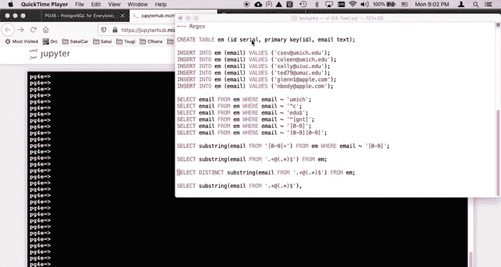
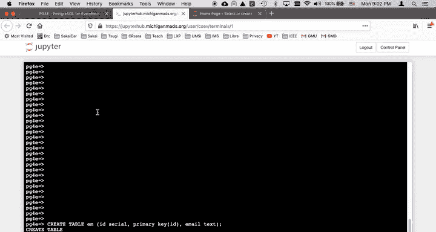
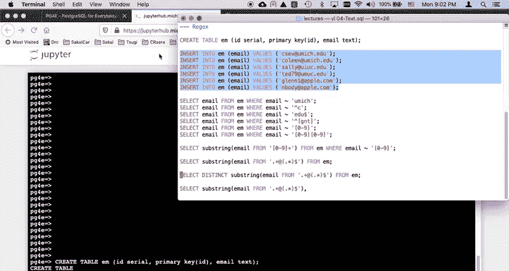
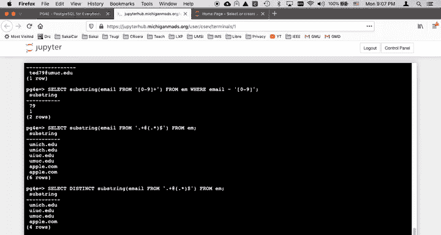
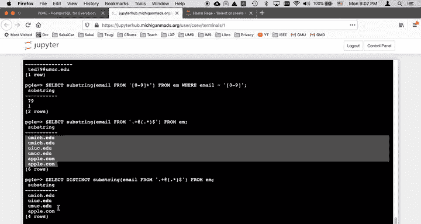
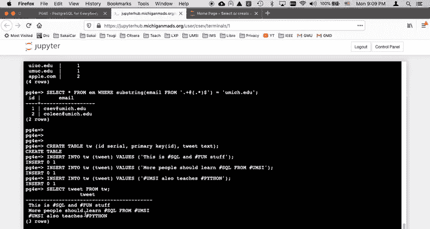
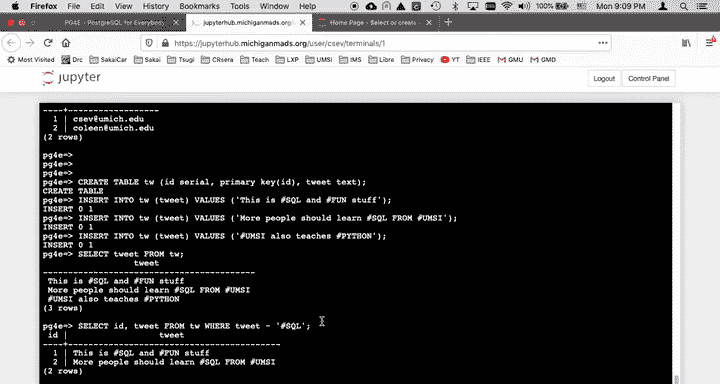
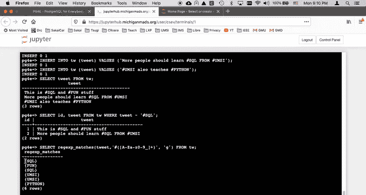
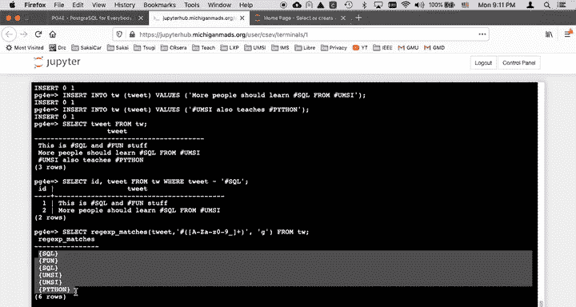
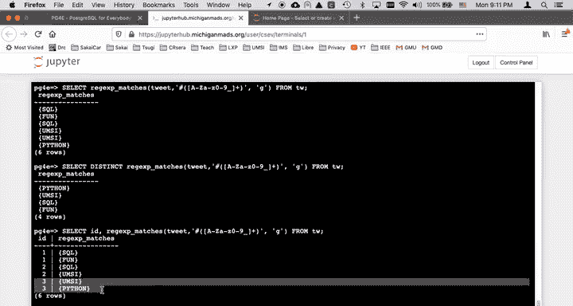

# 060：正则表达式操作演示 🧮







在本节课中，我们将学习如何在 PostgreSQL 中使用正则表达式进行数据查询和提取。正则表达式是一种强大的模式匹配工具，可以帮助我们更灵活地处理和分析文本数据。

## 创建示例数据表

首先，我们创建一个包含电子邮件地址的示例表，并插入一些数据。

```sql
CREATE TABLE email (id SERIAL, email TEXT);
INSERT INTO email (email) VALUES ('csev@umich.edu');
INSERT INTO email (email) VALUES ('coleen@umich.edu');
INSERT INTO email (email) VALUES ('sally@apple.com');
INSERT INTO email (email) VALUES ('ted79@umich.edu');
INSERT INTO email (email) VALUES ('glenn@umich.edu');
INSERT INTO email (email) VALUES ('glenn1@umich.edu');
```

使用 `SELECT * FROM email;` 可以查看表中的所有数据。

## 基础正则表达式匹配

上一节我们创建了数据表，本节中我们来看看如何使用 `~` 操作符进行基础的正则表达式匹配。`~` 操作符类似于 `LIKE`，但功能更强大，它会在整个字符串中搜索匹配项，无需像 `LIKE` 那样在模式两端显式添加通配符。

以下是几个基础匹配的示例：

*   `SELECT * FROM email WHERE email ~ 'u';`：此查询查找电子邮件地址中任意位置包含字母 `u` 的记录。
*   `SELECT * FROM email WHERE email ~ '^c';`：此查询查找以字母 `c` 开头的电子邮件地址。`^` 是一个元字符，表示字符串的开始。
*   `SELECT * FROM email WHERE email ~ 'edu$';`：此查询查找以 `edu` 结尾的电子邮件地址。`$` 是一个元字符，表示字符串的结束。
*   `SELECT * FROM email WHERE email ~ '^[gnt]';`：此查询查找以字母 `g`、`n` 或 `t` 中任意一个开头的电子邮件地址。方括号 `[]` 定义了一个字符集。
*   `SELECT * FROM email WHERE email ~ '[0-9]';`：此查询查找包含任意数字的电子邮件地址。`[0-9]` 表示数字 0 到 9 的范围。
*   `SELECT * FROM email WHERE email ~ '[0-9][0-9]';`：此查询查找包含两个连续数字的电子邮件地址。

## 使用 `substring` 函数提取数据

除了在 `WHERE` 子句中进行匹配，我们还可以使用 `substring` 函数从字符串中提取特定部分。

以下是使用 `substring` 函数进行提取的示例：





*   `SELECT substring(email FROM '[0-9]+') FROM email WHERE email ~ '[0-9]';`：此查询从包含数字的电子邮件地址中提取出第一个连续的数字序列。`[0-9]+` 中的 `+` 表示匹配一个或多个数字。
*   `SELECT DISTINCT substring(email FROM '.+@(.+)$') FROM email;`：此查询提取所有电子邮件地址的域名部分（`@` 符号之后的内容），并使用 `DISTINCT` 去除重复项。模式 `.` 匹配任意字符，`+` 表示一个或多个，括号 `()` 内的部分 `(.+)` 表示要提取的内容。
*   `SELECT substring(email FROM '.+@(.+)$') AS domain, COUNT(*) FROM email GROUP BY domain;`：此查询首先提取域名，然后按域名分组并统计每个域名出现的次数。`GROUP BY` 子句与 `COUNT(*)` 聚合函数结合使用，可以实现类似 `DISTINCT` 但附带计数的功能。
*   `SELECT * FROM email WHERE substring(email FROM '.+@(.+)$') = 'umich.edu';`：此查询在 `WHERE` 子句中使用 `substring` 提取域名，并筛选出域名为 `umich.edu` 的记录。

## 处理标签数据

现在，让我们将正则表达式应用于另一种常见场景：从文本（如推文）中提取标签。

首先，我们创建一个推文表并插入一些示例数据。



```sql
CREATE TABLE tw (id SERIAL, tweet TEXT);
INSERT INTO tw (tweet) VALUES ('This is #sql and #fun');
INSERT INTO tw (tweet) VALUES ('I love #sql and #umsi');
INSERT INTO tw (tweet) VALUES ('This is #umsi and #python');
```



使用 `SELECT * FROM tw;` 可以查看所有推文。

以下是处理标签数据的示例：



*   `SELECT * FROM tw WHERE tweet ~ '#sql';`：此查询简单地查找包含 `#sql` 标签的推文。
*   `SELECT regexp_matches(tweet, '#([A-Za-z0-9_]+)', 'g') FROM tw;`：此查询使用 `regexp_matches` 函数从每条推文中提取所有格式正确的标签。模式 `#([A-Za-z0-9_]+)` 匹配以 `#` 开头，后跟一个或多个字母、数字或下划子的序列，括号内的部分会被提取出来。标志 `'g'` 表示全局匹配（提取所有出现，而不仅仅是第一个）。这个函数会为每条匹配的推文生成多行结果。
*   `SELECT DISTINCT regexp_matches(tweet, '#([A-Za-z0-9_]+)', 'g') FROM tw;`：此查询在提取标签的基础上，使用 `DISTINCT` 去除重复的标签。
*   `SELECT id, regexp_matches(tweet, '#([A-Za-z0-9_]+)', 'g') FROM tw;`：此查询在提取标签的同时，保留每条标签所属推文的原始 `id`，从而可以清晰地看到标签与推文的对应关系。



## 总结



本节课中我们一起学习了 PostgreSQL 中正则表达式的基本用法。我们掌握了如何使用 `~` 操作符进行模式匹配，利用 `substring` 函数从字符串中提取特定部分，以及通过 `regexp_matches` 函数处理像标签这样的复杂文本模式。正则表达式是一个需要不断练习的强大工具，在实际应用中，结合文档和社区资源（如 Stack Overflow）能帮助你更有效地解决各种文本处理问题。