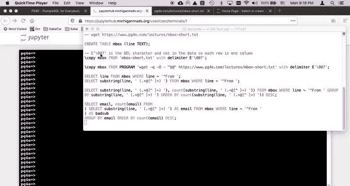
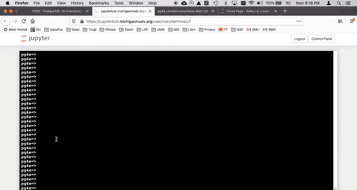
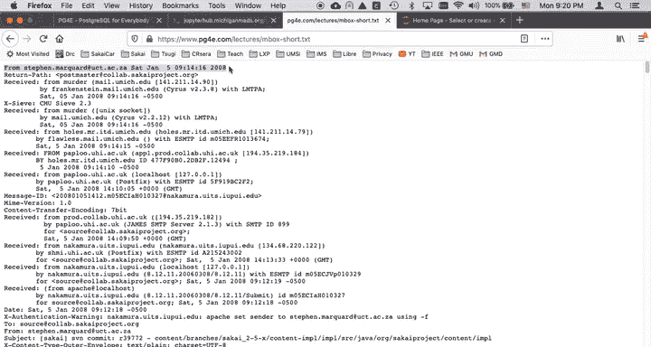
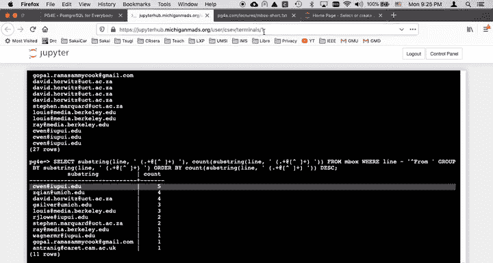

# 061：平面文件与邮件正则解析演示 📧





在本节课中，我们将学习如何将一个纯文本文件（平面文件）加载到 PostgreSQL 数据库中，并利用正则表达式从文本数据中提取结构化信息。我们将通过一个邮件存档文件（mbox格式）的实例，演示从数据获取、加载到查询分析的全过程。

---

上一节我们介绍了课程目标，本节中我们来看看具体的操作步骤。



首先，我们需要将远程的文本文件加载到数据库中。我们将创建一个名为 `inbox` 的表，其中仅包含一个文本类型的列，用于存储文件的每一行。

以下是创建表并加载数据的步骤：

1.  **创建表结构**：我们创建一个单列表 `inbox`，用于存储文本文件的每一行。
    ```sql
    CREATE TABLE inbox (line TEXT);
    ```

2.  **加载数据**：我们可以使用 `COPY` 命令从本地文件加载，但这里演示一个更强大的方法——直接从网络获取并加载。
    ```sql
    COPY inbox FROM PROGRAM 'wget -q -O- https://example.com/mbox-short.txt' WITH (DELIMITER E'\007');
    ```
    *   `PROGRAM` 关键字允许执行外部命令。
    *   `wget -q -O-` 命令安静地（`-q`）下载文件并将输出打印到标准输出（`-O-`）。
    *   `DELIMITER E‘\007’` 指定一个文件中不存在的字符（如响铃字符 `\007`）作为分隔符，确保整行文本被完整地存入一个列中，而不会被错误地分割。

数据加载完成后，我们可以执行 `SELECT * FROM inbox LIMIT 5;` 来查看前5行数据，确认文件内容已正确导入。

---

上一节我们完成了数据加载，本节中我们利用正则表达式进行数据提取。

现在，我们可以对 `inbox` 表中的文本行进行查询。例如，查找所有以 “From “ 开头的行：
```sql
SELECT line FROM inbox WHERE line LIKE 'From %';
```
这将返回所有发件人信息行。

为了进行更深入的分析，例如统计每个发件人的邮件数量，我们需要从这些行中提取出电子邮件地址。这时就需要用到正则表达式。

以下是从 “From “ 行中提取电子邮件地址并统计的步骤：



1.  **提取电子邮件地址**：我们使用 `substring` 函数配合正则表达式来捕获 “From “ 之后、空格之前的电子邮件地址。
    ```sql
    SELECT substring(line FROM ‘From ([^ ]+@[^ ]+)’) AS email FROM inbox WHERE line LIKE ‘From %’;
    ```
    *   正则表达式 `From ([^ ]+@[^ ]+)` 的含义是：匹配 “From “ 之后，捕获一个非空格字符序列（`[^ ]+`），接着是 `@` 符号，然后是另一个非空格字符序列。

2.  **统计发件频次**：基于提取出的电子邮件地址，我们可以进行分组统计。
    ```sql
    SELECT email, COUNT(*) AS count
    FROM (
        SELECT substring(line FROM ‘From ([^ ]+@[^ ]+)’) AS email
        FROM inbox
        WHERE line LIKE ‘From %’
    ) AS subquery
    GROUP BY email
    ORDER BY count DESC;
    ```
    *   这里使用了子查询（subselect）来避免重复编写复杂的 `substring` 表达式。子查询生成了一个临时的、只包含 `email` 列的虚拟表。
    *   外层查询则对这个虚拟表进行分组（`GROUP BY`）和计数（`COUNT`），并按邮件数量降序排列。

通过这个查询，我们可以清晰地看到在给定的邮件存档中，哪些发件人发送的邮件最多。

---

本节课中我们一起学习了如何将平面文本文件加载到 PostgreSQL 数据库，并运用正则表达式从非结构化的文本数据中提取有价值的信息（如电子邮件地址），最后通过分组聚合完成基本的分析统计。这个过程展示了 SQL 在处理和转换原始文本数据方面的强大灵活性。