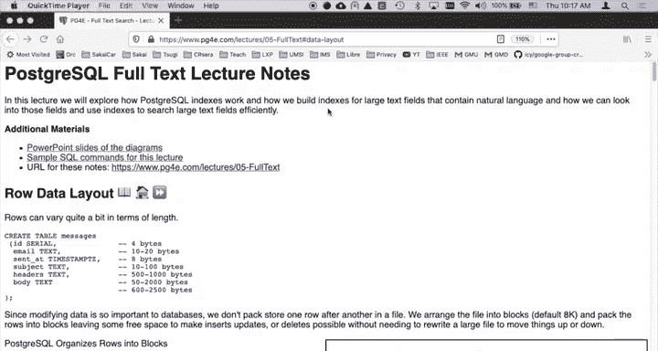
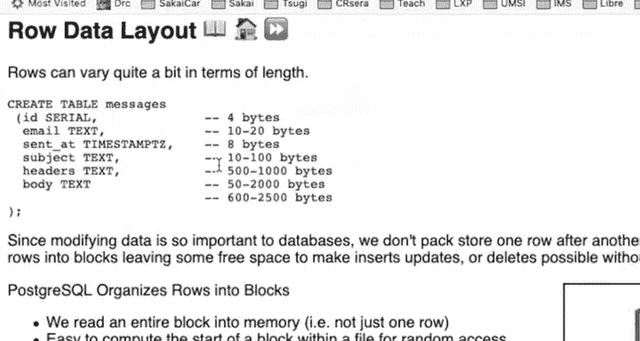
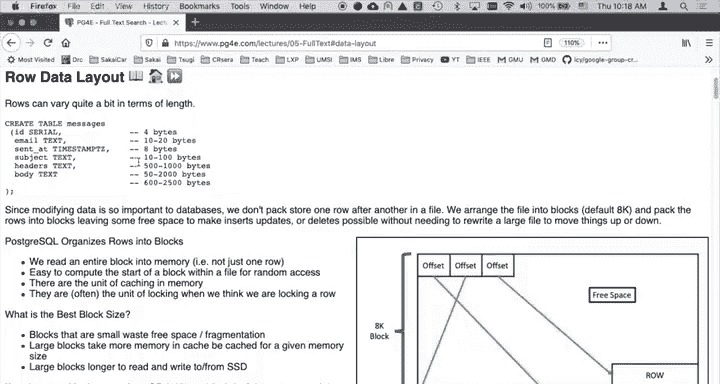
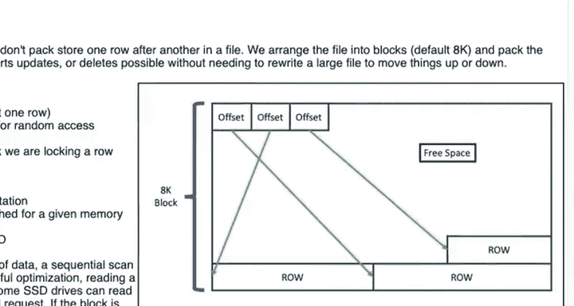
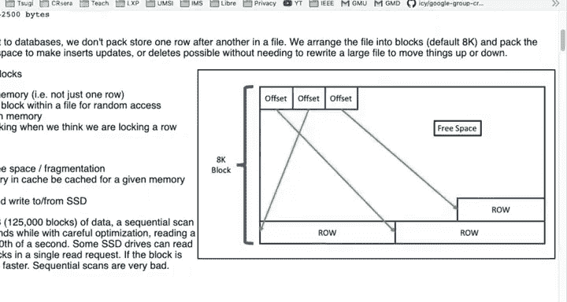
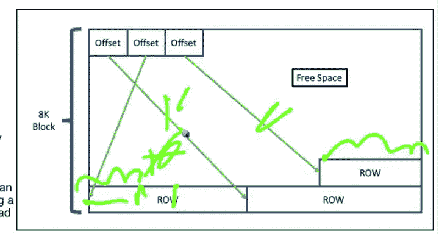

# 065：PostgreSQL数据块分配机制

在本节课中，我们将学习PostgreSQL如何将数据存储在磁盘上，特别是其数据块（Block）的分配机制。理解这一机制对于优化数据库性能和存储效率至关重要。

---

上一节我们介绍了数据库模式（Schema）的重要性，本节中我们来看看模式在磁盘上是如何具体表示的。

首先讨论行布局（Row Layout）。我们一直在讨论`CREATE TABLE`语句，以及精确指定列类型（例如，是短文本列还是长文本列）的重要性。模式成为一种契约，因为这是PostgreSQL能够高效存储数据的方式。扫描的数据量是决定性能的关键因素。

现在，我想谈谈模式在磁盘上的表示方式。这里我们有一个很小的`messages`表，我们曾用它做过几个示例。表中包含一个邮件消息ID、一个时间戳和一些相对较大的字段。ID很小，恰好占用4字节内存；时间戳占用8字节；而其他字段的长度则不确定。请记住，我们可以插入数据，也可以更新这些数据。因此，一个电子邮件地址可能是4个字符，也可能是20个字符，之后可能被替换成一个10个字符的地址。一条记录的大小在更新时可能增加，也可能减少。

当我们修改数据时，不希望重写整个文件。因为，即使是最快的硬件，读写一个千兆字节的文件也需要几秒钟的时间。

因此，PostgreSQL将其磁盘文件组织成带有空闲空间的固定长度块。这些块通常是8K（8192字节）大小。

通过使用固定长度的块，数据库可以非常容易地计算块偏移量。它们不会紧密地打包块，而是创建固定大小的块，以便将整个块读入内存。块通常是缓存的基本单位。数据库所做的工作之一就是将频繁使用的块保留在内存中。因此，如果你同时运行大量查询，并且它们持续使用文件的某些小块，那么这些块就会驻留在内存中。数据库环境所做的一切，都是为了尽可能地提高效率。

对于事务（我们之前简要讨论过），块通常是锁定的单位。我们考虑锁定一行，而一个块可能包含大约5到50行，甚至更少。但这没关系。让我们来看看一个块的结构。

这里我们有一个8K的块。请记住，所有8K块的大小都是8K。它们按顺序存储在磁盘上。块内部有一些头部信息和其他内容。但基本思想是：行是从块的**后端**向**前端**插入的。

每一行都有列，其中一些列的长度是可变的，不同行的总长度也不同。列就存储在这些行中。然后你插入另一行，再插入一行……行从块的末端向前增长。块的前端存储的是一些偏移量，可能只有2到3个字节（很可能是2字节）。这些偏移量构成一个数组，指示了在该块内每一行的起始位置。

这些偏移量很小。整个块被读入内存后，你可以快速定位到每一行，可以按顺序读取它们，也可以读取所有行。在我的示意图中，中间部分（比例并不准确）是空闲空间。从块的末端开始是行数据，从块的前端开始是偏移量。通常，行数据的大小远大于偏移量。

现在从更新的角度来思考这个问题。假设我们有一行数据，其中电子邮件地址是10个字符，我们要将其替换为15个字符的地址。我们只需要移动一小部分数据（5个字符），将所有内容向左移动5个字符，然后腾出15个字符的空间，将新的电子邮件地址放入正确的位置。接着，我们重写整个块，并损失了一些空闲空间。同样，如果我们将电子邮件地址更新为一个更短的地址，也会发生类似的情况（我们可能不需要移动所有数据）。关键在于，我们可以对这个块进行微小的修改。

在我的示意图中，空闲空间的比例并不准确，看起来它占了70%。实际上，这是一个正在被填充的块。核心思想是，我们可以进行微小的修改，然后更改这些偏移量的值，最后将整个块写回磁盘。我们在内存中操作块（这是非常廉价的操作），然后将其写回磁盘。

你可能会问，最佳的块大小是多少？关于这个问题有很多讨论。PostgreSQL中有很多设置，通常接受默认值就是最好的选择。8K通常是默认值。

如果块太小，行就无法很好地放入。例如，一个块只放得下一行，就会造成空闲空间的浪费。如果块太大（比如16K），那么为了读取一行数据，就需要拉入过多的信息，这会开始耗尽内存，影响缓存效率。如果使用16K的块，相比8K的块，你能缓存的块数量会减少50%。你可以查阅相关资料，搜索“PostgreSQL最佳块大小”，他们会告诉你可能是8K，其次是4K。这与固态硬盘（SSD）和机械硬盘（HDD）的特性有关。

对于机械硬盘，存在旋转延迟。一旦磁头定位到数据，读取8K数据比读取4K更明智，因为旋转延迟是主要考虑因素。对于固态硬盘，没有旋转延迟，那么主导因素就变成了实际传输的数据量。这就会主张在SSD上使用较小的块大小，在HDD上使用较大的块大小。

问题是，如果块大小太小，就会产生碎片，并且无法进行某些动态操作，比如插入新行或更新行。块太小可能导致空闲空间过多（因为一个块放不下足够多的行），或者空闲空间过少（行被紧密打包，一旦更新就可能空间不足，需要在数据库中四处移动数据），这都不好。

有很多不同的方式来思考这个问题，但所有讨论中需要记住的关键点是：我们将**整个块**读入内存。我们并不确切知道一行数据在磁盘上的精确位置，但我们确实想知道一行数据在**哪个块内**。我们知道某行在这个块里，然后我们读入这个块，扫描它，找到目标行。因此，我们无法直接定位到一行，但可以直接定位到一个块。

索引（这正是我们接下来要讨论的）本质上是一组**提示**，它将我们要查找的行映射到这些行所在的块。这就是我们下一节要讨论的内容。

---

本节课中我们一起学习了PostgreSQL的数据块分配机制。我们了解到数据以固定大小的块（通常为8K）存储在磁盘上，行从块的后端向前端插入，并通过前端的偏移量数组进行定位。这种设计允许高效的更新操作和缓存管理。理解块的结构和大小选择对数据库性能调优至关重要。下一节，我们将探讨索引如何利用这种块机制来加速数据检索。