# 066：索引实现细节剖析 🔍

在本节课中，我们将要学习数据库索引的核心概念及其实现细节。索引是数据库性能的关键，它通过减少查询时需要读取的磁盘块数量，来大幅提升数据检索速度。我们将探讨几种主要的索引类型，包括正向索引和倒排索引，并深入了解它们的工作原理。

上一节我们介绍了数据行和块的组织方式，以及数据库如何通过随机访问来高效管理数据。本节中我们来看看如何通过索引来限制特定查询需要加载的块数量，这正是索引的目的。

假设存在一个逻辑键或主键，我们需要根据它来查找数据。索引的基本思想是存储一个“键到块的提示”。例如，我们可以存储逻辑键的值以及该键所在的数据块位置。如果这个索引表足够小，可以常驻内存，那么查询时就可以先在内存中快速定位到目标数据块，从而避免扫描整个大文件。这就是索引的本质：一个指向数据块位置的快捷查找表。

索引使得 `WHERE` 子句的查询效率更高。不要将 `WHERE` 子句视为一个简单的判断语句，而应将其理解为向所有行发送一个请求，然后由符合条件的行做出响应。索引的作用是让我们能够有效地请求磁盘只返回我们需要的数据，或者先返回大量数据再丢弃不需要的部分。我们对磁盘的请求越少，数据库系统的速度就越快。

索引本身非常小。接下来，我们将讨论在 PostgreSQL 中可以使用的不同索引类型。

## 正向索引与倒排索引 📂

PostgreSQL 中的索引主要分为两大类：正向索引和倒排索引。正向索引也可以理解为“常规”索引。

以下是几种主要的正向索引类型：

*   **B-树索引**：这是我们最常使用的经典索引。它是一种平衡树结构，通过扇出（fan-out）来尽量减少树的深度。这样，即使需要从磁盘读取部分索引，所需的读取次数也仅限于少数几次（如一、二或三次），然后读取一个数据块即可，相比之下，这远比读取成千上万个数据块高效得多。
*   **块范围索引**：这是对 B-树的一种粗略简化，适用于某些特定场景。它通过记录每个数据块中键值的最小值和最大值来工作，因此索引体积非常小且查询速度快。
*   **哈希索引**：类似于编程中的哈希表，它不对键本身进行索引，而是对键计算哈希值（通常更小），然后直接映射到数据块。哈希索引在键分布均匀时效率极高，但存在哈希冲突的问题。

在常规索引中，当我们从一个键查找一行或少数几行数据时，通常可以保留默认设置，让数据库自动选择索引类型，它几乎总是会选择 B-树。B-树索引适用于字符串键、数字键和日期键，在插入成本和更新成本之间取得了良好的平衡。

块范围索引实际上更小且非常快，但它依赖于数据按顺序递增的特性，例如在日期字段或连续递增的主键上使用效果很好。

我们也会讨论倒排索引，但首先让我们深入了解 B-树是如何工作的。

## B-树索引工作原理 🌳

你可以阅读相关资料来深入了解，我鼓励你这样做。有些维基百科页面可能比较难懂，但这个概念本身很重要。B-树的关键在于它是一个会自我重组、移动数据的平衡树。

想象一下，在树的顶层（根节点），我们有一些数字（实际存储的远多于图中所示的四个）。它记录的信息是：最左边的子节点包含所有小于 7 的键，中间的子节点包含 7 到 16 之间的键，最右边的子节点包含大于 16 的键。

如果我们要插入一个键为 22 的记录，我们会先找到磁盘上存放该记录的数据块。然后，我们遍历 B-树，在索引中添加一个指向 22 的条目，并将其关联到正确的数据块。同理，插入键为 15 的记录时，我们会发现它属于中间子节点，于是将其放在 12 之后，并记录它所在的数据块。

**索引维护流程可以概括为：先插入数据行，再插入索引条目以进行跟踪。**

现在，假设我们要插入键为 4 的记录。由于 4 小于 7，它必须进入最左边的索引字段。这时可能需要重写一些内容，因为我们需要把它放在 2 和 5 之间。操作过程涉及数据的移动：将 12、9、6 向上推，5 移动到合适位置，然后将 4 插入到 2 和 5 之间。同时，我们仍需记录该行所在的数据块。这就是保持树平衡的方式。

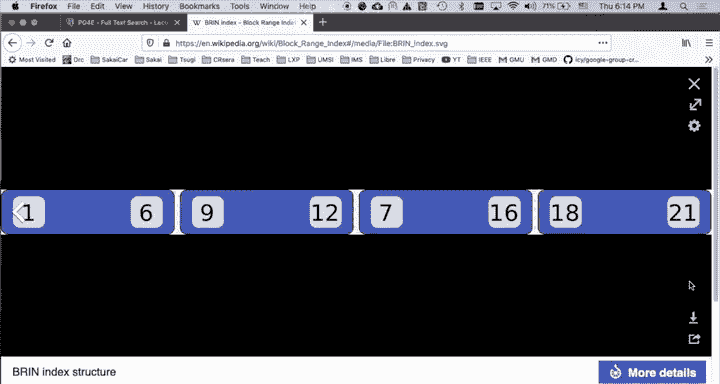

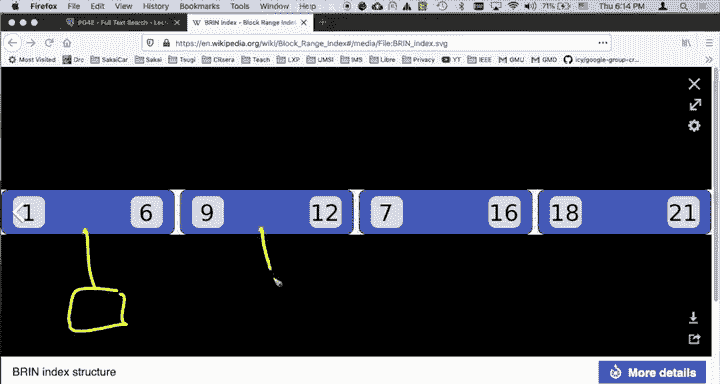

可以想象，如果某个块（比如中间块）积累了太多条目并被填满，我们就必须对其进行分裂。有时，树的深度可能会增加，我们需要努力保持树的深度恒定。实际上，每个节点可以包含数百个条目，树的每一层都如此。这样，仅需三到四层的深度，就能索引数十万条记录。如果需要从磁盘读取这些索引节点，你只需读取第一层、第二层、第三层和第四层，然后读取目标数据块，这远比读取和单独扫描 20 万个数据块要高效得多。

B-树的精妙之处在于，只要在这些索引块中预留一点空闲空间，添加新条目就相当容易。偶尔需要进行一些小的重组，有时可能还需要增加树的深度，但它能很好地分摊插入成本。偶尔会有插入操作成本稍高，但大多数时候插入成本非常低，更新索引的成本也很低，而扫描成本却非常优秀。这就是为什么我们常说 B-树很棒，尽管用就是了。

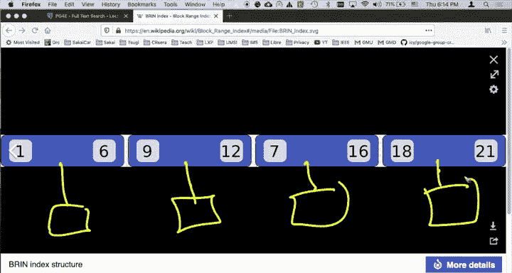

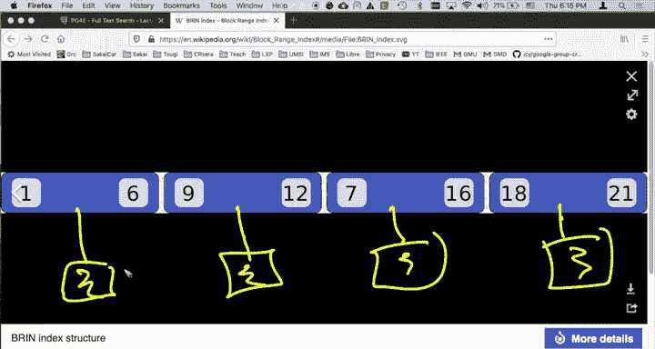

现在，让我们花点时间看看块范围索引，以便你理解索引的核心在于提供数据块位置的“提示”。

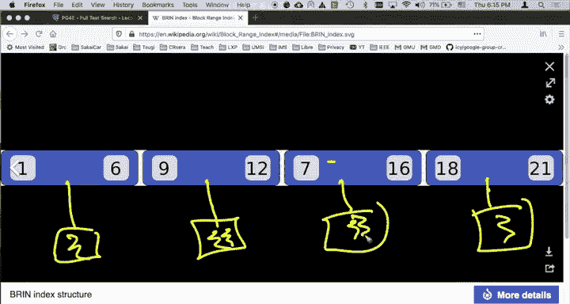

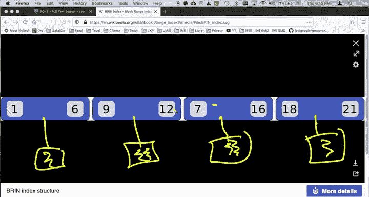

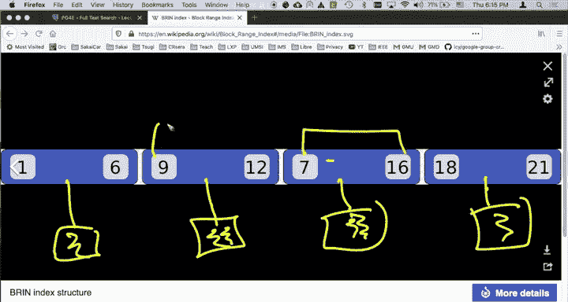

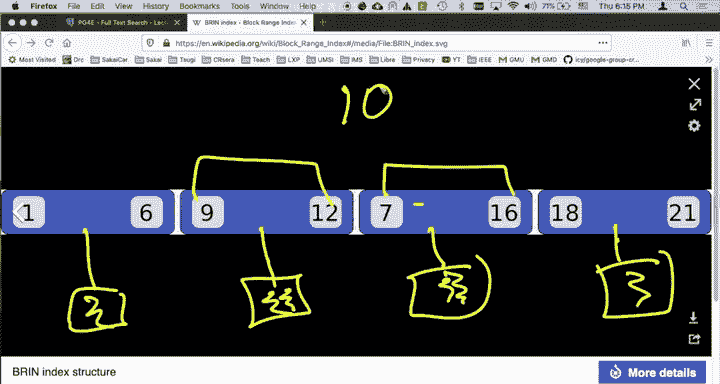

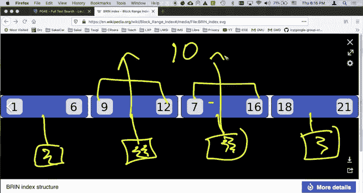

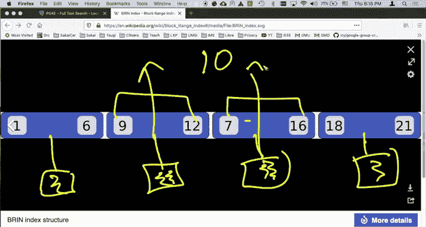

## 块范围索引简介 📊

块范围索引目前是 PostgreSQL 独有的特性，它非常酷。它的工作方式有些不同，更像一个线性列表。列表中的每一项都指向磁盘上的一个数据块。

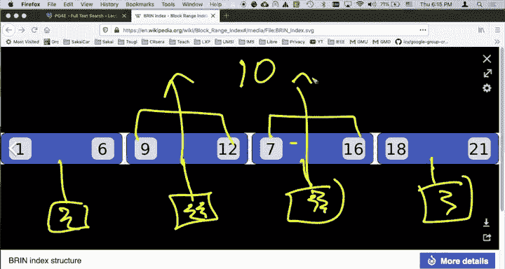

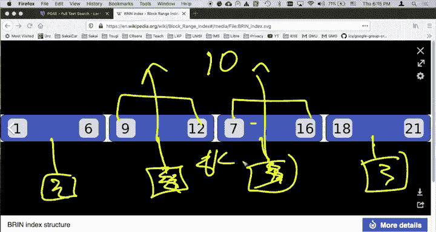

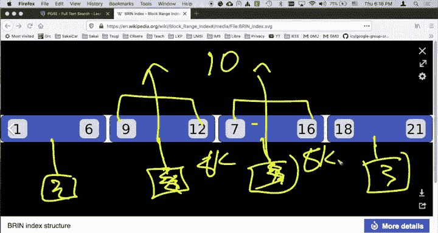

它的工作原理是扫描数据块，找出每个块中键的最小值和最大值，然后用这两个数字来表征每个块。例如，第一个块的键值在 1 到 6 之间，第二个块在 9 到 12 之间，第三个块在 7 到 16 之间，第四个块在 18 到 21 之间。这里需要注意的关键点是存在范围重叠：7 到 16 的范围实际上比 9 到 12 更大。这意味着如果我们要查找键为 10 的记录，根据索引提示，我们可能需要读取两个数据块。

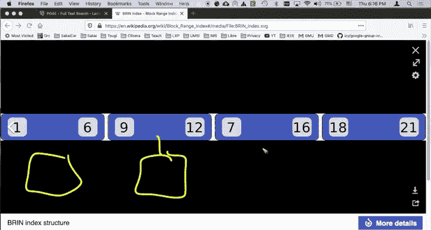

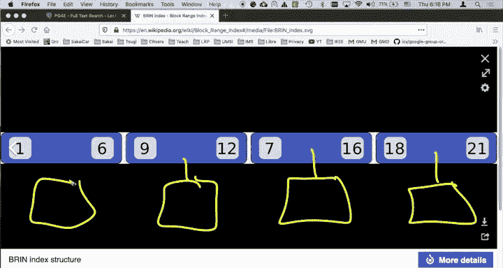

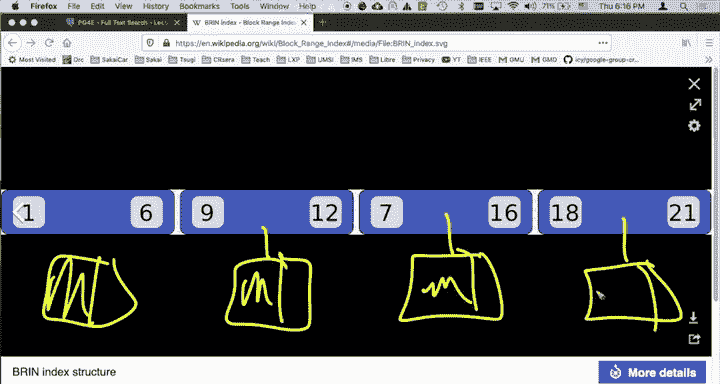

当然，读取数据块后，我们还需要在块内查找 10 的具体位置，因为 10 可能在这两个块中的任何一个。不过请记住，每个数据块只有 8KB，所以问题不在于处理块内的数据，而在于需要读取多少个块。如果我们查找 10，系统可能返回未找到，也可能恰好找到一个副本。

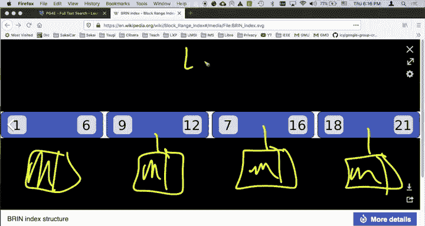

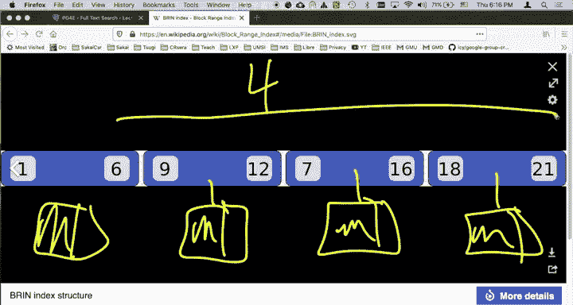

接下来考虑更新操作。假设有一些数据块，每个块都有一部分空闲空间。现在我们要插入键为 4 的记录。我们查询块范围索引，看是否有合适的位置存放它。答案是：如果放入最左边的块，甚至不需要更改索引，因为 4 在其记录的范围内（1-6）。这样操作很好，就像哈希一样，但它是基于范围的。

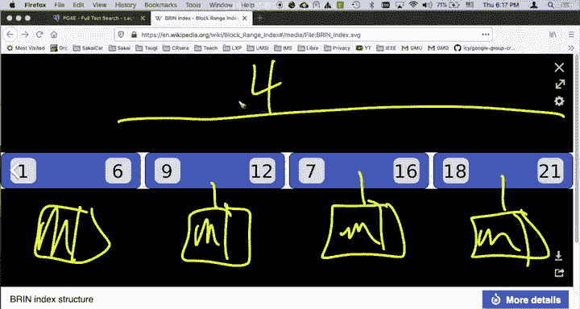

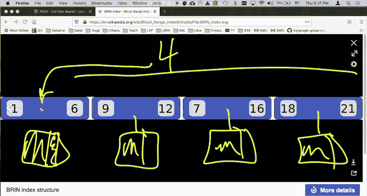

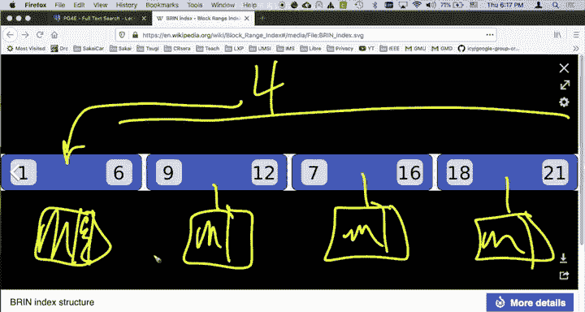

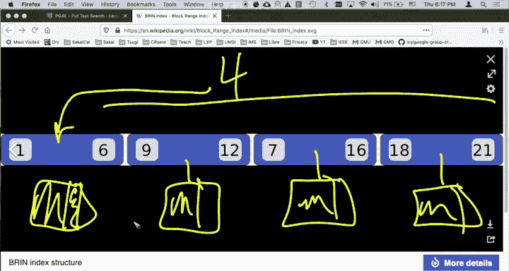

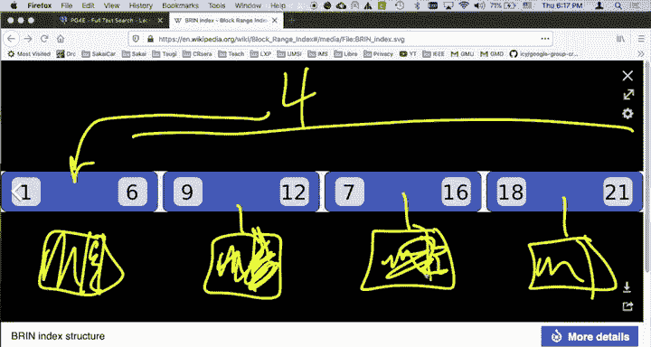

再举一个例子，假设第二个块（9-12）和第三个块（7-16）都满了，而我们要插入键为 10 的记录。你可以想象会发生什么：检查第一个块，发现已满；检查第二个块，也已满。这时，系统可能会创建一个全新的数据块。它可能会从第二个和第三个块中拉出一些记录，将 10 放入新块，然后创建一个新的块范围索引条目来正确反映范围。例如，最左边的块范围可能变为 9-10，另一个变为 11-12，第三个变为 13-16。你可以看到它是如何调整的，然后需要进行数据移动等操作。

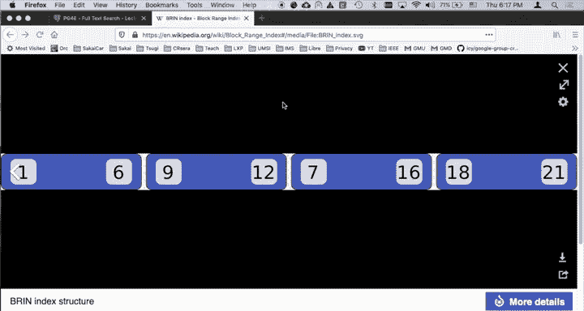

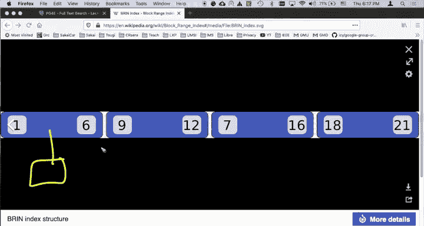

块范围索引的优点是，如果你的数据块是按顺序增长的（例如索引的是主键或日期字段），那么块范围索引条目只需追加在末尾即可，查询速度会非常快，而且索引本身非常小。因此，在许多数据挖掘应用中，块范围索引可能很有用。

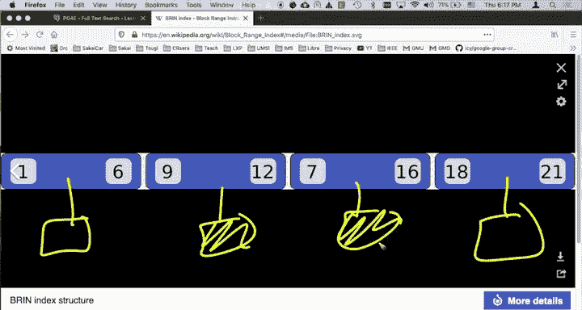

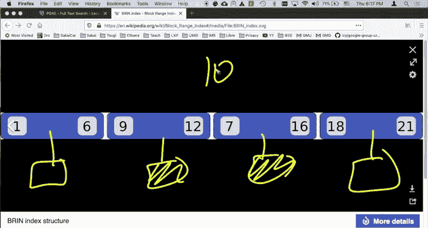

这让你了解到 PostgreSQL 具备这些能力，而在不确定时，默认使用 B-树索引通常是稳妥的选择。

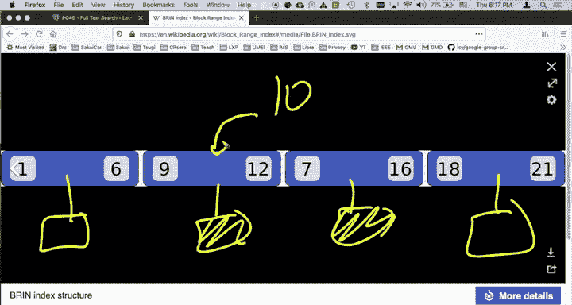

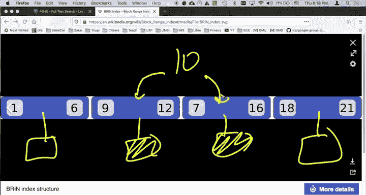

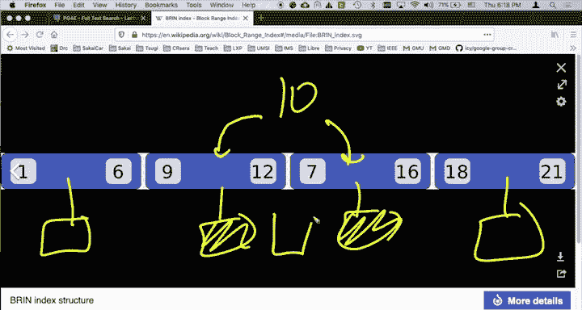

## 倒排索引简介 🔄

现在，我们来谈谈这两类基本索引。我们有正向索引和倒排索引。我其实不太喜欢这两个术语，我宁愿称正向索引为“常规”索引。

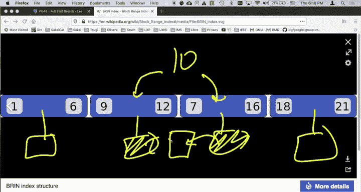

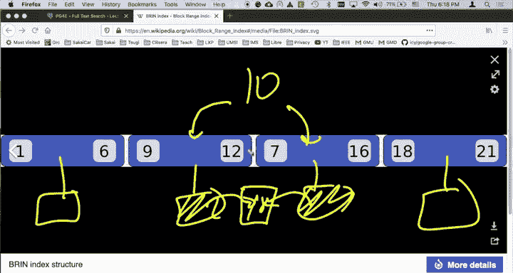

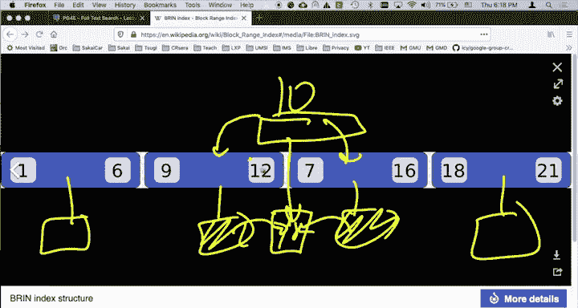

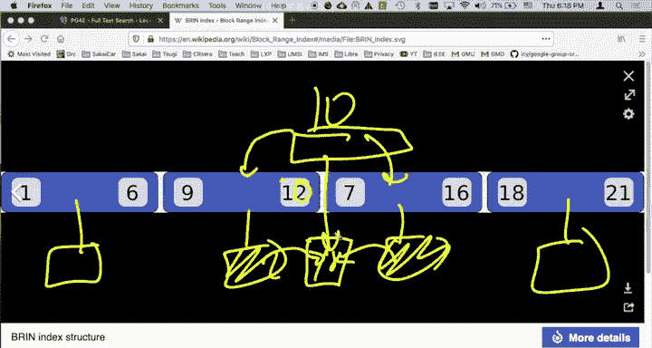

正向索引就像我们有一个键值，它代表一列，通过这个键值我们可以找到对应的行，这类似于逻辑键或主键索引。B-树、块范围索引、哈希索引等都是正向索引的变体，它们都存储了实际的键。

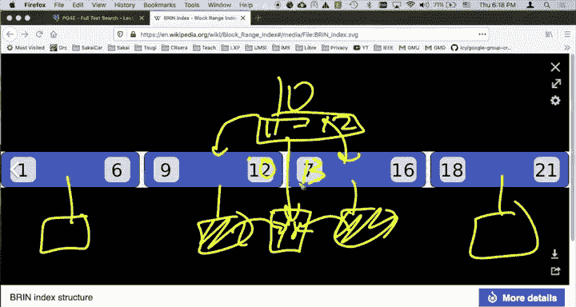

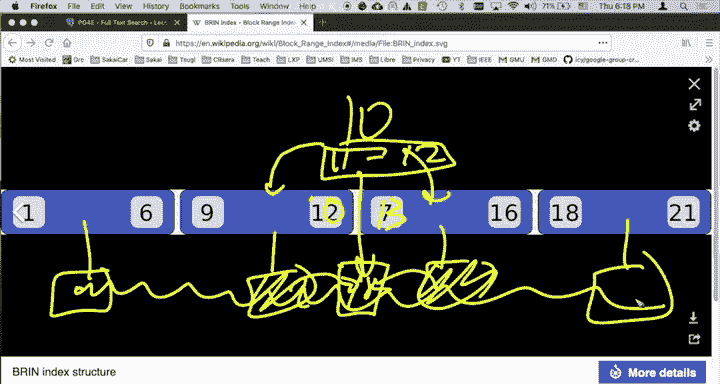

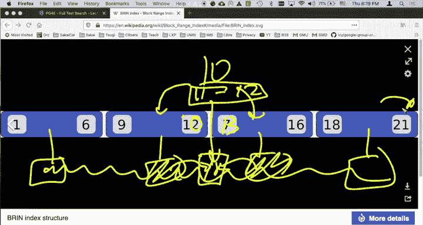

倒排索引则适用于列中包含多个元素的情况。你可以将其想象成一个 Python 列表或数组，或者一个包含许多单词的文档。从某种意义上说，这些列没有单一的键，而是有大量爆炸性增长的“键”。我们感兴趣的不一定是找到某一行，而是找到符合条件的所有行的集合。

例如，我想查找所有提到“SQL”的行。你可以将其视为类似 `LIKE ‘%SQL%’` 的模糊查询。我们如何高效地做到这一点呢？需要将字符串分解成片段（如单词），然后索引所有这些片段，并跟踪哪些行（即哪些数据块）包含这些片段。这就是倒排索引的作用。

PostgreSQL 提供了几种倒排索引：

*   **GIN 索引**：广义倒排索引，适用于包含多个值的列，如数组、全文搜索等。
*   **GiST 索引**：一种基于哈希的通用搜索树索引，支持多种数据类型和操作符。
*   **SP-GiST 索引**：空间分区广义搜索树索引，适用于具有空间聚类特性的数据，如经纬度、三维点等。

倒排索引的经典用例是文本搜索。接下来，我们将看看索引的各种用途，并从谷歌搜索这样的例子开始。

本节课中我们一起学习了数据库索引的核心概念，包括正向索引（如 B-树、块范围、哈希）和倒排索引（如 GIN、GiST）的基本原理。索引通过提供“键到数据块”的映射，极大地减少了查询所需的磁盘 I/O，是数据库高效运行的关键。理解不同索引类型的特点和适用场景，有助于我们在实际应用中做出合理的选择，优化数据库性能。