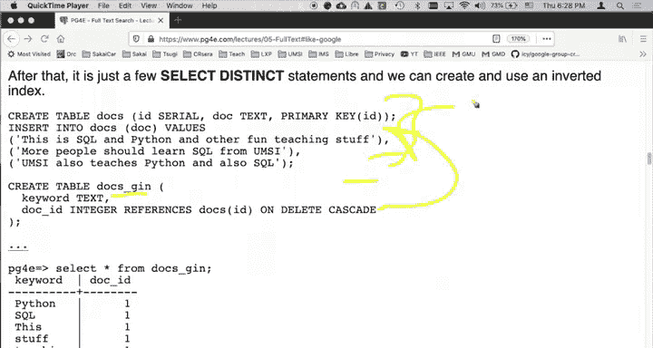
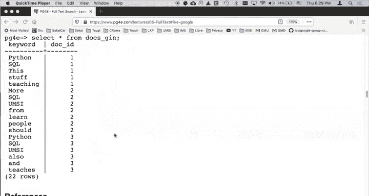

# 067：使用SQL构建倒排索引 📚

在本节课中，我们将学习倒排索引的概念，并通过手动构建一个简单的倒排索引来理解其工作原理。倒排索引是搜索引擎和全文检索的核心技术，理解它将帮助我们更好地利用数据库的高级功能。

## 概述

倒排索引通常用于文本搜索。例如，如果你要构建一个博客系统，数据库中存储了许多博文，每篇博文包含大量词汇，并且你希望提供一个搜索框，那么倒排索引就是实现这一功能的关键技术。虽然倒排索引在文本搜索中最常见，但它也有其他用途。这是一个存在已久的计算机科学概念，早在谷歌、搜索引擎甚至万维网出现之前就已存在。随着搜索在互联网使用中变得至关重要，我们从中学习了许多知识。了解谷歌如何处理搜索、关键词和匹配，以及它在基础倒排索引之上添加的创新，对我们很有启发。

上一节我们介绍了倒排索引的背景，本节中我们来看看如何手动构建它。

## 核心概念与函数

在开始构建之前，我们需要理解两个关键的SQL函数，它们将帮助我们处理文本数据。

### 1. `string_to_array` 函数

这个函数类似于Python中的`split`方法。它接收一个字符串和一个分隔符，根据分隔符将字符串分割，并返回一个数组。

**代码示例：**
```sql
SELECT string_to_array('hello world', ' ');
```
执行上述代码将返回一个字符串数组：`{hello,world}`。在PostgreSQL中，数组使用花括号 `{}` 表示，字符串数组中的元素通常不需要引号。

### 2. `unnest` 函数

`unnest` 函数用于将数组“展开”成多行数据。这类似于我们之前使用`generate_series`函数生成序列的方式，但它是针对数组的。

**代码示例：**
```sql
SELECT unnest(string_to_array('hello world', ' '));
```
执行上述代码将返回两行数据：一行是 `hello`，另一行是 `world`。这个函数的作用是将水平的数组结构转换为垂直的行结构，因此被称为“unnest”（解嵌套）。

有了这两个函数，我们就可以开始构建倒排索引了。

## 什么是倒排索引？🔍

倒排索引的基本思想是：它接收一系列文档，提取出所有文档中的词汇，然后建立一个从**关键词**到**文档**的映射。

例如，假设有三个文档：
*   **文档1** 包含关键词：SQL, 数据库, 查询
*   **文档2** 包含关键词：SQL, 索引, 优化
*   **文档3** 包含关键词：SQL, JSON, 全文检索

倒排索引会建立这样的映射：
*   **SQL** -> 文档1, 文档2, 文档3
*   **数据库** -> 文档1
*   **查询** -> 文档1
*   **索引** -> 文档2
*   **优化** -> 文档2
*   **JSON** -> 文档3
*   **全文检索** -> 文档3

当用户搜索“SQL”时，系统通过这个索引可以快速找到所有包含“SQL”的文档（即文档1、2、3）。

## 手动构建倒排索引 🛠️

现在，我们将通过SQL手动构建一个倒排索引。这个过程分为几个步骤。

首先，我们创建一个简单的文档表。

**步骤1：创建文档表**
```sql
CREATE TABLE docs (
    id SERIAL PRIMARY KEY,
    body TEXT
);
```

**步骤2：插入示例文档**
```sql
INSERT INTO docs (body) VALUES
('This is a document about SQL and databases.'),
('SQL is a powerful query language.'),
('PostgreSQL supports advanced SQL features and JSON.');
```

接下来，我们创建倒排索引表。这个表将存储关键词和对应文档ID的映射。

**步骤3：创建倒排索引表**
```sql
CREATE TABLE docs_gin (
    keyword TEXT,
    doc_id INTEGER REFERENCES docs(id) ON DELETE CASCADE
);
```
注意，`keyword`字段不是唯一的，因为一个关键词可能出现在多篇文档中。`doc_id`是一个外键，指向`docs`表的主键。

以下是填充倒排索引表的关键步骤。

**步骤4：填充倒排索引表**
```sql
INSERT INTO docs_gin (doc_id, keyword)
SELECT DISTINCT d.id, k.keyword
FROM docs d,
     LATERAL unnest(string_to_array(lower(d.body), ' ')) AS k(keyword);
```
让我们分解这个查询：
1.  `string_to_array(lower(d.body), ' ')`: 将每篇文档的正文转换为小写，并按空格分割成单词数组。
2.  `unnest(...)`: 将单词数组展开为多行，每行一个单词。我们使用`LATERAL`连接，以便为每一行文档处理其对应的单词数组。
3.  `SELECT DISTINCT d.id, k.keyword`: 选择文档ID和关键词。使用`DISTINCT`确保`(文档ID, 关键词)`组合是唯一的，避免同一文档中重复单词产生重复记录。
4.  `INSERT INTO docs_gin`: 将结果插入到倒排索引表中。

执行后，`docs_gin`表将包含所有文档中所有唯一单词的映射。

## 使用倒排索引进行搜索 🔎

倒排索引构建完成后，我们可以利用它进行高效的搜索。



**示例查询：查找包含“sql”的文档**
```sql
SELECT d.*
FROM docs d
JOIN docs_gin g ON d.id = g.doc_id
WHERE g.keyword = 'sql';
```
这个查询通过`docs_gin`索引表快速定位到所有包含关键词“sql”的文档ID，然后通过连接获取这些文档的完整信息。

## 从手动构建到内置功能 🚀

我们手动构建倒排索引是为了深入理解其原理。然而，PostgreSQL提供了强大得多的内置全文检索功能，例如`tsvector`和`tsquery`类型，以及`GIN`索引。这些内置功能能够更智能地处理文本（如忽略停用词、处理词干等），并且性能更优。

在接下来的课程中，我们将探索这些内置功能，学习如何更轻松、更高效地在PostgreSQL中实现全文搜索。

## 总结



本节课中我们一起学习了倒排索引的核心概念。我们了解到倒排索引是一种从关键词映射到文档的数据结构，是全文检索的基石。通过手动使用`string_to_array`和`unnest`函数，我们一步步地从文档中提取单词并构建了一个简单的倒排索引表。这个过程虽然基础，但清晰地揭示了倒排索引的工作原理。最后，我们演示了如何利用这个自建的索引进行搜索查询。理解这些基础知识，将为我们后续学习PostgreSQL强大的内置全文检索功能打下坚实的基础。