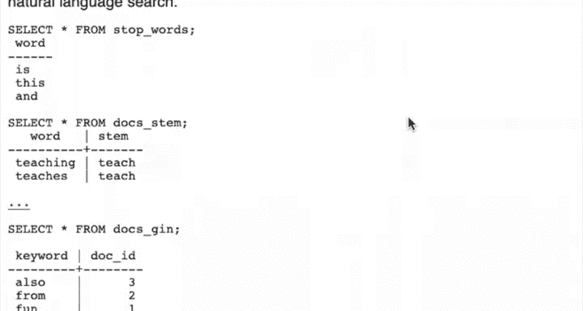
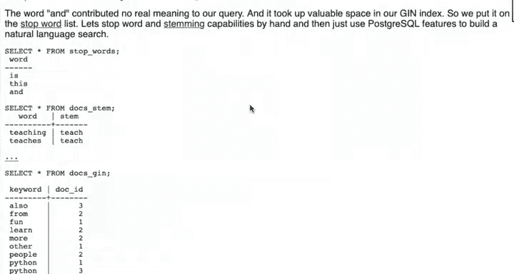
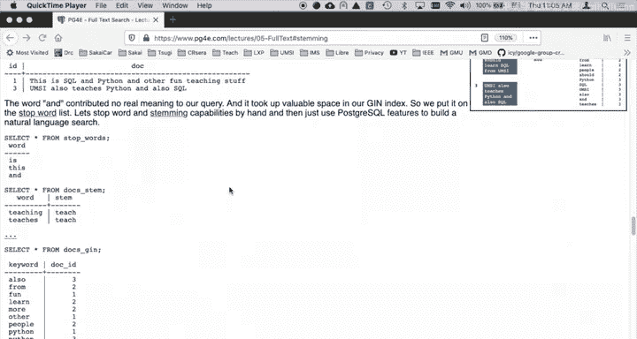
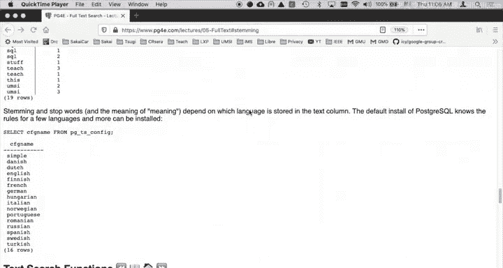
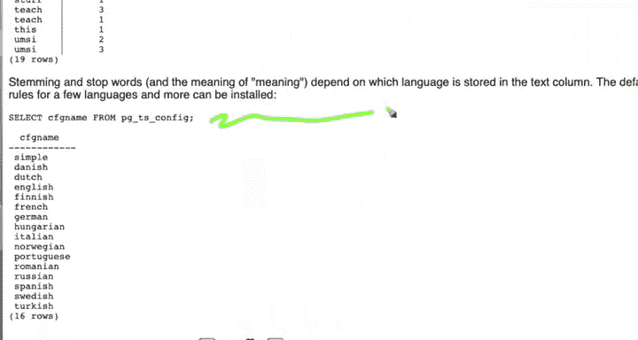
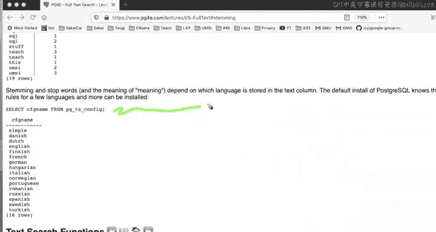

# 069：自然语言索引的SQL实现 🗂️

在本节课中，我们将学习如何为自然语言文本构建更高效的倒排索引。我们将探讨如何通过忽略停用词、统一大小写和进行词干提取来优化索引，从而减少索引大小并提高查询的准确性。

到目前为止，我们已经构建了将字符串视为普通文本的倒排索引。然而，如果我们要搜索的是自然语言，真正的倒排索引需要利用自然语言的一些特性，使我们的索引更小、更高效。因此，我们将像之前一样，首先使用SQL手动构建它，然后再使用PostgreSQL的内置功能来实现。手动构建的主要目的是为了更好地理解其原理。

## 核心优化概念

上一节我们介绍了基础的倒排索引，本节中我们来看看针对自然语言的优化策略。其核心思想是利用自然语言的特性，以及查询应具有实际意义这一事实。例如，你很少会在搜索引擎中输入“the”、“and”、“but”这类词。这些词对于句子结构很重要，但对于句子的含义贡献甚微。在自然语言搜索查询中，这些词实际上是无效的，因此我们不应该索引它们。这类词被称为**停用词**。

以下是我们要实施的三项主要优化：

1.  **停用词过滤**：忽略在搜索中无实际意义的常见词汇。
2.  **统一小写**：将文本全部转换为小写，使搜索不区分大小写。
3.  **词干提取**：将不同形式的单词（如“car”和“cars”）映射到其基本形式（词干），减少索引条目并提高匹配率。

## 手动实现自然语言索引

我们将手动创建一个优化的倒排索引。这个过程包括添加停用词表、词干映射表，并在构建索引和查询时应用这些规则。


### 1. 创建停用词表

首先，我们需要定义一个停用词列表。以下是一个简单的停用词表示例：

```sql
CREATE TABLE stop_words (
    word TEXT PRIMARY KEY
);

INSERT INTO stop_words (word) VALUES
    ('the'), ('and'), ('but'), ('is'), ('in'), ('it'), ('to'), ('of');
```

### 2. 创建词干映射表

接下来，我们创建一个表，将单词的不同形式映射到其统一的词干。这是一个简化的示例：

```sql
CREATE TABLE stems (
    word TEXT PRIMARY KEY,
    stem TEXT NOT NULL
);

INSERT INTO stems (word, stem) VALUES
    ('cars', 'car'),
    ('automobile', 'car'),
    ('running', 'run'),
    ('ran', 'run');
```

### 3. 构建优化的倒排索引

现在，我们将利用这些表来构建一个优化的倒排索引。假设我们有一个存储文档的`docs`表，其中包含`id`和`content`字段。

以下是构建索引的步骤：

```sql
-- 步骤1: 将文档内容拆分为单词，转换为小写，并去除停用词
WITH normalized_words AS (
    SELECT
        d.id AS doc_id,
        lower(unnest(string_to_array(d.content, ' '))) AS word
    FROM docs d
),
-- 步骤2: 应用词干提取
stemmed_words AS (
    SELECT
        nw.doc_id,
        COALESCE(s.stem, nw.word) AS processed_word
    FROM normalized_words nw
    LEFT JOIN stems s ON nw.word = s.word
    WHERE nw.word NOT IN (SELECT word FROM stop_words) -- 过滤停用词
)
-- 步骤3: 创建倒排索引
SELECT
    processed_word AS token,
    array_agg(DISTINCT doc_id) AS doc_ids
FROM stemmed_words
GROUP BY processed_word;
```

这个查询会生成一个倒排索引，其中每个词条（已小写、去除停用词并提取词干）都关联着包含它的文档ID列表。





## 在PostgreSQL中使用内置功能



手动实现帮助我们理解了原理，但PostgreSQL提供了强大的内置全文搜索功能，可以更简便地实现上述优化。

### 查看支持的语言配置

PostgreSQL预置了多种语言的停用词和词干提取规则。你可以使用以下查询查看可用的配置：

```sql
SELECT cfgname FROM pg_ts_config;
```

### 使用`tsvector`和`tsquery`

PostgreSQL通过`tsvector`（文本搜索向量）和`tsquery`（文本搜索查询）数据类型以及相关的函数（如`to_tsvector`和`to_tsquery`）来支持全文搜索。这些函数会自动处理指定语言的小写转换、停用词过滤和词干提取。

例如，为`docs`表创建一个支持英文全文搜索的索引：

```sql
-- 添加一个存储预处理文本的列
ALTER TABLE docs ADD COLUMN content_tsvector tsvector;






-- 更新该列，使用英语配置处理内容
UPDATE docs SET content_tsvector = to_tsvector('english', content);

-- 创建GIN索引以加速搜索
CREATE INDEX idx_docs_content ON docs USING GIN(content_tsvector);
```

现在，你可以进行高效的全文搜索：

```sql
-- 搜索包含“lemons”和“neons”的文档
SELECT id, content FROM docs
WHERE content_tsvector @@ to_tsquery('english', 'lemons & neons');
```

## 总结



本节课中我们一起学习了如何为自然语言构建优化的倒排索引。我们探讨了三个核心优化技术：**停用词过滤**、**统一小写**和**词干提取**。我们首先使用SQL手动实现了这些步骤，以深入理解其工作机制。随后，我们介绍了如何利用PostgreSQL强大的内置全文搜索功能（如`tsvector`和指定语言的配置）来更高效、更简单地达到相同目的。理解这些概念对于设计高效的文本搜索系统至关重要。