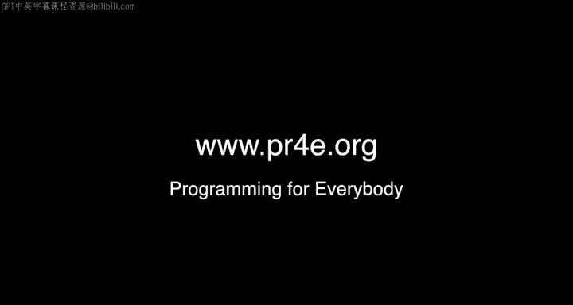

# 071：韩国首尔

## 概述
在本节中，我们将跟随课程主讲人查克博士，回顾一次在韩国首尔举行的特别线下办公时间活动。我们将看到来自世界各地的学习者如何聚集一堂，分享他们学习编程、特别是Python和本课程的经历与收获。

## 活动开场
查克博士在前往韩国首尔办公地点的路上。他像往常一样，不知道会有多少人前来参加。可能是一个人，也可能是二十个人。这种不确定性本身就是乐趣的一部分，就像一场与七十万人的盲约。

我们到达了又一次办公时间现场，这是一次大型活动，地点在韩国首尔。我们距离著名的“江南Style”交叉手臂雕像很近，这个雕像因庆祝那支非常重要的音乐视频而建立。

像往常一样，查克博士希望介绍在场的同学们，让他们打个招呼。但这需要一点时间，因为现场有很多人。

## 学习者自我介绍
以下是参与本次办公时间的部分学习者进行的自我介绍。

*   **Aris**：我的名字是Aris，是真名Post的简称。我正在学习Python。
*   **Shelby**：我是Shelby，我实际上学的是创意写作，所以编程并非我的专业。但我对语言学感兴趣，所以我学习了Python课程。自从今年夏天以来，我大概上了三门课，因为我有很多时间。
*   **Shiino**：你好，我的名字是Shiino。我实际上是跟着Shelby来的。但我真的在考虑学习这门Python课程，它是一门非常棒的计算机语言。你的课程看起来也非常酷。
*   **Victor Lee**：我的名字是Victor Lee，我在韩国翻译Python书籍。我今天带了书来展示。这本书上有Victor和查克的签名。我们为Victor热烈鼓掌。查克博士表示自己很不擅长自拍，但非常感谢Victor将书籍翻译成韩文所付出的一切。当被问及翻译Python 2书籍的报酬时，Victor得到的是一杯啤酒。查克博士开玩笑说会再付几杯啤酒请他翻译Python 3版本。查克博士强调，这一切的核心是每个人的奉献，Victor为此做出了贡献，大家非常感谢他。
*   **Suin**：我的名字是Suin。Python是一门非常有趣的语言。我每天使用Stack Overflow和Victor（翻译的书），很高兴认识你，非常感谢。
*   **John Gong Soong**：我是John Gong Soong，很高兴在这里见面，感觉像是在见一位名人。我一直用笔记本电脑观看课程，能见到他本人真是太棒了。
*   **Chong Min**：我的名字是Chong Min，学习你的课程很有趣，谢谢。
*   **Honalo**：我是来自巴西的Honalo，我热爱Python，热爱学习。我现在和我的未婚妻Priscilla在首尔度假。这是一个非常愉快的巧合。查克博士提到，九月份在拉斯维加斯举行办公小时时，所有参加的人也都是去那里度假的。
*   **Amber**：我是Amber，我刚刚开始学习《Python for Everyone》，很高兴加入大家。
*   **Joine**：我是Joine，很高兴在韩国见到查克博士。玩得开心，我想感谢你确保每个人都拿到了啤酒，因为你做了所有的翻译工作，确保我们得到了需要的所有订单。
*   **Yo**：我是Yo，我非常喜欢查克博士的课程，很高兴来到这里。
*   **Shi**：我是Shi，我通过他的课程开始学习Python编程。现在我在一个实验室工作，编写生物信息学算法相关的程序。如果没有他的课程，我无法想象自己能做这些。我以前只是学习生命科学。学习了Python编程课程后，我成为了一名初级程序员。恭喜你，真的非常感谢你。你并不孤单，我们真的想和你在一起，欢迎加入课程。
*   **Hang**：我是Hang，能在课堂上见到视频中的真人真是太棒了。TED演讲是我第一个编程专题，Python是我的第一门编程语言，我真的很感激。
*   **Michelle**：我是Michelle，来自芝加哥，但开始在韩国从事金融工作。我以前学的是艺术史，但实际上我们在金融中也使用Python，它是一门非常棒的语言。昨天我收到这封邮件时非常惊喜。事情总是这样随机发生，无法预测查克博士下次会在哪里。
*   **Huen**：我的名字是Huen，我已经注册了即将开始的课程。我在这里受到了很大的激励，等不及要在Coursera上看到自己的脸了。
*   **Su Lee**：我的名字是Su Lee，大约两年前我开始学习这门Python编程课程。那时我对编程一无所知，是零基础。但现在我成为了一名开发者。我真的很喜欢教女孩们Python编程，我也是韩国Django Girls的组织者之一。这是我的漂亮吉祥物。韩国的Django Girls刚刚举办了一个帮助大约50人的活动，我们希望在编程世界激励更多女性。所以，你从一个完全不懂编程的人，变成了通过Django Girls激励其他女性成为程序员的人。现在我想要回我的贴纸，我会把这个贴纸贴在我的笔记本电脑上，所以在未来的录制视频中，你们会看到我的笔记本电脑上有来自首尔的Django Girl图案。
*   **Hassan**：我是Hassan，在韩国生活了很长时间。实际上我说Python，这很简单。为了办公室工作，我使用其他语言，但在空闲时间我只用Python。每当有人和我交谈并想学习编程语言时，我就让他们安装Python，然后从你的课程开始。我真的很高兴见到你，因为我在2014年完成了这门课程，我等了两年才见到你，非常感谢。

## 活动尾声
这是一段非常有趣的时光，大家在这里待了大约一个小时，喝了些饮料。他们差点被请出去，但后来重新整理了房间，所以没有被赶走。查克博士不知道下一次办公时间会在哪里，可能在凤凰城或芝加哥。他已经在那里举办过两次办公时间了。但他会在确定后尽快通知大家。

## 总结
本节课中，我们一起回顾了《PostgreSQL for Everybody》课程在韩国首尔举行的一次特别线下办公时间。通过学习者们的自我介绍，我们看到了这门课程如何将不同背景、不同国家的人联系起来，从零基础到成为开发者，从个人学习到社区贡献。这些真实的故事展示了编程学习的广泛影响力和社区支持的重要性。