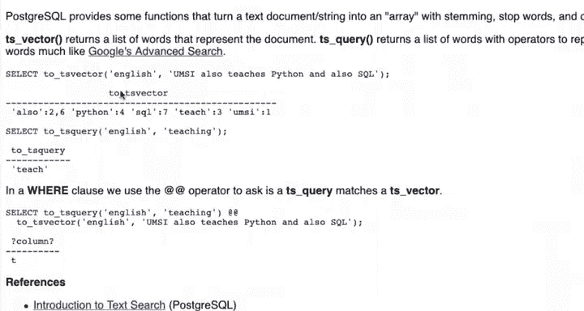
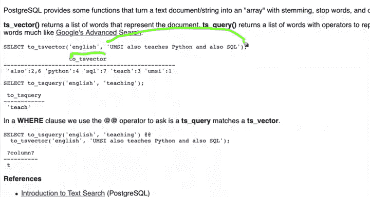
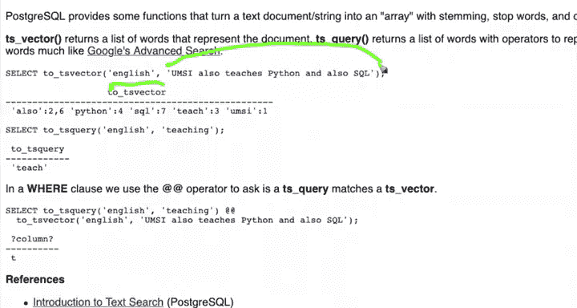
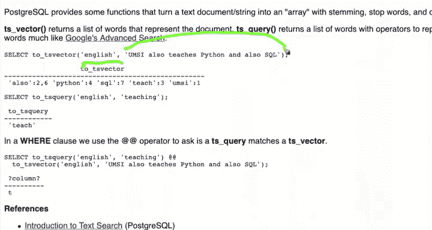
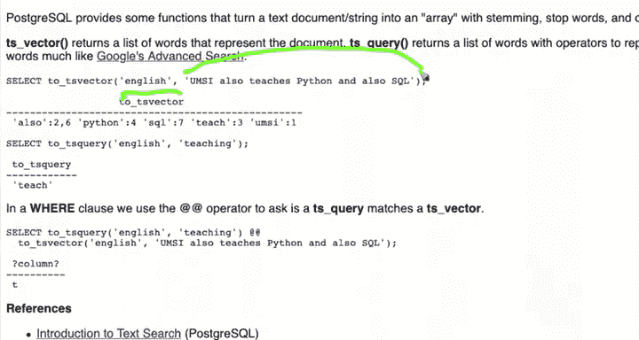

# 075：11_PostgreSQL自然语言索引实践

## 概述

在本节课中，我们将学习如何在PostgreSQL中利用其内置的自然语言处理功能，轻松地创建和使用全文搜索索引。我们将了解核心概念`TSVECTOR`和`TSQUERY`，并学习如何构建一个高效的、支持词干提取和停用词过滤的搜索系统。

上一节我们介绍了手动实现文本搜索的复杂性，本节中我们来看看如何让PostgreSQL为我们完成所有繁重的工作。

## 核心概念：TSVECTOR 与 TSQUERY

PostgreSQL通过两个核心概念来实现智能全文搜索：`TSVECTOR`和`TSQUERY`。

`TSVECTOR`可以理解为一个文本特征向量。它代表一个文档在N维空间中的位置。你可以想象一个三维空间，文档被放置在不同的坐标点上。搜索的本质就是在这个多维空间中寻找“接近”的文档。`TSVECTOR`就是这个从原点到特定文档的向量。它本质上是一个经过处理的数组，包含了文本的精髓。

`TSVECTOR`由`to_tsvector`函数生成。这个函数接收两个参数：语言和文本字符串。

```sql
to_tsvector(‘english‘， ‘This is an English string.‘)
```







该函数会提取文本的特征：进行词干提取、处理大小写、消除停用词等所有我们之前手动完成的工作。它还会记录词汇的位置信息，并包含一套权重系统（例如，标题的权重可能高于正文）。最终，它生成一个代表文本核心特征的向量。



`TSQUERY`则代表了搜索查询。它同样应用词干提取、语言规则和停用词规则，将一个或多个搜索词转换为可以匹配`TSVECTOR`的查询对象。



```sql
to_tsquery(‘english‘， ‘teaching‘)
```

查询中的“teaching”会被词干提取为“teach”。这种将查询词进行词干提取的过程，有一个技术术语叫做“conflation”（词形归并）。

## 构建搜索查询

要执行搜索，我们使用`@@`操作符来连接`TSQUERY`和`TSVECTOR`。

```sql
SELECT * FROM docs WHERE to_tsquery(‘english‘， ‘teaching‘) @@ to_tsvector(‘english‘， doc_column);
```

这个查询会判断`TSQUERY`是否包含在`TSVECTOR`中。即使原文中没有“teaching”只有“teaches”，由于词干提取，两者都能匹配到“teach”，从而实现智能的模糊匹配。

`TSVECTOR`将文档精简为其核心特征（包括词汇位置），`TSQUERY`则将查询字符串转换为可与`TSVECTOR`匹配的形式。你之前用SQL手动实现了这些，现在我们将用PostgreSQL内置功能轻松完成。

## 创建自然语言GIN索引

以下是创建索引的步骤。

首先，我们创建一张简单的表。

```sql
CREATE TABLE docs (id SERIAL， doc TEXT);
```

接着，我们创建一个基于`TSVECTOR`的GIN索引。这比之前的字符串数组索引更简单，因为我们不需要指定操作符类。PostgreSQL知道`TSVECTOR`和GIN索引是“好朋友”，会自动处理。

```sql
CREATE INDEX gin_idx ON docs USING gin(to_tsvector(‘english‘， doc));
```

我们需要告诉索引处理的是什么语言，这就是为什么了解文本语言很重要。这种方式比纯字符串的通用倒排索引更简单。

## 执行索引查询

向表中插入一些数据后，索引会被填充。

现在我们可以执行一个`WHERE`子句查询。

```sql
SELECT id， doc FROM docs WHERE to_tsquery(‘english‘， ‘learn‘) @@ to_tsvector(‘english‘， doc);
```

如果没有索引，PostgreSQL将检索每一行，计算其`TSVECTOR`，然后检查是否匹配`TSQUERY`。但有了索引，查询会非常高效。

使用`EXPLAIN`命令查看查询计划。

```sql
EXPLAIN SELECT id， doc FROM docs WHERE to_tsquery(‘english‘， ‘learn‘) @@ to_tsvector(‘english‘， doc);
```

如果查询计划显示使用了索引扫描（`Index Scan`）而非顺序扫描（`Seq Scan`），则表明索引工作正常。你应该反复在小样本上测试，并对每个重要查询使用`EXPLAIN`，以确保索引被正确使用。

## 总结

本节课中我们一起学习了PostgreSQL的自然语言索引实践。我们掌握了两个核心数据类型`TSVECTOR`和`TSQUERY`，学会了如何使用`to_tsvector`和`to_tsquery`函数，以及如何利用`@@`操作符进行智能全文搜索。最关键的是，我们学会了如何创建一个基于`TSVECTOR`的GIN索引，从而让PostgreSQL内部高效地处理语言相关的所有复杂工作（如词干提取、停用词过滤），极大地简化了全文搜索的实现。接下来，我们将学习如何对搜索结果进行排名。