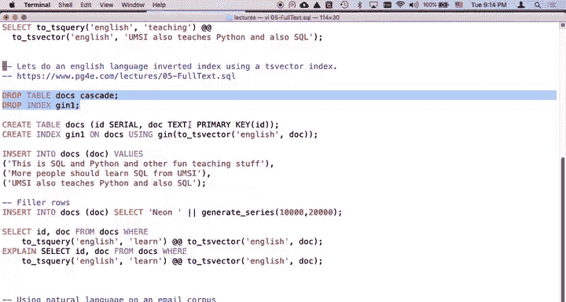
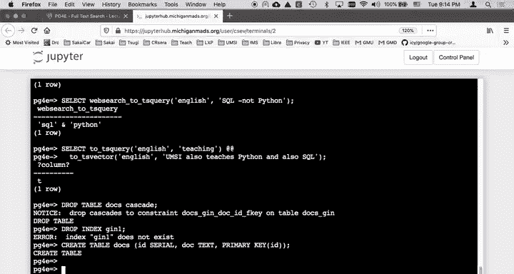
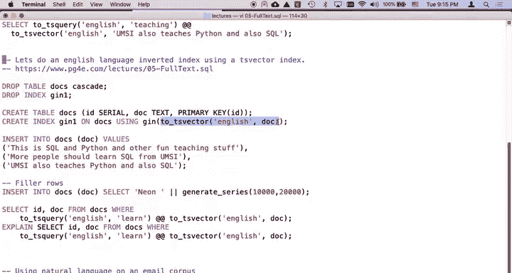
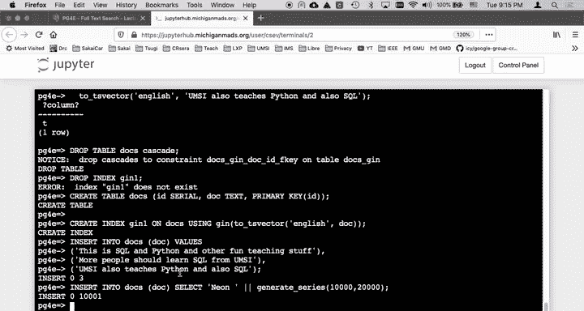
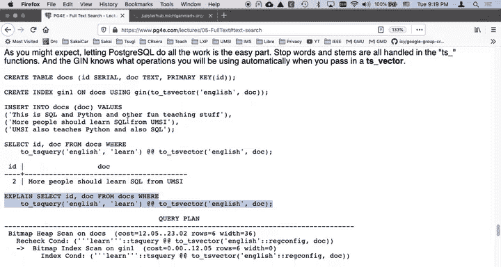

# 077：GIN 与 GiST 索引构建演示 🚀

在本节课中，我们将学习如何在 PostgreSQL 中为自然语言搜索构建倒排索引。我们将重点演示两种索引类型：GIN 和 GiST，并比较它们的创建速度与特性。通过实际操作，你将理解如何利用 `tsvector` 和 `tsquery` 来优化全文搜索查询。

---

## 概述

我们将从创建一个包含文档的表开始，然后为其 `tsvector` 列分别创建 GIN 和 GiST 索引。通过对比两种索引的创建过程和执行计划，我们将了解它们各自的优势以及如何确保查询避免低效的顺序扫描。

---

## 创建文档表与索引

首先，我们需要创建一个存储文档的表。该表结构简单，仅包含一个ID和一个文档文本字段。



```sql
CREATE TABLE docs (
    id SERIAL PRIMARY KEY,
    doc TEXT
);
```



接下来是本节课的核心操作：创建索引。我们将首先创建一个 GIN 索引。GIN 索引特别适合处理包含多个值的列，如数组或全文搜索中的 `tsvector`。

以下是创建 GIN 索引的 SQL 语句：

```sql
CREATE INDEX gin1 ON docs USING gin(to_tsvector('english', doc));
```



**关键点解析**：
*   `to_tsvector('english', doc)`：这个表达式是索引的核心。它使用英语词典对 `doc` 列进行处理，执行**词干提取**、**去除停用词**和**转为小写**。
*   `USING gin`：指定创建 GIN 类型的索引。该索引会为处理后的所有词汇创建一个**倒排索引**，从而可以快速定位包含特定词汇的文档。

创建索引后，我们向表中插入一些数据，包括三条示例文档和一万条填充数据，以模拟真实场景。



```sql
-- 插入示例数据
INSERT INTO docs (doc) VALUES ('This is a sample document.');
INSERT INTO docs (doc) VALUES ('Another example for demonstration.');
INSERT INTO docs (doc) VALUES ('PostgreSQL is powerful.');

-- 插入大量填充数据以测试索引性能
INSERT INTO docs (doc) SELECT 'neon ' || generate_series FROM generate_series(1, 10001);
```

---

## 执行全文搜索查询

数据准备就绪后，我们可以执行一个全文搜索查询。查询的 `WHERE` 子句条件必须与创建索引时使用的表达式**完全匹配**，才能确保索引被使用。

```sql
SELECT id, doc FROM docs
WHERE to_tsvector('english', doc) @@ to_tsquery('english', 'powerful');
```

**查询说明**：
*   `@@` 是全文搜索匹配操作符。
*   `to_tsquery('english', 'powerful')` 将搜索词转换为 `tsquery` 类型。
*   由于 `WHERE` 子句中的 `to_tsvector('english', doc)` 与索引表达式一致，PostgreSQL 将使用我们创建的 GIN 索引来加速查询，避免全表扫描。

我们可以使用 `EXPLAIN` 命令来验证查询是否使用了索引：

```sql
EXPLAIN SELECT id, doc FROM docs WHERE to_tsvector('english', doc) @@ to_tsquery('english', 'powerful');
```

如果执行计划中显示 **`Index Scan using gin1 on docs`**，则证明索引生效。

---

## 对比 GiST 索引

上一节我们介绍了 GIN 索引的创建与使用。本节中，我们来看看另一种可用于全文搜索的索引类型：GiST。我们将通过实际操作对比两者的创建速度。

首先，我们删除之前创建的 GIN 索引。

```sql
DROP INDEX gin1;
```

然后，我们创建一个 GiST 索引。GiST 索引是通用搜索树，它在创建和维护上通常比 GIN 更快、更节省空间，但在查询时可能需要读取更多的数据块。

```sql
CREATE INDEX gin1 ON docs USING gist(to_tsvector('english', doc));
```

创建完成后，立即执行相同的 `EXPLAIN` 命令。你可能会注意到，GiST 索引的创建和查询优化器识别它的速度非常快。

```sql
EXPLAIN SELECT id, doc FROM docs WHERE to_tsvector('english', doc) @@ to_tsquery('english', 'powerful');
```

现在，我们再次删除索引，并重新创建 GIN 索引，直观感受两者的创建速度差异。

```sql
DROP INDEX gin1;
CREATE INDEX gin1 ON docs USING gin(to_tsvector('english', doc));
-- 立即执行 EXPLAIN
EXPLAIN SELECT id, doc FROM docs WHERE to_tsvector('english', doc) @@ to_tsquery('english', 'powerful');
```

在实际操作中，对于一万多条数据，两种索引的创建速度可能都很快，难以肉眼区分。但在更大数据量下，GiST 索引的构建速度优势会更明显。不过，GIN 索引在复杂查询的检索速度上通常更胜一筹。

---

## 关于索引的注意事项

以下是关于全文搜索索引的一些重要补充说明：

*   **多表达式索引**：你可以在一个表上创建多个使用不同表达式或配置的全文搜索索引，以适应多样的查询需求。
*   **权衡成本**：索引不是免费的。需要考虑其带来的存储空间成本，以及在插入、更新、删除数据时维护索引所需的计算开销。GIN 索引的更新成本通常高于 GiST。
*   **核心目标**：创建全文搜索索引的最终目标是让查询执行计划避免 **`Seq Scan`**（顺序扫描），转而使用高效的 **`Index Scan`**。

---

## 总结



本节课中我们一起学习了 PostgreSQL 全文搜索的核心实践。我们创建了文档表，并为其 `tsvector` 列分别构建了 GIN 和 GiST 索引。我们了解到，确保查询条件与索引表达式匹配是索引生效的关键。通过对比，我们知道了 GiST 索引可能在创建和维护上更快更轻量，而 GIN 索引则在查询性能上具有优势。最终，所有努力都是为了优化查询路径，用索引扫描替代低效的全表扫描。