# 082：loadbook.py脚本演示 📚

在本节课中，我们将学习如何使用一个名为 `loadbook.py` 的Python脚本，将一本电子书的文本内容加载到PostgreSQL数据库中，并为其创建全文索引以便进行高效搜索。

## 概述

我们将从Project Gutenberg下载一本电子书，然后使用Python脚本解析文本，将段落合并为单行文本，并批量插入到数据库表中。最后，我们将为该表创建一个GIN索引，以支持快速的全文搜索。

## 下载书籍和脚本

首先，我们需要获取一本电子书。这里我们使用 `wget` 从Project Gutenberg下载查尔斯·狄更斯的《圣诞颂歌》，文件名为 `pg19337.txt`。

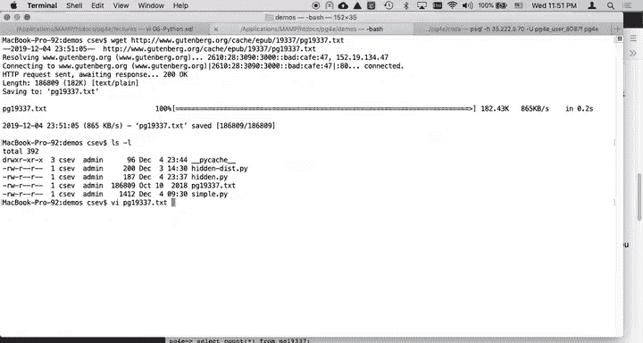

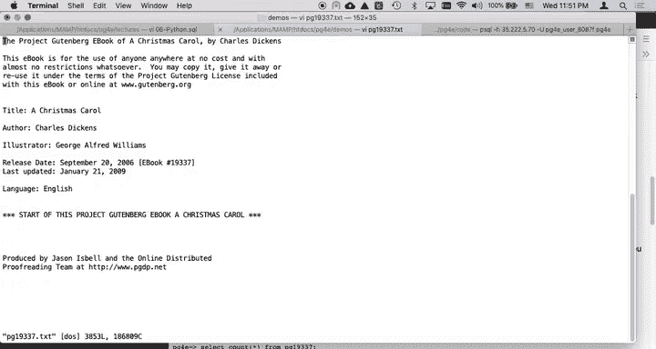

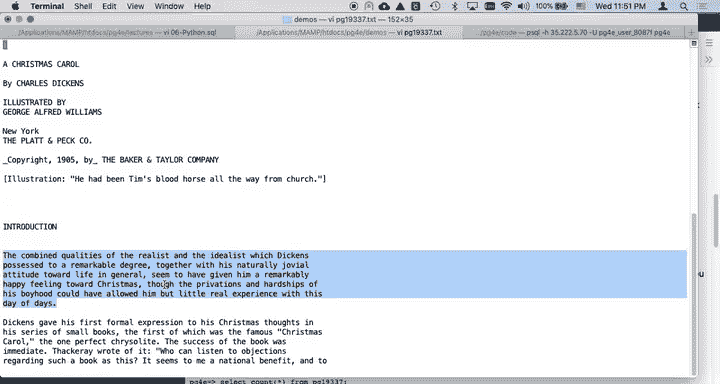

```bash
wget https://www.gutenberg.org/files/19337/19337.txt -O pg19337.txt
```

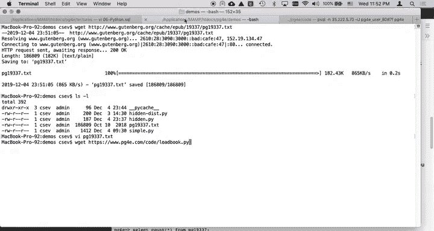

接下来，下载本教程所需的Python脚本 `loadbook.py` 及其依赖的实用工具库 `myutils.py`。

```bash
wget https://pg4e.com/code/loadbook.py
wget https://pg4e.com/code/myutils.py
```

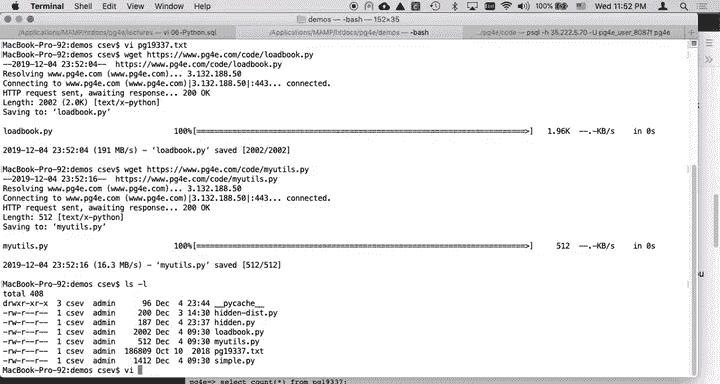

`myutils.py` 文件包含数据库连接等辅助函数。脚本运行时会使用一个名为 `hidden.py` 的配置文件来存储数据库密码等敏感信息。如果你已完成之前的课程练习，该文件应该已配置妥当。

## 解析脚本代码

现在，让我们深入查看 `loadbook.py` 脚本，了解其工作原理。

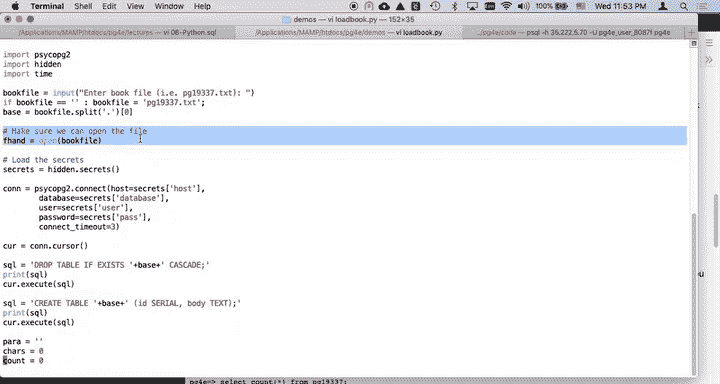

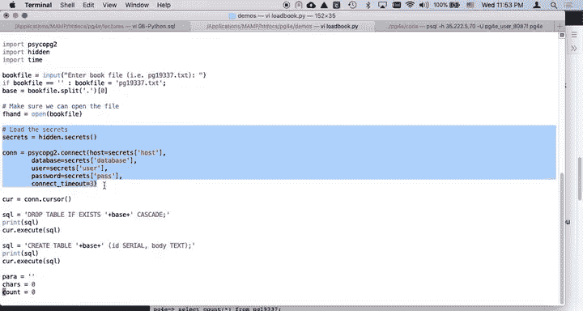

脚本首先导入必要的模块，包括处理数据库连接的 `myutils` 和用于控制速度的 `time` 模块。

```python
import hidden
import time
import myutils
```

接着，脚本会检查命令行参数，以确定要加载的书籍文本文件。默认情况下，它会使用去除 `.txt` 后缀的文件名作为数据库表名。

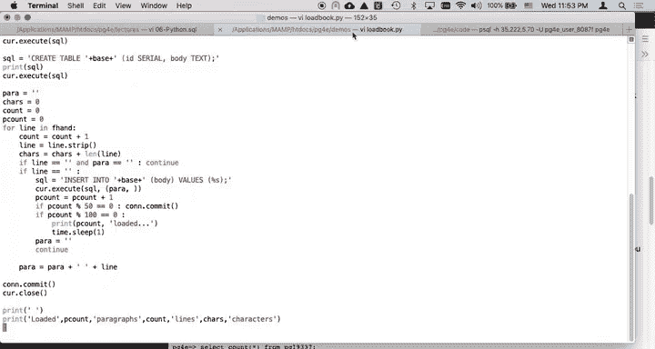

```python
if len(sys.argv) < 2:
    print("Usage: python3 loadbook.py book.txt")
    sys.exit(1)

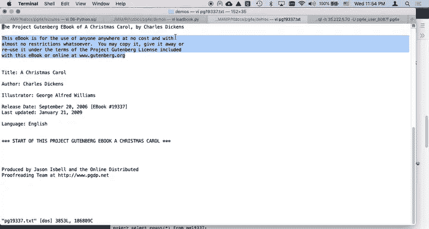

bookfile = sys.argv[1]
basename = bookfile.replace('.txt', '')
tablename = basename
```

在尝试连接数据库之前，脚本会先确认可以成功打开文本文件。

```python
try:
    fhand = open(bookfile)
except:
    print(f'Cannot open file: {bookfile}')
    sys.exit(1)
```

成功打开文件后，脚本加载数据库密码并建立连接，同时创建一个游标（cursor）。游标的作用类似于PostgreSQL客户端，用于执行SQL命令。


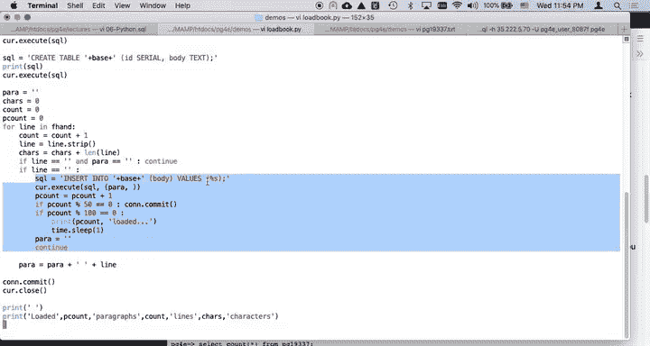

```python
secrets = hidden.secrets()
conn = myutils.connect(secrets)
cur = conn.cursor()
```

## 创建数据库表

脚本会先删除已存在的同名表（如果存在），然后创建一个包含两个字段的新表：一个自增的序列ID (`id SERIAL`) 和一个存储段落正文的文本字段 (`body TEXT`)。

```sql
cur.execute(f'DROP TABLE IF EXISTS {tablename}')
cur.execute(f'CREATE TABLE {tablename} (id SERIAL, body TEXT)')
```

## 处理文本并插入段落

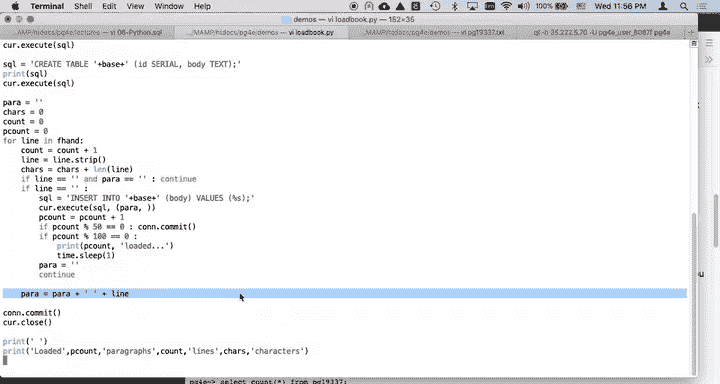

这是脚本的核心部分。它逐行读取文本文件，并将属于同一个段落的行合并成一个长的文本字符串。

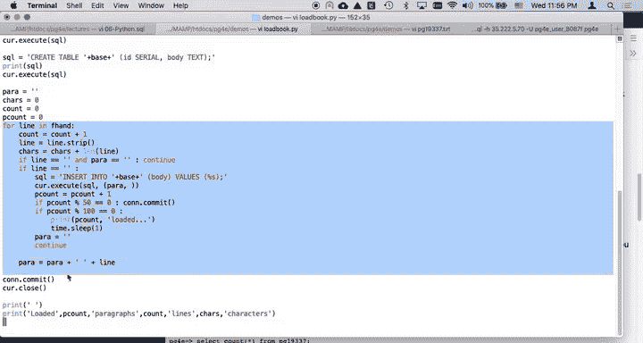

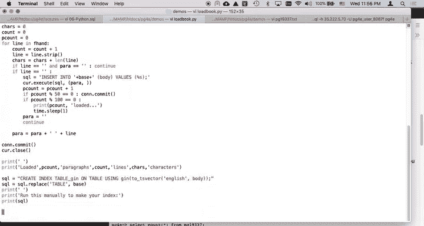

以下是处理逻辑的关键步骤：
1.  初始化一个空字符串 `para` 来累积当前段落的内容。
2.  遍历文件的每一行。
3.  使用 `strip()` 方法移除行首尾的空白字符。
4.  如果遇到空行（即处理后的行长度为0），并且 `para` 中已有内容，则意味着一个段落结束。此时，将该段落插入数据库，并清空 `para` 以准备下一个段落。
5.  如果不是空行，则将当前行内容（加上一个空格）追加到 `para` 变量中。

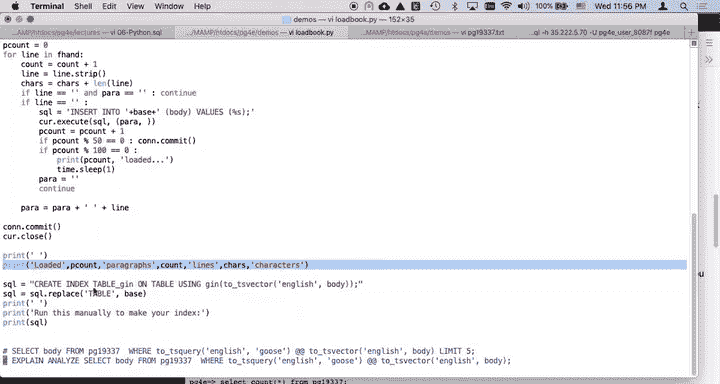

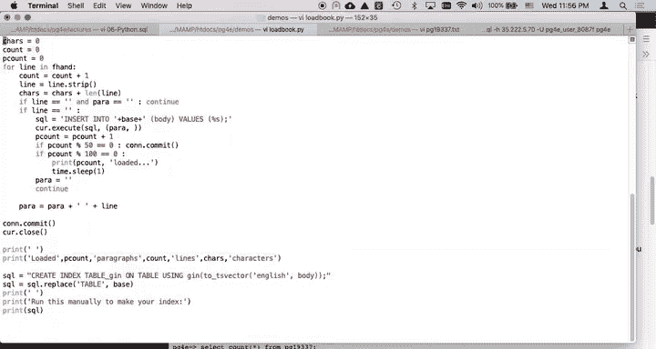

```python
para = ''
count = 0
for line in fhand:
    line = line.strip()
    if len(line) < 1:
        if len(para) < 1: continue
        # 插入段落到数据库
        cur.execute(f"INSERT INTO {tablename} (body) VALUES (%s)", (para, ))
        count += 1
        para = ''
        # 每插入50条记录提交一次事务
        if count % 50 == 0:
            conn.commit()
            if count % 1000 == 0:
                print(f'{count} loaded...')
                time.sleep(1) # 短暂暂停，便于控制
    else:
        para = para + ' ' + line
```

## 性能优化策略

脚本采用了两个重要的性能优化策略：
1.  **批量提交**：不是每次插入都立即提交事务，而是每插入50条记录才提交一次 (`if count % 50 == 0: conn.commit()`)。这大大减少了数据库的磁盘I/O和网络往返开销，显著提升了加载速度。
2.  **进度提示与暂停**：每加载1000条记录，脚本会打印一次进度，并暂停1秒 (`time.sleep(1)`)。这既让用户了解进度，也提供了一个中断脚本运行的机会（例如按 `Ctrl+C`）。

文件读取循环结束后，脚本执行最终提交并关闭游标和数据库连接。

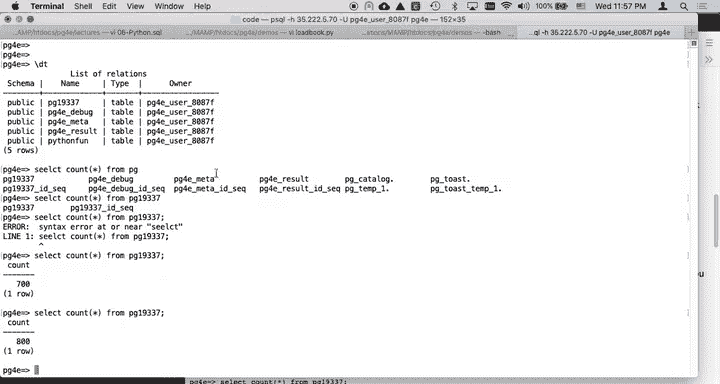

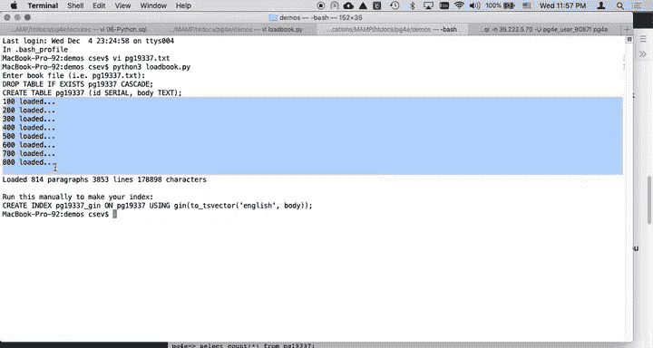

```python
conn.commit()
cur.close()
print(f'Loaded {count} paragraphs into {tablename}.')
```


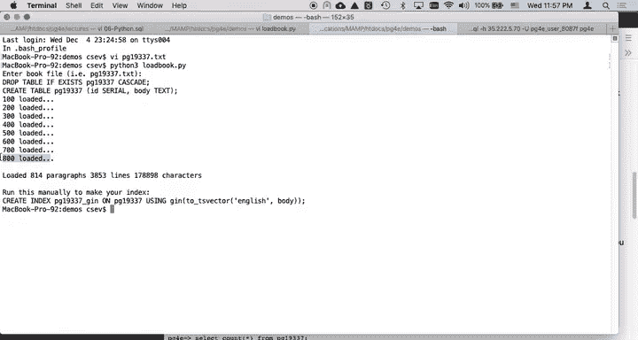

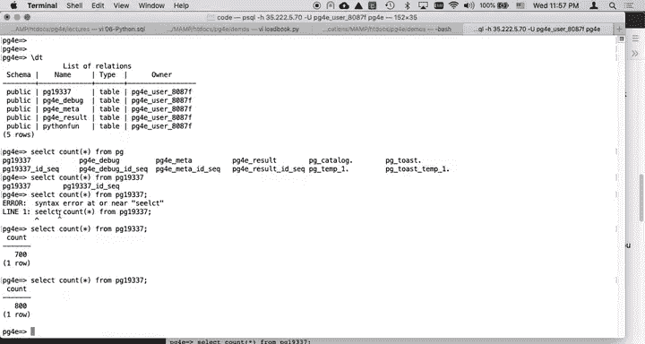

## 运行脚本并验证结果

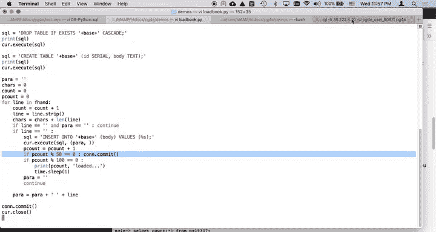

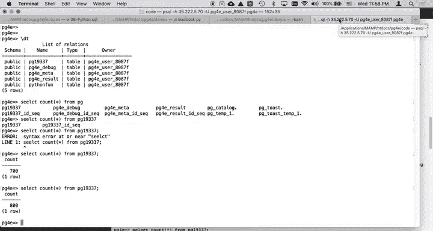

在终端中运行脚本，指定要加载的书籍文件。

```bash
python3 loadbook.py pg19337.txt
```

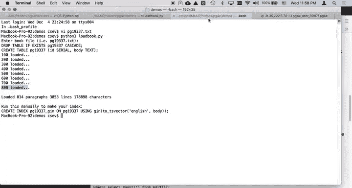

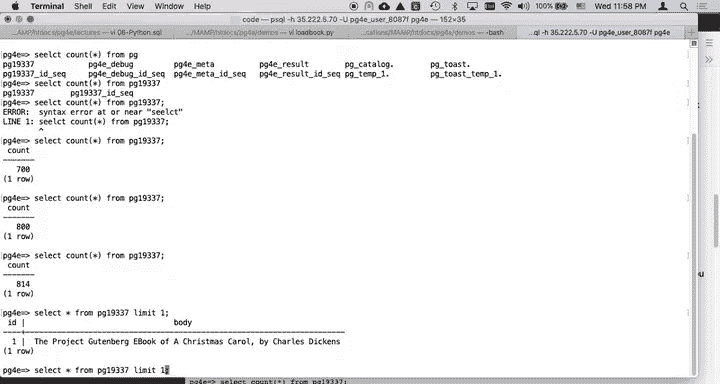

运行过程中，你会在终端看到加载进度的输出。完成后，可以连接到数据库验证数据。

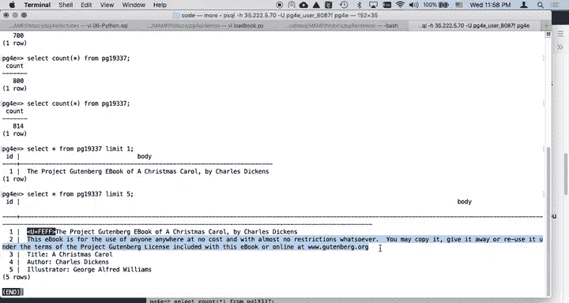

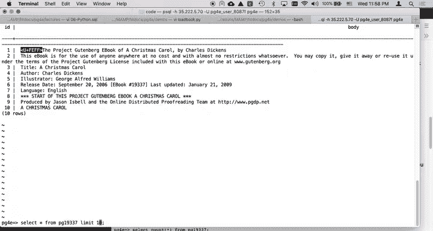

使用 `psql` 连接到你的数据库，然后执行以下SQL命令：
-   查看表中总共有多少段落：`SELECT count(*) FROM pg19337;`
-   查看前几条记录的内容：`SELECT * FROM pg19337 LIMIT 5;`

## 创建全文搜索索引

数据加载完成后，我们需要创建一个GIN索引来启用高效的全文搜索。PostgreSQL的 `tsvector` 类型会自动处理英文的词干提取、忽略标点符号等。

```sql
CREATE INDEX pg19337_gin ON pg19337 USING GIN(to_tsvector('english', body));
```

创建索引后，就可以执行全文搜索查询了。例如，搜索包含单词 “goose” 的段落：

```sql
SELECT id, body FROM pg19337
WHERE to_tsquery('english', 'goose') @@ to_tsvector('english', body)
LIMIT 5;
```

你还可以使用 `EXPLAIN` 命令来验证查询是否使用了我们创建的GIN索引，从而避免低效的全表扫描。

```sql
EXPLAIN ANALYZE SELECT id, body FROM pg19337
WHERE to_tsquery('english', 'goose') @@ to_tsvector('english', body);
```

在输出中，你应该能看到 `Bitmap Heap Scan` 和使用了 `pg19337_gin` 索引，这表示查询是高效的。

## 执行更复杂的搜索

PostgreSQL全文搜索支持邻近操作符 `<->`，用于查找相邻的词汇。例如，查找 “tiny” 后面紧跟着 “Tim” 的段落：

```sql
SELECT id, body FROM pg19337
WHERE to_tsquery('english', 'tiny <-> Tim') @@ to_tsvector('english', body);
```

## 总结

本节课我们一起学习了如何将整本电子书加载到PostgreSQL数据库。我们使用Python脚本 `loadbook.py` 完成了以下关键步骤：
1.  下载并解析文本文件，将段落合并为单行。
2.  使用批量提交和进度控制来优化数据插入性能。
3.  在数据库中创建表并插入数据。
4.  利用 `to_tsvector` 和GIN索引为文本数据创建强大的全文搜索能力。

通过这种方法，你可以为任何书籍或大型文本数据集构建一个可快速搜索的数据库，为后续的自然语言处理或文本分析应用打下基础。