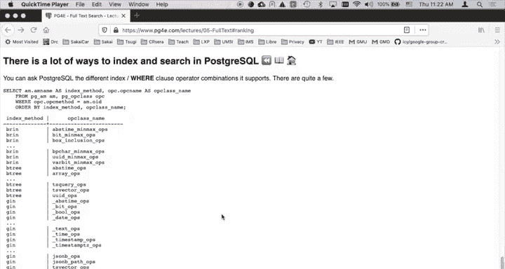
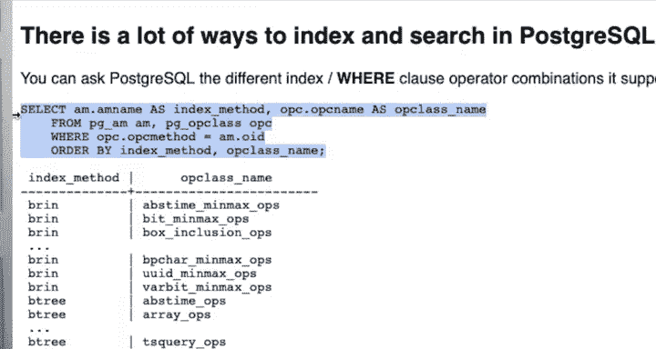
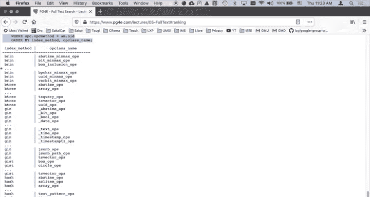

# 086：搜索结果排序技术 🔍

在本节课中，我们将学习如何在 PostgreSQL 中对全文搜索的结果进行排序。排序并非强制要求，但为了提供更好的用户体验，我们通常希望将最相关的结果排在前面。PostgreSQL 内置了一系列排名函数来帮助我们实现这一目标。

## 排序的基本概念与执行位置

首先需要明确的是，排序（排名）的计算通常发生在 `SELECT` 子句中，而不是 `WHERE` 子句里。`WHERE` 子句负责筛选出符合条件的行，这通常是查询中开销最大的部分。相比之下，计算排名本身的开销非常小。

上一节我们介绍了如何使用全文搜索筛选数据，本节中我们来看看如何对这些筛选出的结果进行排序。

即使你需要对结果进行排序（例如使用 `ORDER BY rank DESC`），其开销也相对较低。假设你从一百万行数据中筛选出了300行，对这300行进行排序是高效的。查询的主要开销在于从一百万行减少到300行的筛选过程，而非后续的排序。而索引的价值正是体现在这个筛选过程中，它能帮助我们避免读取每一条记录。

## 排序查询的构成

一个典型的排序查询包含以下部分：

以下是排序查询的核心结构：

*   **`WHERE` 子句**：用于筛选数据。例如，`WHERE to_tsvector('english', body) @@ to_tsquery('english', 'personal & learning')`，这表示在文档的 `body` 字段中搜索包含“personal”和“learning”的记录。
*   **`SELECT` 子句**：在这里计算排名。排名函数（如 `ts_rank`）接收两个参数：文档的 `tsvector` 和搜索的 `tsquery`。它的核心工作是计算这两者之间的“接近”或“相关”程度，并返回一个介于0到1之间的分数。
*   **`ORDER BY` 子句**：根据 `SELECT` 子句中计算出的排名分数对结果进行排序，通常按降序排列（`ORDER BY rank DESC`），以便最相关的结果排在最前面。

## PostgreSQL 的排名函数

PostgreSQL 提供了多个排名函数，例如 `ts_rank` 和 `ts_rank_cd`。它们使用相同的输入数据（`tsvector` 和 `tsquery`），但采用了不同的算法来计算相关性分数。这些差异源于不同的学术研究和理论，开发者可以根据自己的需求选择，甚至编写自定义的排名函数。

本质上，排序是对筛选后结果集的一种优化呈现。查询中最困难的部分已经由 `WHERE` 子句和索引高效地完成了。

## PostgreSQL 索引的强大能力

在结束之前，我想强调一下 PostgreSQL 在索引方面令人印象深刻的能力。通过一个简单的查询（例如 `SELECT amname FROM pg_am`），我们可以列出 PostgreSQL 支持的所有索引访问方法。结果可能多达159行，这展示了其丰富的索引类型，如 B-tree、Hash、GiST、SP-GiST、GIN 和 BRIN。

例如，我们在进行全文搜索时使用的就是 `GIN` 索引。PostgreSQL 内部有针对不同数据类型（如文本、整数数组）优化过的特定代码，这使得各种索引操作都非常高效。

这背后是 PostgreSQL 开发团队投入的巨大努力，他们构建了如此强大而多样的索引系统，极大地简化了我们这些应用开发者的工作，让我们能更轻松地处理和查询数据。

## 总结

本节课中我们一起学习了 PostgreSQL 的搜索结果排序技术。我们了解到排序计算发生在 `SELECT` 子句，其核心是使用 `ts_rank` 等函数计算查询与文档的相关性。查询性能的关键在于利用 `WHERE` 子句和合适的索引高效地筛选数据行，后续的排序开销相对较小。最后，我们也领略了 PostgreSQL 强大而多样的索引系统，正是这些底层优化使得复杂的数据检索变得快速而高效。