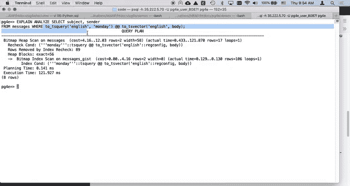
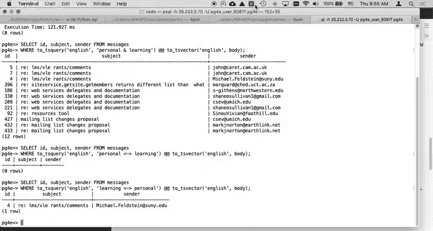
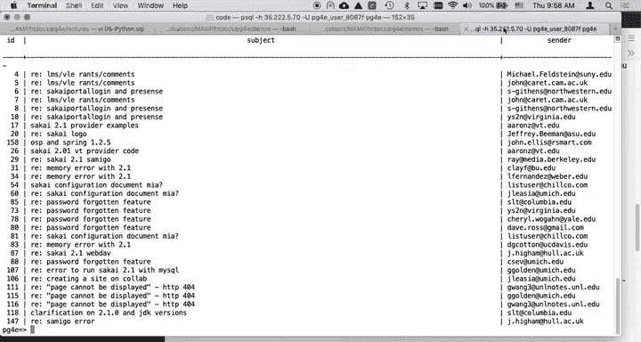

# 087：邮件归档系统演示（第三部分）

在本节课中，我们将继续探索 PostgreSQL 的全文本搜索功能。上一节我们介绍了如何创建 GIST 索引并使用 `to_tsquery` 进行基本查询。本节中，我们将深入了解 `tsquery` 查询语言的更多操作符，并学习如何对搜索结果进行相关性排序。

## 探索 `tsquery` 查询语言



目前，我们已经尝试过使用 `to_tsquery('english', 'monday')` 这样的单字查询。现在，我们来看看如何构建更复杂的查询。

`tsquery` 本身是一种查询语言，有趣的是，你甚至可能在它里面犯语法错误。

### 使用逻辑操作符



以下是 `tsquery` 支持的一些核心操作符：

*   **AND 操作符**：`&`
    查询 `personal & learning` 意味着文档中必须同时包含 **personal** 和 **learning** 这两个词。这是一个标准的“与”操作。
    ```sql
    SELECT * FROM messages WHERE body_tsv @@ to_tsquery('english', 'personal & learning');
    ```

*   **FOLLOWED BY 操作符**：`<->`
    查询 `personal <-> learning` 表示 **personal** 必须紧跟在 **learning** 之后出现。这用于指定词序。
    ```sql
    SELECT * FROM messages WHERE body_tsv @@ to_tsquery('english', 'personal <-> learning');
    ```
    如果查询 `learning <-> personal`，则会找到 **learning** 紧接 **personal** 的文档。

*   **NOT 操作符**：`!`
    查询 `learning & !personal` 表示查找包含 **learning** 但不包含 **personal** 的文档。
    ```sql
    SELECT * FROM messages WHERE body_tsv @@ to_tsquery('english', 'learning & !personal');
    ```
    执行此查询会返回大量包含“learning”但不含“personal”的句子，说明同时提及“personal learning”的文档很少。

### 处理用户输入与语法

正如之前提到的，`to_tsquery` 对输入语法要求严格。例如，`to_tsquery('english', '(personal learning)')` 会因为括号的使用不当而引发语法错误。

为了避免因用户输入不规范导致查询失败，可以使用 `plainto_tsquery` 函数。它会忽略无法理解的特殊字符，而不是抛出错误。
```sql
SELECT * FROM messages WHERE body_tsv @@ plainto_tsquery('english', '(personal learning)');
```

### 短语搜索

`phraseto_tsquery` 函数专门用于短语搜索。它将输入转换为一个 `FOLLOWED BY` 链。
例如，`phraseto_tsquery('english', 'I think')` 本质上等同于 `to_tsquery('english', 'I <-> think')`。
```sql
SELECT * FROM messages WHERE body_tsv @@ phraseto_tsquery('english', 'I think');
```
这在处理用户输入时非常有用，用户无需了解复杂的 `tsquery` 语法即可进行短语查询。



### Web 搜索风格语法

对于 PostgreSQL 11 及以上版本，可以使用 `websearch_to_tsquery` 函数。它支持类似谷歌搜索的语法。
例如，`-personal learning` 表示“不包含 personal 且包含 learning”，这与 `!personal & learning` 等效。
```sql
SELECT * FROM messages WHERE body_tsv @@ websearch_to_tsquery('english', '-personal learning');
```
许多应用程序会编写语法转换器，将用户熟悉的 Web 搜索格式转换为 PostgreSQL 的 `tsquery`。

## 搜索结果排序（文本排名）

文本排名是一个重要的概念。需要明确的是，排名计算**不参与** `WHERE` 子句的筛选过程。

我们之前所做的优化（如倒排索引、词干提取等）都是为了加速 `WHERE` 子句的执行，快速筛选出相关文档。在通过 `WHERE` 子句获取到文档集之后，排名函数才会对这些**已检索到的文档**进行计算。

### 使用 `ts_rank` 函数

你可以使用 `ORDER BY` 子句按相关性降序排列结果。`ts_rank` 函数接收一个 `tsvector` 和一个 `tsquery` 作为参数。
```sql
SELECT
    subject,
    ts_rank(body_tsv, to_tsquery('english', 'personal & learning')) AS rank
FROM messages
WHERE body_tsv @@ to_tsquery('english', 'personal & learning')
ORDER BY rank DESC;
```
这条查询首先通过 `WHERE` 子句找出包含“personal”和“learning”的文档，然后使用 `ts_rank` 计算每个文档的相关性得分，最后按得分从高到低排序。得分最高的文档通常被认为是最相关的。

PostgreSQL 提供了不同的排名算法，例如 `ts_rank` 和 `ts_rank_cd`。它们都是在检索到的记录集上进行计算，只是采用了不同的计算方式。关于哪种算法更优，有大量的相关研究，你可以查阅 PostgreSQL 官方文档来了解更多细节。

---

本节课中我们一起学习了 `tsquery` 查询语言的高级用法，包括逻辑操作符、短语搜索、处理用户输入以及最重要的搜索结果相关性排序。理解索引优化用于筛选、排名用于排序这一区别至关重要。通过组合这些功能，你可以构建出强大且高效的全文搜索应用。

（注：课程中提到的关于正则表达式和基于正则表达式创建索引的内容，将在其他时间介绍。）